# MiniAlalipay 前端系统分析文档
## 0. 文档信息
| 项目 | 内容 |
| --- | --- |
| 产品名称 | MiniAlalipay — AI 加持的确定性金融信任平台 |
| 文档类型 | 前端系统分析文档 |
| 文档版本 | V1.8 |
| 编制日期 | 2026-07-31 |
| 需求基线 | MiniAlalipay PRD V1.9 |
| 总体系分基线 | MiniAlalipay 系统分析文档 V1.13 |
| PRD 文件 | MiniAlalipay PRD V1.9 |
| 总体系分文件 | MiniAlalipay 系统分析文档 V1.13 |
| 项目周期 | 2 周 |
| 团队规模 | 5 人 |
| 资金属性 | 系统虚拟资金，不接入真实人民币通道 |
| 目标读者 | 前端、后端、AI 工程、测试、产品、评委 |


### 0.1 变更记录
| 版本 | 日期 | 修订人 | 内容 |
| --- | --- | --- | --- |
| V1.0 | 2026-07-29 | 项目组 | 基于 PRD V1.7 + 后端系分 V1.9 建立前端系分基线 |
| V1.1 | 2026-07-30 | 项目组 | 前后端系分对齐修正（状态机/字段名/SSE/错误码/安全红线/API端点/新增交易查询与链路追溯） |
| V1.2 | 2026-07-30 | 项目组 | 对齐 PRD V1.8 + 后端 V1.10：新增商户经营统计和商户订单与对账页面、个人收支统计口径、商户经营统计 API |
| V1.3 | 2026-07-30 | 项目组 | 为全部 29 个页面补充"前端逻辑"条目式描述（业务规则/校验/安全约束/状态处理/权限边界） |
| V1.4 | 2026-07-30 | 项目组 | 以后端系分 V1.10 为基准修正前后端冲突：删除 rerun 残留、工单内联查询、订单 FAILED、标注 3 个待补充端点、修正登录误用码与锁定/充值/风控阈值表述 |
| V1.5 | 2026-07-30 | 项目组 | 对齐后端系分变更：注册移除支付密码改为登录后 PUT 设置；新增 2.3.2 支付密码设置与修改页；2.3.5 常用收款人改为成功转账历史生成+置顶/隐藏/备注；新增 2.3.31 演示任务触发页 |
| V1.6 | 2026-07-30 | 项目组 | 补充标准系分章节：新增 2.3.0 全局交互流程图、2.6 接口规约、2.7 数据模型与状态设计、2.8 边界与异常处理、2.9 非功能性设计 |
| V1.7 | 2026-07-30 | 项目组 | 统一端侧与身份边界：C 端仅面向普通用户并承载全部本人业务，B 端仅面向运营维护人员；将扫码收款、本人订单和本人统计迁入 C 端并删除商户系统角色 |
| V1.8 | 2026-07-31 | 项目组 | 按 B/C 端拆分前端 API 客户端范围，明确共享登录、C 端本人数据、B 端运营权限及尚未形成契约的 B 端页面能力 |


---

## 1. 需求背景
MiniAlalipay 是一个 AI 加持的确定性金融信任平台，以虚拟资金演示环境模拟支付宝核心金融链路，涵盖注册开户、传统转账、AI Talk 智能转账、扫码支付、Mini 花呗信用消费与还款、C2C 个人收款码与固定金额收款请求、全链路数据监控与告警。前端需同时构建 B 端 Web 管理后台和 C 端 H5 用户界面，在两周内完成 MVP 交付。

核心挑战：前端需在 React + TypeScript + Umi 双工程（Monorepo）架构下，实现 31 个页面的交互式 UI、Mermaid 时序图级别的业务流程编排、支付密码与确认令牌安全链路、SSE 跨端状态同步、AI Talk 结构化草稿与聊天分离、以及 Ant Design / Ant Design Mobile 双组件体系。所有资金状态以服务端状态机为唯一事实来源，前端不得臆造余额、额度或交易终态。

### 1.1 项目成员
| 角色 | 成员 | 备注 |
| --- | --- | --- |
| 业务方 | 产品经理（PD） | 需求基线 PRD V1.9 |
| 后端技术 | 后端/架构负责人 + 账户工程师 | 总体系分 V1.13，Maven 多模块 5 部署单元 |
| UED | — | 低保真原型由 PRD 第 13 章定义，研发据此完成实现稿 |
| 前端 | 前端工程师 | 本文档产出方，负责 Web/H5 双工程 |
| 质量 | 测试/产品/集成 | 验收、自动化、故障注入、答辩材料 |


### 1.2 项目文档
| 文档类型 | 路径 | 说明 |
| --- | --- | --- |
| PRD 文档（必填） | MiniAlalipay PRD V1.9 | V1.9，产品需求与页面交互规格 |
| 总体系分（必填） | MiniAlalipay 系统分析文档 V1.13 | V1.13，架构、API 目录、状态模型、数据模型 |
| 迭代地址（必填） | [XX-迭代地址] |  |
| 开发环境地址（必填） | [XX-开发环境] |  |
| 测试环境地址（必填） | [XX-测试环境] |  |


---

## 2. 详细设计
### 2.1 前端迭代目标
在两周 MVP 范围内，前端需完成以下交付：

1. **C 端 H5 工程（**`frontend-h5`**）**：22 个页面，仅面向普通用户，覆盖注册登录、首页资产摘要、传统转账与确认、AI Talk、多种扫码付款与收款、本人收款订单和统计、Mini 花呗、个人收款码与固定请求、账户明细与回执。
2. **B 端 Web 工程（**`frontend-admin`**）**：9 个页面，仅面向运营、管理员和观察者，覆盖人工确认台、可信运行看板、T+1 报表、告警中心、数据质量、用户管理、全局交易查询与回执、链路追溯和演示任务触发。B 端不提供收银台、本人订单或本人收款统计。
3. **安全链路**：支付密码通过独立安全输入组件采集，确认令牌（`confirmationToken`）通过请求体传递给后端支付 API，不写入 URL、日志、埋点或 Query 持久化缓存；AI Talk 场景下确认上下文由策略网关服务端注入，不进入 Agent 消息体。
4. **跨端同步**：C 端扫码收款页和固定请求创建者通过 SSE 订阅收款状态；SSE 失败时降级为 2 秒轮询。
5. **工程规范**：Monorepo 双 Umi 工程独立构建部署，通过 `contracts/openapi` 共享类型和错误码；TanStack Query 管理服务端状态，Zustand 管理客户端状态；Day.js 处理日期，金额统一使用后端返回的分值。

### 2.2 技术栈与工程约束
#### 2.2.1 端侧技术栈
| 端 | 技术栈 | 关键约束 |
| --- | --- | --- |
| B 端 Web | React + TypeScript；Umi + Vite | 不使用 Vue；仅面向运营、管理员和观察者，提供风控处置、数据监控和运行维护功能 |
| B 端请求与数据 | Umi `request`、TanStack Query、Axios | `request` 为标准 API 客户端；Query 管理服务端状态；Axios 仅用于流式/二进制特殊场景 |
| B 端组件与可视化 | Ant Design、AntV | 表格、表单、权限菜单、监控大盘和趋势图统一使用既定组件 |
| B 端工具与路由 | Lodash、Day.js、Moment（遗留兼容）、aHooks；React Router 或 Umi 路由 | 同一应用不得存在两个路由权威 |
| B 端状态与样式 | Zustand；CSS + Less | Zustand 只保存登录态、权限、筛选条件等客户端状态 |
| C 端 H5 | React + TypeScript；独立 Umi H5 工程 + Vite | 不使用 Vue；仅面向普通用户并承载本人全部付款和收款业务；独立浏览器 H5 构建产物，不内嵌 App |
| C 端请求与数据 | Umi `request`、TanStack Query、Axios | 与 B 端职责规则一致；支付状态查询必须以服务端状态为准 |
| C 端组件与可视化 | Ant Design Mobile、AntV F2 | 移动端表单、确认页、账单和轻量数据图表 |
| C 端工具、路由、状态 | Lodash、Day.js、aHooks；React Router 或 Umi 路由；Zustand | 统一会话、扫码订单、转账草稿和 AI 会话的客户端状态边界 |
| C 端样式与适配 | CSS + Less + CSS Modules | 移动端响应式布局、触控交互、安全区和主流浏览器兼容 |


#### 2.2.2 前端依赖职责与实现边界
1. Umi 提供构建、运行时配置、约定式路由和部署入口；Vite 负责开发服务器与生产构建。Umi 应用优先使用 Umi 路由；仅独立非 Umi 模块可使用 React Router，同一应用不得存在两套路由权威。
2. API 服务层集中放在 `src/services`，统一注入 `Authorization`、`X-Request-Id`、幂等键和错误归一化逻辑。组件不得直接拼接 URL 或修改账户金额。
3. TanStack Query 负责用户、订单、交易、账单、告警和监控指标等服务端数据；成功/失败状态通过失效和重新查询更新，禁止用 Zustand 复制余额、账本或交易终态。
4. Zustand 负责跨页面客户端状态（登录用户摘要、端侧主题、筛选器、扫码会话和 AI 对话草稿）；刷新后需恢复的状态使用受控持久化并排除敏感令牌。
5. Day.js 为日期处理首选；Moment 仅用于遗留接口或兼容性适配，不得在新模块混用两套时区和格式化规则。金额统一使用后端返回的分值和格式化函数。
6. 交易确认、支付密码、二维码原始令牌、`confirmationToken` 等敏感值不得写入 URL、日志、埋点、Query 持久化缓存或 AI 消息。
7. 认证方式：`Authorization: Bearer <session-token>` 与同站 HttpOnly Cookie 不可混用。Cookie 登录态写请求须携带 `X-CSRF-Token`。

#### 2.2.3 Monorepo 工程目录基线
B 端与 C 端 H5 为同一 Monorepo 下两个独立 Umi 前端工程，分别安装依赖、构建、部署和维护路由。两端仅通过 `contracts` 共享 OpenAPI 类型、错误码和无副作用工具；不共享路由、Layout、页面级 Store、全局样式或依赖端侧环境的业务组件。

```plain
minialalipay/
├── backend/
│   ├── pom.xml
│   ├── platform-common/
│   ├── gateway/
│   ├── user-center/
│   ├── business-center/
│   ├── account-center/
│   └── ai-service/
├── frontend-admin/                      # B 端独立 React + TypeScript + Umi 工程
│   ├── config/
│   │   ├── config.ts
│   │   └── routes.ts                     # /admin/** 前缀
│   ├── mock/
│   ├── public/
│   ├── src/
│   │   ├── access.ts
│   │   ├── app.tsx
│   │   ├── assets/                        # 静态资源
│   │   ├── components/                   # B 端专属组件
│   │   ├── constants/
│   │   ├── hooks/
│   │   ├── icons/                         # 自定义图标
│   │   ├── layouts/                      # B 端专属布局
│   │   ├── models/                        # B 端客户端状态
│   │   ├── pages/                        # B 端页面
│   │   ├── services/
│   │   ├── typings/
│   │   ├── type.d.ts                      # 全局类型声明
│   │   ├── utils/
│   │   └── overrides.css                  # 样式覆盖
│   ├── test/                               # 单元测试
│   ├── docs/                               # 工程文档
│   ├── .eslintrc.js
│   ├── .prettierrc.js
│   ├── .stylelintrc.js
│   ├── .editorconfig
│   ├── package.json
│   ├── tsconfig.json
│   └── README.md
├── frontend-h5/                          # C 端独立 React + TypeScript + Umi H5 工程
│   ├── config/
│   │   ├── config.ts
│   │   └── routes.ts                     # /h5/** 前缀
│   ├── mock/
│   ├── public/
│   ├── src/
│   │   ├── access.ts
│   │   ├── app.tsx
│   │   ├── assets/                        # 静态资源
│   │   ├── components/                   # H5 专属组件
│   │   ├── constants/
│   │   ├── hooks/
│   │   ├── icons/                         # 自定义图标
│   │   ├── layouts/                      # H5 专属布局
│   │   ├── models/                       # H5 客户端状态
│   │   ├── pages/                        # H5 页面
│   │   ├── services/
│   │   ├── typings/
│   │   ├── type.d.ts                      # 全局类型声明
│   │   ├── utils/
│   │   └── overrides.css                  # 样式覆盖
│   ├── test/                               # 单元测试
│   ├── docs/                               # 工程文档
│   ├── .eslintrc.js
│   ├── .prettierrc.js
│   ├── .stylelintrc.js
│   ├── .editorconfig
│   ├── package.json
│   ├── tsconfig.json
│   └── README.md
├── contracts/
│   ├── openapi/                           # REST/SSE 接口契约及生成配置
│   ├── events/                           # 可靠事件 Schema
│   └── error-codes/                      # 前后端统一错误码字典
├── tests/
│   ├── api/
│   ├── e2e/                              # B/C 端端到端测试
│   ├── performance/
│   └── fault-injection/
├── deploy/
│   ├── docker-compose.yml
│   ├── nginx/
│   └── ...
├── docs/
└── README.md
```

两个工程均启用路由级懒加载；C 端 H5 不得下载 B 端大盘和完整 AntV 桌面图表代码。B 端路由以 `/admin/**` 为前缀，C 端路由以 `/h5/**` 为前缀。两个工程分别使用 Ant Design 与 Ant Design Mobile，不共享全局样式。B 端权限由后端 RBAC 和对象级授权控制，不能依赖隐藏菜单或 `/admin` 路径实现安全隔离。

#### 2.2.4 页面路由清单
**C 端 H5 路由（**`frontend-h5/config/routes.ts`**）：**

| 路由路径 | 页面 | 优先级 |
| --- | --- | --- |
| `/h5/register` | 注册页 | P0 |
| `/h5/payment-password` | 支付密码设置与修改页 | P0 |
| `/h5/login` | 登录页 | P0 |
| `/h5/home` | 首页 | P0 |
| `/h5/transfer` | 传统转账页 | P0 |
| `/h5/transfer/confirm` | 转账确认页 | P0 |
| `/h5/ai-talk` | AI Talk | P0 |
| `/h5/qr-pay/:token` | H5 扫码支付页 | P0 |
| `/h5/qr-pay/:orderId/receipt` | H5 支付回执页 | P0 |
| `/h5/collection` | 个人收款页 | P0 |
| `/h5/p2p-collection/:token` | C2C 收款 H5 | P0 |
| `/h5/collection/request/:id` | 固定收款请求详情 | P0 |
| `/h5/accounts` | 账户明细页 | P0 |
| `/h5/accounts/analytics` | 资产分析页 | P0 |
| `/h5/transactions/:id` | 交易详情页 | P0 |
| `/h5/transactions/:id/receipt` | 结果/回执页 | P0 |
| `/h5/credit` | Mini 花呗首页 | P0 |
| `/h5/credit/bills` | Mini 花呗账单页 | P0 |
| `/h5/credit/repayment` | Mini 花呗还款页 | P0 |
| `/h5/qr-collection` | 动态扫码收款页 | P0 |
| `/h5/qr-collection/analytics` | 本人扫码收款统计 | P0 |
| `/h5/qr-collection/orders` | 本人扫码收款订单与对账 | P0 |


**B 端 Web 路由（**`frontend-admin/config/routes.ts`**）：**

| 路由路径 | 页面 | 优先级 |
| --- | --- | --- |
| `/admin/manual-cases` | 人工确认台 | P0 |
| `/admin/dashboard` | 可信运行看板 | P0 |
| `/admin/reports` | T+1 报表页 | P0 |
| `/admin/alerts` | 告警中心 | P0 |
| `/admin/data-quality` | 数据质量页 | P0 |
| `/admin/users` | 用户管理页 | P1 |
| `/admin/transactions` | 交易查询与回执 | P0 |
| `/admin/trace` | 链路追溯 | P0 |
| `/admin/demo-tasks` | 演示任务触发页 | P0 |


#### 2.2.5 错误码与安全约束
前端统一使用后端 `contracts/error-codes` 中的错误码字典。关键错误码及前端处理策略：

| 错误码 | HTTP | 前端处理 |
| --- | --- | --- |
| `AUTH_REQUIRED` | 401 | 跳转登录页，保留安全回跳状态 |
| `PAY_PASSWORD_INVALID` | 422 | 展示剩余尝试次数，订单保持 `PENDING_CONFIRMATION` |
| `PAYMENT_LOCKED` | 429 | 展示服务端返回的锁定结束时间，禁用支付功能直至解锁 |
| `CONFIRMATION_EXPIRED` | 409 | 重新校验密码并生成新确认卡片 |
| `CONFIRMATION_MISMATCH` | 409 | 确认字段已变更，拒绝并重新生成确认卡片 |
| `INSUFFICIENT_BALANCE` | 422 | 提示余额不足，引导调低金额或结束流程 |
| `ACCOUNT_UNAVAILABLE` | 422 | 提示账户冻结/注销，拒绝执行 |
| `IDEMPOTENCY_CONFLICT` | 409 | 展示原始资源，提示冲突 |
| `VERSION_CONFLICT` | 409 | 重新读取最新状态后决定是否重试 |
| `ORDER_EXPIRED` | 410 | 关闭支付入口 |
| `QR_TOKEN_INVALID` | 404 | 仅展示通用失效提示，不泄露订单详情 |
| `QR_TOKEN_CONSUMED` | 409 | 提示令牌已绑定其他会话 |
| `P2P_CODE_INVALID` | 404 | 提示个人码失效，不泄露收款人信息 |
| `COLLECTION_REQUEST_EXPIRED` | 410 | 隐藏支付入口 |
| `COLLECTION_REQUEST_CANCELLED` | 409 | 禁止继续确认 |
| `COLLECTION_REQUEST_PROCESSING` | 409 | 查询请求最终状态 |
| `COLLECTION_REQUEST_PAID` | 409 | 提示已支付，不可重复 |
| `SELF_PAYMENT_FORBIDDEN` | 422 | 提示不可向本人支付 |
| `AMOUNT_IMMUTABLE` | 422 | 提示金额不可修改（固定请求或个人码订单金额锁定后） |
| `FUNDING_SOURCE_NOT_ALLOWED` | 422 | C2C 仅允许余额支付 |
| `TRANSACTION_PENDING` | 202 | 保持处理中状态，进入恢复流程轮询 |
| `CREDIT_NOT_AVAILABLE` | 422 | 花呗未开通/停用 |
| `CREDIT_LIMIT_INSUFFICIENT` | 422 | 可用额度不足 |
| `CREDIT_OVERDUE` | 422 | 逾期，禁止信用支付但允许还款 |
| `REPAYMENT_AMOUNT_INVALID` | 422 | 还款额超过虚拟余额或信用应收，或小于 1 分 |
| `RISK_MANUAL_REVIEW` | 202 | 展示审核状态，资金不变化 |
| `TRANSACTION_PROCESSING` | 202 | 轮询/SSE 查询，不创建重复交易 |
| `RATE_LIMITED` | 429 | 展示限流提示，按 `Retry-After` 重试 |
| `ORDER_ALREADY_CLAIMED` | 409 | 源订单已有交易，展示原交易号和状态，不重复创建 |
| `CONFIRMATION_STALE` | 409 | 订单/请求版本或字段哈希已变化，旧确认失效，需重新确认 |


安全红线：`paymentPassword`、`confirmationToken`、`paymentProof`、二维码原始令牌、Cookie、Authorization 等敏感值不得写入 URL、日志、埋点、Query 持久化缓存或 AI 消息体。常规转账/扫码/C2C/还款场景下 `confirmationToken` 通过请求体传递给后端支付 API；AI Talk 场景下确认上下文由策略网关服务端注入（`submit_confirmed_transfer` 仅接受 `{draftId}`），不进入 Agent 消息体。  
幂等键规则：`Idempotency-Key` 为 16-64 位随机字符串，同用户保留 24 小时；资金类请求超时后只按原幂等键重试或查询交易状态，禁止自动创建新键再次扣款。  
统计边界规则（总体系分 7.6.5）：普通用户综合收支按本人账户归属生成；扫码收款统计同样按本人逻辑收款字段 `payee_account_id` 隔离，但只统计本人作为收款方的 `SUCCESS QR_PAY/CREDIT_PAY`，退款冲减净收款，失败、处理中、补偿中和人工处理订单不计入成功金额。动态扫码订单持久化时，`payee_account_id` 映射服务器现有 `merchant_account_id`，该历史字段名不产生商户角色、第二账户或 B 端权限。两者是同一普通用户的不同统计视图，不创建第二系统身份或第二账户。B 端只查看全平台聚合、脱敏运营与异常数据，不复用普通用户的本人查询权限。

### 2.3 迭代具体描述
本次迭代实现 PRD V1.9 全部 31 个 P0/P1 页面，覆盖 C 端 H5（22 页）和 B 端 Web（9 页）。以下按页面逐一描述 UI&交互时序图、前端逻辑字段表、操作按钮和所需 API。

#### 2.3.0 全局交互流程
**C 端 H5 用户主流程**

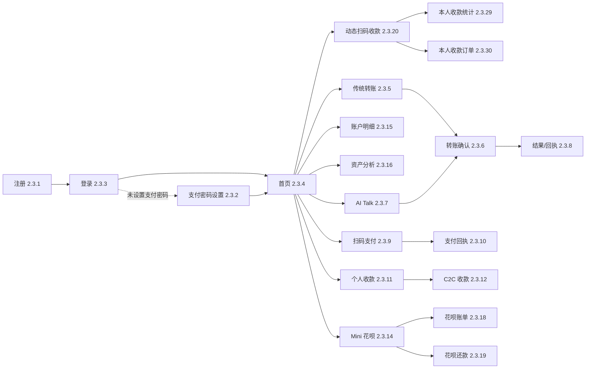
```mermaid
flowchart LR
    A[注册 2.3.1] --> B[登录 2.3.3]
    B --> C[首页 2.3.4]
    C --> D[传统转账 2.3.5]
    C --> E[AI Talk 2.3.7]
    C --> F[账户明细 2.3.15]
    C --> G[资产分析 2.3.16]
    C --> H[Mini 花呗 2.3.14]
    C --> I[个人收款 2.3.11]
    C --> J[扫码支付 2.3.9]
    C --> R[动态扫码收款 2.3.20]
    R --> S[本人收款统计 2.3.29]
    R --> T[本人收款订单 2.3.30]
    D --> K[转账确认 2.3.6]
    E --> K
    K --> L[结果/回执 2.3.8]
    J --> M[支付回执 2.3.10]
    I --> N[C2C 收款 2.3.12]
    H --> O[花呗账单 2.3.18]
    H --> P[花呗还款 2.3.19]
    B -.未设置支付密码.-> Q[支付密码设置 2.3.2]
    Q --> C
```

**B 端 Web 页面结构（按角色分流）**

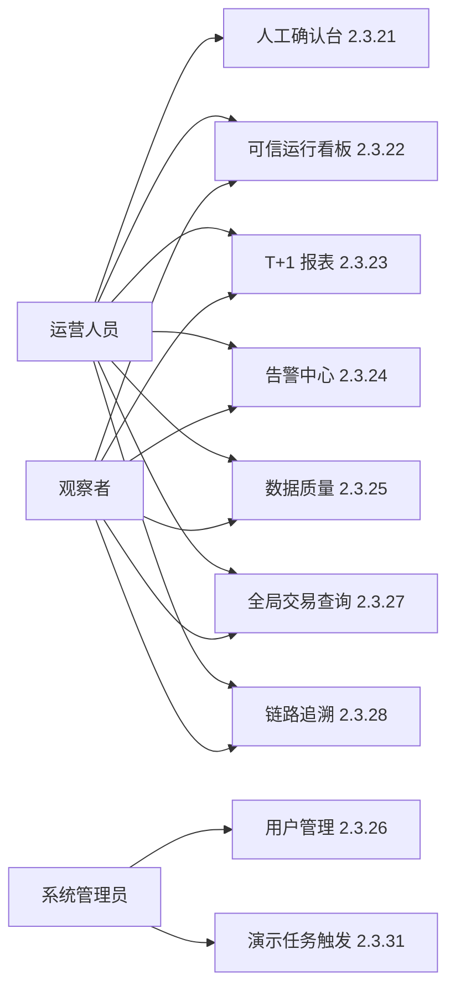
```mermaid
flowchart LR
    O[运营人员] --> M[人工确认台 2.3.21]
    O --> D[可信运行看板 2.3.22]
    O --> R[T+1 报表 2.3.23]
    O --> A[告警中心 2.3.24]
    O --> Q[数据质量 2.3.25]
    O --> T[全局交易查询 2.3.27]
    O --> L[链路追溯 2.3.28]
    X[系统管理员] --> U[用户管理 2.3.26]
    X --> J[演示任务触发 2.3.31]
    V[观察者] --> D
    V --> R
    V --> A
    V --> Q
    V --> T
    V --> L
```

B 端没有普通用户、收款用户或所谓商户入口。观察者只读，运营人员按权限处置工单和告警，系统管理员只执行用户维护和受审计的演示任务。

**前端交易状态流转（统一展示映射）**

| 后端状态 | 前端展示 | 文案 | 可操作入口 |
| --- | --- | --- | --- |
| `PROCESSING` | 处理中 | "交易处理中，请稍候" | 轮询/手动刷新 |
| `COMPENSATING` | 补偿中 | "交易异常，正在自动补偿" | 查看明细 |
| `MANUAL_REVIEW` | 人工审核 | "人工审核中，请等待" | 联系客服 |
| `SUCCESS` | 成功 | "交易成功" | 查看明细/回执 |
| `REVERSED` | 已冲正 | "交易已冲正，资金已恢复" | 查看明细 |
| `CANCELLED` | 已取消 | "交易已取消" | 重新转账 |
| `REJECTED` | 已拒绝 | "交易被拒绝" | 修改重试 |
| `EXPIRED` | 已过期 | "交易已过期" | 重新发起 |


---

#### 2.3.1 注册页（C 端 H5）
**UI&交互**

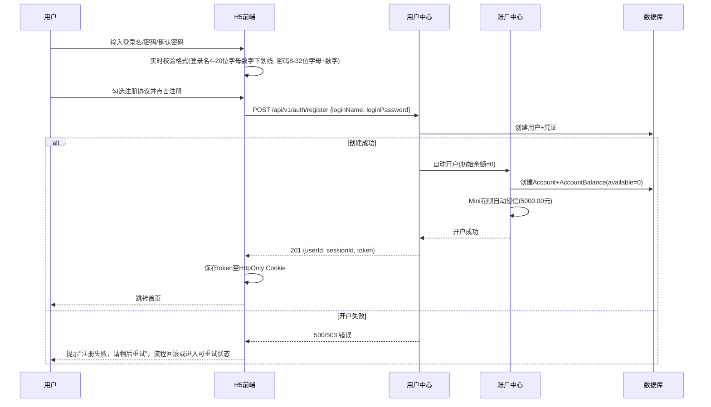
```mermaid
sequenceDiagram
    participant 用户
    participant H5前端
    participant 用户中心
    participant 账户中心
    participant 数据库

    用户->>H5前端: 输入登录名/密码/确认密码
    H5前端->>H5前端: 实时校验格式(登录名4-20位字母数字下划线, 密码8-32位字母+数字)
    用户->>H5前端: 勾选注册协议并点击注册
    H5前端->>用户中心: POST /api/v1/auth/register {loginName, loginPassword}
    用户中心->>数据库: 创建用户+凭证
    alt 创建成功
        用户中心->>账户中心: 自动开户(初始余额=0)
        账户中心->>数据库: 创建Account+AccountBalance(available=0)
        账户中心->>账户中心: Mini花呗自动授信(5000.00元)
        账户中心-->>用户中心: 开户成功
        用户中心-->>H5前端: 201 {userId, sessionId, token}
        H5前端->>H5前端: 保存token至HttpOnly Cookie
        H5前端-->>用户: 跳转首页
    else 开户失败
        用户中心-->>H5前端: 500/503 错误
        H5前端-->>用户: 提示"注册失败，请稍后重试"，流程回滚或进入可重试状态
    end
```

**前端逻辑**

+ 登录名 4-20 位字母、数字、下划线，前端实时校验格式，唯一性由后端注册时返回。
+ 登录密码 8-32 位，必须包含字母和数字；确认密码需与登录密码完全一致。
+ 注册协议必须勾选方可提交，未勾选时注册按钮禁用。
+ 提交后服务端原子完成建用户 + 开户（初始余额 0）+ Mini 花呗自动授信（5000.00 元），任一环节失败整体回滚。
+ 注册不再采集支付密码；注册成功并登录后，若未设置支付密码则引导跳转 `/h5/payment-password` 设置（见 2.3.2）。
+ 开户失败时展示可重试状态，不部分回滚用户态；会话 token 写入 HttpOnly Cookie，不进入 localStorage 或 URL。

**前端逻辑 — 表单字段**

| 字段名称 | 说明 | 输入方式 | 是否必填 | 默认值 | 最大输入长度 | 输入限制 | 字段类型 | 提示文案 | 数据源 |
| --- | --- | --- | --- | --- | --- | --- | --- | --- | --- |
| 用户名 | 登录名 | 文本输入 | Y | N | 20 | 仅字母、数字、下划线；4-20 位 | string | "4-20 位字母、数字或下划线" | — |
| 登录密码 | 登录密码 | 密码输入 | Y | N | 32 | 8-32 位；字母+数字混合 | string | "8-32 位，需包含字母和数字" | — |
| 确认密码 | 确认登录密码 | 密码输入 | Y | N | 32 | 必须与登录密码一致 | string | "请再次输入登录密码" | — |
| 注册协议 | 注册协议 | 复选框 | Y | N | — | 必须勾选才能提交 | boolean | "我已阅读并同意《MiniAlalipay 演示注册协议》" | — |


**操作按钮**

| 字段名称 | 交互 | 是否有二次确认 | 显示、禁用控制 |
| --- | --- | --- | --- |
| 注册 | 点击后提交注册请求，成功跳转首页 | N | 格式校验未通过或协议未勾选时禁用；提交中 disabled + loading |


**所需 API**

| 方法 | 路径 | 说明 |
| --- | --- | --- |
| POST | `/api/v1/auth/register` | 注册并创建账户，初始余额 0，自动开通 Mini 花呗授信；请求体 `{loginName, loginPassword}`，不含支付密码 |


#### 2.3.2 支付密码设置与修改页（C 端 H5）
> 注册不再采集支付密码（见 2.3.1），用户登录后通过本页首次设置或修改支付密码。对应后端 12.7.1 新增 `PUT/PATCH /payment-password`。
>

**UI&交互**

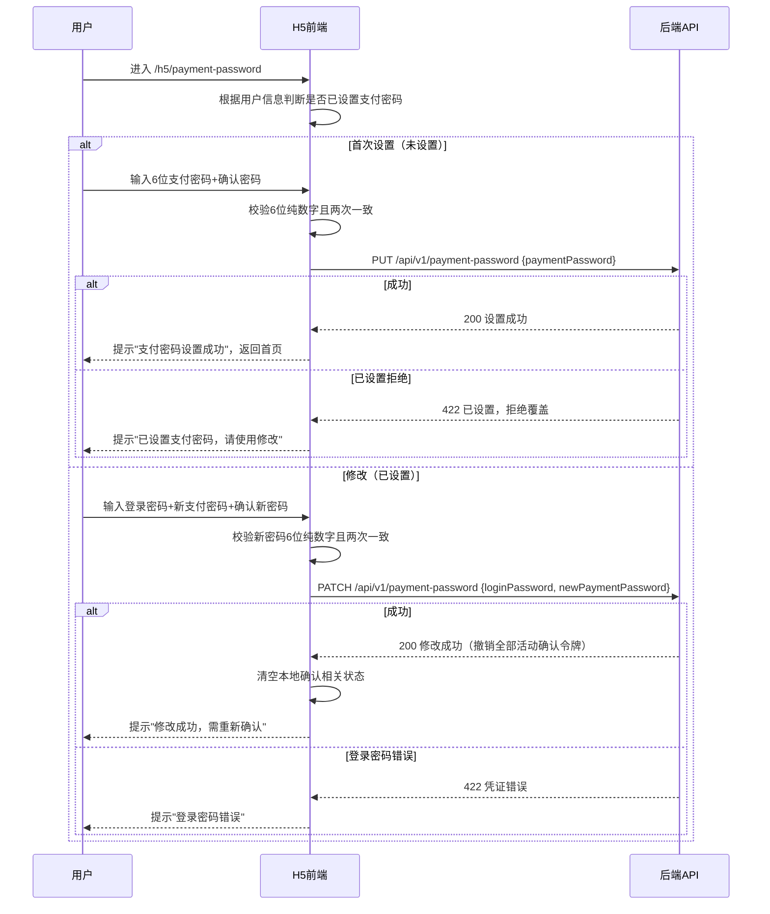
```mermaid
sequenceDiagram
    participant U as 用户
    participant H5 as H5前端
    participant API as 后端API
    U->>H5: 进入 /h5/payment-password
    H5->>H5: 根据用户信息判断是否已设置支付密码
    alt 首次设置（未设置）
        U->>H5: 输入6位支付密码+确认密码
        H5->>H5: 校验6位纯数字且两次一致
        H5->>API: PUT /api/v1/payment-password {paymentPassword}
        alt 成功
            API-->>H5: 200 设置成功
            H5-->>U: 提示"支付密码设置成功"，返回首页
        else 已设置拒绝
            API-->>H5: 422 已设置，拒绝覆盖
            H5-->>U: 提示"已设置支付密码，请使用修改"
        end
    else 修改（已设置）
        U->>H5: 输入登录密码+新支付密码+确认新密码
        H5->>H5: 校验新密码6位纯数字且两次一致
        H5->>API: PATCH /api/v1/payment-password {loginPassword, newPaymentPassword}
        alt 成功
            API-->>H5: 200 修改成功（撤销全部活动确认令牌）
            H5->>H5: 清空本地确认相关状态
            H5-->>U: 提示"修改成功，需重新确认"
        else 登录密码错误
            API-->>H5: 422 凭证错误
            H5-->>U: 提示"登录密码错误"
        end
    end
```

**前端逻辑**

+ 根据用户信息判断是否已设置支付密码，分别展示首次设置或修改表单；未设置时由首页或转账流程引导跳转本页。
+ 支付密码 6 位纯数字，通过独立安全输入组件采集，不进入普通表单状态或持久化缓存。
+ 首次设置调用 `PUT /payment-password`，已设置时后端拒绝覆盖，前端提示改用修改。
+ 修改需先验证登录密码，再调用 `PATCH /payment-password`；修改成功后后端撤销全部活动确认令牌，前端同步清空本地确认相关状态。
+ 支付密码不写入 URL、日志、埋点或 Query 持久化缓存。

**前端逻辑 — 表单字段**

| 场景 | 字段名称 | 说明 | 输入方式 | 是否必填 | 输入限制 | 字段类型 |
| --- | --- | --- | --- | --- | --- | --- |
| 首次设置 | 支付密码 | 6 位数字支付密码 | 数字密码输入 | Y | 仅 6 位数字 | string |
| 首次设置 | 确认支付密码 | 再次输入支付密码 | 数字密码输入 | Y | 必须与支付密码一致 | string |
| 修改 | 登录密码 | 验证当前登录密码 | 密码输入 | Y | 8-32 位字母+数字 | string |
| 修改 | 新支付密码 | 新 6 位数字支付密码 | 数字密码输入 | Y | 仅 6 位数字 | string |
| 修改 | 确认新支付密码 | 再次输入新支付密码 | 数字密码输入 | Y | 必须与新支付密码一致 | string |


**操作按钮**

| 字段名称 | 交互 | 是否有二次确认 | 显示、禁用控制 |
| --- | --- | --- | --- |
| 设置/修改 | 校验通过后提交 | N | 格式校验未通过时禁用；提交中 disabled + loading |


**所需 API**

| 方法 | 路径 | 说明 |
| --- | --- | --- |
| PUT | `/api/v1/payment-password` | 首次设置 6 位支付密码，已设置时拒绝覆盖，只存强哈希 |
| PATCH | `/api/v1/payment-password` | 验证登录密码后修改支付密码，原子更新并撤销全部活动确认令牌 |


#### 2.3.3 登录页（C 端 H5）
**UI&交互**

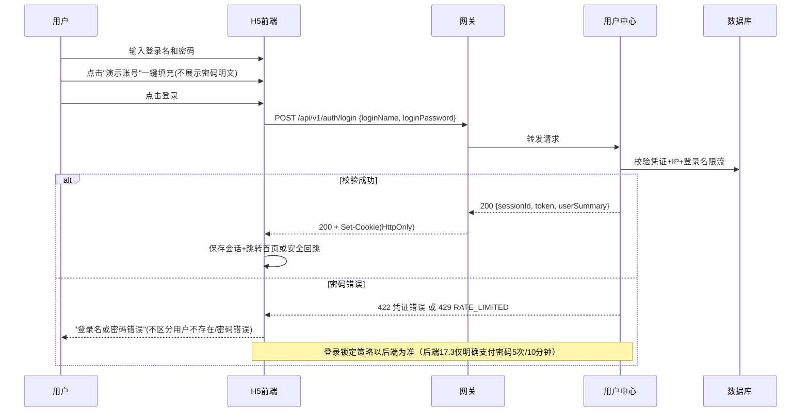
```mermaid
sequenceDiagram
    participant 用户
    participant H5前端
    participant 网关
    participant 用户中心
    participant 数据库

    用户->>H5前端: 输入登录名和密码
    用户->>H5前端: 点击"演示账号"一键填充(不展示密码明文)
    用户->>H5前端: 点击登录
    H5前端->>网关: POST /api/v1/auth/login {loginName, loginPassword}
    网关->>用户中心: 转发请求
    用户中心->>数据库: 校验凭证+IP+登录名限流
    alt 校验成功
        用户中心-->>网关: 200 {sessionId, token, userSummary}
        网关-->>H5前端: 200 + Set-Cookie(HttpOnly)
        H5前端->>H5前端: 保存会话+跳转首页或安全回跳
    else 密码错误
        用户中心-->>H5前端: 422 凭证错误 或 429 RATE_LIMITED
        H5前端-->>用户: "登录名或密码错误"(不区分用户不存在/密码错误)
        Note over H5前端,用户中心: 登录锁定策略以后端为准（后端17.3仅明确支付密码5次/10分钟）
    end
```

**前端逻辑**

+ 登录名和密码格式同注册规则，前端做基础格式校验，密码不区分用户不存在与密码错误。
+ 演示账号一键填充后不展示密码明文，仅填充表单字段。
+ 登录失败统一提示"登录名或密码错误"，不泄露用户是否存在。
+ 登录密码锁定策略以后端为准（后端 17.3 仅明确支付密码 5 次/10 分钟，登录密码锁定次数与时长待后端明确）；触发锁定时按服务端返回时间倒计时并禁用登录按钮。
+ IP + 登录名限流由后端控制，前端按 `RATE_LIMITED` 提示并遵循 `Retry-After`。
+ 会话 token 写入 HttpOnly Cookie；登录成功后跳转首页或安全回跳地址，回跳地址须校验同站白名单。

**前端逻辑 — 表单字段**

| 字段名称 | 说明 | 输入方式 | 是否必填 | 默认值 | 最大输入长度 | 输入限制 | 字段类型 | 提示文案 | 数据源 |
| --- | --- | --- | --- | --- | --- | --- | --- | --- | --- |
| 用户名 | 登录名 | 文本输入 | Y | N | 20 | 同注册规则 | string | "请输入用户名" | — |
| 密码 | 登录密码 | 密码输入 | Y | N | 32 | 同注册规则 | string | "请输入密码" | — |


**操作按钮**

| 字段名称 | 交互 | 是否有二次确认 | 显示、禁用控制 |
| --- | --- | --- | --- |
| 登录 | 点击提交登录请求 | N | 提交中 disabled + loading；锁定期间禁用并展示剩余时间 |
| 演示账号 | 点击一键填充演示账号信息 | N | 填充后不展示密码明文 |


**所需 API**

| 方法 | 路径 | 说明 |
| --- | --- | --- |
| POST | `/api/v1/auth/login` | 登录并建立会话；IP + 登录名限流 |


#### 2.3.4 首页（C 端 H5）
**UI&交互**

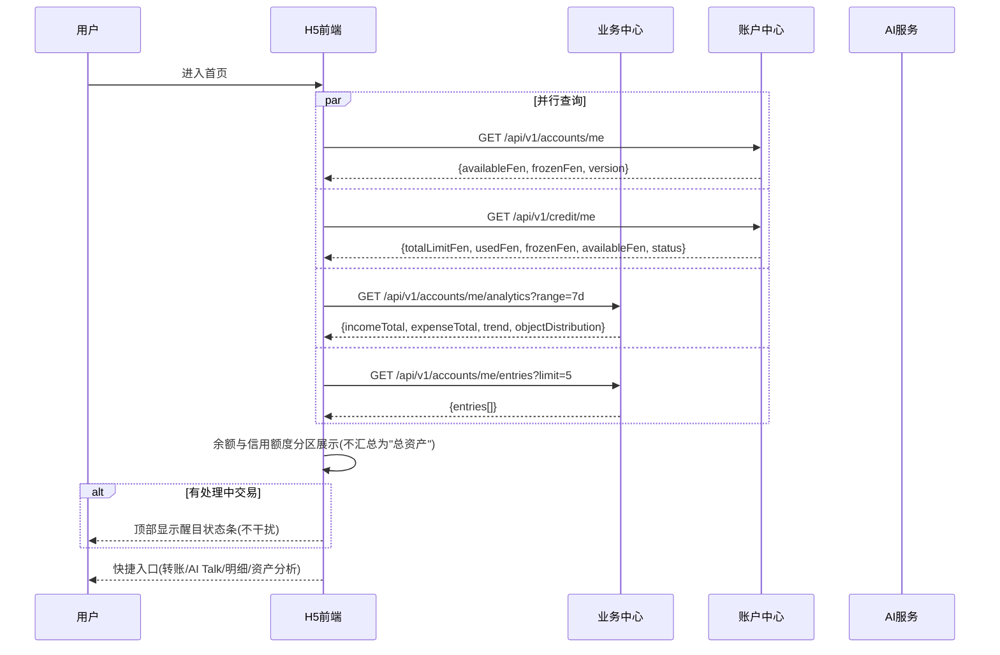
```mermaid
sequenceDiagram
    participant 用户
    participant H5前端
    participant 业务中心
    participant 账户中心
    participant AI服务

    用户->>H5前端: 进入首页
    par 并行查询
        H5前端->>账户中心: GET /api/v1/accounts/me
        账户中心-->>H5前端: {availableFen, frozenFen, version}
    and
        H5前端->>账户中心: GET /api/v1/credit/me
        账户中心-->>H5前端: {totalLimitFen, usedFen, frozenFen, availableFen, status}
    and
        H5前端->>业务中心: GET /api/v1/accounts/me/analytics?range=7d
        业务中心-->>H5前端: {incomeTotal, expenseTotal, trend, objectDistribution}
    and
        H5前端->>业务中心: GET /api/v1/accounts/me/entries?limit=5
        业务中心-->>H5前端: {entries[]}
    end
    H5前端->>H5前端: 余额与信用额度分区展示(不汇总为"总资产")
    alt 有处理中交易
        H5前端-->>用户: 顶部显示醒目状态条(不干扰)
    end
    H5前端-->>用户: 快捷入口(转账/AI Talk/明细/资产分析)
```

**前端逻辑**

+ 进入首页并行查询账户余额、花呗额度、近 7 天收支和最近 5 条明细，任一失败不影响其他区域渲染。
+ 余额与花呗额度分区展示，前端不得汇总为"总资产"，避免混淆资金属性。
+ 可用额度 = 总额度 - 已用 - 冻结，由前端计算展示，以后端返回分值为准。
+ 存在处理中交易时顶部展示醒目但不干扰的状态条，状态以服务端为准。
+ 模拟充值金额范围以后端 12.7.1 单笔/单日限额为准（后端未给具体数值，前端暂按 0.01-50000.00 元），请求携带 Idempotency-Key，超时只按原键重试或查询状态。
+ 快捷入口始终可用，不依赖数据加载完成；余额/额度数据通过 TanStack Query 失效刷新，禁止用 Zustand 复制余额。

**前端逻辑 — 展示字段**

| 区域 | 字段名称 | 说明 | 数据源 |
| --- | --- | --- | --- |
| 余额区 | 总余额 | 总余额 = 可用 + 冻结（前端计算） | GET /accounts/me |
| 余额区 | 可用余额 | 可用余额（分） | GET /accounts/me |
| 余额区 | 冻结金额 | 冻结金额（分） | GET /accounts/me |
| 花呗区 | 总额度 | 总额度（分） | GET /credit/me |
| 花呗区 | 已用额度 | 已用额度（分） | GET /credit/me |
| 花呗区 | 可用额度 | 可用额度（分）= totalLimitFen - usedFen - frozenFen | GET /credit/me |
| 花呗区 | 花呗状态 | 花呗状态（ACTIVE/SUSPENDED/CLOSED） | GET /credit/me |
| 收支区 | 收入汇总 | 近 7 天收入汇总 | GET /accounts/me/analytics |
| 收支区 | 支出汇总 | 近 7 天支出汇总 | GET /accounts/me/analytics |
| 最近交易 | 交易明细列表 | 最近 5 条交易明细 | GET /accounts/me/entries |


**操作按钮**

| 字段名称 | 交互 | 是否有二次确认 | 显示、禁用控制 |
| --- | --- | --- | --- |
| 转账 | 点击跳转 `/h5/transfer` | N | 始终可用 |
| AI Talk | 点击跳转 `/h5/ai-talk` | N | 始终可用 |
| 明细 | 点击跳转 `/h5/accounts` | N | 始终可用 |
| 资产分析 | 点击跳转 `/h5/accounts/analytics` | N | 始终可用 |
| 模拟充值 | 点击弹出充值弹窗 | N | 余额区显示；登录后可用 |


**模拟充值弹窗字段**

| 字段名称 | 说明 | 输入方式 | 是否必填 | 默认值 | 最大输入长度 | 输入限制 | 字段类型 | 提示文案 | 数据源 |
| --- | --- | --- | --- | --- | --- | --- | --- | --- | --- |
| 充值金额 | 充值金额 | 数字输入 | Y | N | — | 1-5000000 分（0.01-50000.00 元，以后端 12.7.1 限额为准） | integer | "充值金额（元）" | — |


**所需 API**

| 方法 | 路径 | 说明 |
| --- | --- | --- |
| GET | `/api/v1/accounts/me` | 查询账户和实时余额 |
| GET | `/api/v1/credit/me` | 查询花呗额度摘要 |
| GET | `/api/v1/accounts/me/analytics?range=7d` | 查询收支分析 |
| GET | `/api/v1/accounts/me/entries?limit=5` | 查询最近交易明细 |
| POST | `/api/v1/recharges` | 创建模拟充值订单（Idempotency-Key） |


#### 2.3.5 传统转账页（C 端 H5）
**UI&交互**

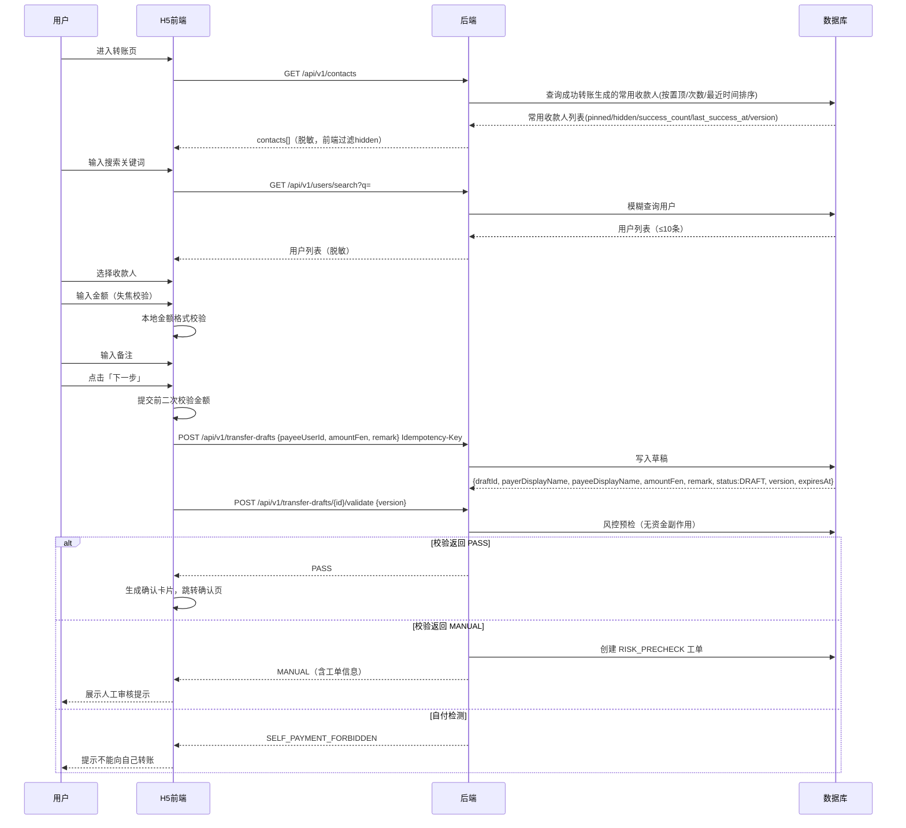
```mermaid
sequenceDiagram
    participant U as 用户
    participant FE as H5前端
    participant BE as 后端
    participant DB as 数据库

    U->>FE: 进入转账页
    FE->>BE: GET /api/v1/contacts
    BE->>DB: 查询成功转账生成的常用收款人(按置顶/次数/最近时间排序)
    DB-->>BE: 常用收款人列表(pinned/hidden/success_count/last_success_at/version)
    BE-->>FE: contacts[]（脱敏，前端过滤hidden）
    U->>FE: 输入搜索关键词
    FE->>BE: GET /api/v1/users/search?q=
    BE->>DB: 模糊查询用户
    DB-->>BE: 用户列表（≤10条）
    BE-->>FE: 用户列表（脱敏）
    U->>FE: 选择收款人
    U->>FE: 输入金额（失焦校验）
    FE->>FE: 本地金额格式校验
    U->>FE: 输入备注
    U->>FE: 点击「下一步」
    FE->>FE: 提交前二次校验金额
    FE->>BE: POST /api/v1/transfer-drafts {payeeUserId, amountFen, remark} Idempotency-Key
    BE->>DB: 写入草稿
    DB-->>BE: {draftId, payerDisplayName, payeeDisplayName, amountFen, remark, status:DRAFT, version, expiresAt}
    FE->>BE: POST /api/v1/transfer-drafts/{id}/validate {version}
    BE->>DB: 风控预检（无资金副作用）
    alt 校验返回 PASS
        BE-->>FE: PASS
        FE->>FE: 生成确认卡片，跳转确认页
    else 校验返回 MANUAL
        BE->>DB: 创建 RISK_PRECHECK 工单
        BE-->>FE: MANUAL（含工单信息）
        FE-->>U: 展示人工审核提示
    else 自付检测
        BE-->>FE: SELF_PAYMENT_FORBIDDEN
        FE-->>U: 提示不能向自己转账
    end
```

**前端逻辑**

+ 收款人先查询后选择：支持登录名精确、昵称模糊、手机号尾号辅助查询。
+ 搜索结果只返回脱敏数据，重名联系人返回多个候选，最多 10 条。
+ 金额只接受人民币元，精确到分，范围 0.01 ~ 50000.00，失焦与提交双重校验。
+ 备注不超过 50 字符，过滤脚本和控制字符。
+ 禁止向本人同一账户转账，由后端风控预检拦截并返回 `SELF_PAYMENT_FORBIDDEN`。
+ 进入确认页前完成风控预检（POST /transfer-drafts/{id}/validate），无资金副作用；返回 MANUAL 时展示人工审核提示并终止流程。
+ 草稿携带版本号和过期时间，乐观锁控制并发修改；创建草稿请求携带 Idempotency-Key。

**前端逻辑 — 表单字段**

| 字段名称 | 说明 | 输入方式 | 是否必填 | 默认值 | 最大输入长度 | 输入限制 | 字段类型 | 提示文案 | 数据源 |
| --- | --- | --- | --- | --- | --- | --- | --- | --- | --- |
| 收款人搜索 | 按姓名/手机号搜索收款人 | 文本输入 | Y | N | 50 | 仅中英文、数字、空格 | string | "请输入收款人姓名或手机号" | GET /users/search?q= |
| 收款人选择 | 从搜索结果或常用联系人中选择 | 列表选择 | Y | — | — | 仅可选择列表中用户 | object | "请选择收款人" | 搜索结果/GET /contacts |
| 常用收款人列表 | 成功转账历史自动生成，按置顶+次数+最近成功时间排序，隐藏项不展示，展示置顶标记 | 列表点击 | N | — | — | ≤10 条，脱敏展示 | array | "常用收款人" | GET /contacts |
| 转账金额 | 转账金额（元） | 数字输入 | Y | N | 9 | 0.01-50000.00 元，仅两位小数 | decimal | "请输入转账金额（0.01-50000.00 元）" | 用户输入 |
| 备注 | 转账备注 | 文本输入 | N | N | 50 | 不含特殊控制字符 | string | "选填，最多 50 字" | 用户输入 |
| 草稿编号 | 创建草稿返回的唯一标识 | 隐藏字段 | — | — | — | ULID | string | — | POST /transfer-drafts 返回 |
| 草稿版本号 | 乐观锁版本号 | 隐藏字段 | — | — | — | integer | integer | — | POST /transfer-drafts 返回 |
| 草稿过期时间 | 草稿有效截止时间 | 隐藏字段 | — | — | — | ISO 8601 | datetime | — | POST /transfer-drafts 返回 |


**操作按钮**

| 字段名称 | 交互 | 是否有二次确认 | 显示、禁用控制 |
| --- | --- | --- | --- |
| 搜索收款人 | 输入关键词触发搜索（防抖） | N | 关键词为空时禁用 |
| 常用收款人操作 | 长按/右键菜单：置顶/取消置顶、隐藏、编辑备注 | Y | 仅常用收款人列表项可用；PATCH 携带 version CAS |
| 下一步 | 校验全部字段后创建草稿并校验 | Y（金额失焦+提交双重校验） | 收款人未选或金额非法时禁用；提交中 disabled+loading |


**所需 API**

| 方法 | 路径 | 说明 |
| --- | --- | --- |
| GET | `/api/v1/users/search?q=` | 模糊搜索用户，最多返回 10 条脱敏结果 |
| GET | `/api/v1/contacts` | 查询成功转账历史生成的常用收款人，按次数/最近成功时间/置顶排序 |
| PATCH | `/api/v1/contacts/{payeeUserId}` | 设置置顶/隐藏/备注，携带 version CAS |
| POST | `/api/v1/transfer-drafts` | 创建转账草稿，携带 Idempotency-Key |
| POST | `/api/v1/transfer-drafts/{id}/validate` | 校验草稿（风控预检），返回 PASS 或 MANUAL |


#### 2.3.6 转账确认页（C 端 H5）
**UI&交互**

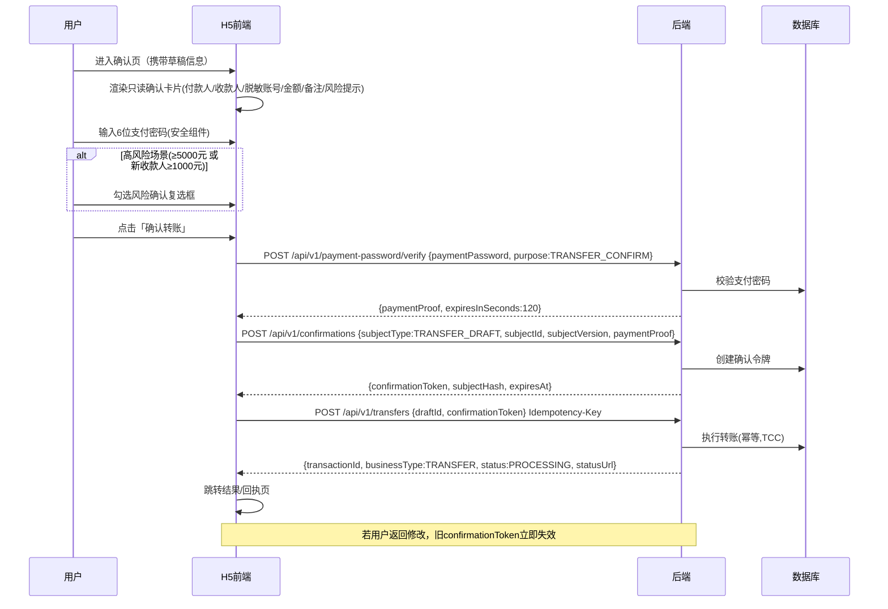
```mermaid
sequenceDiagram
    participant U as 用户
    participant FE as H5前端
    participant BE as 后端
    participant DB as 数据库

    U->>FE: 进入确认页（携带草稿信息）
    FE->>FE: 渲染只读确认卡片(付款人/收款人/脱敏账号/金额/备注/风险提示)
    U->>FE: 输入6位支付密码(安全组件)
    alt 高风险场景(≥5000元 或 新收款人≥1000元)
        U->>FE: 勾选风险确认复选框
    end
    U->>FE: 点击「确认转账」
    FE->>BE: POST /api/v1/payment-password/verify {paymentPassword, purpose:TRANSFER_CONFIRM}
    BE->>DB: 校验支付密码
    BE-->>FE: {paymentProof, expiresInSeconds:120}
    FE->>BE: POST /api/v1/confirmations {subjectType:TRANSFER_DRAFT, subjectId, subjectVersion, paymentProof}
    BE->>DB: 创建确认令牌
    BE-->>FE: {confirmationToken, subjectHash, expiresAt}
    FE->>BE: POST /api/v1/transfers {draftId, confirmationToken} Idempotency-Key
    BE->>DB: 执行转账(幂等,TCC)
    BE-->>FE: {transactionId, businessType:TRANSFER, status:PROCESSING, statusUrl}
    FE->>FE: 跳转结果/回执页
    Note over FE,BE: 若用户返回修改，旧confirmationToken立即失效
```

**前端逻辑**

+ 确认卡片展示不可编辑的付款账户、收款人实名掩码、金额、备注和风险提示，所有字段只读。
+ 按后端风控规则判定为高风险的场景需勾选风险确认复选框方可提交（具体阈值以后端风控规则为准）。
+ 用户输入支付密码并确认后，服务端签发一次性确认令牌（2 分钟有效）。
+ 确认令牌通过请求体传递给支付 API，不写入 URL、日志、埋点或 Query 持久化缓存。
+ 用户返回修改后旧确认令牌立即失效，需重新输密码并生成新确认卡片。
+ 转账执行携带 Idempotency-Key，超时只按原键重试或查询交易状态，禁止自动创建新键再次扣款。
+ 处理中禁用确认与返回按钮，跳转结果/回执页后通过轮询获取终态。

**前端逻辑 — 展示字段**

| 字段名称 | 说明 | 输入方式 | 是否必填 | 数据源 |
| --- | --- | --- | --- | --- |
| 付款人姓名 | 付款人脱敏姓名 | 只读展示 | — | 草稿信息 |
| 收款人姓名 | 收款人脱敏姓名 | 只读展示 | — | 草稿信息 |
| 收款人账号 | 收款人账号脱敏 | 只读展示 | — | 草稿信息 |
| 转账金额 | 确认转账金额（元） | 只读展示 | — | 草稿信息 |
| 备注 | 转账备注 | 只读展示 | — | 草稿信息 |
| 风险提示 | 虚拟资金转账风险说明 | 只读展示 | — | 固定文案 |
| 支付密码 | 6 位数字支付密码 | 安全输入组件 | Y | 用户输入 |
| 高风险确认 | 高风险场景复选框 | 复选框 | 条件必填 | — |


**操作按钮**

| 字段名称 | 交互 | 是否有二次确认 | 显示、禁用控制 |
| --- | --- | --- | --- |
| 确认转账 | 校验密码→创建确认→执行转账 | Y（支付密码+高风险复选框） | 密码未输满 6 位或高风险未勾选时禁用；处理中 disabled |
| 返回修改 | 返回转账页修改信息 | N | 处理中禁用；返回后旧 confirmationToken 失效 |


**所需 API**

| 方法 | 路径 | 说明 |
| --- | --- | --- |
| POST | `/api/v1/payment-password/verify` | 校验支付密码，返回 paymentProof（120 秒有效） |
| POST | `/api/v1/confirmations` | 创建确认令牌 |
| POST | `/api/v1/transfers` | 执行转账，请求体含 `{draftId, confirmationToken}`，携带 Idempotency-Key |


#### 2.3.7 AI Talk（C 端 H5）
**UI&交互**

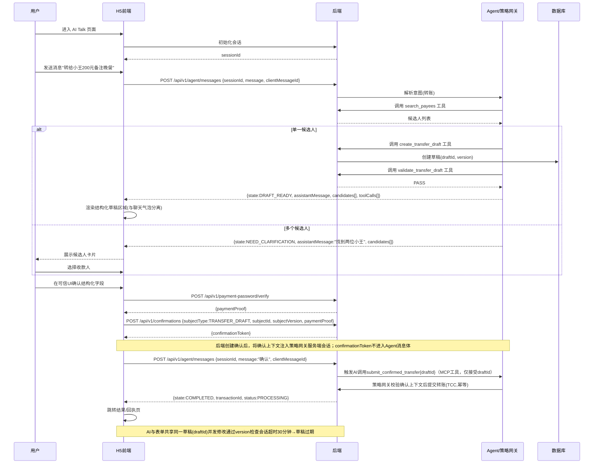
```mermaid
sequenceDiagram
    participant U as 用户
    participant FE as H5前端
    participant BE as 后端
    participant AG as Agent/策略网关
    participant DB as 数据库

    U->>FE: 进入 AI Talk 页面
    FE->>BE: 初始化会话
    BE-->>FE: sessionId
    U->>FE: 发送消息"转给小王200元备注晚餐"
    FE->>BE: POST /api/v1/agent/messages {sessionId, message, clientMessageId}
    BE->>AG: 解析意图(转账)
    AG->>BE: 调用 search_payees 工具
    BE-->>AG: 候选人列表
    alt 单一候选人
        AG->>BE: 调用 create_transfer_draft 工具
        BE->>DB: 创建草稿(draftId, version)
        AG->>BE: 调用 validate_transfer_draft 工具
        BE-->>AG: PASS
        AG-->>FE: {state:DRAFT_READY, assistantMessage, candidates[], toolCalls[]}
        FE->>FE: 渲染结构化草稿区域(与聊天气泡分离)
    else 多个候选人
        AG-->>FE: {state:NEED_CLARIFICATION, assistantMessage:"找到两位小王", candidates[]}
        FE-->>U: 展示候选人卡片
        U->>FE: 选择收款人
    end
    U->>FE: 在可信UI确认结构化字段
    FE->>BE: POST /api/v1/payment-password/verify
    BE-->>FE: {paymentProof}
    FE->>BE: POST /api/v1/confirmations {subjectType:TRANSFER_DRAFT, subjectId, subjectVersion, paymentProof}
    BE-->>FE: {confirmationToken}
    Note over FE,AG: 后端创建确认后，将确认上下文注入策略网关服务端会话；confirmationToken不进入Agent消息体
    FE->>BE: POST /api/v1/agent/messages {sessionId, message:"确认", clientMessageId}
    BE->>AG: 触发AI调用submit_confirmed_transfer{draftId}（MCP工具，仅接受draftId）
    AG->>BE: 策略网关校验确认上下文后提交转账(TCC,幂等)
    BE-->>FE: {state:COMPLETED, transactionId, status:PROCESSING}
    FE->>FE: 跳转结果/回执页
    Note over FE,BE: AI与表单共享同一草稿(draftId)并发修改通过version检查会话超时30分钟→草稿过期
```

**前端逻辑**

+ 聊天消息气泡与结构化草稿区域分离渲染，用户仅在可信 UI 确认结构化字段，不在聊天输入框填敏感数据。
+ AI 返回 `NEED_CLARIFICATION` 时展示候选人卡片供用户选择，单一候选人直接进入草稿就绪。
+ 草稿就绪后用户在可信 UI 输入支付密码，确认上下文由策略网关服务端注入，`confirmationToken` 不进入 Agent 消息体。
+ 转账执行由 AI Agent 调用 `submit_confirmed_transfer{draftId}` MCP 工具完成，前端不直接调用 `POST /transfers`。
+ 会话超时 30 分钟，草稿过期需重新发起；AI 与表单共享同一草稿，并发修改通过 version 检查并提示刷新。
+ 工具调用失败时可切换表单模式兜底，不丢失已确认字段；工具状态实时展示执行中/成功/失败。

**前端逻辑 — 展示字段**

| 字段名称 | 说明 | 输入方式 | 是否必填 | 数据源 |
| --- | --- | --- | --- | --- |
| 聊天消息输入 | 用户输入自然语言消息 | 文本输入 | Y | 用户输入 |
| 消息气泡（用户） | 用户发送的消息展示 | 只读展示 | — | 用户输入 |
| 消息气泡（AI） | AI 回复的文本消息 | 只读展示 | — | assistantMessage |
| 结构化草稿区 | AI 生成的转账草稿结构化展示 | 只读+可编辑 | — | candidates[] |
| 工具状态 | AI 工具调用状态（执行中/成功/失败） | 只读展示 | — | toolCalls[] |
| 候选项列表 | AI 提供的结构化候选方案 | 列表选择 | 条件必填 | candidates[] |
| 会话编号 | AI 会话唯一标识 | 隐藏字段 | — | 初始化返回 |
| 草稿编号 | AI 创建的转账草稿 ID | 隐藏字段 | — | 工具返回 |
| 草稿版本号 | 乐观锁版本号 | 隐藏字段 | — | 草稿信息 |


**操作按钮**

| 字段名称 | 交互 | 是否有二次确认 | 显示、禁用控制 |
| --- | --- | --- | --- |
| 发送消息 | 提交用户消息至 Agent | N | 消息为空或 Agent 处理中时禁用 |
| 确认转账 | 在可信 UI 确认结构化字段后进入确认流程 | Y（需支付密码） | 非 DRAFT_READY 状态时隐藏；处理中禁用 |
| 切换表单模式 | 切换至传统转账表单页 | N | 切换不丢失已确认字段 |
| 工具重试 | 工具调用失败后重试 | N | 仅工具失败时显示 |
| 切换表单（兜底） | 工具失败后切换至表单手动填写 | N | 仅工具失败时显示 |


**所需 API**

| 方法 | 路径 | 说明 |
| --- | --- | --- |
| POST | `/api/v1/agent/messages` | 发送用户消息（含确认指令），返回 assistantMessage/state/transactionId |
| POST | `/api/v1/payment-password/verify` | 校验支付密码（与转账确认共用） |
| POST | `/api/v1/confirmations` | 创建确认令牌，后端同时注入确认上下文到策略网关会话 |


> **转账执行说明：** AI Talk 场景下转账由 AI Agent 调用 `submit_confirmed_transfer{draftId}` MCP 工具执行（后端 12.10），策略网关从服务端会话取得确认上下文校验后提交业务中心，前端不直接调用 `POST /api/v1/transfers`。
>
> **Agent 响应状态：** 前端根据后端 12.9.7 定义的 SSE 响应结构处理 `state:NEED_CLARIFICATION`（需要澄清）状态，展示澄清交互。草稿就绪和转账完成状态由前端从 Agent 响应的 `text` 字段和后续业务接口轮询结果中推导。
>

#### 2.3.8 结果/回执页（C 端 H5）
**UI&交互**

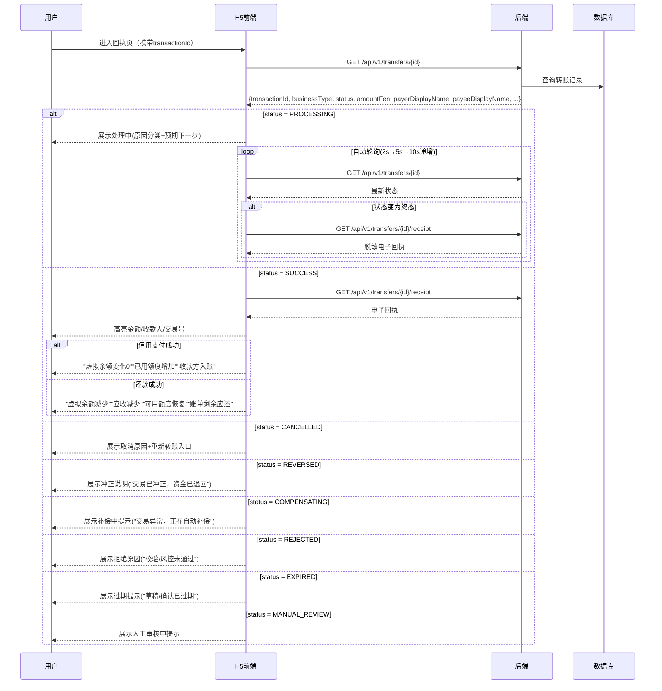
```mermaid
sequenceDiagram
    participant U as 用户
    participant FE as H5前端
    participant BE as 后端
    participant DB as 数据库

    U->>FE: 进入回执页（携带transactionId）
    FE->>BE: GET /api/v1/transfers/{id}
    BE->>DB: 查询转账记录
    BE-->>FE: {transactionId, businessType, status, amountFen, payerDisplayName, payeeDisplayName, ...}
    alt status = PROCESSING
        FE-->>U: 展示处理中(原因分类+预期下一步)
        loop 自动轮询(2s→5s→10s递增)
            FE->>BE: GET /api/v1/transfers/{id}
            BE-->>FE: 最新状态
            alt 状态变为终态
                FE->>BE: GET /api/v1/transfers/{id}/receipt
                BE-->>FE: 脱敏电子回执
            end
        end
    else status = SUCCESS
        FE->>BE: GET /api/v1/transfers/{id}/receipt
        BE-->>FE: 电子回执
        FE-->>U: 高亮金额/收款人/交易号
        alt 信用支付成功
            FE-->>U: "虚拟余额变化0""已用额度增加""收款方入账"
        else 还款成功
            FE-->>U: "虚拟余额减少""应收减少""可用额度恢复""账单剩余应还"
        end
    else status = CANCELLED
        FE-->>U: 展示取消原因+重新转账入口
    else status = REVERSED
        FE-->>U: 展示冲正说明("交易已冲正，资金已退回")
    else status = COMPENSATING
        FE-->>U: 展示补偿中提示("交易异常，正在自动补偿")
    else status = REJECTED
        FE-->>U: 展示拒绝原因("校验/风控未通过")
    else status = EXPIRED
        FE-->>U: 展示过期提示("草稿/确认已过期")
    else status = MANUAL_REVIEW
        FE-->>U: 展示人工审核中提示
    end
```

**前端逻辑**

+ 进入页面查询交易状态，PROCESSING 时自动轮询（2s→5s→10s 间隔逐步增大），不创建重复交易。
+ 电子回执仅在确定终态后可查询，非终态调用返回错误。
+ 状态分类展示：SUCCESS/REVERSED/COMPENSATING/REJECTED/EXPIRED/MANUAL_REVIEW/CANCELLED，各自对应独立文案与入口。
+ 信用支付成功展示虚拟余额变化 0、已用额度增加、收款方入账；还款成功展示虚拟余额减少、可用额度恢复、账单剩余应还。
+ CANCELLED 状态提供重新转账入口；MANUAL_REVIEW 提供联系客服入口；SUCCESS 提供查看明细入口。
+ 终态后隐藏手动刷新按钮，所有金额以后端分值为准格式化为元展示。

**前端逻辑 — 展示字段**

| 字段名称 | 说明 | 输入方式 | 数据源 |
| --- | --- | --- | --- |
| 交易号 | 转账交易唯一标识 | 只读展示 | GET /transfers/{id} |
| 交易状态 | 当前状态 | 只读展示 | GET /transfers/{id} |
| 业务类型 | TRANSFER/QR_PAY/CREDIT_PAY/CREDIT_REPAY | 只读展示 | GET /transfers/{id} |
| 付款人 | 付款人脱敏姓名 | 只读展示 | 回执接口 |
| 收款人 | 收款人脱敏姓名 | 只读展示 | 回执接口 |
| 转账金额 | 金额（元） | 只读展示 | GET /transfers/{id} |
| 交易时间 | 创建时间 | 只读展示 | GET /transfers/{id} |
| 备注 | 转账备注 | 只读展示 | GET /transfers/{id} |
| 处理原因分类 | 处理中原因 | 只读展示 | GET /transfers/{id} |
| 信用-虚拟余额变化 | 信用支付场景 | 只读展示 | 回执接口 |
| 信用-已用额度增加 | 信用支付场景 | 只读展示 | 回执接口 |
| 还款-虚拟余额减少 | 还款场景 | 只读展示 | 回执接口 |
| 还款-可用额度恢复 | 还款场景 | 只读展示 | 回执接口 |


**操作按钮**

| 字段名称 | 交互 | 是否有二次确认 | 显示、禁用控制 |
| --- | --- | --- | --- |
| 手动刷新 | 手动刷新交易状态 | N | 处理中可用；终态后隐藏 |
| 查看明细 | 跳转交易明细详情页 | N | 仅 SUCCESS 状态显示 |
| 重新转账 | 跳转转账页重新发起 | N | 仅 CANCELLED 状态显示 |
| 联系客服 | 跳转客服会话 | N | 仅 MANUAL_REVIEW 状态显示 |
| 返回首页 | 返回应用首页 | N | 始终可用 |


**所需 API**

| 方法 | 路径 | 说明 |
| --- | --- | --- |
| GET | `/api/v1/transfers/{id}` | 查询转账详情和状态 |
| GET | `/api/v1/transfers/{id}/receipt` | 查询脱敏电子回执，仅终态可用 |


#### 2.3.9 H5 扫码支付页（C 端 H5）
**UI&交互**

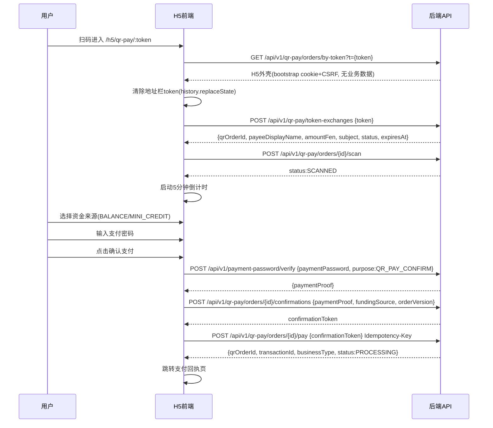
```mermaid
sequenceDiagram
    participant U as 用户
    participant H5 as H5前端
    participant API as 后端API

    U->>H5: 扫码进入 /h5/qr-pay/:token
    H5->>API: GET /api/v1/qr-pay/orders/by-token?t={token}
    API-->>H5: H5外壳(bootstrap cookie+CSRF, 无业务数据)
    H5->>H5: 清除地址栏token(history.replaceState)
    H5->>API: POST /api/v1/qr-pay/token-exchanges {token}
    API-->>H5: {qrOrderId, payeeDisplayName, amountFen, subject, status, expiresAt}
    H5->>API: POST /api/v1/qr-pay/orders/{id}/scan
    API-->>H5: status:SCANNED
    H5->>H5: 启动5分钟倒计时
    U->>H5: 选择资金来源(BALANCE/MINI_CREDIT)
    U->>H5: 输入支付密码
    U->>H5: 点击确认支付
    H5->>API: POST /api/v1/payment-password/verify {paymentPassword, purpose:QR_PAY_CONFIRM}
    API-->>H5: {paymentProof}
    H5->>API: POST /api/v1/qr-pay/orders/{id}/confirmations {paymentProof, fundingSource, orderVersion}
    API-->>H5: confirmationToken
    H5->>API: POST /api/v1/qr-pay/orders/{id}/pay {confirmationToken} Idempotency-Key
    API-->>H5: {qrOrderId, transactionId, businessType, status:PROCESSING}
    H5->>H5: 跳转支付回执页
```

**前端逻辑**

+ 扫码进入后先获取 H5 外壳（bootstrap cookie + CSRF），此时尚无业务数据，防止令牌泄露前暴露订单信息。
+ 原子绑定令牌后通过 `history.replaceState` 清除地址栏 token，防止分享链接泄露。
+ 启动 5 分钟倒计时，过期后关闭支付入口并提示订单失效。
+ 资金来源仅可选 BALANCE 或 MINI_CREDIT，切换后旧确认令牌失效，需重新输入支付密码。
+ 支付密码校验 + 风控通过后签发确认令牌，再执行支付；支付请求携带 Idempotency-Key，超时只按原键重试或查询状态。
+ 可用余额/额度实时从 `/accounts/me`、`/credit/me` 读取，不前端缓存。

**前端逻辑 — 展示/输入字段**

| 字段名称 | 说明 | 输入方式 | 是否必填 | 输入限制 | 字段类型 | 数据源 |
| --- | --- | --- | --- | --- | --- | --- |
| 收款方名称 | 收款普通用户脱敏展示名 | 只读展示 | Y | — | string | token-exchanges 返回 |
| 支付金额 | 金额（元） | 只读展示 | Y | — | decimal | token-exchanges 返回 |
| 商品说明 | 订单标题 | 只读展示 | Y | max 50 | string | token-exchanges 返回 |
| 订单号 | 扫码订单 ID | 只读展示 | Y | — | string | token-exchanges 返回 |
| 剩余有效期 | 5 分钟倒计时 | 只读展示 | Y | 300s | integer | 前端计算 |
| 资金来源 | 余额/花呗 | 单选 | Y | BALANCE/MINI_CREDIT | enum | 用户选择 |
| 可用余额 | 余额支付模式 | 只读展示 | N | — | decimal | GET /accounts/me |
| 可用额度 | 花呗支付模式 | 只读展示 | N | — | decimal | GET /credit/me |
| 支付密码 | 6 位数字 | 安全输入 | Y | 6 位数字 | string | 用户输入 |


**操作按钮**

| 字段名称 | 交互 | 是否有二次确认 | 显示、禁用控制 |
| --- | --- | --- | --- |
| 确认支付 | 校验密码→获取确认令牌→发起支付 | Y | 已选资金来源+已输密码+未过期；处理中 disabled |
| 切换资金来源 | 切换 BALANCE/MINI_CREDIT | N | 切换后旧确认令牌失效，需重新输密码 |


**所需 API**

| 方法 | 路径 | 说明 |
| --- | --- | --- |
| GET | `/api/v1/qr-pay/orders/by-token?t=` | H5 外壳，设置 bootstrap cookie+CSRF |
| POST | `/api/v1/qr-pay/token-exchanges` | 原子绑定令牌，返回脱敏订单 |
| POST | `/api/v1/qr-pay/orders/{id}/scan` | 标记已扫码（CREATED→SCANNED） |
| POST | `/api/v1/qr-pay/orders/{id}/confirmations` | 校验密码+风控，签发确认令牌 |
| POST | `/api/v1/qr-pay/orders/{id}/pay` | 执行支付，携带 Idempotency-Key |


#### 2.3.10 H5 支付回执页（C 端 H5）
**UI&交互**

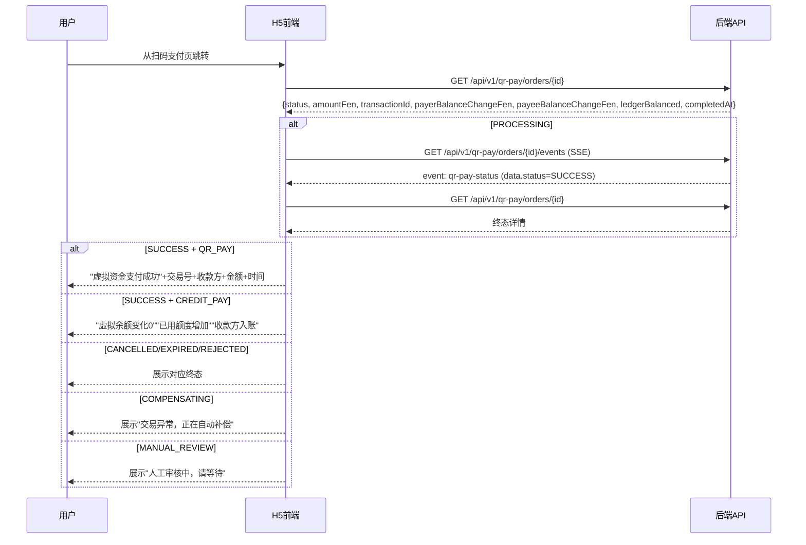
```mermaid
sequenceDiagram
    participant U as 用户
    participant H5 as H5前端
    participant API as 后端API
    U->>H5: 从扫码支付页跳转
    H5->>API: GET /api/v1/qr-pay/orders/{id}
    API-->>H5: {status, amountFen, transactionId, payerBalanceChangeFen, payeeBalanceChangeFen, ledgerBalanced, completedAt}  # payeeDisplayName 来自 token-exchanges 响应，非订单查询
    alt PROCESSING
        H5->>API: GET /api/v1/qr-pay/orders/{id}/events (SSE)
        API-->>H5: event: qr-pay-status (data.status=SUCCESS)
        H5->>API: GET /api/v1/qr-pay/orders/{id}
        API-->>H5: 终态详情
    end
    alt SUCCESS + QR_PAY
        H5-->>U: "虚拟资金支付成功"+交易号+收款方+金额+时间
    else SUCCESS + CREDIT_PAY
        H5-->>U: "虚拟余额变化0""已用额度增加""收款方入账"
    else CANCELLED/EXPIRED/REJECTED
        H5-->>U: 展示对应终态
    else COMPENSATING
        H5-->>U: 展示"交易异常，正在自动补偿"
    else MANUAL_REVIEW
        H5-->>U: 展示"人工审核中，请等待"
    end
```

**前端逻辑**

+ 查询订单真实资金状态，`payeeDisplayName` 来自 token-exchanges 响应而非订单查询，需在会话内缓存。
+ PROCESSING 时通过 SSE 订阅 `qr-pay-status` 事件，支持 `Last-Event-ID` 续传，避免事件丢失。
+ SSE 失败降级为 2 秒轮询，确保状态最终一致。
+ QR_PAY 成功展示虚拟资金支付成功 + 交易号 + 收款方 + 金额 + 时间。
+ CREDIT_PAY 成功展示虚拟余额变化 0、已用额度增加、收款方入账。
+ COMPENSATING 展示"交易异常，正在自动补偿"；MANUAL_REVIEW 展示"人工审核中，请等待"；CANCELLED/EXPIRED/REJECTED 展示对应终态。

**所需 API**

| 方法 | 路径 | 说明 |
| --- | --- | --- |
| GET | `/api/v1/qr-pay/orders/{id}` | 查询订单和真实资金状态 |
| GET | `/api/v1/qr-pay/orders/{id}/events` | SSE 订阅跨端状态，支持 Last-Event-ID |


#### 2.3.11 个人收款页（C 端 H5）
**UI&交互**

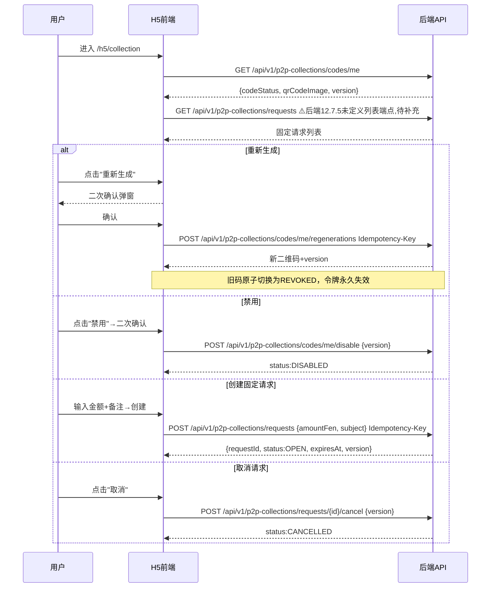
```mermaid
sequenceDiagram
    participant U as 用户
    participant H5 as H5前端
    participant API as 后端API
    U->>H5: 进入 /h5/collection
    H5->>API: GET /api/v1/p2p-collections/codes/me
    API-->>H5: {codeStatus, qrCodeImage, version}
    H5->>API: GET /api/v1/p2p-collections/requests ⚠️后端12.7.5未定义列表端点,待补充
    API-->>H5: 固定请求列表
    alt 重新生成
        U->>H5: 点击"重新生成"
        H5-->>U: 二次确认弹窗
        U->>H5: 确认
        H5->>API: POST /api/v1/p2p-collections/codes/me/regenerations Idempotency-Key
        API-->>H5: 新二维码+version
        Note over H5,API: 旧码原子切换为REVOKED，令牌永久失效
    else 禁用
        U->>H5: 点击"禁用"→二次确认
        H5->>API: POST /api/v1/p2p-collections/codes/me/disable {version}
        API-->>H5: status:DISABLED
    else 创建固定请求
        U->>H5: 输入金额+备注→创建
        H5->>API: POST /api/v1/p2p-collections/requests {amountFen, subject} Idempotency-Key
        API-->>H5: {requestId, status:OPEN, expiresAt, version}
    else 取消请求
        U->>H5: 点击"取消"
        H5->>API: POST /api/v1/p2p-collections/requests/{id}/cancel {version}
        API-->>H5: status:CANCELLED
    end
```

**前端逻辑**

+ 查询当前个人码状态和固定请求列表，个人码状态以服务端为准。
+ 重新生成需二次确认，旧码原子切换为 REVOKED，令牌永久失效，携带 Idempotency-Key。
+ 禁用个人码需携带 version 乐观锁，避免并发操作覆盖。
+ 创建固定请求金额 + 备注，30 分钟有效，携带 Idempotency-Key；金额范围 0.01-50000.00 元。
+ 取消请求仅限未被接受的 OPEN 状态，携带 version 乐观锁。
+ 二维码图片由服务端生成，前端不本地存储原始令牌。

**所需 API**

| 方法 | 路径 | 说明 |
| --- | --- | --- |
| GET | `/api/v1/p2p-collections/codes/me` | 查询当前个人码状态 |
| GET | `/api/v1/p2p-collections/requests` | ⚠️ 查询固定请求列表，后端 12.7.5 未定义，待后端补充 |
| GET | `/api/v1/p2p-collections/requests/{id}` | 查询固定请求详情和本人尝试状态 |
| POST | `/api/v1/p2p-collections/codes/me/regenerations` | 重新生成（撤销旧码+创建新码） |
| POST | `/api/v1/p2p-collections/codes/me/disable` | 禁用当前个人码 |
| POST | `/api/v1/p2p-collections/requests` | 创建固定金额收款请求（30 分钟有效） |
| POST | `/api/v1/p2p-collections/requests/{id}/cancel` | 取消未被接受的请求 |


#### 2.3.12 C2C 收款 H5（C 端 H5）
**UI&交互**

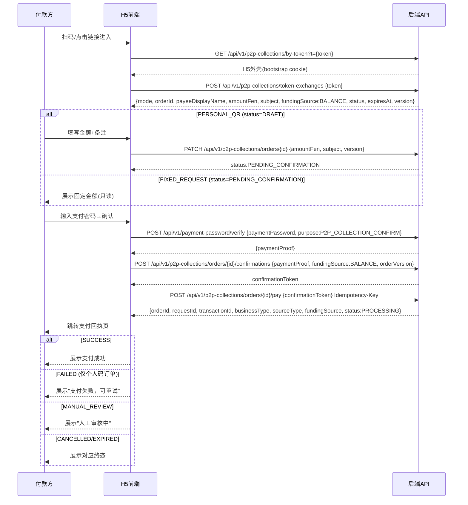
```mermaid
sequenceDiagram
    participant U as 付款方
    participant H5 as H5前端
    participant API as 后端API
    U->>H5: 扫码/点击链接进入
    H5->>API: GET /api/v1/p2p-collections/by-token?t={token}
    API-->>H5: H5外壳(bootstrap cookie)
    H5->>API: POST /api/v1/p2p-collections/token-exchanges {token}
    API-->>H5: {mode, orderId, payeeDisplayName, amountFen, subject, fundingSource:BALANCE, status, expiresAt, version}
    alt PERSONAL_QR (status=DRAFT)
        U->>H5: 填写金额+备注
        H5->>API: PATCH /api/v1/p2p-collections/orders/{id} {amountFen, subject, version}
        API-->>H5: status:PENDING_CONFIRMATION
    else FIXED_REQUEST (status=PENDING_CONFIRMATION)
        H5-->>U: 展示固定金额(只读)
    end
    U->>H5: 输入支付密码→确认
    H5->>API: POST /api/v1/payment-password/verify {paymentPassword, purpose:P2P_COLLECTION_CONFIRM}
    API-->>H5: {paymentProof}
    H5->>API: POST /api/v1/p2p-collections/orders/{id}/confirmations {paymentProof, fundingSource:BALANCE, orderVersion}
    API-->>H5: confirmationToken
    H5->>API: POST /api/v1/p2p-collections/orders/{id}/pay {confirmationToken} Idempotency-Key
    API-->>H5: {orderId, requestId, transactionId, businessType, sourceType, fundingSource, status:PROCESSING}
    H5-->>U: 跳转支付回执页
    alt SUCCESS
        H5-->>U: 展示支付成功
    else FAILED (仅个人码订单)
        H5-->>U: 展示"支付失败，可重试"
    else MANUAL_REVIEW
        H5-->>U: 展示"人工审核中"
    else CANCELLED/EXPIRED
        H5-->>U: 展示对应终态
    end
```

**前端逻辑**

+ 扫码/点击链接进入，先获取 H5 外壳，再原子绑定令牌，返回脱敏订单。
+ PERSONAL_QR 模式（DRAFT）由付款方填写金额 + 备注，锁定后不可修改（`AMOUNT_IMMUTABLE`）。
+ FIXED_REQUEST 模式金额只读展示，付款方无需填写。
+ 仅允许余额支付（`FUNDING_SOURCE_NOT_ALLOWED` 限制信用支付），资金来源固定为 BALANCE。
+ 支付密码校验 + 风控签发确认令牌后执行付款，携带 Idempotency-Key，超时只按原键重试。
+ 个人码订单 FAILED 终态（后端 10.8 单次个人收款订单状态机）展示"支付失败，可重试"；固定请求失败后恢复 OPEN 可重新尝试；MANUAL_REVIEW 展示人工审核中。

**所需 API**

| 方法 | 路径 | 说明 |
| --- | --- | --- |
| GET | `/api/v1/p2p-collections/by-token?t=` | H5 外壳 |
| POST | `/api/v1/p2p-collections/token-exchanges` | 验证令牌，返回脱敏订单 |
| PATCH | `/api/v1/p2p-collections/orders/{id}` | 个人码订单锁定金额 |
| POST | `/api/v1/p2p-collections/orders/{id}/confirmations` | 校验密码+风控 |
| POST | `/api/v1/p2p-collections/orders/{id}/pay` | 执行付款，仅 BALANCE |


#### 2.3.13 固定收款请求详情（C 端 H5）
**UI&交互**

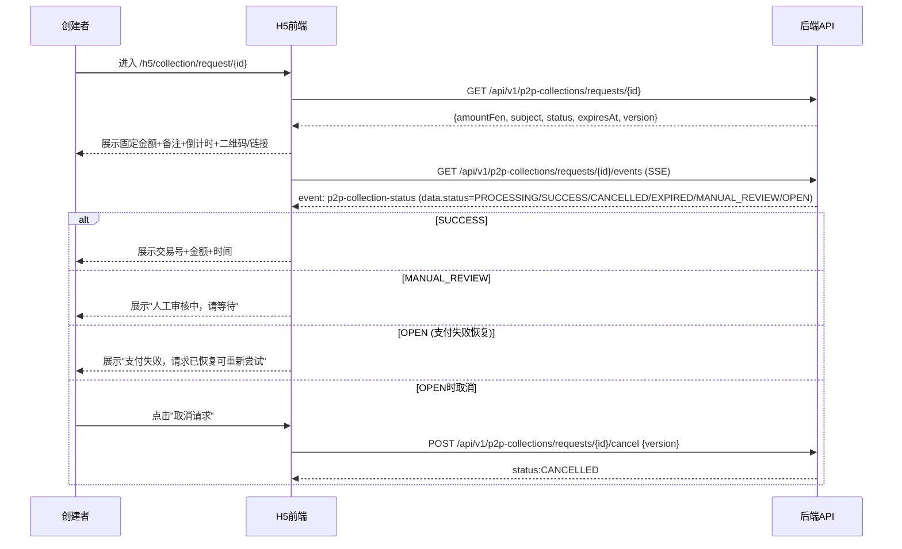
```mermaid
sequenceDiagram
    participant U as 创建者
    participant H5 as H5前端
    participant API as 后端API
    U->>H5: 进入 /h5/collection/request/{id}
    H5->>API: GET /api/v1/p2p-collections/requests/{id}
    API-->>H5: {amountFen, subject, status, expiresAt, version}
    H5-->>U: 展示固定金额+备注+倒计时+二维码/链接
    H5->>API: GET /api/v1/p2p-collections/requests/{id}/events (SSE)
    API-->>H5: event: p2p-collection-status (data.status=PROCESSING/SUCCESS/CANCELLED/EXPIRED/MANUAL_REVIEW/OPEN)
    alt SUCCESS
        H5-->>U: 展示交易号+金额+时间
    else MANUAL_REVIEW
        H5-->>U: 展示"人工审核中，请等待"
    else OPEN (支付失败恢复)
        H5-->>U: 展示"支付失败，请求已恢复可重新尝试"
    else OPEN时取消
        U->>H5: 点击"取消请求"
        H5->>API: POST /api/v1/p2p-collections/requests/{id}/cancel {version}
        API-->>H5: status:CANCELLED
    end
```

**前端逻辑**

+ 创建者查看固定请求详情 + 倒计时 + 二维码/链接，金额和备注只读展示。
+ 通过 SSE 订阅 `p2p-collection-status` 事件，支持 `Last-Event-ID` 续传；SSE 失败降级为 2 秒轮询。
+ 支付失败恢复 OPEN 时展示"支付失败，请求已恢复可重新尝试"。
+ SUCCESS 展示交易号 + 金额 + 时间；MANUAL_REVIEW 展示人工审核提示。
+ OPEN 状态可取消请求，携带 version 乐观锁；非 OPEN 状态禁用取消按钮。

**所需 API**

| 方法 | 路径 | 说明 |
| --- | --- | --- |
| GET | `/api/v1/p2p-collections/requests/{id}` | 查询脱敏请求和自身尝试状态 |
| POST | `/api/v1/p2p-collections/requests/{id}/cancel` | 取消未被接受的请求 |
| GET | `/api/v1/p2p-collections/requests/{id}/events` | SSE 订阅固定请求状态 |


#### 2.3.14 Mini 花呗首页（C 端 H5）
**UI&交互**

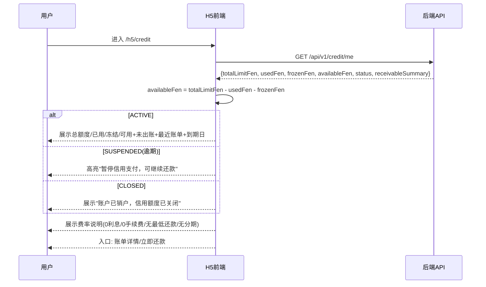
```mermaid
sequenceDiagram
    participant U as 用户
    participant H5 as H5前端
    participant API as 后端API
    U->>H5: 进入 /h5/credit
    H5->>API: GET /api/v1/credit/me
    API-->>H5: {totalLimitFen, usedFen, frozenFen, availableFen, status, receivableSummary}
    H5->>H5: availableFen = totalLimitFen - usedFen - frozenFen
    alt ACTIVE
        H5-->>U: 展示总额度/已用/冻结/可用+未出账+最近账单+到期日
    else SUSPENDED(逾期)
        H5-->>U: 高亮"暂停信用支付，可继续还款"
    else CLOSED
        H5-->>U: 展示"账户已销户，信用额度已关闭"
    end
    H5-->>U: 展示费率说明(0利息/0手续费/无最低还款/无分期)
    H5-->>U: 入口: 账单详情/立即还款
```

**前端逻辑**

+ 查询花呗额度摘要和应收，`availableFen = totalLimitFen - usedFen - frozenFen`，由前端计算展示。
+ ACTIVE 展示总额度/已用/冻结/可用 + 未出账 + 最近账单 + 到期日。
+ SUSPENDED（逾期）高亮"暂停信用支付，可继续还款"，禁用信用消费入口但保留还款入口。
+ CLOSED 展示"账户已销户，信用额度已关闭"，禁用所有信用操作。
+ 展示费率说明：0 利息/0 手续费/无最低还款/无分期，强化虚拟资金属性。
+ 额度数据通过 TanStack Query 管理，不前端缓存余额或额度终态。

**所需 API**

| 方法 | 路径 | 说明 |
| --- | --- | --- |
| GET | `/api/v1/credit/me` | 查询花呗额度摘要和应收 |


#### 2.3.15 账户明细页（C 端 H5）
**UI&交互**

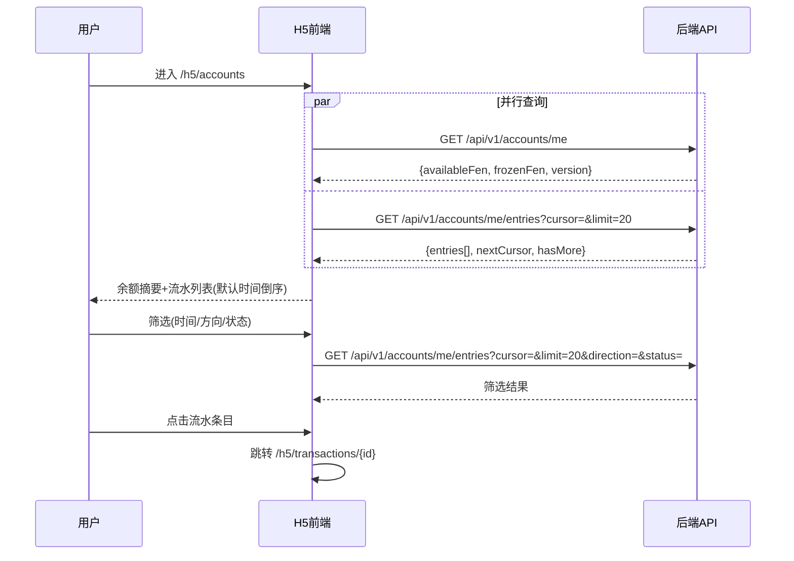
```mermaid
sequenceDiagram
    participant U as 用户
    participant H5 as H5前端
    participant API as 后端API
    U->>H5: 进入 /h5/accounts
    par 并行查询
        H5->>API: GET /api/v1/accounts/me
        API-->>H5: {availableFen, frozenFen, version}
    and
        H5->>API: GET /api/v1/accounts/me/entries?cursor=&limit=20
        API-->>H5: {entries[], nextCursor, hasMore}
    end
    H5-->>U: 余额摘要+流水列表(默认时间倒序)
    U->>H5: 筛选(时间/方向/状态)
    H5->>API: GET /api/v1/accounts/me/entries?cursor=&limit=20&direction=&status=
    API-->>H5: 筛选结果
    U->>H5: 点击流水条目
    H5->>H5: 跳转 /h5/transactions/{id}
```

**前端逻辑**

+ 并行查询账户余额和账本分录，任一失败不影响另一区域渲染。
+ 分录查询 cursor + limit（≤100），默认时间倒序，支持方向和状态筛选。
+ 金额统一使用后端返回的分值，前端格式化为元展示，不做浮点运算。
+ 点击流水条目跳转交易详情页，携带 transactionId。
+ 余额数据通过 TanStack Query 失效刷新，禁止用 Zustand 复制余额或账本终态。

**所需 API**

| 方法 | 路径 | 说明 |
| --- | --- | --- |
| GET | `/api/v1/accounts/me` | 查询账户余额 |
| GET | `/api/v1/accounts/me/entries` | 查询账本分录，cursor+limit≤100 |


#### 2.3.16 资产分析页（C 端 H5）
**UI&交互**

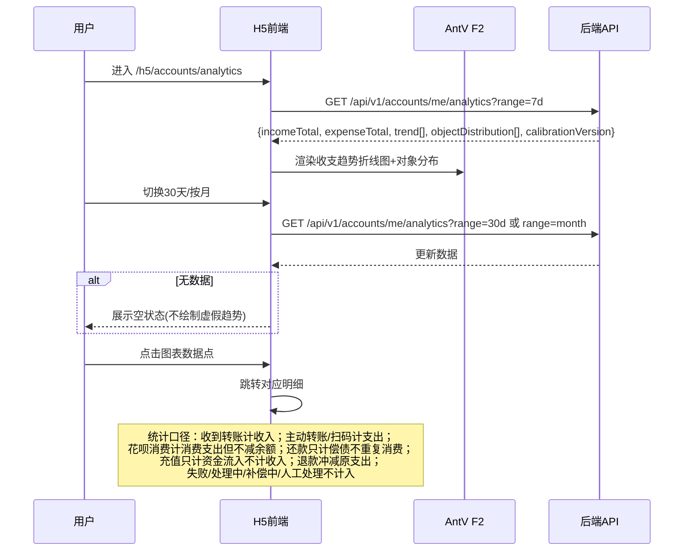
```mermaid
sequenceDiagram
    participant U as 用户
    participant H5 as H5前端
    participant Chart as AntV F2
    participant API as 后端API
    U->>H5: 进入 /h5/accounts/analytics
    H5->>API: GET /api/v1/accounts/me/analytics?range=7d
    API-->>H5: {incomeTotal, expenseTotal, trend[], objectDistribution[], calibrationVersion}
    H5->>Chart: 渲染收支趋势折线图+对象分布
    U->>H5: 切换30天/按月
    H5->>API: GET /api/v1/accounts/me/analytics?range=30d 或 range=month
    API-->>H5: 更新数据
    alt 无数据
        H5-->>U: 展示空状态(不绘制虚假趋势)
    end
    U->>H5: 点击图表数据点
    H5->>H5: 跳转对应明细
    Note over H5: 统计口径：收到转账计收入；主动转账/扫码计支出；<br/>花呗消费计消费支出但不减余额；还款只计偿债不重复消费；<br/>充值只计资金流入不计收入；退款冲减原支出；<br/>失败/处理中/补偿中/人工处理不计入
```

**前端逻辑**

+ 查询本人收支、余额资金流、信用消费/还款和对象分布，支持 7d/30d/month 维度切换。
+ 无数据时展示空状态，不绘制虚假趋势或模拟数据点。
+ 统计口径：收到转账计收入；主动转账/扫码计支出；花呗消费计消费支出但不减余额；还款只计偿债不重复消费；充值只计资金流入不计收入；退款冲减原支出；失败/处理中/补偿中/人工处理不计入。
+ 点击图表数据点跳转对应明细，趋势图由 AntV F2 渲染。
+ 数据含 `calibrationVersion` 口径版本，切换维度时重新查询，不前端聚合。

**所需 API**

| 方法 | 路径 | 说明 |
| --- | --- | --- |
| GET | `/api/v1/accounts/me/analytics?range=7d | 30d |


#### 2.3.17 交易详情页（C 端 H5）
**UI&交互**

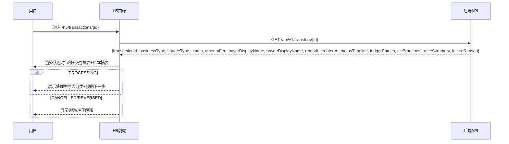
```mermaid
sequenceDiagram
    participant U as 用户
    participant H5 as H5前端
    participant API as 后端API
    U->>H5: 进入 /h5/transactions/{id}
    H5->>API: GET /api/v1/transfers/{id}
    API-->>H5: {transactionId, businessType, sourceType, status, amountFen, payerDisplayName, payeeDisplayName, remark, createdAt, statusTimeline, ledgerEntries, tccBranches, traceSummary, failureReason}
    H5-->>U: 渲染状态时间线+交易摘要+账本摘要
    alt PROCESSING
        H5-->>U: 展示处理中原因分类+预期下一步
    else CANCELLED/REVERSED
        H5-->>U: 展示失败/冲正解释
    end
```

**前端逻辑**

+ 查询交易详情，含状态时间线、交易摘要、账本摘要、TCC 分支和链路摘要。
+ PROCESSING 展示处理中原因分类 + 预期下一步，不臆造终态。
+ CANCELLED/REVERSED 展示失败/冲正解释，说明资金是否退回。
+ 所有金额以后端分值为准格式化为元展示，双方信息脱敏。
+ 状态以服务端为唯一事实来源，前端不缓存终态。

**所需 API**

| 方法 | 路径 | 说明 |
| --- | --- | --- |
| GET | `/api/v1/transfers/{id}` | 查询交易详情，含状态时间线和账本摘要 |


#### 2.3.18 Mini 花呗账单页（C 端 H5）
**UI&交互**

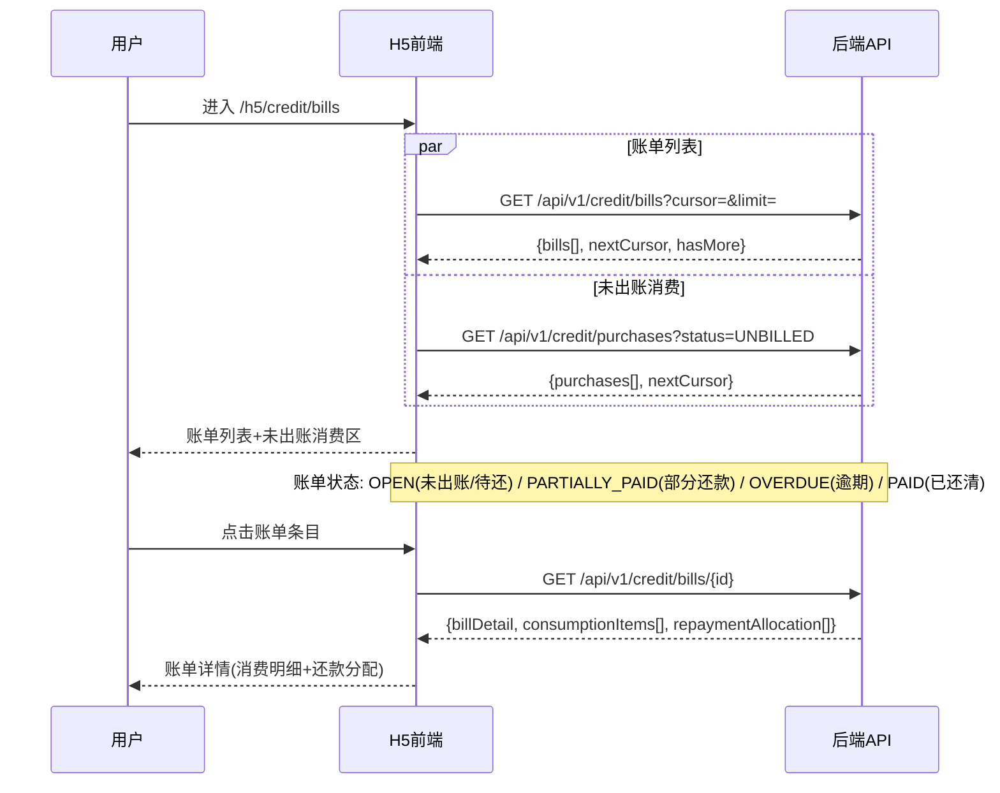
```mermaid
sequenceDiagram
    participant U as 用户
    participant H5 as H5前端
    participant API as 后端API
    U->>H5: 进入 /h5/credit/bills
    par 账单列表
        H5->>API: GET /api/v1/credit/bills?cursor=&limit=
        API-->>H5: {bills[], nextCursor, hasMore}
    and 未出账消费
        H5->>API: GET /api/v1/credit/purchases?status=UNBILLED
        API-->>H5: {purchases[], nextCursor}
    end
    H5-->>U: 账单列表+未出账消费区
    Note over H5,API: 账单状态: OPEN(未出账/待还) / PARTIALLY_PAID(部分还款) / OVERDUE(逾期) / PAID(已还清)
    U->>H5: 点击账单条目
    H5->>API: GET /api/v1/credit/bills/{id}
    API-->>H5: {billDetail, consumptionItems[], repaymentAllocation[]}
    H5-->>U: 账单详情(消费明细+还款分配)
```

**前端逻辑**

+ 并行查询账单列表和未出账消费，任一失败不影响另一区域渲染。
+ 账单状态：OPEN（未出账/待还）/PARTIALLY_PAID（部分还款）/OVERDUE（逾期）/PAID（已还清），按状态展示对应样式。
+ 账单列表 cursor 分页，点击账单条目查询详情（消费明细 + 还款分配）。
+ 逾期账单高亮提示并引导还款，已还清账单置灰展示。
+ 金额统一使用后端返回的分值，前端格式化为元展示。

**所需 API**

| 方法 | 路径 | 说明 |
| --- | --- | --- |
| GET | `/api/v1/credit/bills` | 查询账单列表，cursor 分页 |
| GET | `/api/v1/credit/bills/{id}` | 查询账单详情+消费明细+还款分配 |
| GET | `/api/v1/credit/purchases` | 查询信用消费明细，status 筛选 |


#### 2.3.19 Mini 花呗还款页（C 端 H5）
**UI&交互**

```mermaid
sequenceDiagram
    participant U as 用户
    participant H5 as H5前端
    participant API as 后端API
    U->>H5: 进入 /h5/credit/repayment
    H5->>API: GET /api/v1/credit/me
    API-->>H5: {availableFen, outstandingFen, unbilledFen}
    H5-->>U: 展示虚拟余额+花呗应收+建议全额
    U->>H5: 输入还款金额
    H5->>API: POST /api/v1/credit/repayment-drafts {amountFen} Idempotency-Key
    API-->>H5: {repaymentDraftId, allocationPreview[], allocationHash, version, expiresAt}
    H5-->>U: 展示分配预览(只读: 逾期→已出账→未出账)
    U->>H5: 输入支付密码→确认还款
    H5->>API: POST /api/v1/payment-password/verify {paymentPassword, purpose:CREDIT_REPAY}
    API-->>H5: {paymentProof}
    H5->>API: POST /api/v1/confirmations {subjectType:CREDIT_REPAYMENT_DRAFT, subjectId, subjectVersion, paymentProof}
    API-->>H5: {confirmationToken}
    H5->>API: POST /api/v1/credit/repayments {repaymentDraftId, confirmationToken} Idempotency-Key
    API-->>H5: {transactionId, status:PROCESSING}
    H5-->>U: 处理中(禁用重复提交)
    alt 成功
        H5-->>U: 展示额度实时恢复
    end
```

**前端逻辑**

+ 查询虚拟余额 + 花呗应收 + 建议全额，展示分配预览（逾期→已出账→未出账），只读不可编辑。
+ 还款额不超过虚拟余额或信用应收，不小于 1 分（`REPAYMENT_AMOUNT_INVALID`）。
+ 支付密码校验 + 确认令牌后执行还款，请求体含 `{repaymentDraftId, confirmationToken}`，携带 Idempotency-Key。
+ 处理中禁用重复提交按钮，成功后展示额度实时恢复。
+ 分配预览含 `allocationHash` 和 version，草稿过期需重新创建。

**所需 API**

| 方法 | 路径 | 说明 |
| --- | --- | --- |
| GET | `/api/v1/credit/me` | 查询虚拟余额和花呗应收 |
| POST | `/api/v1/credit/repayment-drafts` | 创建还款草稿+分配预览 |
| POST | `/api/v1/payment-password/verify` | 校验支付密码 |
| POST | `/api/v1/confirmations` | 创建确认令牌 |
| POST | `/api/v1/credit/repayments` | 执行还款，请求体含 `{repaymentDraftId, confirmationToken}`，携带 Idempotency-Key |


#### 2.3.20 动态扫码收款页（C 端 H5）
**UI&交互**

```mermaid
sequenceDiagram
    participant U as 普通用户（收款方）
    participant H5 as C端H5
    participant API as 后端API
    U->>H5: 进入 /h5/qr-collection
    U->>H5: 输入金额+商品说明→创建本人收款订单
    H5->>API: POST /api/v1/qr-pay/orders {amountFen, subject} Idempotency-Key
    API-->>H5: {qrOrderId, qrCodeUrl, status:CREATED, expiresAt, version}
    H5-->>U: 展示动态收款码+状态时间线+5分钟倒计时
    H5->>API: GET /api/v1/qr-pay/orders/{id}/events (SSE)
    API-->>H5: event: qr-pay-status (data.status: SCANNED→PENDING_CONFIRMATION→PROCESSING→SUCCESS)
    alt SSE失败
        H5->>API: GET /api/v1/qr-pay/orders/{id} (每2秒轮询)
    end
    alt 取消未支付订单
        U->>H5: 点击"取消订单"
        H5->>API: DELETE /api/v1/qr-pay/orders/{id}
        API-->>H5: status:CANCELLED
    else 终态后创建新订单
        U->>H5: 点击"新建订单"
    end
```

**前端逻辑**

+ 输入金额（0.01-50000.00 元）+ 商品说明（max 50 字符）创建订单，携带 Idempotency-Key，返回动态收款码 + 5 分钟倒计时。
+ 收款账户由服务端从当前普通用户会话派生，前端不得提交 `payeeUserId` 或 `payeeAccountId`；现实生活中的商户称谓不产生额外权限。
+ 通过 SSE 订阅 `qr-pay-status` 事件，支持 `Last-Event-ID` 续传；SSE 失败降级为 2 秒轮询。
+ 状态时间线展示 CREATED→SCANNED→PENDING_CONFIRMATION→PROCESSING→SUCCESS（含 RISK_REVIEW/COMPENSATING/MANUAL_REVIEW/REJECTED/CANCELLED/EXPIRED 分支），状态以服务端为准。
+ 仅 CREATED/SCANNED/PENDING_CONFIRMATION 可取消订单，取消需二次确认。
+ 终态后才可新建订单，处理中禁用创建入口，避免重复下单。

**前端逻辑 — 表单字段**

| 字段名称 | 说明 | 输入方式 | 是否必填 | 输入限制 | 字段类型 | 数据源 |
| --- | --- | --- | --- | --- | --- | --- |
| 收款金额 | 金额（元） | 数字输入 | Y | 0.01-50000.00 | decimal | 用户输入 |
| 商品说明 | 订单标题 | 文本输入 | Y | max 50 字符 | string | 用户输入 |
| 二维码图片 | 动态收款码 | 只读展示 | Y | — | image | API 返回 qrCodeUrl |
| 订单状态 | 状态时间线 | 只读展示 | Y | CREATED→SCANNED→PENDING_CONFIRMATION→PROCESSING→SUCCESS（含 RISK_REVIEW/COMPENSATING/MANUAL_REVIEW/REJECTED/CANCELLED/EXPIRED 分支） | enum | SSE/查询 |
| 剩余有效期 | 5 分钟倒计时 | 只读展示 | Y | 300s | integer | 前端计算 |


**操作按钮**

| 字段名称 | 交互 | 是否有二次确认 | 显示、禁用控制 |
| --- | --- | --- | --- |
| 创建订单 | 创建扫码支付订单和动态收款码 | N | 金额/说明未填写时禁用 |
| 取消订单 | 取消未处理订单 | Y | 仅 CREATED/SCANNED/PENDING_CONFIRMATION 可取消 |
| 新建订单 | 终态后创建新订单 | N | 仅终态后显示 |


**所需 API**

| 方法 | 路径 | 说明 |
| --- | --- | --- |
| POST | `/api/v1/qr-pay/orders` | 创建订单和动态收款码 |
| GET | `/api/v1/qr-pay/orders/{id}` | 查询订单和真实资金状态 |
| GET | `/api/v1/qr-pay/orders/{id}/events` | SSE 订阅跨端状态 |
| DELETE | `/api/v1/qr-pay/orders/{id}` | 取消未处理订单 |


#### 2.3.21 人工确认台（B 端 Web）
**UI&交互**

```mermaid
sequenceDiagram
    participant O as 运营人员
    participant Web as B端Web
    participant API as 后端API
    O->>Web: 进入 /admin/manual-cases
    Web->>API: GET /api/v1/manual-cases?status=&type=&cursor=
    API-->>Web: {cases[], nextCursor}
    Web-->>O: 工单列表(20条/页, 默认创建时间倒序)
    O->>Web: 点击工单→展开抽屉详情
    Note over Web: 从列表响应项中读取详情（后端 12.7.2 详情内联，无单条端点）
    Web-->>O: 抽屉展示{脱敏双方, 风控规则, TCC分支, 重试记录, 账本摘要, AgentTrace}
    O->>Web: 选择批准/驳回/继续观察+填写原因
    Web->>API: POST /api/v1/manual-cases/{id}/decisions {action, reason, version}
    API-->>Web: 更新后工单状态
```

**前端逻辑**

+ 查询工单列表（20 条/页，默认创建时间倒序），支持状态/类型/时间筛选，时间范围最长 90 天。
+ 工单详情从列表响应项中获取，抽屉展示脱敏双方 + 风控规则 + TCC 分支 + 重试记录 + 账本摘要 + AgentTrace。
+ 批准/驳回需填写原因 + version CAS，避免并发覆盖；继续观察保持工单开放。
+ 仅 OPEN 状态可批准/驳回/继续观察，非 OPEN 状态禁用操作按钮。
+ 交易号可点击跳转交易详情页，链路信息按角色裁剪展示。

**前端逻辑 — 列表筛选字段**

| 字段名称 | 说明 | 输入方式 | 是否必填 | 输入限制 | 数据源 |
| --- | --- | --- | --- | --- | --- |
| 状态筛选 | 工单状态 | 下拉选择 | N | OPEN/ACKNOWLEDGED/RESOLVED/CLOSED | 前端 |
| 类型筛选 | 工单类型 | 下拉选择 | N | RISK_PRECHECK/TRANSACTION_RECOVERY | 前端 |
| 时间筛选 | 创建时间范围 | 日期选择 | N | 最长 90 天 | 前端 |


**列表展示字段**

| 字段名称 | 说明 | 交互 |
| --- | --- | --- |
| 工单号 | caseId | 点击展开抽屉详情 |
| 交易号 | transactionId | 点击跳转交易详情 |
| 创建时间 | createdAt | — |
| 金额 | 充值金额 | 分转元展示 |
| 风险/故障原因 | reason | — |
| 当前状态 | status | — |
| 负责人 | operatorId | — |


**操作按钮**

| 字段名称 | 交互 | 是否有二次确认 | 显示、禁用控制 |
| --- | --- | --- | --- |
| 批准 | 批准工单 | Y（需填写原因） | 仅 OPEN 状态可批准 |
| 驳回 | 驳回工单 | Y（需填写原因） | 仅 OPEN 状态可驳回 |
| 继续观察 | 保持工单开放 | N | 仅 OPEN 状态可用 |


**所需 API**

| 方法 | 路径 | 说明 |
| --- | --- | --- |
| GET | `/api/v1/manual-cases` | 查询工单列表，status+type+time 筛选，工单详情从列表响应项中获取 |
| POST | `/api/v1/manual-cases/{id}/decisions` | 批准/驳回/继续观察，需原因+version CAS |


#### 2.3.22 可信运行看板（B 端 Web）
**UI&交互**

```mermaid
sequenceDiagram
    participant O as 运营人员
    participant Web as B端Web
    participant API as 后端API
    O->>Web: 进入 /admin/dashboard
    Web->>API: GET /api/v1/ops/realtime-metrics
    API-->>Web: {created, success, rejected, cancelled, amount, userCount, qps, ...}
    Web-->>O: 实时概览(每分钟刷新)
    O->>Web: 切换Tab(事务健康/Agent健康/扫码/花呗/C2C/链路检索/离线报表)
    Web->>API: GET /api/v1/ops/realtime-metrics?metricCode=&timeRange=
    API-->>Web: 对应指标数据
    Web-->>O: AntV图表展示
    alt 链路检索
        O->>Web: 输入Trace ID或Transaction ID
        Web->>API: GET /api/v1/ops/realtime-metrics?traceId=
        API-->>Web: 链路详情(脱敏)
    end
```

**前端逻辑**

+ 查询分钟级实时指标，每分钟刷新，Tab 切换：事务健康/Agent 健康/扫码/花呗/C2C/链路检索/离线报表。
+ 链路检索输入 Trace ID 或 Transaction ID 查询脱敏链路详情，按角色裁剪 Span。
+ AntV 图表展示指标趋势，指标口径版本通过 `metric-definitions` 查询对齐。
+ 观察者只读查看脱敏大盘，运营可处置告警，权限由后端 RBAC 控制。
+ 指标数据通过 TanStack Query 管理，不前端聚合或缓存终态。

**所需 API**

| 方法 | 路径 | 说明 |
| --- | --- | --- |
| GET | `/api/v1/ops/realtime-metrics` | 查询分钟级指标，metricCode+时间范围 |
| GET | `/api/v1/ops/metric-definitions` | 查询指标口径版本 |


#### 2.3.23 T+1 报表页（B 端 Web）
**UI&交互**

```mermaid
sequenceDiagram
    participant O as 运营人员
    participant Web as B端Web
    participant API as 后端API
    O->>Web: 进入 /admin/reports
    Web->>API: GET /api/v1/ops/daily-reports?date=
    API-->>Web: {metrics[], dataDate, generatedAt, qualityStatus, calibrationVersion}
    Web-->>O: 报表(默认最近7个数据日)
    alt 数据质量 PASSED
        Web-->>O: 正常展示指标
    else WARNING
        Web-->>O: 展示数据+风险标记
    else FAILED
        Web-->>O: 展示"数据不可用"，不展示数值
    end
```

**前端逻辑**

+ 查询 T+1 报表，默认最近 7 个数据日，返回口径和质量版本（`calibrationVersion`）。
+ 数据质量 PASSED 正常展示指标；WARNING 展示数据 + 风险标记；FAILED 展示"数据不可用"且不展示数值。
+ 报表为 T+1 只读查询，后端 12.7.6 未提供手动重跑端点（V1.1 已移除 rerun 路由），前端不提供重跑入口；如需重跑由后端运维侧触发。
+ 报表金额统一使用后端返回的分值，前端格式化为元展示。
+ 报表生成时间 `generatedAt` 和数据日期 `dataDate` 明确标注，避免混淆。

**所需 API**

| 方法 | 路径 | 说明 |
| --- | --- | --- |
| GET | `/api/v1/ops/daily-reports` | 查询 T+1 报表，返回口径和质量版本 |


#### 2.3.24 告警中心（B 端 Web）
**UI&交互**

```mermaid
sequenceDiagram
    participant O as 运营人员
    participant Web as B端Web
    participant API as 后端API
    O->>Web: 进入 /admin/alerts
    Web->>API: GET /api/v1/ops/alerts?cursor=&level=
    API-->>Web: {alerts[], nextCursor}
    Web-->>O: 告警列表(按级别+时间排序)
    alt 确认告警
        O->>Web: 填写确认说明→确认
        Web->>API: POST /api/v1/ops/alerts/{id}/acknowledge {explanation}
        API-->>Web: status:ACKNOWLEDGED
    else 解决告警
        O->>Web: 提交证据→解决
        Web->>API: POST /api/v1/ops/alerts/{id}/resolve {evidence}
        API-->>Web: status:RESOLVED
    else 关闭告警
        O->>Web: 关闭已恢复告警
        Web->>API: POST /api/v1/ops/alerts/{id}/close
        API-->>Web: status:CLOSED
    end
```

**前端逻辑**

+ 查询告警列表，cursor 分页，按级别 + 时间排序。
+ 确认告警需填写说明；解决告警需提交证据；关闭告警仅限 RESOLVED→CLOSED。
+ 告警级别和状态以服务端为准，前端不缓存终态。
+ 权限由后端 RBAC 控制：运营可处置告警，观察者只读查看，系统管理员可配置非资金告警阈值。

**所需 API**

| 方法 | 路径 | 说明 |
| --- | --- | --- |
| GET | `/api/v1/ops/alerts` | 查询告警列表，cursor 分页 |
| POST | `/api/v1/ops/alerts/{id}/acknowledge` | 确认告警，需说明 |
| POST | `/api/v1/ops/alerts/{id}/resolve` | 解决告警，需证据 |
| POST | `/api/v1/ops/alerts/{id}/close` | 关闭恢复告警，仅 RESOLVED→CLOSED |


#### 2.3.25 数据质量页（B 端 Web）
**UI&交互**

```mermaid
sequenceDiagram
    participant O as 运营人员
    participant Web as B端Web
    participant API as 后端API
    O->>Web: 进入 /admin/data-quality
    Web->>API: GET /api/v1/ops/data-quality?date=&job=&rule=
    API-->>Web: {qualityResults[], quarantinedEvents[], reportPublishStatus}
    Web-->>O: 质量检查结果+隔离事件+报表发布状态
    O->>Web: 筛选(任务/规则/日期)
    Web->>API: GET /api/v1/ops/data-quality?job=&rule=&date=
    API-->>Web: 筛选结果
    O->>Web: 查看隔离数据摘要
    Web-->>O: 隔离事件详情(reason, payloadDigest, quarantinedAt)
```

**前端逻辑**

+ 查询质量检查结果 + 隔离事件 + 报表发布状态，支持 date + job + rule 筛选。
+ 隔离事件展示 reason、payloadDigest、quarantinedAt，不展示原始 payload 明文。
+ 报表发布状态联动 T+1 报表页，质量 FAILED 时报表页展示"数据不可用"。
+ 筛选条件变化时重新查询，不前端聚合。

**所需 API**

| 方法 | 路径 | 说明 |
| --- | --- | --- |
| GET | `/api/v1/ops/data-quality` | 查询质量检查，date+task+rule 筛选 |


#### 2.3.26 用户管理页（B 端 Web，P1）
> **说明：** 此页面为 P1 优先级。后端 `user-center` 模块负责用户、身份、登录密码、支付密码、联系人等领域（后端 7.6.2），用户管理功能通过 `user-center` 内部领域接口提供服务，未在 12.7 端点目录中定义独立 REST 路由。前端 MVP 阶段提供基础框架和只读展示，API 端点待 `user-center` 模块扩展后对接。
>

**UI&交互**

```mermaid
sequenceDiagram
    participant O as 运营人员
    participant Web as B端Web
    participant API as 后端API
    O->>Web: 进入 /admin/users
    Web->>API: GET /api/v1/admin/users?cursor=&status=
    API-->>Web: {users[], nextCursor}
    Web-->>O: 用户列表(状态/账户状态/登录锁定)
```

**前端逻辑**

+ 查询用户列表（cursor 分页），展示状态/账户状态/登录锁定信息，均为只读。
+ 仅 ACTIVE 可冻结，仅 FROZEN 可解冻，操作需二次确认。
+ API 由 `user-center` 模块提供，MVP 阶段提供框架和只读展示，端点待后端扩展后对接。
+ 用户敏感信息脱敏展示，不展示完整登录密码或支付密码。

**前端逻辑 — 列表展示字段**

| 字段名称 | 说明 | 交互 |
| --- | --- | --- |
| 登录名 | 登录名 | 只读展示 |
| 昵称 | nickname | 只读展示 |
| 用户状态 | status | 只读展示 |
| 账户状态 | accountStatus | 只读展示 |
| 登录锁定信息 | loginLockedUntil | 只读展示 |
| 创建时间 | createdAt | 只读展示 |


**操作按钮**

| 字段名称 | 交互 | 是否有二次确认 | 显示、禁用控制 |
| --- | --- | --- | --- |
| 冻结账户 | 冻结用户账户 | Y | 仅 ACTIVE 状态可冻结 |
| 解冻账户 | 解冻用户账户 | Y | 仅 FROZEN 状态可解冻 |


**所需 API**

| 方法 | 路径 | 说明 |
| --- | --- | --- |
| GET | `/api/v1/admin/users` | ⚠️ 查询用户列表，后端 12.7 未定义，待 user-center 扩展（P1，端点落地前隐藏入口） |
| POST | `/api/v1/admin/users/{id}/freeze` | ⚠️ 冻结用户账户，后端 12.7 未定义，待 user-center 扩展（P1） |
| POST | `/api/v1/admin/users/{id}/unfreeze` | ⚠️ 解冻用户账户，后端 12.7 未定义，待 user-center 扩展（P1） |


#### 2.3.27 交易查询与回执（B 端 Web）
> 对应后端 7.6.4 `Transactions` 页面模块，运营/观察者通过交易号查询交易唯一事实状态和脱敏电子回执。
>

**UI&交互**

```mermaid
sequenceDiagram
    participant O as 运营人员
    participant Web as B端Web
    participant API as 后端API
    O->>Web: 进入 /admin/transactions
    O->>Web: 输入交易号并查询
    Web->>API: GET /api/v1/transfers/{id}
    API-->>Web: 交易唯一事实状态（status/amount/双方脱敏）
    Web-->>O: 交易详情卡片
    O->>Web: 查看回执
    Web->>API: GET /api/v1/transfers/{id}/receipt
    API-->>Web: 脱敏电子回执
    Web-->>O: 回执预览
```

**前端逻辑**

+ 输入交易号查询交易唯一事实状态，状态回源业务中心，含 PROCESSING/SUCCESS/REVERSED/CANCELLED 等。
+ 查看回执仅确定终态生成，非终态调用返回错误，脱敏展示双方信息。
+ `traceId` 可点击跳转链路追溯页，定位全链路 Span。
+ 金额以后端分值为准格式化为元展示，前端不缓存交易终态。

**前端逻辑 — 交易详情字段**

| 字段名称 | 说明 | 交互 |
| --- | --- | --- |
| 交易编号 | transactionId | 只读展示 |
| 交易状态 | status | 只读展示，含 PROCESSING/SUCCESS/REVERSED/CANCELLED 等 |
| 金额 | amountFen | 只读展示，元为单位 |
| 业务类型 | businessType | 只读展示 |
| 来源类型 | sourceType | 只读展示 |
| 资金来源 | fundingSource | 只读展示 |
| 发生时间 | occurredAt | 只读展示 |
| 付款方 | 付款方脱敏信息 | 只读展示 |
| 收款方 | 收款方脱敏信息 | 只读展示 |
| 链路编号 | traceId | 只读展示，可跳转链路追溯页 |


**所需 API**

| 方法 | 路径 | 说明 |
| --- | --- | --- |
| GET | `/api/v1/transfers/{id}` | 查询交易唯一事实状态，状态回源业务中心（后端 12.7.2） |
| GET | `/api/v1/transfers/{id}/receipt` | 查询脱敏电子回执，仅确定终态生成（后端 12.7.2） |


#### 2.3.28 链路追溯（B 端 Web）
> 对应后端 7.6.4 `Trace` 页面模块和 UC-12 用例，运营/观察者通过交易号或链路编号查询脱敏全链路，定位 Agent、接口、事务或账本阶段。后端按角色裁剪 Span。
>

**UI&交互**

```mermaid
sequenceDiagram
    participant O as 运营/观察者
    participant Web as B端Web
    participant API as 后端API
    O->>Web: 进入 /admin/trace
    O->>Web: 输入交易号或链路编号
    Web->>API: GET /api/v1/transfers/{id}/trace
    API-->>Web: 脱敏全链路 Span 列表（按角色裁剪）
    Web-->>O: 链路时间线视图
    Note over Web: 展示 Agent→网关→风控→事务→账本<br/>各阶段 Span 耗时与状态
```

**前端逻辑**

+ 输入交易号或链路编号查询脱敏全链路，后端按角色裁剪 Span。
+ 链路时间线展示 Agent→网关→风控→事务→账本各阶段 Span 的名称、状态、开始时间、耗时和服务来源。
+ `transactionId` 可点击跳转交易查询页，双向导航。
+ Span 详情已由后端脱敏，前端不二次处理敏感属性。
+ 观察者与运营看到的 Span 范围不同，权限由后端对象级授权控制。

**前端逻辑 — 链路展示字段**

| 字段名称 | 说明 | 交互 |
| --- | --- | --- |
| 链路编号 | traceId | 只读展示 |
| 交易编号 | transactionId | 只读展示，可跳转交易查询页 |
| Span 名称 | spanName | 只读展示，如 Agent/网关/风控/事务/账本 |
| Span 状态 | spanStatus | 只读展示，OK/ERROR |
| 开始时间 | startedAt | 只读展示 |
| 耗时 | durationMs | 只读展示 |
| 服务来源 | service | 只读展示，如 ai-service/gateway/business-center |
| 脱敏详情 | sanitizedAttributes | 只读展示，后端已脱敏 |


**所需 API**

| 方法 | 路径 | 说明 |
| --- | --- | --- |
| GET | `/api/v1/transfers/{id}/trace` | 查询脱敏全链路，按角色裁剪 Span（后端 12.7.2） |


#### 2.3.29 本人扫码收款统计（C 端 H5）
> 对应总体系分 7.6.4 `QrCollectionAnalytics` 页面模块和 PRD FR-SP-005，普通用户查看本人作为动态扫码收款方的今日/本月成功收款金额、订单数、客单价、支付方式占比、收款趋势、退款金额和净收款金额。
>

**UI&交互**

```mermaid
sequenceDiagram
    participant U as 普通用户
    participant H5 as C端H5
    participant API as 后端API
    U->>H5: 进入 /h5/qr-collection/analytics
    H5->>API: GET /api/v1/accounts/me/qr-collection-analytics?range=today
    API-->>H5: {totalReceiptFen,orderCount,avgOrderFen,payMethodBreakdown,refundFen,netReceiptFen,reconciliationStatus,trend[]}
    H5-->>U: 今日收款概览卡片+趋势图
    U->>H5: 切换本月
    H5->>API: GET /api/v1/accounts/me/qr-collection-analytics?range=month
    API-->>H5: 更新数据
    H5-->>U: 本月收款概览+趋势图
    Note over H5: 只统计本人收款的 SUCCESS QR_PAY/CREDIT_PAY 并按订单去重
```

**前端逻辑**

+ 查询当前普通用户本人的扫码收款统计，支持 today/month 维度切换，服务端从会话派生本人收款账户。
+ 统计口径：只统计 SUCCESS 的 QR_PAY/CREDIT_PAY 并按订单去重；净收款 = 成功收款 - 成功退款；失败/处理中/补偿中/人工处理不计入。
+ 退款冲减净收款，不重复计入成功金额。
+ 展示成功收款金额/订单数/客单价/余额支付占比/花呗支付占比/收款趋势/退款金额/净收款金额/对账状态。
+ 金额以后端分值为准格式化为元展示，趋势图由 AntV F2 渲染，不前端聚合。

**前端逻辑 — 统计展示字段**

| 字段名称 | 说明 | 交互 |
| --- | --- | --- |
| 成功收款金额 | totalReceiptFen | 只读展示，元为单位 |
| 成功/失败/处理中订单数 | orderCountByStatus | 只读展示 |
| 客单价 | avgOrderFen | 只读展示，元为单位 |
| 余额支付占比 | balancePayRatio | 只读展示，百分比 |
| Mini 花呗支付占比 | creditPayRatio | 只读展示，百分比 |
| 收款趋势 | trend | 折线图展示 |
| 退款金额 | refundFen | 只读展示，元为单位 |
| 净收款金额 | netReceiptFen | 只读展示，元为单位 |
| 对账状态 | reconciliationStatus | 只读展示 |


**所需 API**

| 方法 | 路径 | 说明 |
| --- | --- | --- |
| GET | `/api/v1/accounts/me/qr-collection-analytics?range=today | month` |


#### 2.3.30 本人扫码收款订单与对账（C 端 H5）
> 对应总体系分 7.6.4 `QrCollectionOrders` 页面模块，普通用户查看本人创建的动态扫码收款订单列表和退款、对账摘要。
>

**UI&交互**

```mermaid
sequenceDiagram
    participant U as 普通用户
    participant H5 as C端H5
    participant API as 后端API
    U->>H5: 进入 /h5/qr-collection/orders
    H5->>API: GET /api/v1/qr-pay/orders?status=&cursor=
    API-->>H5: {orders[], nextCursor}
    H5-->>U: 本人收款订单列表(订单号/金额/状态/支付方式/时间)
    U->>H5: 查看订单详情
    H5->>API: GET /api/v1/transfers/{id}
    API-->>H5: 交易唯一事实状态
    H5-->>U: 订单详情弹窗
    Note over H5: 普通用户只可见本人创建的收款订单；<br/>不展示付款人余额、完整账号或其他隐私信息
```

**前端逻辑**

+ 查询本人扫码收款订单列表，按状态和游标分页，当前普通用户只可见本人创建的订单。
+ 不展示付款人余额、完整账号或其他隐私信息，仅展示订单维度数据。
+ 点击订单查询关联交易详情（交易唯一事实状态），弹窗展示。
+ 订单状态含 CREATED/PENDING_CONFIRMATION/PROCESSING/SUCCESS/FAILED 等，完成时间仅终态有值。
+ 金额以后端分值为准格式化为元展示，状态以服务端为唯一事实来源。

**前端逻辑 — 列表展示字段**

| 字段名称 | 说明 | 交互 |
| --- | --- | --- |
| 订单编号 | orderId | 只读展示 |
| 金额 | amountFen | 只读展示，元为单位 |
| 订单状态 | status | 只读展示，含 CREATED/PENDING_CONFIRMATION/PROCESSING/SUCCESS/FAILED 等 |
| 支付方式 | fundingSource | 只读展示，BALANCE/MINI_CREDIT |
| 创建时间 | createdAt | 只读展示 |
| 完成时间 | completedAt | 只读展示，仅终态有值 |


**所需 API**

| 方法 | 路径 | 说明 |
| --- | --- | --- |
| GET | `/api/v1/qr-pay/orders` | 查询本人创建的扫码收款订单列表，按状态和游标分页 |
| GET | `/api/v1/transfers/{id}` | 查询订单关联的交易详情 |


#### 2.3.31 演示任务触发页（B 端 Web）
> 演示环境支持演示管理员受审计地触发信用账单日任务和到期检查任务。对应后端 12.7.6 新增 `POST /ops/credit/statement-runs` 和 `POST /ops/credit/due-check-runs`。
>

**UI&交互**

```mermaid
sequenceDiagram
    participant A as 演示管理员
    participant Web as B端Web
    participant API as 后端API
    A->>Web: 进入 /admin/demo-tasks
    alt 触发出账
        A->>Web: 选择业务日期→点击"触发出账"
        Web->>API: POST /api/v1/ops/credit/statement-runs {businessDate}
        API-->>Web: 200 {runId, status, businessDate}
        Web-->>A: 展示执行结果（业务日期唯一，重复执行幂等返回原结果）
    else 触发到期检查
        A->>Web: 选择业务日期→点击"触发到期检查"
        Web->>API: POST /api/v1/ops/credit/due-check-runs {businessDate}
        API-->>Web: 200 {runId, status, businessDate}
        Web-->>A: 展示执行结果（只推进合法状态，不修改账单金额）
    end
```

**前端逻辑**

+ 演示管理员权限（RBAC），提供出账和到期检查两个触发入口。
+ 触发出账：选择业务日期 → `POST /statement-runs`，业务日期唯一，重复执行幂等返回原结果。
+ 触发到期检查：选择业务日期 → `POST /due-check-runs`，只推进合法状态，不修改账单金额。
+ 执行结果展示 runId/status/businessDate，失败展示错误原因；受审计操作，记录操作者和时间。

**前端逻辑 — 表单字段**

| 字段名称 | 说明 | 输入方式 | 是否必填 | 输入限制 | 数据源 |
| --- | --- | --- | --- | --- | --- |
| 业务日期 | 触发任务的演示日期 | 日期选择 | Y | 演示环境有效日期 | 前端 |


**操作按钮**

| 字段名称 | 交互 | 是否有二次确认 | 显示、禁用控制 |
| --- | --- | --- | --- |
| 触发出账 | 选择日期后触发出账任务 | Y | 日期未选禁用；执行中 disabled + loading |
| 触发到期检查 | 选择日期后触发到期检查任务 | Y | 日期未选禁用；执行中 disabled + loading |


**所需 API**

| 方法 | 路径 | 说明 |
| --- | --- | --- |
| POST | `/api/v1/ops/credit/statement-runs` | 触发指定演示日期出账，业务日期唯一，重复执行幂等 |
| POST | `/api/v1/ops/credit/due-check-runs` | 触发指定演示日期到期检查，只推进合法状态，不修改账单金额 |


### 2.4 菜单与权限变动
本次迭代按端侧硬边界新增以下入口。B 端菜单只包含运营维护功能；普通用户业务不进入 `/admin/**`。

**B 端 Web（**`/admin`** 前缀）：**

| 菜单码 | 菜单名称 | 路由 | 权限角色 |
| --- | --- | --- | --- |
| `admin.manualCases` | 人工确认台 | `/admin/manual-cases` | 运营 |
| `admin.dashboard` | 可信运行看板 | `/admin/dashboard` | 运营/观察者 |
| `admin.reports` | T+1 报表 | `/admin/reports` | 运营/观察者 |
| `admin.alerts` | 告警中心 | `/admin/alerts` | 运营/观察者 |
| `admin.dataQuality` | 数据质量 | `/admin/data-quality` | 运营/观察者 |
| `admin.users` | 用户管理 | `/admin/users` | 系统管理员 |
| `admin.transactions` | 交易查询与回执 | `/admin/transactions` | 运营/观察者 |
| `admin.trace` | 链路追溯 | `/admin/trace` | 运营/观察者 |
| `admin.demoTasks` | 演示任务触发 | `/admin/demo-tasks` | 演示管理员 |


B 端权限由后端 RBAC 和对象级授权控制，不依赖隐藏菜单或路由路径实现安全隔离。运营人员可处置告警，观察者只读查看脱敏大盘，系统管理员可配置非资金告警阈值。普通用户访问任意 `/admin/**` 路由或接口均返回 403，现实生活中的商户身份不例外。

**C 端 H5（**`/h5`** 前缀）：** 无独立菜单系统，通过首页快捷入口和页面间导航跳转；首页为普通用户提供动态扫码收款、本人扫码收款订单和本人扫码收款统计入口。

### 2.5 模块划分与工作量评估
```mermaid
gantt
    title MiniAlalipay 前端两周交付计划
    dateFormat  YYYY-MM-DD
    axisFormat  %m-%d
    section 基础与用户
    工程骨架+目录+路由    :a1, 2026-07-28, 2d
    注册+登录+首页+充值   :a2, after a1, 2d
    section 转账与AI
    传统转账+确认+回执    :b1, 2026-08-01, 2d
    AI Talk+MCP对接       :b2, 2026-08-03, 2d
    section 扫码与收款
    动态扫码收款+SSE      :c1, 2026-08-05, 2d
    H5扫码支付+回执       :c2, 2026-08-05, 2d
    个人收款+C2C+固定请求 :c3, 2026-08-07, 2d
    section 花呗与账户
    花呗首页+账单+还款     :d1, 2026-08-01, 4d
    账户明细+资产分析+交易详情 :d2, 2026-08-05, 2d
    section B端后台
    人工确认台+看板       :e1, 2026-08-07, 2d
    报表+告警+数据质量+用户 :e2, 2026-08-09, 2d
    交易查询+链路追溯       :e3, 2026-08-09, 1d
    本人扫码收款统计+订单对账 :c4, 2026-08-09, 1d
    section 质量
    联调+缺陷收敛+稳定性   :f1, 2026-08-09, 1d
    彩排+最终验收           :milestone, f2, 2026-08-10, 1d
```

| 模块 | 细节 | 开发 | 联调 | 自测 | 前端 | 后端 |
| --- | --- | --- | --- | --- | --- | --- |
| 工程骨架 | Monorepo 双 Umi 工程目录+路由+services 层 | 1 | 0.5 | 0.5 | 前端 | — |
| 注册+登录+首页 | 注册页/登录页/首页/模拟充值 | 1.5 | 0.5 | 0.5 | 前端 | 后端 |
| 传统转账+确认+回执 | 转账页/确认页/回执页 | 1.5 | 0.5 | 0.5 | 前端 | 后端 |
| AI Talk | AI Talk 页+Agent 对接+结构化草稿 | 2 | 1 | 0.5 | 前端 | AI |
| 扫码支付 | C 端动态扫码收款/H5 扫码付款/回执/SSE | 2 | 1 | 0.5 | 前端 | 后端 |
| 个人收款 | 个人码/C2C H5/固定请求详情 | 2 | 1 | 0.5 | 前端 | 后端 |
| Mini 花呗 | 首页/账单/还款 | 2 | 1 | 0.5 | 前端 | 后端 |
| 账户与明细 | 明细/资产分析/交易详情 | 1.5 | 0.5 | 0.5 | 前端 | 后端 |
| B 端后台 | 人工确认台/看板/报表/告警/数据质量/用户/交易查询/链路追溯 | 2.5 | 1 | 0.5 | 前端 | 后端 |
| 本人扫码收款 | C 端本人收款统计/本人收款订单与对账 | 1.5 | 0.5 | 0.5 | 前端 | 后端 |
| 联调与稳定性 | 全链路联调/缺陷收敛/性能优化 | — | 1 | 1 | 前端 | 后端 |


---

### 2.6 接口规约
#### 2.6.1 B/C 端 API 客户端边界

`frontend-h5` 和 `frontend-admin` 分别根据 OpenAPI 的调用端标记生成客户端，不建立包含全部接口的公共业务客户端。两个工程只共享无副作用请求工具、统一响应外壳、错误码和 OpenAPI 生成基础类型。

| 前端工程 | 允许生成和调用的 API | 身份与数据范围 |
| --- | --- | --- |
| `frontend-h5`（C 端） | `auth`、`payment-password`、`users`、`contacts`、`accounts/me`、`recharges`、`transfer-drafts`、`confirmations`、`transfers`（不含 `trace`）、`qr-pay`、`p2p-collections`、`credit`、`agent` 及本人资源 SSE | 当前普通用户本人、本人账户、本人创建或参与的订单和绑定 H5 会话 |
| `frontend-admin`（B 端） | `manual-cases`、`ops/realtime-metrics`、`ops/daily-reports`、`ops/alerts`、`ops/data-quality`、`ops/metric-definitions`、`ops/credit/*-runs`、授权的脱敏 Trace | 运营、观察者或演示管理员按角色访问全局脱敏数据；写操作必须有审计 |
| B/C 共用 | `auth/login`、`auth/logout`、统一错误响应、Trace 和请求编号 | 登录结果由服务端返回角色；前端不能提交或提升角色 |

C 端不得调用 `/api/v1/ops/**`、`/api/v1/manual-cases/**` 或脱敏 Trace 运营接口；B 端不得调用 `/api/v1/accounts/me/**`、本人转账、扫码付款、个人收款和信用还款接口模拟用户操作。即使用户手工构造请求，网关和后端仍必须拒绝越权，不能把前端菜单隐藏当作安全控制。

B 端的用户管理、全局交易列表与详情、全局电子回执查询目前只有页面需求，后端和 OpenAPI 尚未给出可编码契约。对应页面在契约完成前只能保留路由和明确的“功能未接入”状态，禁止自行猜测 `/api/v1/ops/users`、`/api/v1/ops/transactions` 等路径，也禁止复用 C 端 `/me` 或本人交易接口拼接全局数据。

#### 2.6.2 统一响应格式
所有 REST 接口遵循统一响应结构，前端 `src/services` 层统一归一化处理：

| 场景 | HTTP | 响应体 |
| --- | --- | --- |
| 成功（查询/受理） | 200 | `{ "code": "OK", "data": <T>, "message": "success", "traceId": "..." }` |
| 创建成功 | 201 | `{ "code": "OK", "data": <T>, "message": "success", "traceId": "..." }` |
| 已受理（处理中） | 202 | `{ "code": "TRANSACTION_PENDING", "data": { "transactionId": "...", "status": "PROCESSING" }, "message": "...", "traceId": "..." }` |
| 格式错误 | 400 | `{ "code": "<ERROR_CODE>", "message": "...", "data": { ... }, "traceId": "..." }` |
| 未鉴权 | 401 | `{ "code": "AUTH_REQUIRED", "message": "...", "data": null, "traceId": "..." }` |
| 权限/CSRF 拒绝 | 403 | `{ "code": "<ERROR_CODE>", "message": "...", "data": null, "traceId": "..." }` |
| 资源不存在 | 404 | `{ "code": "<ERROR_CODE>", "message": "...", "data": null, "traceId": "..." }` |
| 冲突 | 409 | `{ "code": "<ERROR_CODE>", "message": "...", "data": { ... }, "traceId": "..." }` |
| 业务拒绝 | 422 | `{ "code": "<ERROR_CODE>", "message": "...", "data": { ... }, "traceId": "..." }` |
| 限流 | 429 | `{ "code": "RATE_LIMITED", "message": "...", "data": { "retryAfter": 60 }, "traceId": "..." }` |
| 服务异常 | 500/503 | `{ "code": "INTERNAL_ERROR", "message": "...", "data": null, "traceId": "..." }` |


前端处理：`code === "OK"` 取 `data`；`code !== "OK"` 按 2.2.5 错误码表处理，错误详情取 `data` 字段；`traceId` 用于全链路追踪（可展示供客服查询）；HTTP 5xx 统一提示"服务异常，请稍后重试"。创建接口返回 201。（对齐后端 12.8.2/12.8.3）

#### 2.6.3 通用 HTTP 契约
**请求头**

| 请求头 | 说明 | 必填 | 适用场景 |
| --- | --- | --- | --- |
| `Authorization` | `Bearer <session-token>` | 登录后必填 | 所有需鉴权接口 |
| `X-Request-ID` | 请求追踪 ID（ULID），前端生成 | 推荐 | 全部接口，用于全链路追踪；缺失时网关生成 |
| `Idempotency-Key` | 幂等键，16-64 位随机字符串 | 资金类必填 | POST 转账/充值/还款/创建订单/换码/创建固定请求 |
| `X-CSRF-Token` | CSRF 令牌 | Cookie 会话写请求必填 | 同站 Cookie 模式下的写操作 |
| `Last-Event-ID` | SSE 断线续传事件 ID | SSE 重连时 | `GET .../events` |


**响应头**：`X-Request-ID` 回传用于追踪；`Retry-After`（429 限流倒计时秒数）。

#### 2.6.4 分页规范
游标分页，适用于列表类接口（工单、告警、账单、明细、订单列表等）：

| 项 | 说明 |
| --- | --- |
| 请求参数 | `?cursor=<opaque>&limit=<1-100>`，cursor 为空表示首页，limit 最大 100 |
| 响应结构 | `{ "items": [...], "nextCursor": "<opaque |
| 终止条件 | `nextCursor` 为 `null` 表示无更多数据 |
| 排序 | 默认创建时间倒序，可在 `sort` 参数覆盖 |


#### 2.6.5 SSE 事件结构
```plain
event: qr-pay-status
id: <eventId>
data: { "orderId": "...", "status": "PROCESSING", "summary": "支付处理中", "occurredAt": "2026-07-30T10:00:00+08:00" }
```

| 事件类型 | 订阅端点 | 订阅权限 | 终态 |
| --- | --- | --- | --- |
| `qr-pay-status` | `GET /qr-pay/orders/{id}/events` | 订单创建者/付款人 | SUCCESS/REJECTED/CANCELLED/EXPIRED 后关闭 |
| `p2p-collection-status` | `GET /p2p-collections/requests/{id}/events` | 请求创建者 | SUCCESS/CANCELLED/EXPIRED 后关闭 |


+ `Last-Event-ID` 请求头用于断线续传，服务端从该 ID 之后推送
+ SSE 不传递支付密码、确认令牌、二维码原始令牌或完整账号
+ 断线超过阈值（默认 10 秒无重连）前端降级为 2 秒轮询

#### 2.6.6 核心 API 请求/响应字段
**POST /api/v1/auth/register**

| 请求字段 | 类型 | 必填 | 约束 |
| --- | --- | --- | --- |
| `loginName` | string | Y | 4-20 位字母/数字/下划线 |
| `loginPassword` | string | Y | 8-32 位，含字母+数字 |


| 响应字段 | 类型 | 说明 |
| --- | --- | --- |
| `userId` | string(ULID) | 用户 ID |
| `sessionId` | string | 会话 ID |
| `token` | string | 会话令牌（写入 HttpOnly Cookie） |


**POST /api/v1/payment-password/verify**

| 请求字段 | 类型 | 必填 | 约束 |
| --- | --- | --- | --- |
| `paymentPassword` | string | Y | 6 位数字，不进日志/埋点 |
| `purpose` | string | Y | `TRANSFER_CONFIRM` / `QR_PAY_CONFIRM` / `C2P_CONFIRM` / `CREDIT_REPAY` |


| 响应字段 | 类型 | 说明 |
| --- | --- | --- |
| `paymentProof` | string | 一次性短期凭证，通过请求体传递给 confirmations |


**POST /api/v1/transfer-drafts**

| 请求字段 | 类型 | 必填 | 约束 |
| --- | --- | --- | --- |
| `payeeUserId` | string(ULID) | Y | 收款人用户 ID |
| `amountFen` | integer | Y | 1-5000000（0.01-50000.00 元） |
| `remark` | string | N | ≤50 字符，过滤控制字符 |


| 响应字段 | 类型 | 说明 |
| --- | --- | --- |
| `draftId` | string(ULID) | 草稿 ID |
| `version` | integer | 乐观锁版本号 |
| `expiresAt` | datetime | 草稿过期时间（30 分钟） |


**POST /api/v1/confirmations**

| 请求字段 | 类型 | 必填 | 约束 |
| --- | --- | --- | --- |
| `subjectType` | string | Y | `TRANSFER_DRAFT` / `QR_PAY_ORDER` / `COLLECTION_ORDER` / `CREDIT_REPAYMENT_DRAFT` |
| `subjectId` | string(ULID) | Y | 草稿/订单 ID |
| `subjectVersion` | integer | Y | 主体版本号 |
| `paymentProof` | string | Y | payment-password/verify 返回的凭证 |


| 响应字段 | 类型 | 说明 |
| --- | --- | --- |
| `confirmationToken` | string | 一次性确认令牌，2 分钟有效，通过请求体传递给支付 API |


**POST /api/v1/transfers**

| 请求字段 | 类型 | 必填 | 约束 |
| --- | --- | --- | --- |
| `draftId` | string(ULID) | Y | 转账草稿 ID |
| `confirmationToken` | string | Y | 确认令牌 |


| 响应字段 | 类型 | 说明 |
| --- | --- | --- |
| `transactionId` | string(ULID) | 交易 ID |
| `status` | string | `PROCESSING` / `RISK_REVIEW` |
| `businessType` | string | `TRANSFER` |


---

### 2.7 前端数据模型与状态设计
#### 2.7.1 TypeScript 核心类型定义
核心领域模型类型统一放在 `frontend-h5/src/types` 和 `frontend-admin/src/types`（Monorepo 共享 `contracts/types`）：

```typescript
/** 用户与会话 */
interface UserSummary { userId: string; loginName: string; nickname: string; hasPaymentPassword: boolean; }
interface Session { sessionId: string; token: string; user: UserSummary; }

/** 账户与额度 */
interface Account { accountId: string; availableFen: number; frozenFen: number; version: number; }
interface CreditAccount {
  creditAccountId: string; totalLimitFen: number; usedFen: number; frozenFen: number;
  availableFen: number; status: 'ACTIVE' | 'SUSPENDED' | 'CLOSED'; version: number;
}

/** 交易 */
interface Transaction {
  transactionId: string; businessType: 'TRANSFER' | 'QR_PAY' | 'CREDIT_PAY' | 'CREDIT_REPAY';
  status: 'DRAFT' | 'PENDING_CONFIRMATION' | 'RISK_REVIEW' | 'PROCESSING' | 'COMPENSATING'
        | 'MANUAL_REVIEW' | 'SUCCESS' | 'REVERSED' | 'CANCELLED' | 'REJECTED' | 'EXPIRED';
  amountFen: number; sourceType: string; sourceOrderId: string; fundingSource: string;
  createdAt: string; traceId: string;
}

/** 转账草稿 */
interface TransferDraft {
  draftId: string; payeeUserId: string; payeeDisplayName: string; amountFen: number;
  remark: string; version: number; expiresAt: string; status: string;
}

/** 扫码订单 */
interface QrPayOrder {
  qrOrderId: string; payeeAccountId: string; amountFen: number; subject: string;
  fundingSource: 'BALANCE' | 'MINI_CREDIT'; status: string; version: number;
  expiresAt: string; transactionId?: string;
}

/** 花呗账单 */
interface CreditBill {
  billId: string; billPeriod: string; totalAmountFen: number; paidAmountFen: number;
  status: 'OPEN' | 'PARTIALLY_PAID' | 'OVERDUE' | 'PAID'; dueDate: string; version: number;
}

/** 个人收款 */
interface CollectionRequest {
  requestId: string; amountFen: number; subject: string; status: string;
  expiresAt: string; activeOrderId?: string; version: number;
}
interface Contact {
  payeeUserId: string; alias: string; successCount: number; lastSuccessAt: string;
  pinned: boolean; hidden: boolean; version: number;
}

/** B 端运营 */
interface ManualCase { caseId: string; transactionId?: string; status: 'OPEN' | 'ACKNOWLEDGED' | 'RESOLVED' | 'CLOSED'; type: string; reason: string; version: number; }
interface Alert { alertId: string; level: 'P0' | 'P1' | 'P2'; status: 'OPEN' | 'ACKNOWLEDGED' | 'RESOLVED' | 'CLOSED'; title: string; occurredAt: string; }

/** 统一分页响应 */
interface PageResult<T> { items: T[]; nextCursor: string | null; }
/** 统一 API 响应 */
interface ApiResponse<T> { code: string; data: T | null; message: string; traceId: string; }
```

#### 2.7.2 Zustand Store 结构
Zustand 仅保存客户端状态，禁止复制服务端资金终态：

```typescript
/** authStore — 登录态与权限 */
interface AuthStore {
  user: UserSummary | null;
  isAuthenticated: boolean;
  roles: string[];
  setUser: (user: UserSummary) => void;
  logout: () => void;
}

/** uiStore — 全局 UI 状态 */
interface UiStore {
  theme: 'light' | 'dark';
  globalLoading: boolean;
  online: boolean;              // 网络在线状态
  setTheme: (t: 'light' | 'dark') => void;
  setGlobalLoading: (v: boolean) => void;
  setOnline: (v: boolean) => void;
}

/** sessionStore — 跨页面会话状态（受控持久化，排除敏感令牌） */
interface SessionStore {
  activeTransferDraftId: string | null;   // 当前转账草稿
  activeQrOrderId: string | null;          // 当前扫码订单
  aiSessionId: string | null;              // AI Talk 会话
  filters: Record<string, unknown>;        // 列表筛选条件
  setActiveTransferDraft: (id: string | null) => void;
  setActiveQrOrder: (id: string | null) => void;
}
```

#### 2.7.3 TanStack Query queryKey 规范与缓存策略
**queryKey 命名规范**：`[domain, resource, ...params]`

| queryKey | 说明 | staleTime | 刷新时机 |
| --- | --- | --- | --- |
| `['auth', 'me']` | 当前用户信息 | 5min | 登录/登出/支付密码变更 |
| `['account', 'me']` | 账户余额 | 0（始终过期） | 转账/充值/还款成功后 invalidate |
| `['credit', 'me']` | 花呗额度 | 0 | 消费/还款成功后 invalidate |
| `['account', 'entries', { cursor, limit, direction, status }]` | 账本明细 | 30s | 新交易成功后 invalidate |
| `['account', 'analytics', { range }]` | 收支分析 | 60s | 维度切换重新查询 |
| `['transfers', id]` | 交易详情 | 0 | 轮询期间自动刷新 |
| `['credit', 'bills', { cursor }]` | 账单列表 | 30s | 还款成功后 invalidate |
| `['contacts', { cursor }]` | 常用收款人 | 60s | 转账成功后 invalidate |
| `['manual-cases', { status, type, cursor }]` | 工单列表 | 10s | 决策后 invalidate |
| `['ops', 'alerts', { cursor, level }]` | 告警列表 | 10s | 处置后 invalidate |


**缓存策略**：

+ 余额、额度、交易终态 `staleTime: 0`（始终回源），禁止用 Zustand 复制
+ 列表类 `staleTime: 10-60s`，操作后主动 `invalidateQueries`
+ `gcTime: 5min`（默认垃圾回收）
+ `retry: 1`（失败重试 1 次，资金类不自动重试，按幂等键手动重试）

#### 2.7.4 状态流转设计
**转账流程状态机（前端视角）**

```mermaid
stateDiagram-v2
    [*] --> 填写草稿
    填写草稿 --> 风控预检: 创建草稿+validate
    风控预检 --> 确认页: PASS
    风控预检 --> 人工审核提示: MANUAL(RISK_MANUAL_REVIEW)
    确认页 --> 处理中: 输密码+确认令牌+执行
    确认页 --> 填写草稿: 返回修改(旧令牌失效)
    处理中 --> 成功: SUCCESS
    处理中 --> 失败终态: REVERSED/CANCELLED/REJECTED/EXPIRED
    处理中 --> 人工审核: MANUAL_REVIEW
    成功 --> [*]
    失败终态 --> [*]
    人工审核 --> [*]
```

**扫码支付流程状态机（前端视角）**

```mermaid
stateDiagram-v2
    [*] --> 扫码落地
    扫码落地 --> 绑定令牌: token-exchanges
    绑定令牌 --> 待确认: 展示脱敏订单
    待确认 --> 处理中: 输密码+确认令牌+pay
    处理中 --> 成功: SUCCESS(QR_PAY/CREDIT_PAY)
    处理中 --> 补偿中: COMPENSATING
    处理中 --> 人工审核: MANUAL_REVIEW
    处理中 --> 失败终态: REJECTED/CANCELLED/EXPIRED
    成功 --> [*]
    补偿中 --> [*]
    人工审核 --> [*]
    失败终态 --> [*]
```

---

### 2.8 边界与异常处理
#### 2.8.1 全局错误处理
| 层级 | 机制 | 说明 |
| --- | --- | --- |
| API 拦截器 | `src/services` 统一响应归一化 | `code === 0` 取 data；`code !== 0` 按 2.2.5 错误码表分发处理；5xx 统一 Toast |
| ErrorBoundary | React ErrorBoundary 包裹路由级组件 | 捕获渲染异常，展示兜底页 + "刷新重试"按钮，上报 `error.render` 埋点 |
| 兜底页 | 404 页 / 500 页 / 网络错误页 | 路由不匹配 → 404；渲染异常 → 500；断网 → 网络错误页 |


#### 2.8.2 loading / 骨架屏统一策略
| 场景 | 策略 |
| --- | --- |
| 页面首次加载 | 骨架屏（Skeleton）占位，匹配页面布局 |
| 按钮提交 | `disabled + loading`，防止重复点击 |
| 列表加载 | Skeleton 列表项占位 |
| 全局请求 | 顶部进度条（NProgress） |
| 轮询中 | 保持上次数据展示 + 局部 loading 指示，不闪烁清空 |


#### 2.8.3 空状态统一策略
| 场景 | 展示 |
| --- | --- |
| 列表为空 | `<Empty>` 组件 + 引导文案（如"暂无交易记录"） |
| 图表无数据 | `<Empty>` + "暂无数据"，不绘制虚假趋势 |
| 无权限 | `<Empty>` + "您无权访问此页面" + 返回首页入口 |
| 搜索无结果 | `<Empty>` + "未找到匹配的收款人" |


#### 2.8.4 网络异常 / 断网 / 弱网
| 场景 | 处理 |
| --- | --- |
| 断网 | `navigator.onLine` + online/offline 事件监听；断网时全局 Toast "网络已断开"，恢复时 Toast "网络已恢复" |
| 请求超时 | 按接口超时配置（见 2.9.5）；资金类不自动重试，提示"处理中，请查询状态" |
| 弱网 | TanStack Query `retry: 1`；SSE 断线降级 2 秒轮询；轮询间隔递增（2s→5s→10s） |
| 5xx 服务异常 | Toast "服务异常，请稍后重试"；不改变本地资金状态 |


#### 2.8.5 会话过期 / 401 统一拦截
| 场景 | 处理 |
| --- | --- |
| 401 `AUTH_REQUIRED` | 拦截器统一处理：清除 authStore 登录态 → 跳转 `/h5/login` 或 `/admin/login` → 保留 `redirect` 安全回跳 |
| 登录态恢复 | 登录成功后读取 `redirect` 参数回跳原页面，回跳地址须校验同站白名单 |
| Cookie 过期 | 后端返回 401，前端按上述流程处理 |


#### 2.8.6 重复提交防护
| 场景 | 策略 |
| --- | --- |
| 资金类提交（转账/支付/还款/充值） | `Idempotency-Key` + 按钮 `disabled + loading`；超时只按原键重试或查询状态，禁止创建新键 |
| 搜索输入 | 防抖 300ms（aHooks `useDebounce`） |
| 列表分页 | 节流，避免快速翻页重复请求 |
| 处理中交易 | 禁用提交按钮，跳转结果页轮询 |


#### 2.8.7 表单校验统一规范
| 维度 | 规范 |
| --- | --- |
| 校验时机 | 失焦校验（onBlur）+ 提交校验（onSubmit）双重校验 |
| 错误展示 | 字段下方红色文案；金额类同时标注范围 |
| 提交控制 | 任一字段校验未通过禁用提交按钮 |
| 密码类 | 独立安全输入组件，不进入普通表单状态；确认密码与原密码一致性校验 |
| 金额类 | 校验范围 0.01-50000.00 元，仅两位小数；失焦格式化 |
| 备注类 | 过滤脚本和控制字符，≤50 字符 |


---

### 2.9 非功能性设计
#### 2.9.1 浏览器兼容性矩阵
| 端 | 浏览器 | 最低版本 | 说明 |
| --- | --- | --- | --- |
| C 端 H5 | Chrome | 90+ | 移动端主流 |
| C 端 H5 | Safari (iOS) | 14+ | 安全区适配 |
| C 端 H5 | Edge | 90+ | — |
| B 端 Web | Chrome | 90+ | 桌面端主流 |
| B 端 Web | Edge | 90+ | — |
| B 端 Web | Firefox | 88+ | — |


+ 不支持 IE；ES2020+ 语法，Vite/Babel 按目标浏览器自动 polyfill
+ H5 适配 375px-428px 主流宽度，安全区 `env(safe-area-inset-*)`

#### 2.9.2 性能预算
| 指标 | C 端 H5 | B 端 Web |
| --- | --- | --- |
| 首屏 LCP | < 2s | < 3s |
| FID | < 100ms | < 100ms |
| CLS | < 0.1 | < 0.1 |
| 主包体积（gzip） | < 300KB | < 500KB |
| 接口响应 P95 | < 500ms | < 500ms |
| 路由切换 | < 200ms | < 300ms |


+ 性能监控见 3.1（H5 首屏 P95 > 2s 触发 P1 告警）
+ 超预算时优先优化：路由懒加载分包、图片压缩、接口合并

#### 2.9.3 骨架屏 / 占位 UI
| 场景 | 组件 |
| --- | --- |
| 首页/明细首屏 | 卡片骨架屏（匹配余额区/列表布局） |
| 列表加载 | 列表项骨架屏（Ant Design Mobile / Ant Design Skeleton） |
| 图表加载 | 图表区占位 Skeleton |
| 详情页 | 详情卡片骨架屏 |


#### 2.9.4 资源优化策略
| 策略 | 说明 |
| --- | --- |
| 路由级懒加载 | `React.lazy` + `Suspense`，B/C 端分别按路由分包 |
| 图片懒加载 | `loading="lazy"`；二维码图片由服务端生成，前端不本地存储 |
| 字体子集化 | 仅打包实际使用的字重和字符集 |
| 依赖按需引入 | Lodash 按需、AntV 按图表类型引入、Ant Design Mobile 按需 |
| Tree Shaking | Vite 生产构建自动摇树，确保无未使用代码 |


#### 2.9.5 接口超时与重试配置
| 接口类型 | 超时 | 重试 | 说明 |
| --- | --- | --- | --- |
| 普通查询 | 10s | 1 次 | TanStack Query retry: 1 |
| 资金类（转账/支付/还款/充值） | 15s | 0（手动） | 超时只按原 Idempotency-Key 重试或查询状态 |
| SSE 订阅 | 30s 无数据重连 | 自动 | 携带 Last-Event-ID 续传；超阈值降级 2s 轮询 |
| 轮询 | 按间隔 | 持续 | 2s→5s→10s 递增，终态停止 |
| 文件/流式 | 30s | 0 | Axios 单独配置 |


#### 2.9.6 防抖 / 节流策略
| 场景 | 策略 | 说明 |
| --- | --- | --- |
| 收款人搜索 | 防抖 300ms | aHooks `useDebounce`，避免频繁请求 |
| 按钮点击 | 节流 500ms | 防止快速双击 |
| 轮询间隔 | 递增 2s→5s→10s | PROCESSING 状态自动轮询，间隔逐步增大 |
| 窗口 resize | 防抖 200ms | 图表重绘 |
| 页面滚动 | 节流 100ms | 列表无限滚动加载 |


---

## 3. 监控和埋点
### 3.1 前端监控指标
| 监控域 | 指标 | 采集方式 | 告警条件 |
| --- | --- | --- | --- |
| 页面性能 | H5 首屏加载 P95 | Performance API + 埋点 | > 2s：P1 |
| 页面性能 | B 端页面加载 P95 | Performance API + 埋点 | > 3s：P2 |
| 交互 | 支付确认按钮响应 P95 | 埋点计时 | > 1s：P1 |
| 交互 | SSE 连接成功率 | 埋点 | 连续 5 分钟低于 90%：P1 |
| 交互 | SSE 断线重连次数 | 埋点 | 单会话 > 3 次：P2 |
| 交互 | 轮询降级触发次数 | 埋点 | 展示趋势 |
| 业务 | 转账发起成功率 | 业务事件埋点 | 连续 5 分钟低于 90%：P1 |
| 业务 | 扫码支付成功率 | 业务事件埋点 | 连续 5 分钟低于 90%：P1 |
| 业务 | AI Talk 澄清率 | 业务事件埋点 | 展示趋势 |
| 业务 | 确认页退出率 | 业务事件埋点 | 展示趋势 |
| 安全 | 敏感值泄露检测 | 前端代码扫描+运行时检查 | > 0：P0 |


### 3.2 前端埋点事件
| 事件名 | 触发时机 | 关键属性 |
| --- | --- | --- |
| `page.view` | 页面加载完成 | pagePath, loadTime, userIdHash |
| `transfer.draft.created` | 转账草稿创建成功 | draftId, amountFen, source(AI/form) |
| `transfer.confirmed` | 转账确认提交 | transactionId, businessType, riskLevel |
| `qrpay.order.created` | 普通用户创建扫码收款订单 | qrOrderId, amountFen |
| `qrpay.scanned` | H5 扫码成功 | qrOrderId |
| `qrpay.paid` | 扫码支付提交 | qrOrderId, fundingSource |
| `aitalk.message.sent` | AI Talk 发送消息 | sessionId, intent |
| `aitalk.clarification` | AI 需要澄清 | sessionId, missingSlots |
| `credit.repayment.submitted` | 花呗还款提交 | transactionId, amountFen |
| `collection.request.created` | 固定请求创建 | requestId, amountFen |
| `alert.acknowledged` | 告警确认 | alertId, level |
| `sse.disconnected` | SSE 断线 | orderId, lastEventId |


---

## 4. 发布计划
### 4.1 发布准则
发布前必须满足以下准则（无例外）：

1. 没有监控核对不允许上线
2. 没有灰度不允许上线
3. 没有应急方案不允许上线
4. 没有 CR 不允许上线
5. 没有发布计划不允许上线
6. 代码变更必须走变更流程
7. 非代码变更必须有 review 或测试

### 4.2 发布时间节点
| 时间 | 事项 |
| --- | --- |
| 2026-08-09 | 联调完成+缺陷收敛+稳定性优化 |
| 2026-08-10 | 演示彩排+数据重置脚本+最终验收 |


### 4.3 故障应急响应原则
线上问题、故障及突发事件立即同步和上报，不得迟报、谎报、瞒报、漏报。应急处理优先止血，控制影响，避免问题扩散。所有解决措施以恢复业务为原则，包括技术和业务手段。应急交流中必须保证信息和数据准确，所有关键内容记录备忘。需要检查应急操作执行结果，效果确认至少观察 10 分钟。

---

## 5. 其他
### 5.1 风险评估
| 风险项 | 级别 | 影响 | 应对措施 |
| --- | --- | --- | --- |
| 后端用户管理 API 未定义 | 中 | 用户管理页（P1）无法实现完整功能 | 页面提供框架和只读展示，API 待后端确认后补充 |
| SSE 在演示网络环境不稳定 | 中 | 跨端状态同步延迟 | 降级为 2 秒轮询，确保状态最终一致 |
| AI Talk 与表单草稿并发冲突 | 中 | 草稿版本不一致导致提交失败 | 前端拦截旧版本提交，提示用户刷新 |
| 双 Umi 工程构建配置复杂 | 低 | 开发效率下降 | 使用 Monorepo 共享 contracts 类型，统一 lint 规范 |
| Ant Design Mobile 与桌面组件混用 | 低 | C 端体验不一致 | 严格隔离双工程组件库，不共享全局样式 |
| 模拟充值 API 请求/响应细节未在后端 12.9 中定义 | 中 | 首页充值功能联调受阻 | 参照 12.7 端点目录定义，与后端确认后补充请求/响应 Schema |


### 5.2 稳定性保障
前端稳定性保障措施：路由级懒加载确保首屏体积可控；TanStack Query 缓存和重试策略配置合理的 staleTime 和 retry；SSE 断线自动重连携带 Last-Event-ID；金额统一使用后端返回的分值，前端不做浮点运算；Zustand 状态刷新后恢复排除敏感令牌；支付密码安全输入组件防止截屏和键盘记录。

### 5.3 项目总结/复盘
[XX-项目复盘待项目结束后补充]
