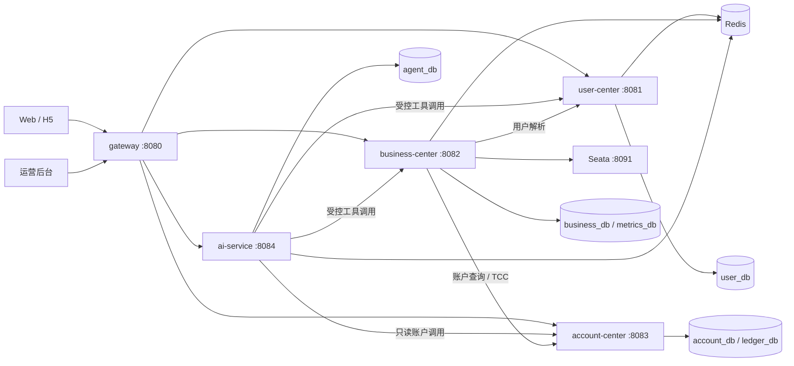
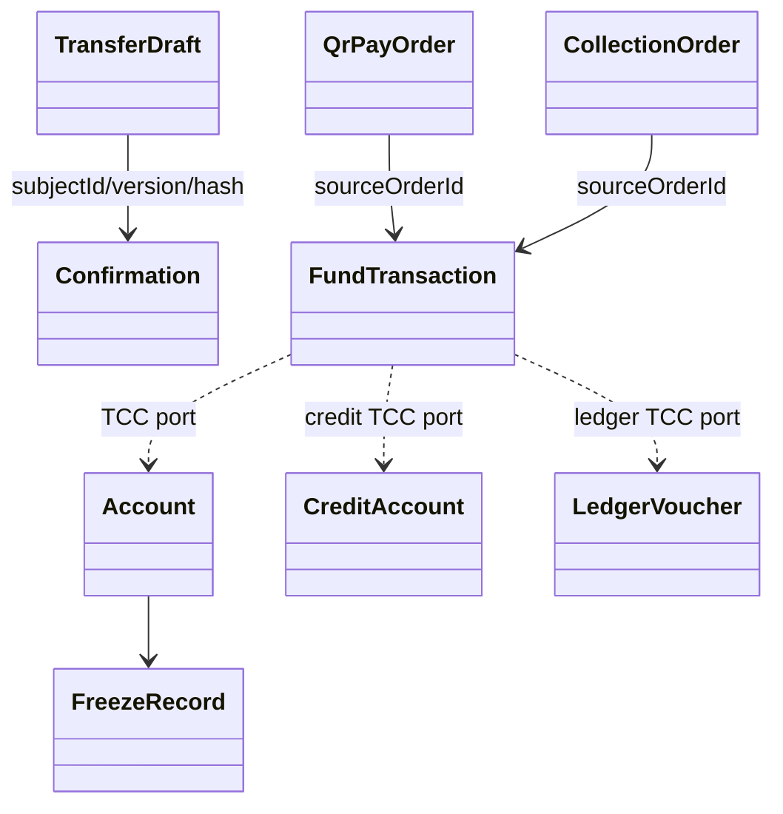
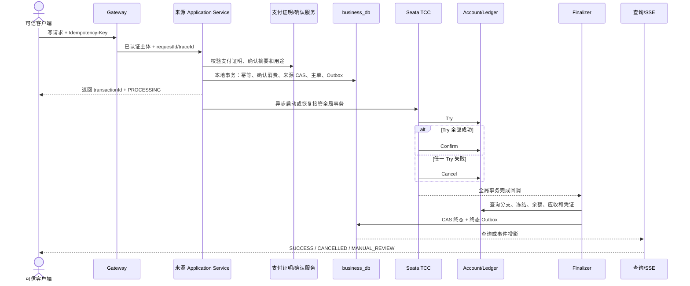
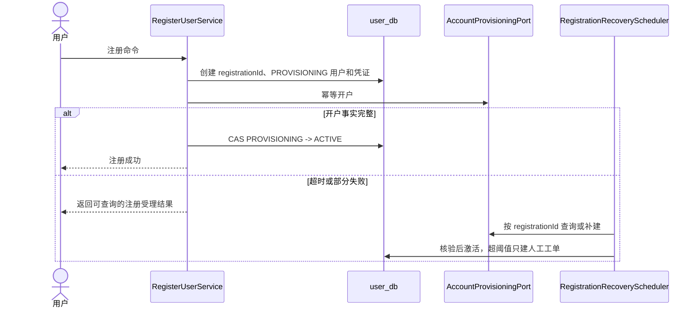
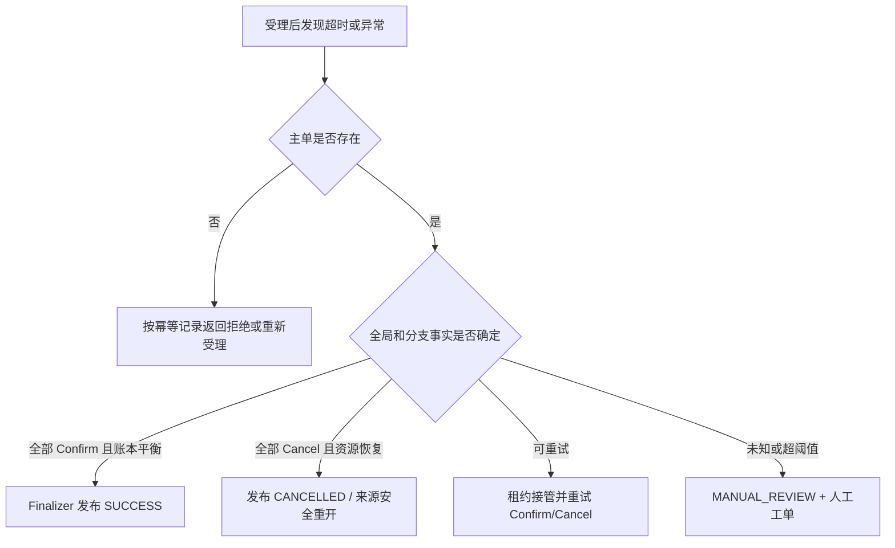
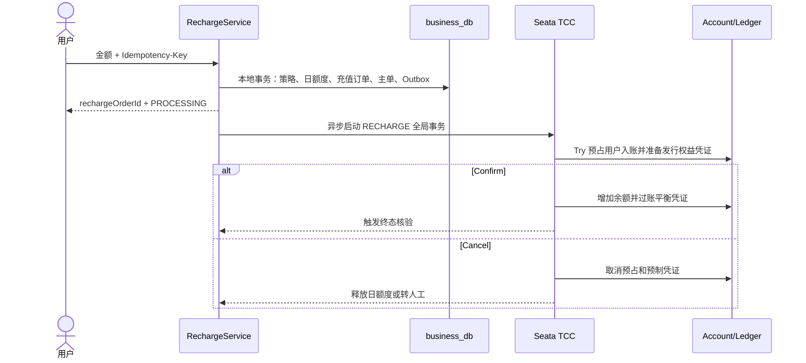

# MiniAlalipay 后端系统分析与详细设计

## 0. 文档控制

| 项目 | 内容 |
|---|---|
| 文档版本 | V2.2 |
| 修订日期 | 2026-07-31 |
| 需求基线 | [MiniAlalipay PRD](./minialalipay-prd.md) |
| 架构事实 | [MiniAlalipay 总体系统分析](./minialalipay-system-analysis.md) |
| 物理数据事实 | [MiniAlalipay 数据库设计](./minialalipay-database-design.md) |
| 可执行接口事实 | [`contracts/openapi/minialalipay-api.yaml`](../../contracts/openapi/minialalipay-api.yaml) |
| 技术基线 | Java 21、Spring Boot 3.3.4、Spring Cloud 2023.0.3、Spring Cloud Alibaba 2023.0.1.0、MySQL 8、Redis 7、Seata 2、Nacos 2.3 |
| 目标读者 | 后端、AI、测试、前端联调、运维和技术评审人员 |

### 0.1 变更记录

| 版本 | 日期 | 内容 |
|---|---|---|
| V1.0 | 2026-07-30 | 建立后端系统分析基线 |
| V1.1 | 2026-07-30 | 明确派生文档定位，删除重复系统事实 |
| V2.0 | 2026-07-30 | 按标准系分补齐架构、依赖、领域落点、主流程、接口就绪、事务、安全、异常用例和编码追踪 |
| V2.1 | 2026-07-30 | 对齐 PRD V1.9 与总体系统分析 V1.12：删除独立商户权限主体，扫码订单收款用户及本人账户统一从普通用户会话派生 |
| V2.2 | 2026-07-31 | 按调用端拆分 C 端、B 端、AI/MCP 和内部服务接口边界，补充端侧权限、OpenAPI 标记及 B 端契约缺口 |

## 1. 文档目的、范围与标准项

本文是总体系统分析的后端派生设计，回答系统事实如何落到 Java 模块、类、端口、事务、持久化、配置和测试中。本文不重新定义业务状态、物理字段或 HTTP Schema；引用与专项事实冲突时，按第 0 章列出的权威文件修正后再编码。

### 1.1 标准系分覆盖矩阵

| 标准项 | 本文位置 | 完成判定 |
|---|---|---|
| 文档目标、范围、假设和约束 | 第 1、2 章 | 范围及非目标明确 |
| 当前系统与差距 | 第 2 章 | 已实现和目标设计分离 |
| 系统架构、部署和依赖 | 第 3 章 | 部署单元、调用方向和禁止依赖明确 |
| 领域模型和数据模型 | 第 4 章 | 聚合、端口、数据所有权和一致性边界明确 |
| 功能模块和应用设计 | 第 5、7 章 | 可定位到包、类、方法和事务入口 |
| 主流程、异常和恢复流程 | 第 6、10 章 | 正常、拒绝、超时、补偿和人工路径明确 |
| 外部接口与集成 | 第 8 章 | OpenAPI 就绪状态、Controller 映射和契约门禁明确 |
| 数据访问与事务 | 第 9、10 章 | Repository、CAS、幂等、TCC、Outbox 明确 |
| 安全与可观测性 | 第 11、12 章 | 代码、通信、存储、审计和 Trace 明确 |
| 用例和测试 | 第 13 章 | 正常、异常、并发、故障和安全场景有追踪 |
| 实施和验收 | 第 14 章及附录 | 开发顺序、完成定义和检查表明确 |

### 1.2 范围边界

- 覆盖 `gateway`、`user-center`、`business-center`、`account-center`、`ai-service` 和 `platform-common`。
- 覆盖注册、支付密码、模拟充值、转账、扫码、C2C、Mini 花呗、Agent、监控和恢复。
- 不接入真实人民币通道、真实 KYC、真实征信或生产级多地域容灾。
- 浏览器只能访问网关；跨上下文只通过版本化契约或 Outbox 事件交互。
- 只有 `account-center` 可以修改余额、额度、应收、凭证和分录。

## 2. 当前实现基线与设计差距

### 2.1 已实现事实

- Maven 父工程和六个模块已经建立，Java 版本为 21。
- 五个后端进程可启动，默认端口为 8080 至 8084。
- 网关已有基础路由（Nacos 服务发现 + `lb://` 动态路由）、`X-Request-Id`、安全响应头、统一异常响应和限流。
- `platform-common` 已有统一 `ApiResponse`、公共异常映射、错误接口、幂等键校验器和请求 ID 生成器。
- 各业务模块只有启动类、少量状态枚举、包占位和领域枚举测试。
- Docker Compose 已提供 MySQL、Redis、Seata 和 Nacos；尚未提供 OTel 监控栈。

### 2.2 实现阻断项

| 编号 | 当前差距 | 影响 | 完成条件 |
|---|---|---|---|
| GAP-01 | OpenAPI 已冻结公共组件和 P0 接口目录，但业务操作尚无完整请求/响应 Schema | 业务 Controller、DTO 和前端联调仍无可执行操作契约 | 每个纵向切片先补 OpenAPI 操作、校验和契约测试 |
| GAP-02 | 未集成 Flyway、数据访问框架和 Testcontainers | 表结构、Mapper 和数据库测试不可落地 | 父 POM 锁定依赖并建立迁移测试 |
| GAP-03 | 未集成 Seata 客户端和 TCC 屏障 | 资金主流程不可编码 | 内部 TCC 契约、分支表和故障测试就绪 |
| GAP-06 | 已统一 `ApiResponse`、OpenAPI 与总体 HTTP 结构为 `requestId + traceId` | 基线差异已消除；网关仍需在阶段二接入真实 Trace | 网关异常响应测试同时验证两个标识 |
| GAP-07 | 无 Controller、Application Service、聚合、Repository 和业务迁移 | 业务能力尚未实现 | 按第 14 章逐个纵向切片交付 |

“文档已设计”不等于“代码已实现”。完成状态必须同时满足源码、OpenAPI、Flyway 和自动化测试。

## 3. 后端架构与应用依赖

### 3.1 系统上下文与部署单元



### 3.2 模块职责与依赖

| 模块 | 负责 | 允许依赖 | 禁止事项 |
|---|---|---|---|
| `gateway` | 鉴权入口、路由、限流、CSRF/CORS、Trace | `platform-common`、Nacos、Redis、各服务 HTTP | 业务编排和数据持久化 |
| `user-center` | 用户、凭证、会话、联系人、角色 | `platform-common`、`account-center` 内部开户 API、事件 | 余额、交易和账本事实 |
| `business-center` | 草稿、确认、交易、扫码、C2C、风控、恢复、监控 | 用户/账户 API、Seata、Redis Streams | 直接修改账户或账本表 |
| `account-center` | 账户、余额、额度、应收、账单、还款、账本、TCC 分支 | `platform-common`、Seata、事件 | AI 意图和页面流程 |
| `ai-service` | 会话、意图、Memory、Tool Router、MCP | 三中心契约、LLM、Redis | 持有确认句柄或直接写资金事实 |
| `platform-common` | API 包装、错误接口、Trace 技术类型 | Java 标准库和必要技术库 | 任何用户、账户、交易、金额或持久化领域类型 |

### 3.3 服务内部依赖规则

```text
interfaces -> application -> domain <- infrastructure
```

- `interfaces` 把 HTTP、SSE、MCP、消息和调度输入转换为应用命令。
- `application` 负责用例编排、本地事务、权限主体和端口调用。
- `domain` 只包含聚合、值对象、领域策略、事件和 Repository 端口。
- `infrastructure` 实现数据库、缓存、HTTP、Seata、消息和配置适配器。
- Spring MVC、MyBatis、Feign、Redis 和 Seata 类型不得进入 `domain`。
- ArchUnit 必须验证分层方向、跨服务持久化隔离和 `platform-common` 边界。

### 3.4 目标包结构

```text
com.minialalipay.<context>/
├── interfaces/web|internal|messaging|scheduler
├── application/command|query|service|port
├── domain/<aggregate>/model|repository|service|event|policy
└── infrastructure/persistence|client|messaging|cache|config
```

## 4. 领域模型与数据模型落地

### 4.1 限界上下文和聚合

| 上下文 | 聚合根 | Java 目标包 | 权威数据 | 关键不变量 |
|---|---|---|---|---|
| Identity | `User`、`Credential` | `user.domain.user/credential` | `app_user`、`credential` | 开户前不可登录；两套密码独立锁定 |
| Contact | `Contact` | `user.domain.contact` | `contact` | 只由成功转账形成；所有者修改需 CAS |
| Transfer | `TransferDraft` | `business.domain.transfer` | `transfer_draft` | 已确认字段变化必须使旧确认失效 |
| Transaction | `FundTransaction` | `business.domain.transaction` | `fund_transaction` | 来源唯一；未核验全部事实不得成功 |
| QR Payment | `QrPayOrder` | `business.domain.qrpay` | `qr_pay_order` | 余额与信用资金来源竞争只能一方成功 |
| P2P Collection | `PersonalCode`、`CollectionRequest`、`CollectionOrder` | `business.domain.collection` | 对应三张业务表 | 长期码可并发多单；固定请求最多一笔成功 |
| Risk | `RiskDecision`、`ManualCase` | `business.domain.risk/manualcase` | 风控和工单表 | 人工批准后必须重新确认 |
| Account | `Account`、`Balance`、`FreezeRecord` | `account.domain.account` | `account`、`account_balance`、`freeze_record` | 可用和冻结非负；版本 CAS |
| Credit | `CreditAccount`、`CreditBill`、`CreditRepayment` | `account.domain.credit` | 额度、应收、账单和还款表 | 总额=可用+已用+冻结；已用=应收 |
| Ledger | `LedgerVoucher` | `account.domain.ledger` | 凭证和分录 | 借贷相等；分录只增不改 |
| Agent | `AgentSession` | `ai.domain.agent` | 会话、消息和工具日志 | 同会话串行；模型结果不是资金事实 |

### 4.2 关键领域依赖



跨上下文关系只保存稳定 ID，不在 Java 中直接持有其他服务的聚合对象。物理字段、键和索引以[数据库设计](./minialalipay-database-design.md)为准。

### 4.3 数据模型合理性结论

- 数据按服务独占 Schema，符合限界上下文和最小写权限原则。
- 余额、冻结、额度、应收和复式账本分离，能表达资金事实与恢复状态。
- `source_type + source_order_id`、幂等记录、版本列和 TCC 屏障构成多层防重。
- 交易、账本、TCC、Outbox、审计和对账数据不可物理删除。
- 禁止跨 Schema 外键和联表；跨服务引用通过 API、事件和对账验证。
- 实施前仍必须为每张表生成 Flyway，并用 Testcontainers 验证唯一键、检查约束和索引路径。

## 5. 功能模块与代码单元设计

### 5.1 用户中心

| 用例 | Application Service | 命令/查询 | 端口与仓储 | 主要结果 |
|---|---|---|---|---|
| 注册开户 | `RegisterUserService` | `RegisterUserCommand` | `UserRepository`、`CredentialRepository`、`AccountProvisioningPort` | `RegistrationResult` |
| 注册恢复 | `RecoverRegistrationService` | `RecoverRegistrationCommand` | 开户/信用查询端口、工单端口 | 激活或保持 `PROVISIONING` |
| 登录退出 | `SessionService` | `LoginCommand`、`LogoutCommand` | 凭证、会话、审计端口 | 会话 DTO |
| 支付密码 | `PaymentPasswordService` | 设置、修改、验证命令 | 哈希、证明、撤销端口 | 一次性支付证明 |
| 搜索联系人 | `PayeeQueryService`、`ContactService` | 搜索/分页/修改命令 | 用户和联系人仓储 | 脱敏候选与联系人页 |

`RegisterUserService.handle` 的本地事务只创建 `PROVISIONING` 用户、凭证和 Outbox；跨服务开户失败不回滚已提交用户，而由 `RegistrationRecoveryScheduler` 按 `registrationId` 接续。核验余额账户和适用信用账户后，以旧状态和 `version` CAS 激活。

### 5.2 业务中心

| 用例 | Application Service | 核心端口 | 本地事务责任 |
|---|---|---|---|
| 转账草稿 | `TransferDraftService` | 用户解析、账户预检、风控 | 草稿版本和风险快照 |
| 确认 | `ConfirmationService` | 支付证明校验、摘要和时钟 | 活动槽位、令牌摘要和过期时间 |
| 资金受理 | `TransactionAcceptanceService` | 幂等、来源聚合、TCC、Outbox | 消费确认、来源 CAS、主单、受理事件 |
| 终态发布 | `TransactionFinalizerService` | 全局/分支/余额/账本查询 | 核验后 CAS 终态并写终态 Outbox |
| 扫码 | `QrPayOrderService` | 令牌交换、会话、账户、SSE | 订单状态、令牌摘要和交易关联 |
| C2C | `CollectionService` | 个人码、请求、订单、TCC | 活动码槽位或请求抢占和订单关联 |
| 风控工单 | `RiskService`、`ManualCaseService` | 规则、权限、审计 | 决策快照和工单 CAS |
| 模拟充值 | `RechargeService` | 策略、日额度、账户/账本 TCC、Outbox | 额度预占、充值订单、交易主单和受理事件 |
| 恢复对账 | `TransactionRecoveryService` | 租约、Seata、账户/账本查询 | 接管、重试、补偿或建工单 |
| 监控投影 | `MetricsProjectionService` | Inbox、口径、质量和告警 | 去重与投影同事务 |

### 5.3 账户中心

| 用例 | 应用组件 | 关键方法 | 本地事务责任 |
|---|---|---|---|
| 幂等开户 | `AccountProvisioningService` | `provision`、`findByRegistrationId` | 账户、零余额行和信用账户 |
| 余额查询 | `AccountQueryService` | `getBalance`、`listEntries` | 强一致余额和游标明细 |
| 余额 TCC | `BalanceTccParticipant` | `tryFreeze`、`confirmTransfer`、`cancelFreeze` | 屏障、冻结、余额、分支、Outbox |
| 信用 TCC | `CreditTccParticipant` | `tryCredit`、`confirmCredit`、`cancelCredit` | 额度、应收、消费、分支 |
| 账本 TCC | `LedgerTccParticipant` | `prepareVoucher`、`postVoucher`、`cancelVoucher` | 预制凭证、平衡校验和过账 |
| 出账还款 | `CreditBillingService`、`CreditRepaymentService` | `runStatement`、`applyAllocation` | 账期幂等和不可变分配 |
| 对账 | `AccountReconciliationService` | `verifyTransaction` | 余额、冻结、应收和账本证据 |

### 5.4 AI 服务

| 组件 | 目标位置 | 责任 |
|---|---|---|
| `AgentMessageService` | `application/service` | 会话串行、上下文压缩、意图和响应编排 |
| `IntentValidator` | `domain/agent` | 结构化 Schema 和槽位校验 |
| `ToolPolicyService` | `application/service` | 主体、风险级别、确认上下文和工具白名单 |
| `McpToolAdapter` | `interfaces/mcp` | 只暴露批准的工具 Schema |
| 三中心客户端 | `infrastructure/client` | 使用生成契约、超时预算和错误映射 |
| `ToolCallAuditRepository` | `infrastructure/persistence` | 保存脱敏摘要、结果、耗时和 Trace |

## 6. 后端主流程设计

### 6.1 统一资金受理主流程



首次受理通常返回 `PROCESSING`，不等待全局事务完成。协调器回调只触发 Finalizer；回调丢失时由恢复调度器扫描接管。客户端超时只允许按原幂等键查询或重试，不得推断成功。业务中心只有在 Finalizer 核验后才能发布成功事件和回执。

### 6.2 注册与恢复



### 6.3 转账、扫码、C2C 和信用差异

| 来源 | 来源聚合 | 资金类型 | 受理前必须校验 | 特殊并发控制 |
|---|---|---|---|---|
| 主动转账 | `TransferDraft` | `TRANSFER` | 草稿版本、收款人、余额、风控、确认 | 草稿来源唯一 |
| 动态扫码余额支付 | `QrPayOrder` | `QR_PAY` | H5 会话、订单金额、收款用户、余额、确认 | 订单 CAS + 跨资金来源唯一 |
| 动态扫码信用支付 | `QrPayOrder` | `CREDIT_PAY` | 同上并校验额度/逾期 | 与余额支付竞争同一来源键 |
| 长期个人码 | `CollectionOrder` | `TRANSFER` | 服务端收款人、锁定金额、余额、禁止自付 | 每次扫码独立订单 |
| 固定请求 | `CollectionRequest` + `CollectionOrder` | `TRANSFER` | 固定金额、余额、禁止自付 | `active_order_id` 只允许一个处理中 |
| 信用还款 | `CreditRepaymentDraft` | `CREDIT_REPAY` | 余额、应收、分配哈希、确认 | Confirm 不得重新计算分配 |

### 6.4 异常与恢复决策



### 6.5 模拟充值



充值使用 `recharge_policy`、`recharge_daily_usage`、`recharge_order` 和 `fund_transaction`；开户不得借充值流程创建初始资金。结果未知时保留日额度占用并进入人工处理，禁止释放后创建第二笔充值。

## 7. Application Service、端口和事务规范

### 7.1 命令与结果约定

```java
public record CommandContext(
        String principalId,
        String requestId,
        String traceId,
        String idempotencyKey,
        Instant requestedAt) {}
```

- 金额命令统一使用 `long amountFen`，时间使用 `Instant` 或 `OffsetDateTime`。
- Controller 不能把客户端提交的 `userId/accountId/payeeUserId/payeeAccountId` 当作权限主体。
- 写命令返回资源 ID、当前状态和版本；未知资金结果必须返回交易 ID。
- Application Service 捕获基础设施异常后转换为明确的应用错误，不泄露 SQL、令牌或内部地址。

### 7.2 端口调用策略

| 端口类型 | 超时/重试 | 降级 | 禁止行为 |
|---|---|---|---|
| 只读用户/账户查询 | 短超时；仅幂等重试 | 返回暂不可用或回源权威库 | 用缓存余额决定支付 |
| 开户命令 | 以 `registrationId` 幂等重试 | 查询既有资源 | 生成新幂等键重复开户 |
| 资金写命令 | 不在 HTTP 客户端盲重试 | 按交易号查询并由恢复任务接管 | 超时后创建第二笔主单 |
| LLM 调用 | 超时、熔断、并发限制 | 降级传统表单 | 降级时放宽确认和权限 |
| 事件发布 | Outbox 后台重试 | 保留待发送状态 | 数据库提交后直接尽力发送 |

## 8. 对外接口与集成设计

### 8.1 契约完整性结论

当前 OpenAPI 已定义公共响应、请求头、鉴权规则，并通过 `p0-interface-catalog.yaml` 冻结 P0 方法、路径、所有者、调用端和幂等级别；`paths` 中仍只有 `GET /actuator/health` 具备完整可执行操作，因此业务接口的参数、返回结果和错误 Schema **尚未达到可编码状态**。总体系统分析第 12 章和 P0 接口目录都是架构输入，不替代具体 OpenAPI 操作。任何业务 Controller 开发前必须在同一纵向切片中完成：

1. OpenAPI path、`operationId`、请求头、请求/响应 Schema 和错误响应。
2. `additionalProperties: false`、金额范围、版本和游标约束。
3. 生成或严格对齐的 API DTO，以及请求/响应契约测试。
4. 网关路由、Controller 和对象级授权测试。

### 8.2 B 端、C 端与非页面接口边界

#### 8.2.1 调用端定义

| 调用端 | 使用者与工程 | 接口数据范围 | 权限原则 |
|---|---|---|---|
| C 端 | 普通用户，`frontend-h5/` | 当前用户本人、本人参与的交易及绑定的 H5 会话资源 | 默认从会话派生用户和账户；使用 `/me` 或对象级授权，禁止查询全局数据 |
| B 端 | 运营、观察者、演示管理员，`frontend-admin/` | 脱敏全局运营数据、工单、告警、质量、任务和 Trace | 必须校验运营角色、操作权限和数据范围；所有写操作记录审计 |
| AI/MCP | `ai-service`、MCP Tool Router | 当前普通用户授权范围内的查询和业务草稿 | 只能通过网关或公开契约调用；不得持有资金执行权限或运营权限 |
| 内部服务 | `user-center`、`business-center`、`account-center` 之间 | 开户、用户解析、TCC 分支、终态核验等服务间能力 | 不向浏览器暴露；使用服务身份、版本化契约、幂等和最小权限 |

B 端和 C 端共用 `gateway` 和统一响应外壳，但不能因后端服务相同而共用权限语义。路径中没有 `/b`、`/c` 前缀时，仍必须通过 OpenAPI 操作标记、角色校验和对象级授权区分调用端。`/api/v1/auth/login`、`/api/v1/auth/logout` 可以作为 B/C 共用会话入口；注册、支付密码和本人资金能力只属于 C 端。

#### 8.2.2 C 端 API 设计目录

| 能力 | 路径组 | C 端调用主体 | 关键边界 |
|---|---|---|---|
| 注册与会话 | `/api/v1/auth/register`、`auth/login`、`auth/logout` | 匿名用户或当前会话用户 | 注册只创建普通用户；登录后按角色进入对应前端，不信任客户端角色字段 |
| 支付密码 | `/api/v1/payment-password/**` | 当前普通用户 | 密码和短期支付证明不得回显、记录或进入浏览器存储 |
| 用户与联系人 | `/api/v1/users/search`、`contacts/**` | 当前普通用户 | 搜索结果脱敏；联系人只能操作本人列表 |
| 本人账户与统计 | `/api/v1/accounts/me/**` | 当前普通用户 | 账户由会话派生；禁止提交 `accountId` 覆盖权限主体 |
| 模拟充值 | `/api/v1/recharges/**` | 当前普通用户 | 限额、幂等、虚拟资金声明和账本入账 |
| 主动转账 | `/api/v1/transfer-drafts/**`、`confirmations`、`transfers/**`（不含 `trace`） | 草稿所有者、付款人或收款人 | 写操作只允许可信确认流程；详情和回执按交易参与者授权 |
| 动态扫码收付款 | `/api/v1/qr-pay/**` | 收款创建用户、付款用户或绑定 H5 会话 | 收款账户由创建者会话派生；付款阶段禁止客户端覆盖金额和双方账户 |
| C2C 个人收款 | `/api/v1/p2p-collections/**` | 收款请求创建者、付款人或绑定 H5 会话 | 仅余额资金来源；付款人不能枚举其他付款尝试 |
| Mini 花呗 | `/api/v1/credit/**` | 当前普通用户 | 只操作本人信用账户；额度、应收和还款分配由服务端计算 |
| AI Talk | `/api/v1/agent/**` | 当前普通用户 | 会话隔离；只返回工具结果和解释，不返回内部推理或确认句柄 |
| C 端 SSE | `/api/v1/qr-pay/orders/{id}/events`、`p2p-collections/requests/{id}/events` | 资源参与者 | 只推送已持久化且脱敏的状态事件，断线后回源查询 |

#### 8.2.3 B 端 API 设计目录

| 能力 | 路径组 | B 端角色 | 关键边界 |
|---|---|---|---|
| 人工工单 | `/api/v1/manual-cases/**` | 运营人员 | 查询脱敏工单；决定操作要求 `version`、说明和完整审计 |
| 实时监控与报表 | `/api/v1/ops/realtime-metrics`、`ops/daily-reports` | 运营、观察者 | 观察者只读；返回指标定义和质量版本 |
| 告警闭环 | `/api/v1/ops/alerts/**` | 运营、观察者 | 观察者只读；确认、解决和关闭使用状态 CAS |
| 数据质量与指标口径 | `/api/v1/ops/data-quality`、`ops/metric-definitions` | 运营、观察者 | 不允许通过监控接口直接修改业务库或资金事实 |
| 信用演示任务 | `/api/v1/ops/credit/statement-runs`、`ops/credit/due-check-runs` | 演示管理员 | 只触发受审计任务，不允许直接修改额度、应收和账单金额 |
| 链路追溯 | `/api/v1/transfers/{id}/trace` | 运营、观察者 | 返回脱敏 Span；普通 C 端用户无权访问 |
| 用户管理 | `/api/v1/admin/users/**` | 系统管理员 | 列表只读且登录名脱敏；冻结/解冻携带 `version` CAS 并记录操作者与理由 |

B 端页面中以下能力已由 PRD 和前端系分提出，但当前总体端点目录和 OpenAPI 尚未形成可编码契约：全局交易列表与详情、全局电子回执查询。实现前必须明确 path、角色矩阵、查询条件、分页、脱敏字段、响应 DTO 和错误码；在契约完成前禁止前端自行假设 `/api/v1/ops/users` 或 `/api/v1/ops/transactions` 等路径。用户管理已按 `/api/v1/admin/users/**` 落地（OpenAPI 与对象级授权测试同步补齐）。

#### 8.2.4 AI/MCP 与内部服务接口

- `/api/v1/agent/**` 是 C 端 AI Talk 的页面接口，不是资金内部接口。
- MCP 工具调用必须携带当前用户授权上下文，查询或创建草稿后仍由 C 端可信 UI 完成支付确认。
- 开户、用户解析、TCC Try/Confirm/Cancel、账本核验和交易终态查询属于内部服务能力，不进入 B/C 前端客户端包。
- 内部接口不得仅依赖网络隔离，应校验服务身份、调用方、幂等键、全局事务号和对象所有权。

#### 8.2.5 接口所有权与当前就绪度

| 路径组 | 调用端 | 所有者 | 目标 Controller | 当前 OpenAPI | 编码结论 |
|---|---|---|---|---|---|
| `/actuator/health` | 运维探针 | gateway | Actuator | 已定义 | 可联调 |
| `/api/v1/auth/**`、`users/**`、`contacts/**`、`payment-password` | C；登录/退出为 B/C 共用 | user-center | `AuthController` 等 | 未定义 | 禁止实现业务 Controller |
| `/api/v1/transfer-drafts/**`、`transfers/**`、`confirmations` | C；Trace 为 B | business-center | `TransferController` 等 | 已定义 | 契约门禁与网关路由已具备 |
| `/api/v1/qr-pay/**`、`p2p-collections/**` | C | business-center | `QrPayController`、`CollectionController` | 已定义 | 契约门禁与网关路由已具备 |
| `/api/v1/recharges/**` | C | business-center | `RechargeController` | 已定义 | 契约门禁与网关路由已具备 |
| `/api/v1/manual-cases/**`、`/api/v1/ops/**`（不含 `ops/credit/**`） | B | business-center | 对应用途 Controller | 已定义 | 契约门禁与网关路由已具备 |
| `/api/v1/accounts/**`、`/api/v1/credit/**`、`/api/v1/ops/credit/**` | C/B | account-center | `AccountController`、`CreditController`、`CreditJobController` | 未定义 | 先补契约；还款资金执行调用 business-center 内部契约 |
| `/api/v1/agent/**` | C | ai-service | `AgentController` | 未定义 | 先补契约 |

新增 OpenAPI 操作时必须标记调用端，例如使用 `x-client-scope: C|B|SHARED|INTERNAL`，并通过 `tags` 和安全要求声明角色。`x-client-scope` 只用于生成客户端和评审，服务端仍必须执行真实鉴权，不能信任前端声明。

### 8.3 接口定义目录

下表明确后端设计使用的 DTO、主要参数和返回数据。字段约束必须原样写入 OpenAPI 后才可生成客户端；客户端未列出的身份和账户字段一律不得提交。

#### 8.3.1 身份、用户、账户与充值

| 方法与路径 | 请求参数/DTO | 成功返回 `data` | 主要错误 |
|---|---|---|---|
| `POST /api/v1/auth/register` | `RegisterRequest(loginName,password,paymentPassword,nickname)`；三种密码字段只存在于请求边界 | `RegistrationView(registrationId,userId,status,accountId,creditAccountId)` | `LOGIN_NAME_EXISTS`、`PASSWORD_POLICY_VIOLATION`、`REGISTRATION_PROCESSING` |
| `POST /api/v1/auth/login` | `LoginRequest(loginName,password)` | `SessionView(userId,displayName,roles,expiresAt)`；会话令牌通过安全 Cookie 或认证头返回 | `LOGIN_INVALID`、`LOGIN_LOCKED` |
| `POST /api/v1/auth/logout` | 无请求体 | `OperationResult(success=true)` | `AUTH_REQUIRED` |
| `PUT /api/v1/payment-password` | `SetPaymentPasswordRequest(paymentPassword)` | `PasswordVersionView(version,updatedAt)` | `PAYMENT_PASSWORD_ALREADY_SET` |
| `PATCH /api/v1/payment-password` | `ChangePaymentPasswordRequest(loginPassword,newPaymentPassword)` | `PasswordVersionView` | `LOGIN_INVALID`、`PAYMENT_LOCKED` |
| `POST /api/v1/payment-password/verify` | `VerifyPaymentPasswordRequest(paymentPassword,purpose)` | `PaymentProofView(paymentProof,expiresAt,passwordVersion)`；短期凭证只返回一次 | `PAY_PASSWORD_INVALID`、`PAYMENT_LOCKED` |
| `GET /api/v1/users/search` | 查询参数 `q`，长度 1..64，最多返回 10 条 | `PayeeCandidateList(items[userId,displayName,loginNameMasked,phoneTail])` | `AUTH_REQUIRED`、`RATE_LIMITED` |
| `GET /api/v1/contacts` | `cursor`、`limit<=100` | `ContactPage(items,nextCursor)` | `AUTH_REQUIRED` |
| `PATCH /api/v1/contacts/{payeeUserId}` | 路径 `payeeUserId`；`UpdateContactRequest(alias,pinned,hidden,version)` | `ContactView(...,version)` | `CONTACT_NOT_FOUND`、`VERSION_CONFLICT` |
| `GET /api/v1/accounts/me` | 无业务参数，用户由会话派生 | `AccountSummaryView(accountId,status,availableFen,frozenFen,version)` | `ACCOUNT_UNAVAILABLE` |
| `GET /api/v1/accounts/me/entries` | `cursor`、`limit<=100`、可选 `businessType` | `LedgerEntryPage(items,nextCursor)` | `INVALID_CURSOR` |
| `POST /api/v1/recharges` | `Idempotency-Key`；`CreateRechargeRequest(amountFen)`，范围 1..5000000 | `RechargeView(rechargeOrderId,transactionId,amountFen,status,createdAt)` | `RECHARGE_LIMIT_EXCEEDED`、`IDEMPOTENCY_CONFLICT` |

#### 8.3.2 转账与确认

| 方法与路径 | 请求参数/DTO | 成功返回 `data` | 主要错误 |
|---|---|---|---|
| `POST /api/v1/transfer-drafts` | `Idempotency-Key`；`CreateTransferDraftRequest(payeeUserId,amountFen,subject)` | `TransferDraftView(draftId,payee,amountFen,subject,status,version,expiresAt)` | `PAYEE_NOT_FOUND`、`SELF_PAYMENT_FORBIDDEN` |
| `GET /api/v1/transfer-drafts/{id}` | 草稿 ID | `TransferDraftView` | `DRAFT_NOT_FOUND` |
| `PATCH /api/v1/transfer-drafts/{id}` | `UpdateTransferDraftRequest(payeeUserId,amountFen,subject,version)` | 新版本 `TransferDraftView` | `VERSION_CONFLICT`、`DRAFT_NOT_EDITABLE` |
| `POST /api/v1/transfer-drafts/{id}/validate` | `ValidateDraftRequest(version)` | `DraftValidationView(valid,riskAction,balanceFen,confirmationRequired,violations[])` | `INSUFFICIENT_BALANCE`、`RISK_REJECTED` |
| `POST /api/v1/confirmations` | `CreateConfirmationRequest(subjectType,subjectId,subjectVersion,paymentProof)` | `ConfirmationView(confirmationToken,expiresAt,subjectHash)`；令牌只返回可信 UI | `CONFIRMATION_MISMATCH`、`PAYMENT_PROOF_INVALID` |
| `POST /api/v1/transfers` | `Idempotency-Key`；`SubmitTransferRequest(draftId,confirmationToken)` | `TransactionView(transactionId,businessType,amountFen,status,createdAt)` | `IDEMPOTENCY_CONFLICT`、`CONFIRMATION_EXPIRED` |
| `GET /api/v1/transfers/{id}` | 交易 ID | `TransactionView` | `TRANSACTION_NOT_FOUND` |
| `GET /api/v1/transfers/{id}/receipt` | 交易 ID | `ReceiptView(transactionId,payerMasked,payeeMasked,amountFen,status,completedAt)` | `RECEIPT_NOT_READY` |

#### 8.3.3 扫码、C2C 与信用

| 方法与路径 | 请求参数/DTO | 成功返回 `data` | 主要错误 |
|---|---|---|---|
| `POST /api/v1/qr-pay/orders` | `Idempotency-Key`；`CreateQrOrderRequest(amountFen,subject)`；收款用户及本人账户由会话派生 | `QrOrderView(orderId,amountFen,status,qrUrl,expiresAt,version)` | `ACCOUNT_UNAVAILABLE` |
| `GET /api/v1/qr-pay/orders` | `status,cursor,limit<=100`；服务端从会话派生订单创建者 | `QrOrderPage(items,nextCursor)`，仅返回本人创建的订单 | `AUTH_REQUIRED`、`INVALID_CURSOR` |
| `POST /api/v1/qr-pay/token-exchanges` | `QrTokenExchangeRequest(token,bootstrapSessionId)` | 脱敏 `QrOrderView` + `h5SessionId` | `QR_TOKEN_INVALID`、`ORDER_EXPIRED` |
| `POST /api/v1/qr-pay/orders/{id}/confirmations` | `QrConfirmationRequest(fundingSource,paymentProof,orderVersion)`；短期凭证由 `payment-password/verify` 签发，仅通过 HTTPS 请求体传输，禁止记录、存储或回显 | `ConfirmationView` | `INSUFFICIENT_BALANCE`、`CREDIT_LIMIT_INSUFFICIENT` |
| `POST /api/v1/qr-pay/orders/{id}/pay` | `Idempotency-Key`；`QrPayRequest(confirmationToken)`，禁止提交金额和双方账户 | `TransactionView` | `ORDER_ALREADY_CLAIMED`、`CONFIRMATION_MISMATCH` |
| `GET /api/v1/qr-pay/orders/{id}` | 订单 ID；主体由订单创建者、付款人或 H5 会话校验 | `QrOrderView`，处理中后包含 `transactionId` | `ORDER_NOT_FOUND` |
| `GET /api/v1/p2p-collections/codes/me` | 无业务参数 | `PersonalCodeView(codeId,status,qrUrl,version)` 或空状态 | `AUTH_REQUIRED` |
| `POST /api/v1/p2p-collections/codes/me/regenerations` | `Idempotency-Key`；可选 `version` | 新 `PersonalCodeView` | `VERSION_CONFLICT` |
| `POST /api/v1/p2p-collections/requests` | `Idempotency-Key`；`CreateCollectionRequest(amountFen,subject)` | `CollectionRequestView(requestId,amountFen,subject,status,qrUrl,expiresAt,version)` | `AMOUNT_OUT_OF_RANGE` |
| `POST /api/v1/p2p-collections/token-exchanges` | `CollectionTokenExchangeRequest(token,bootstrapSessionId)` | `CollectionOrderView(orderId,mode,payeeMasked,amountFen,status,h5SessionId,version)` | `COLLECTION_TOKEN_INVALID` |
| `PATCH /api/v1/p2p-collections/orders/{id}` | `LockCollectionOrderRequest(amountFen,subject,version)`；仅个人码草稿 | `CollectionOrderView` | `ORDER_NOT_EDITABLE`、`VERSION_CONFLICT` |
| `POST /api/v1/p2p-collections/orders/{id}/confirmations` | `CollectionConfirmationRequest(paymentProof,orderVersion)`；短期凭证由 `payment-password/verify` 签发，资金来源固定 `BALANCE`，禁止记录、存储或回显 | `ConfirmationView` | `SELF_PAYMENT_FORBIDDEN`、`FUNDING_SOURCE_NOT_ALLOWED` |
| `POST /api/v1/p2p-collections/orders/{id}/pay` | `Idempotency-Key`；`CollectionPayRequest(confirmationToken)` | `TransactionView` | `ORDER_ALREADY_CLAIMED`、`IDEMPOTENCY_CONFLICT` |
| `GET /api/v1/credit/me` | 用户由会话派生 | `CreditSummaryView(totalLimitFen,availableFen,usedFen,frozenFen,status)` | `CREDIT_ACCOUNT_NOT_FOUND` |
| `GET /api/v1/credit/bills` | `cursor`、`limit<=100`、可选 `status` | `CreditBillPage(items,nextCursor)` | `INVALID_CURSOR` |
| `POST /api/v1/credit/repayment-drafts` | `Idempotency-Key`；`CreateRepaymentDraftRequest(amountFen)` | `RepaymentDraftView(draftId,amountFen,allocationPreview,allocationHash,version,expiresAt)` | `REPAYMENT_AMOUNT_INVALID` |
| `POST /api/v1/credit/repayments` | `Idempotency-Key`；`SubmitRepaymentRequest(draftId,confirmationToken)` | `TransactionView(businessType=CREDIT_REPAY)` | `CONFIRMATION_MISMATCH`、`IDEMPOTENCY_CONFLICT` |

#### 8.3.4 Agent、运营与事件流

| 方法与路径 | 请求参数/DTO | 成功返回 `data` | 主要错误 |
|---|---|---|---|
| `POST /api/v1/agent/messages` | `AgentMessageRequest(sessionId,message,clientMessageId)`；同会话串行 | `AgentMessageView(sessionId,messageId,reply,cards[],toolStatus,createdAt)` | `AGENT_BUSY`、`TOOL_UNAVAILABLE`、`PROMPT_INJECTION_REJECTED` |
| `GET /api/v1/ops/realtime-metrics` | `metricCode`、`from`、`to`、`cursor`；未指定时间范围默认回看最近 60 分钟 | `MetricPage(items,definitionVersion,nextCursor)` | `INVALID_TIME_RANGE` |
| `GET /api/v1/ops/alerts` | `severity`、`status`、`cursor`、`limit` | `AlertPage(items,nextCursor)` | `OPS_PERMISSION_REQUIRED` |
| `POST /api/v1/ops/alerts/{id}/acknowledge` | `AlertDecisionRequest(version,comment)` | `AlertView(id,status,assigneeId,version,updatedAt)` | `VERSION_CONFLICT`、`ALERT_STATE_INVALID` |
| `POST /api/v1/ops/alerts/{id}/resolve` | `ResolveAlertRequest(version,comment,evidenceRefs[])` | `AlertView` | `EVIDENCE_REQUIRED` |
| `GET /api/v1/qr-pay/orders/{id}/events` | 路径 `id`；请求头 `Last-Event-ID` | `text/event-stream`：`eventId,eventType,resourceId,status,occurredAt,traceId` | `EVENT_CURSOR_EXPIRED`；客户端转订单查询 |
| `GET /api/v1/p2p-collections/requests/{id}/events` | 路径 `id`；请求头 `Last-Event-ID` | 同一 SSE 事件结构 | `EVENT_CURSOR_EXPIRED`；客户端转请求查询 |

#### 8.3.5 其余查询、取消与运营接口

| 方法与路径 | 请求参数/DTO | 成功返回 `data` | 主要错误 |
|---|---|---|---|
| `GET /api/v1/accounts/me/analytics` | `range=7d/30d/month` | `PersonalAnalyticsView(range,definitionVersion,incomeFen,expenseFen,balanceFlow,creditFlow,counterparties[])` | `RANGE_NOT_SUPPORTED` |
| `GET /api/v1/qr-pay/me/qr-collection-analytics` | `range=today/month` | `QrCollectionAnalyticsResponse(orderCount,transactionCount,grossAmountFen,refundAmountFen,netAmountFen,byPaymentMethod[],since,now)` | `RANGE_NOT_SUPPORTED`、`ACCOUNT_UNAVAILABLE` |
| `GET /api/v1/transfers/{id}/trace` | 交易 ID | `TraceView(traceId,transactionId,spans[],masked=true)` | `OPS_PERMISSION_REQUIRED` |
| `GET /api/v1/manual-cases` | `status,type,cursor,limit` | `ManualCasePage(items,nextCursor)` | `OPS_PERMISSION_REQUIRED` |
| `POST /api/v1/manual-cases/{id}/decisions` | `ManualCaseDecisionRequest(decision,comment,version)` | `ManualCaseView(id,status,decision,version,updatedAt)` | `CASE_STATE_INVALID`、`VERSION_CONFLICT` |
| `GET /api/v1/qr-pay/orders/by-token` | 查询参数 `t`，只建立 bootstrap 会话 | `BootstrapView(bootstrapSessionId,expiresAt)`，不返回订单业务数据 | `QR_TOKEN_INVALID` |
| `POST /api/v1/qr-pay/orders/{id}/scan` | `QrScanRequest(h5SessionId,version)` | `QrOrderView` | `ORDER_STATE_INVALID` |
| `DELETE /api/v1/qr-pay/orders/{id}` | 可选 `version` | `QrOrderView(status=CANCELLED)` | `ORDER_NOT_CANCELLABLE` |
| `GET /api/v1/credit/purchases` | `status,cursor,limit` | `CreditPurchasePage(items,nextCursor)` | `CREDIT_ACCOUNT_NOT_FOUND` |
| `GET /api/v1/credit/bills/{id}` | 账单 ID | `CreditBillDetailView(bill,items,repaymentAllocations)` | `BILL_NOT_FOUND` |
| `GET /api/v1/credit/repayments/{id}` | 还款 ID | `RepaymentView(repaymentId,transactionId,amountFen,status,allocations[])` | `REPAYMENT_NOT_FOUND` |
| `POST /api/v1/p2p-collections/codes/me/disable` | `DisableCodeRequest(version)` | `PersonalCodeView(status=DISABLED)` | `VERSION_CONFLICT` |
| `GET /api/v1/p2p-collections/requests/{id}` | 请求 ID | `CollectionRequestView` + 当前主体可见的本人尝试 | `REQUEST_NOT_FOUND` |
| `POST /api/v1/p2p-collections/requests/{id}/cancel` | `CancelCollectionRequest(version)` | `CollectionRequestView` | `REQUEST_NOT_CANCELLABLE` |
| `GET /api/v1/p2p-collections/by-token` | 查询参数 `t`，只建立 bootstrap 会话 | `BootstrapView` | `COLLECTION_TOKEN_INVALID` |
| `GET /api/v1/p2p-collections/orders/{id}` | 订单 ID | `CollectionOrderView`，处理中后包含真实 `transactionId/status` | `ORDER_NOT_FOUND` |
| `GET /api/v1/agent/sessions/{id}` | 会话 ID | `AgentSessionView(sessionId,status,messages[],toolTraces[])`，不返回内部推理 | `SESSION_NOT_FOUND` |
| `DELETE /api/v1/agent/sessions/{id}/memory` | 会话 ID | `OperationResult(success=true)` | `SESSION_NOT_FOUND` |
| `GET /api/v1/ops/daily-reports` | `businessDate,metricCode,cursor` | `DailyReportPage(items,definitionVersion,qualityStatus,nextCursor)` | `REPORT_NOT_PUBLISHED` |
| `GET /api/v1/ops/data-quality` | `dataDate`、`jobCode`、`ruleCode` | `DataQualityResult[]` | `OPS_PERMISSION_REQUIRED` |
| `GET /api/v1/ops/metric-definitions` | `metricCode,version,cursor` | `MetricDefinitionPage(items,nextCursor)` | `OPS_PERMISSION_REQUIRED` |
| `POST /api/v1/ops/alerts/{id}/close` | `CloseAlertRequest(version,comment)` | `AlertView(status=CLOSED)` | `ALERT_STATE_INVALID`、`VERSION_CONFLICT` |
| `POST /api/v1/ops/credit/statement-runs` | `CreditJobRunRequest(businessDate)` | `CreditJobRunView(runId,jobType,businessDate,status)` | `JOB_ALREADY_RUNNING` |
| `POST /api/v1/ops/credit/due-check-runs` | `CreditJobRunRequest(businessDate)` | `CreditJobRunView` | `JOB_ALREADY_RUNNING` |

### 8.4 通用请求和返回结构

| 字段 | 类型与约束 | 说明 |
|---|---|---|
| `*Id` | `string`，26 位 ULID | 客户端不得伪造权限主体 ID |
| `amountFen` | `int64`，1..5000000 | 单位为分，禁止小数金额 |
| `version` | `int64`，最小 0 | 写入时用于 CAS |
| `subject` | `string`，最长 50 | 移除控制字符，输出时转义 |
| `cursor` | `string`，最长 256 | 不透明游标，不允许客户端解析 |
| `limit` | `integer`，1..100 | 默认值由具体接口契约定义 |
| `Idempotency-Key` | 请求头字符串，16..64 | 同主体同接口保留至少 24 小时 |
| 密码字段 | 请求体字符串，禁止回显 | 不进入日志、Trace、事件或浏览器存储 |
| 原始令牌 | 高熵字符串，只返回一次 | 服务端只持久化 HMAC-SHA-256 摘要 |

```json
{
  "code": "OK",
  "message": "成功",
  "requestId": "req_01K1...",
  "traceId": "6f8b0f0a0ad64fd1b9eb5be13e146a82",
  "data": {}
}
```

错误响应保持相同外壳，`data` 只包含安全、可操作的冲突信息，例如原资源 ID、当前版本或锁定截止时间；不得包含堆栈、SQL、内部地址、密码和原始令牌。

### 8.5 统一协议规则

- JSON 请求使用 UTF-8；写请求按契约携带 `Idempotency-Key`。
- 网关生成或透传 `X-Request-Id`，服务端统一传播 `traceId`。
- 创建返回 201；查询和受理返回 200；异步资金先返回 `PROCESSING`。
- 400 表示格式错误，401 未认证，403 无权限，404 不可感知资源，409 并发/幂等冲突，422 业务拒绝，429 限流，503 依赖不可用。
- 网关本地限流拒绝必须返回统一 429 JSON，错误码为 `RATE_LIMITED`，并携带同一 `requestId/traceId`；不得只返回空响应。
- Redis 限流依赖不可用时，阶段二采用 Spring Cloud Gateway 的临时放行语义并记录错误日志，避免网关把全部业务误拒绝；恢复 Redis 后自动回到令牌桶限流。该策略不是内存限流，安全敏感接口仍须由所属服务执行独立限流和失败计数。
- SSE 只推送已持久化事件，支持 `Last-Event-ID`；断线后可回源查询。
- 密码、支付证明、确认令牌和二维码原始令牌不得进入 URL、日志、SSE 或错误详情。

## 9. 持久化、幂等与并发设计

### 9.1 Repository 与 Mapper 语义

| 能力 | Repository 方法语义 | Mapper/SQL 要求 |
|---|---|---|
| 聚合读取 | 按 ID 和所有者读取 | 对象权限条件进入查询，不先查后判 |
| 状态迁移 | `compareAndSetStatus(id, old, next, version)` | WHERE 同时包含 ID、旧状态和版本，检查影响行数 |
| 幂等受理 | `findOrReserve(principal, scope, key, digest)` | 唯一键抢占；同键异参返回冲突 |
| 来源防重 | `insertTransaction(sourceType, sourceOrderId)` | 来源联合唯一键，冲突后读取原交易 |
| TCC 屏障 | `recordBranch(xid, branchType, resourceId, action)` | 唯一键覆盖重复、空回滚和防悬挂 |
| Outbox | 与业务事实同事务插入 | 按状态和 `next_retry_at` 索引扫描 |
| Inbox | 消费者名和事件 ID 去重 | 插入成功后才更新投影并同事务提交 |

### 9.2 HTTP 幂等算法

1. 以认证主体、API scope 和 `Idempotency-Key` 组成唯一边界。
2. 对规范化请求体计算摘要，不包含 Trace、时间戳等易变字段。
3. 首次请求抢占 `PROCESSING` 记录；提交业务资源后保存资源 ID 和响应快照。
4. 同键同摘要返回原资源；同键异摘要返回 `IDEMPOTENCY_CONFLICT`。
5. 响应未知但主单存在时返回原交易状态，不重新创建业务资源。

### 9.3 本地事务边界

- 注册：用户、凭证、注册 Outbox 同事务；跨服务开户不放入本地事务。
- 资金受理：幂等记录、确认消费、来源 CAS、`PROCESSING` 主单和受理 Outbox 同一业务库事务提交，此阶段不写尚未取得 XID 的 `tcc_global`。
- TCC 启动：受理事务提交后创建或接管 Seata 全局事务；取得 XID 后在独立本地事务幂等写入 `tcc_global`，再调用参与者。若在两阶段之间崩溃，恢复任务扫描“存在 `PROCESSING` 主单但无 `tcc_global`”的记录并接管。
- TCC 分支：屏障、资源条件更新、分支状态和分支 Outbox 同事务。
- 终态发布：事实核验结果、主单 CAS 和终态 Outbox 同事务。
- 人工处置：工单 CAS、决策、审计和后续命令 Outbox 同事务。

## 10. TCC、可靠事件、恢复与对账

### 10.1 TCC 分支职责

| 分支 | Try | Confirm | Cancel |
|---|---|---|---|
| 付款余额 | 建冻结记录并减少可用 | 冻结转已扣 | 释放冻结一次 |
| 收款余额 | 建入账预占 | 增加可用余额 | 取消预占 |
| 信用额度 | 支付时增加冻结；还款时预占额度恢复 | 支付时冻结转已用；还款时减少已用并恢复可用 | 撤销预占，额度回到动作前 |
| 信用应收 | 预占应收增加或减少 | 支付增加应收；还款按已持久化分配减少应收 | 撤销预占，不改变确定应收 |
| 还款分配 | 固化账单/消费分配明细 | 按原分配更新账单、消费已还金额 | 撤销未确认分配 |
| 账本 | 创建 `PREPARED` 平衡凭证 | 校验后 `POSTED` | 取消未过账预制凭证 |

每个动作先写或检查屏障再操作资源。Confirm/Cancel 可重复调用；Cancel 早于 Try 时记录空回滚，后到 Try 必须被防悬挂规则拒绝。

### 10.2 恢复调度器

| 调度器 | 扫描条件 | 动作 | 超阈值 |
|---|---|---|---|
| `RegistrationRecoveryScheduler` | 长时间 `PROVISIONING` | 查询/补建账户并尝试激活 | 创建活动人工工单 |
| `TransactionRecoveryScheduler` | 主单处理中且超过重试时间 | 租约接管，查询 Seata/分支并重试 | `MANUAL_REVIEW` |
| `OutboxPublisherScheduler` | 待发送且到达重试时间 | 发布并更新状态 | 告警，不删除事件 |
| `OrderExpiryScheduler` | 前置状态且已过期 | CAS 过期 | 处理中只记录意图 |
| `CreditJobScheduler` | 业务日期未成功 | 幂等出账/逾期检查 | 告警并可接续 |
| `ReconciliationScheduler` | 终态或日切范围 | 核对证、账、实和事件 | 差异工单和发布阻断 |

## 11. 错误处理与安全设计

### 11.1 错误处理

- 领域拒绝使用稳定错误码，不以异常消息作为客户端逻辑。
- 预期业务拒绝不创建资金主单；已受理后的失败必须通过状态和恢复表达。
- 未分类异常映射为 500，只返回错误码、中文消息和 Trace 关联字段。
- 下游超时若可能已产生副作用，返回资源 ID 和 `PROCESSING`，禁止包装成普通失败。

### 11.2 分层安全

| 安全维度 | 设计要求 | 验证方式 |
|---|---|---|
| 代码安全 | 参数校验、参数化 SQL、依赖版本锁定、禁止反序列化任意类型 | SAST、依赖扫描、恶意输入测试 |
| 身份与授权 | 网关认证 + 服务端角色/对象授权；主体从会话派生 | 越权、ID 枚举和角色矩阵测试 |
| 通信安全 | 外部 HTTPS；内部服务认证；超时预算；CSRF/CORS/Fetch Metadata | 代理配置和协议测试 |
| 密码安全 | 登录/支付密码独立强哈希；失败计数原子更新 | 哈希配置、锁定并发和敏感字段检查 |
| 令牌安全 | 高熵、用途隔离、短期、一次性、只存摘要 | 重放、过期、篡改和日志扫描 |
| 存储安全 | Schema 最小账号权限；凭据环境注入；备份加密；资金表不可删 | 权限检查、Secret 扫描和恢复演练 |
| AI 安全 | Schema、工具白名单、提示注入隔离、写操作需可信确认 | 注入和越权工具测试 |
| 审计安全 | 登录、密码、确认、交易、TCC、工单、冲正和配置追加留痕 | 审计完整性和操作者追踪 |

## 12. 配置、调度与可观测性

### 12.1 必需配置组

| 配置组 | 所属模块 | 必须显式配置 |
|---|---|---|
| 数据源/Flyway | 各事实服务 | URL、Schema、凭据引用、迁移开关 |
| HTTP 客户端 | 三中心、AI | connect/read timeout、连接池、内部认证 |
| Seata | business/account | 事务组、超时、重试和协调器地址 |
| 幂等/令牌 | user/business | TTL、摘要密钥引用、最大重试次数 |
| 恢复任务 | user/business/account | 批次、租约、退避、阈值 |
| Redis/Streams | user/business/ai | consumer group、claim idle、重试 |
| OTel | 全部模块 | service name、采样率、导出端点 |

凭据和密钥不得有可提交默认值。配置键加入后必须同步 Docker Compose、环境示例、健康检查和配置测试。

### 12.2 Trace 与日志

- 网关、HTTP 客户端、TCC、Outbox、SSE 和 MCP 传播 `requestId/traceId`。
- 资金日志必须包含业务类型、资源 ID、旧/新状态、结果码和耗时，不记录敏感原文。
- 交易、来源订单、TCC 分支、凭证、Outbox 和人工工单可通过同一 Trace 关联。
- 指标投影不能反向决定资金终态；实时和离线指标都只消费确定性事件。

## 13. 设计用例与测试覆盖

### 13.1 用例覆盖矩阵

| 场景组 | 正常场景 | 异常/边界 | 并发/故障 |
|---|---|---|---|
| 注册登录 | 注册、开户、登录、退出 | 登录名重复、开户失败、密码锁定 | 重复注册、恢复并发、服务重启 |
| 模拟充值 | 受控充值、余额和回执 | 单笔/日限额、策略拒绝、非法金额 | 重复提交、TCC 失败、结果未知不释放额度 |
| 转账 | 草稿、确认、成功、回执 | 重名、余额不足、字段变化、风控拒绝 | 100 次重复提交、Confirm 超时、Cancel 失败 |
| 扫码 | 建码、交换、确认、余额/信用支付、SSE | 过期、篡改、自付、账户冻结 | 余额/信用竞争、支付/取消/过期竞争、响应丢失 |
| C2C | 长期码多笔、固定请求首笔成功 | 非余额资金、旧码、金额篡改、余额不足 | 双付款并发、100 路请求竞争、未知结果不重开 |
| Mini 花呗 | 开户、消费、出账、部分/全额还款 | 额度不足、逾期、还款超额 | 重复出账、重复还款、分支部分成功 |
| AI | 意图、槽位、草稿、结果解释 | 歧义、Schema 失败、提示注入、LLM 超时 | 同会话并发、工具超时、无确认写调用 |
| 监控恢复 | Outbox、指标、告警、对账 | 事件缺失、借贷不平、权限拒绝 | 重复事件、Redis 丢失、数据库/服务重启 |

### 13.2 测试落点

```text
<service>/src/test/java/com/minialalipay/<context>/
├── domain/          # 不变量和状态迁移
├── application/     # 编排、权限、幂等和失败处理
├── infrastructure/  # Flyway、唯一键、CAS、Outbox、TCC
├── interfaces/      # OpenAPI、Controller、SSE、MCP
└── architecture/    # ArchUnit
tests/api|e2e|performance|fault-injection/
```

- 领域测试覆盖所有合法/非法迁移和金额不变量。
- Testcontainers 验证真实唯一键、乐观锁、迁移和分支屏障。
- 契约测试以 OpenAPI 为输入，验证 DTO、状态码、错误码和额外字段拒绝。
- 跨服务测试验证受理原子性、Try/Confirm/Cancel、恢复和终态只发布一次。
- 安全测试覆盖越权、重放、CSRF、注入、令牌泄露和敏感日志。
- 性能测试至少覆盖 100 QPS 查询、20 TPS 资金和固定请求 100 路竞争。

## 14. 编码顺序、追踪与完成定义

### 14.1 纵向切片顺序

1. 技术基线：OpenAPI 生成、统一响应、认证、Flyway、Testcontainers、Trace、幂等和 Outbox/Inbox。
2. 注册、开户、支付密码、登录会话。
3. 模拟充值、余额、账本明细和对账基线。
4. 转账草稿、风控、确认、普通转账、终态和恢复。
5. 普通用户动态扫码收款、H5 令牌交换、余额支付、SSE。
6. 长期个人码、固定请求和并发仲裁。
7. 信用支付、账单、还款和逾期。
8. Agent/MCP、指标、告警、T+1 和质量门禁。

每个切片必须按“OpenAPI/事件 Schema -> 领域测试 -> 应用服务 -> Flyway/Repository -> Controller/适配器 -> 集成/E2E”交付，不允许先建空 Controller 返回假数据。

### 14.2 需求到实现追踪

| 需求域 | 主要模块 | 核心实现单元 | 验证 |
|---|---|---|---|
| FR-UC/AC-001 | user/account | 注册、会话、密码、开户和恢复 | AT-13、AT-14、AT-15、AT-16；登录/退出补充契约用例 |
| FR-AC-007 | business/account | 充值策略、日额度、充值主单、余额和账本 | 正常、限额、重复提交、TCC/恢复专项用例 |
| FR-TR/RC/TX | business/account | 草稿、确认、风控、交易、TCC、Finalizer | AT-03、AT-04、AT-05、AT-06、AT-08、AT-09、AT-10、AT-12、AT-14、AT-15 |
| FR-SP | business/account | 扫码订单、令牌交换、余额/信用分支、SSE | AT-19 至 AT-24、AT-32 至 AT-40、AT-44、AT-45 |
| FR-CR | account/business | 额度、应收、账单、还款草稿和分配 | AT-41 至 AT-53 |
| FR-PC | business/account | 个人码、请求、订单、CAS、余额 TCC | AT-54 至 AT-68 |
| FR-AI | ai/business/user/account | Agent、Tool Policy、三中心客户端 | AT-01、AT-02、AT-07、AT-18、AT-52 |
| FR-OB | business/全部服务 | Outbox/Inbox、Trace、指标、告警和对账 | AT-17、AT-25 至 AT-31、AT-53 |

### 14.3 完成定义

- 需求、总体流程、OpenAPI、数据库设计、代码和测试可双向追踪。
- Controller 只使用契约 DTO；无跨服务 Mapper、PO 或聚合依赖。
- 所有写接口有幂等、对象授权、审计和可观测字段。
- 所有资金状态有 TCC、复式记账、恢复和对账证据。
- 正常、异常、并发、故障和安全用例均有自动化断言。
- 受影响 Maven 测试、契约校验、迁移测试和文档链接检查通过。

## 附录 A：后端系分评审清单

- [x] 标准章节包含目标、范围、基线、架构、领域、数据、模块、流程、接口、事务、安全、测试和实施。
- [x] 主流程区分受理、TCC、终态核验和异常恢复，未把客户端超时当作失败。
- [x] 数据模型明确所有权、聚合映射、唯一键、CAS、账本和事件边界。
- [x] 应用依赖明确服务间、分层和禁止依赖。
- [x] 功能模块可追踪到 Application Service、端口、Repository、调度器和测试。
- [ ] 业务接口参数和响应尚未进入 OpenAPI；完成 GAP-01 前不得声称接口定义完整。
- [x] 用例覆盖正常、异常、并发、故障恢复和安全场景。
- [x] 幂等、事务一致性、代码安全、通信安全和存储安全均有实现与验证要求。

## 附录 B：维护规则

1. 业务流程、状态和不变量变化先修改总体系统分析，再更新本文实现落点。
2. HTTP 路径、字段和响应只在 OpenAPI 定义，本文维护所有权、Controller 和就绪状态。
3. 物理字段、索引和约束只在数据库设计定义，本文维护 Repository、Mapper 和事务语义。
4. 当前代码与目标设计必须分别陈述，禁止把目标类名写成已实现事实。
5. 新增行为必须在同一修改中补齐契约、测试、迁移、错误处理、可观测性和安全检查。
