# MiniAIalipay 后端系统分析文档

## 0. 文档信息

| 项目 | 内容 |
|---|---|
| 文档版本 | V1.0 |
| 编制日期 | 2026-07-30 |
| PRD 基线 | MiniAIalipay PRD V1.8 |
| PRD SHA-256 | `0DF43B216FC30237F8FF994D6B2BBBD1420BE3B86C602523F0485B68B9E4D964` |
| 总体系统分析基线 | MiniAIalipay 系统分析 V1.10 |
| 总体系分 SHA-256 | `E895DE738617C3EEF84201E76D4CA0A12FA439208E83DFA314B6FFDBE3342F52` |
| 库表设计基线 | `minialalipay-database-design.md` |
| 库表设计 SHA-256 | `161562C58D7C67E1D260365F4FE1B5666CDD68BF0F0908943778A89F341CC969` |
| 项目周期 | 2 周 |
| 团队规模 | 5 人 |
| 目标读者 | 后端、AI、测试、前端联调、运维和技术评审人员 |

## 1. 文档目标与边界

本文将 PRD 和总体系统分析转换为后端可实施设计，明确：

1. Maven 模块、服务进程、包结构和依赖方向。
2. 限界上下文、聚合根、数据库归属和事务边界。
3. 注册、模拟充值、转账、扫码、个人收款、Mini 花呗和 AI 工具调用流程。
4. REST、SSE、MCP、事件、错误码和幂等契约。
5. TCC、Saga、账本、终态发布、恢复和对账机制。
6. RBAC、数据归属、敏感信息、审计和可观测性规则。
7. 分阶段开发顺序、测试策略和发布门禁。

本文不包含前端页面视觉实现，不接入真实人民币支付渠道，不建设真实征信、清结算、银行卡和商户入驻系统。

## 2. 当前代码基线

当前已搭建：

- Java 21 Maven 父工程与 `platform-common`、`gateway`、`user-center`、`business-center`、`account-center`、`ai-service`。
- Spring Cloud Gateway 路由、`X-Request-Id`、安全响应头和统一网关异常响应。
- 通用 `ApiResponse`、`ErrorCode`、`BusinessException`、`RequestIdGenerator`。
- 用户、交易、账户、账本、TCC、信用和 AI 工具风险基础枚举。
- MySQL、Redis、Seata 本地 Docker Compose 基线。

尚未实现：

- 业务 Controller、应用服务、聚合根、仓储、Mapper 和 Flyway 业务迁移。
- 登录鉴权、支付密码、确认令牌、模拟充值和交易主流程。
- Seata TCC 分支、Outbox/Inbox、复式账本、恢复和对账。
- AI Agent、MCP 工具、SSE、监控事件和离线分析。
- 网关现有前缀尚未覆盖 `/recharges`、`/transfer-drafts`、`/confirmations`、`/payment-password`、`/merchants`、`/manual-cases` 和 `/ops`；这些路由必须与 Controller、OpenAPI 和契约测试同时补齐，当前不得视为可联调接口。
- 当前 `ApiResponse` 只有 `requestId`，本设计要求同时返回 `traceId`；实现 API 前必须同步修改通用响应类和 OpenAPI，不能只改文档或前端类型。
- 当前 `UserStatus` 只有 `ACTIVE/LOCKED/DISABLED`，无法表达跨服务开户中的不可登录状态；注册实现前必须增加 `PROVISIONING` 及其恢复测试。

## 3. 总体后端架构

采用“逻辑微服务、MVP 有限合并部署”。服务边界、数据所有权和接口契约按微服务设计，相关子域在两周阶段合并进五个进程。

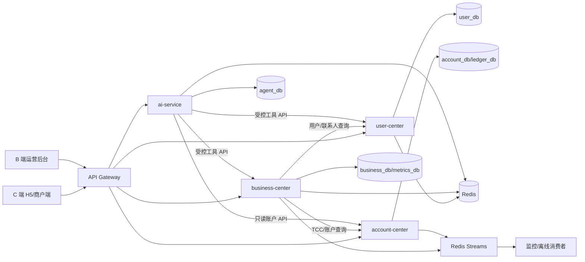

### 3.1 服务职责

| 服务 | 主要职责 | 禁止事项 |
|---|---|---|
| `gateway` | 认证入口、路由、限流、CSRF/CORS、安全头、请求 ID | 不保存业务事实、不编排资金 |
| `user-center` | 用户、登录、支付密码、角色、联系人、会话 | 不保存余额、交易和账本 |
| `business-center` | 草稿、交易、充值订单、扫码、C2C、风控、工单、终态、监控投影 | 不直接写账户与账本表 |
| `account-center` | 账户、余额、TCC 分支、账本、信用额度、账单、还款 | 不处理页面交互和 AI 意图 |
| `ai-service` | Agent 会话、记忆、意图、MCP、工具策略、调用留痕 | 不持有资金写权限、不保存支付密码 |

### 3.2 五步执行链路

所有功能统一按“入口层、编排层、领域服务、资金执行、事件与监控”五步实现。五步不是五个独立进程，而是一次请求从接入到结果可追溯的职责划分：

| 步骤 | 所在模块 | 输入 | 核心职责 | 输出 |
|---|---|---|---|---|
| 入口层 | Gateway、各服务 `interfaces` | HTTP/SSE/MCP 请求 | 鉴权、限流、CSRF、参数校验、请求 ID、DTO 转换 | 经认证的命令/查询 |
| 编排层 | `application.service` | 命令、当前主体、幂等键 | 组织用例、加载聚合、调用外部端口、确定本地事务边界 | 受理结果或领域错误 |
| 领域服务 | `domain` | 聚合和值对象 | 执行业务不变量、状态迁移、风险策略和账本模板选择 | 新聚合状态、领域事件 |
| 资金执行 | business-center + account-center + Seata | 已确认的资金命令 | 创建主单、TCC Try/Confirm/Cancel、余额/额度/应收/账本更新 | 可验证的资金事实 |
| 事件与监控 | Outbox、Streams、指标投影、Trace | 已提交事实事件 | 可靠投递、SSE、统计、告警、审计、离线分析和对账 | 用户结果、运营视图和处置工单 |

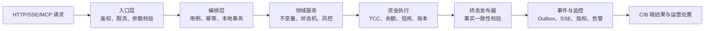

入口层不能编排资金，领域层不能依赖网络和数据库实现，监控投影不能反向决定资金终态。只有终态发布器完成事实核验后，事件与监控层才能对外传播 `SUCCESS`。

### 3.3 后端技术选型

| 层次 | 选型 | 本项目约束 |
|---|---|---|
| 语言与构建 | Java 21、Maven 多模块 | 统一 UTF-8；金额使用 `long` 分；父 POM 统一依赖版本 |
| Web 框架 | Spring Boot 3.3.4 | 用户、业务、账户和 AI 服务使用 MVC；健康检查使用 Actuator |
| 网关与服务调用 | Spring Cloud 2023.0.3、Spring Cloud Gateway、OpenFeign/HTTP Client | 浏览器只访问网关；内部 API 使用服务鉴权和超时预算 |
| 数据访问 | MyBatis-Plus 或 Spring JDBC、Flyway | 显式 SQL/条件更新和版本 CAS；禁止字符串拼接 SQL |
| 主数据库 | MySQL 8.0、InnoDB | MVP 单实例多 Schema；生产可拆实例；资金事实只在 MySQL |
| 缓存与事件 | Redis 7、Redis Streams | 会话、限流、短期 H5 会话、Outbox 投递和指标消费；不决定资金结果 |
| 分布式事务 | Seata TCC + Saga 恢复 | 真实执行 Try/Confirm/Cancel；屏障、恢复、冲正和对账必须可演示 |
| AI 工程 | Spring AI、MCP Server | Agent 与 MCP 同进程；高风险工具必须使用可信确认上下文 |
| 可观测性 | Micrometer、OpenTelemetry、Prometheus、Tempo、Grafana | Trace、指标、日志和业务 ID 关联；演示资金链路 100% 采样 |
| 测试 | JUnit 5、Spring Boot Test、Testcontainers、契约/E2E 测试 | 资金断言必须覆盖主单、余额、分支和借贷平衡 |
| 部署 | Docker Compose、Nginx | 两周演示环境一键启动；后续可迁移 Kubernetes |

当前 POM 只具备 Java、Spring Boot、Spring Cloud 和基础 Web/测试依赖；MyBatis、Flyway、Seata、Spring AI、OTel 和 Testcontainers 仍为待集成技术，不得因本节选型而标记为已实现。

## 4. Maven 模块与包结构

```text
backend/
├── platform-common/
├── gateway/
├── user-center/
├── business-center/
├── account-center/
└── ai-service/
```

每个业务服务统一使用：

```text
com.minialalipay.<context>/
├── interfaces/
│   ├── web/                 # 外部 REST/SSE
│   ├── internal/            # 服务间/TCC 接口
│   ├── messaging/           # 事件消费者
│   └── scheduler/           # 恢复、账单、对账任务
├── application/
│   ├── command/             # 命令与处理器
│   ├── query/               # 查询服务与投影 DTO
│   ├── service/             # 用例编排与事务边界
│   └── port/                # 外部上下文端口
├── domain/
│   ├── model/               # 聚合根、实体和值对象
│   ├── service/             # 领域服务
│   ├── repository/          # 仓储接口
│   ├── event/               # 领域事件
│   └── policy/              # 风控和状态策略
└── infrastructure/
    ├── persistence/         # PO、Mapper、仓储实现、Flyway
    ├── client/              # HTTP 客户端
    ├── messaging/           # Outbox/Inbox/Streams
    ├── cache/               # Redis
    └── config/              # Spring、Seata、OTel
```

依赖方向为 `interfaces -> application -> domain <- infrastructure`。`domain` 不依赖 Spring MVC、MyBatis、Redis、Feign 或其他服务的领域类型。

### 4.1 各服务内部模块

| 服务 | 领域子包 | 应用服务 | 主要接口适配器 | 基础设施适配器 |
|---|---|---|---|---|
| user-center | `user`、`credential`、`contact`、`authorization` | 注册、登录、密码校验、常用收款人投影与偏好 | Auth/User/Contact Controller、内部用户查询 | MyBatis、密码哈希、会话 Redis、审计 Outbox |
| business-center | `recharge`、`transfer`、`transaction`、`qrpay`、`collection`、`risk`、`monitoring` | 草稿、确认、资金受理、终态发布、恢复、统计查询 | C 端 Controller、运营 Controller、SSE、TCC 发起器 | MyBatis、Seata Client、中心间 Client、Outbox/Inbox、调度器 |
| account-center | `account`、`ledger`、`credit`、`tcc`、`reconciliation` | 开户、余额查询、TCC 参与、记账、出账、还款分配 | 账户 API、内部 TCC Controller | MyBatis、Seata Participant、Flyway、账本模板 |
| ai-service | `agent`、`memory`、`intent`、`tool`、`policy` | 消息处理、上下文压缩、工具路由、结果解释 | Agent Controller/SSE、MCP Server | LLM Client、三中心 API Client、Redis 会话、工具审计 |
| gateway | `filter`、`security`、`ratelimit`、`error` | 无领域用例 | 全局过滤器、统一网关异常处理 | Redis 限流、路由配置、OTel |

每个模块的命令与查询分离：写操作必须进入聚合和事务；页面列表、统计和回执可由 `application.query` 读取专用投影，不要求加载完整聚合，也不得把查询 DTO 回写为领域对象。

## 5. 限界上下文与聚合

| 上下文 | 主要聚合根 | 关键不变量 |
|---|---|---|
| 用户 | `User`、`Credential`；`FrequentPayeeProjection` 为查询投影 | 登录名唯一；密码强哈希；常用收款人只由成功转账生成并归属本人 |
| 账户 | `Account` | 可用/冻结金额非负；只有 ACTIVE 可扣款；版本 CAS |
| 充值 | `RechargeOrder` | 服务端生成结果；同幂等键最多一次入账；限额有效 |
| 转账 | `TransferDraft`、`FundTransaction` | 字段版本锁定；同来源订单最多一笔资金交易 |
| 扫码 | `QrPayOrder` | 商户、金额创建后锁定；余额/信用只能成功一种 |
| C2C 收款 | `PersonalCollectionCode`、`CollectionRequest`、`CollectionOrder` | 长期码可多笔；固定请求最多一笔成功 |
| 账本 | `LedgerVoucher` | 借贷合计相等；已过账分录不可改删 |
| 信用 | `CreditAccount`、`CreditBill`、`CreditRepayment` | 总额度=可用+已用+冻结；已用额度=信用应收 |
| 风控 | `RiskDecision`、`ManualCase` | 审批不能改变交易关键字段；批准后重新确认 |
| AI | `AgentSession`、`ToolCall` | 高风险工具需要可信确认；不保存支付密码 |

跨聚合使用应用服务、TCC 或事件；禁止把所有交易、账本和历史明细加载进账户聚合。

## 6. 统一金额、时间和标识规范

- 金额使用 `long amountFen`，数据库使用 `BIGINT` 分；禁止 `float/double`。
- 展示元时由边界层使用 `BigDecimal` 转换。
- 时间使用 `Instant` 保存，API 使用 ISO-8601 带时区文本。
- 业务 ID 使用服务端生成的不可枚举字符串，如 `txn_`、`draft_`、`qr_`、`rch_`。
- 每个 HTTP 请求使用 `X-Request-Id`；每条链路使用 `traceId`；每笔资金交易使用 `transactionId`。
- 可变聚合包含 `version BIGINT`，更新 SQL 必须带原版本条件。

## 7. 核心业务流程

### 7.1 注册与零余额开户

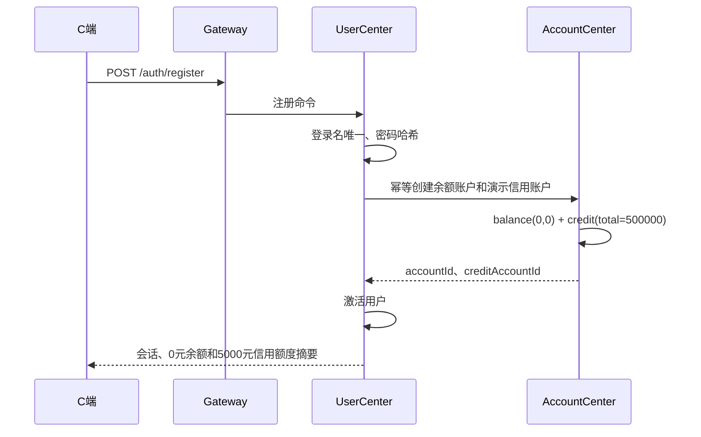

注册不得赠送虚拟金、不得生成充值分录。注册请求先创建 `PROVISIONING` 用户，以 `registrationId` 作为账户中心开户幂等键；余额账户和符合条件的普通演示用户信用账户都创建成功后才 CAS 激活。若账户已创建但激活失败，恢复任务按 `registrationId` 查询既有账户后继续激活，不重复开户或发放额度；超过恢复阈值转人工，用户在此期间不能登录。

### 7.2 模拟充值

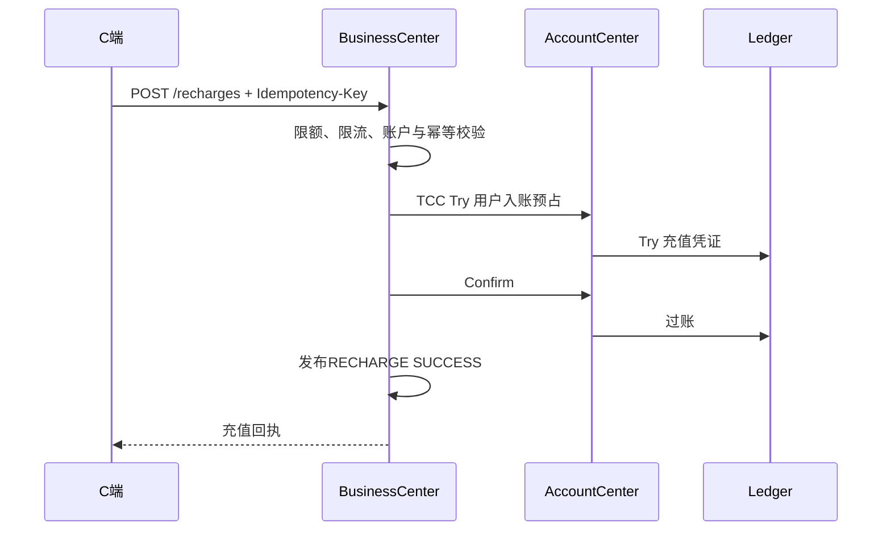

模拟充值只计入资金流入，不计入个人收入；采用“虚拟资金发行/权益账户 → 用户余额负债”平衡分录。

### 7.3 普通转账

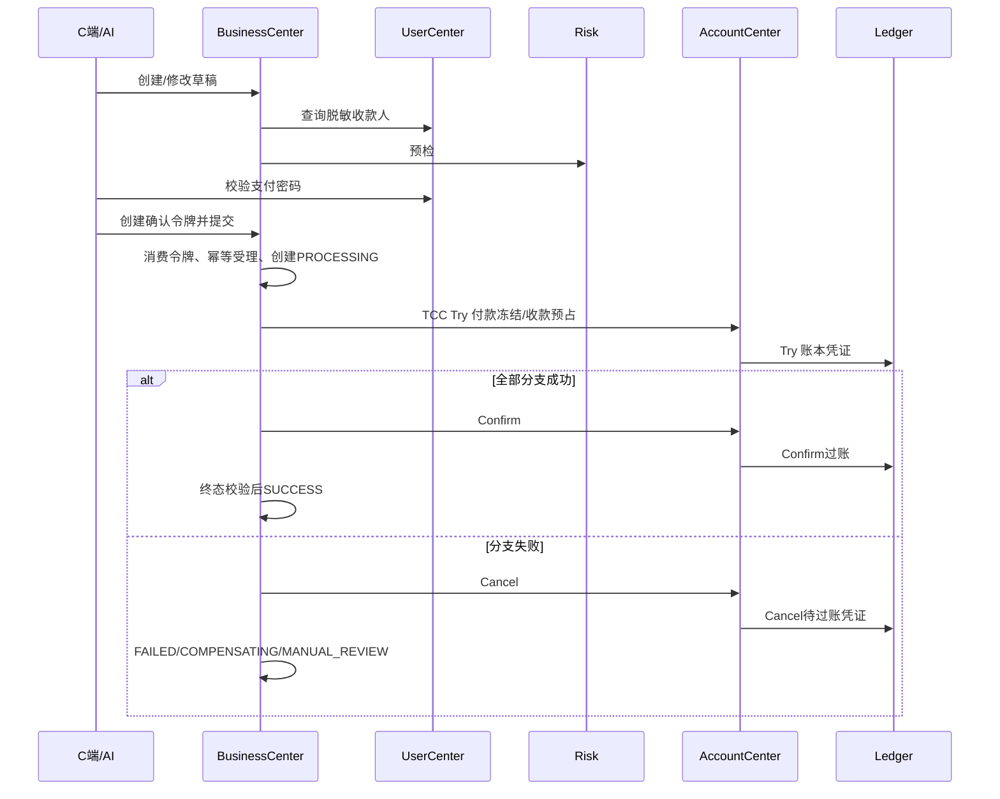

### 7.4 商户扫码支付

商户 C 端创建锁定金额订单和短期二维码令牌；H5 通过同源 POST 交换令牌建立受限会话，用户选择余额或 Mini 花呗并确认。同一 `source_order_id` 通过唯一约束保证 `QR_PAY` 与 `CREDIT_PAY` 最多成功一种。

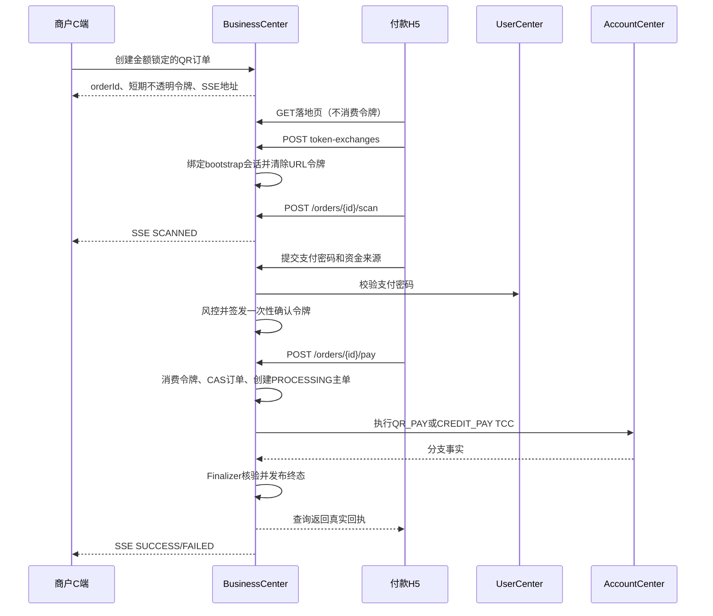

二维码 URL 只包含高熵不透明令牌，不包含金额、商户账号或内部订单号。匿名 GET 只建立 bootstrap 会话并返回 H5 壳；真正的令牌消费必须由同源 POST 完成，以避免浏览器预取、链接预览和安全扫描提前烧毁二维码。

### 7.5 个人收款

- 长期个人码：每次扫码创建独立 `CollectionOrder`，不同付款互不覆盖。
- 固定金额请求：并发付款通过 `CollectionRequest.version` 与 `active_order_id` CAS 抢占，最多一笔进入资金处理。
- 两类付款最终均形成 `TRANSFER`，仅允许余额，手续费为 0。

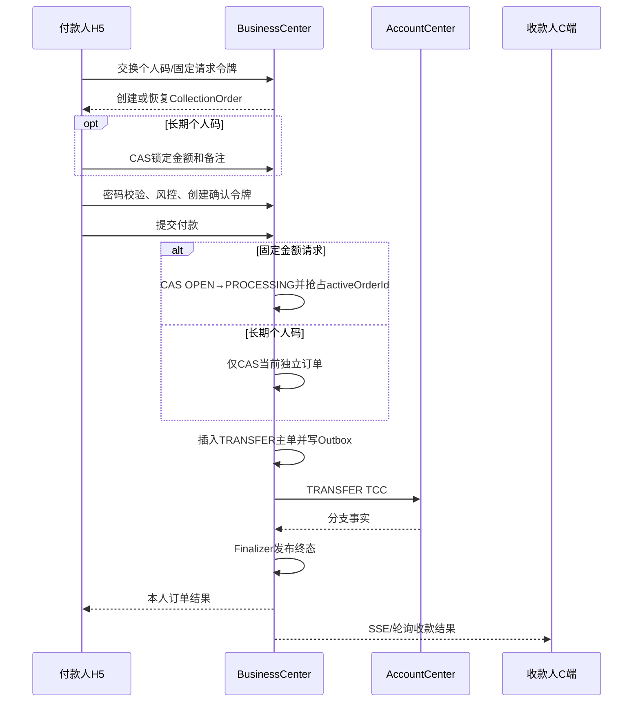

固定请求的竞争失败订单不得进入 TCC。若抢占订单的 TCC 完整 Cancel，只有在冻结为 0、收款未入账、账本无过账残片后才允许清空 `active_order_id` 并按是否过期恢复为 `OPEN`；事实未知时保持 `MANUAL_REVIEW`，不能接受第二笔付款。

### 7.6 Mini 花呗

- 信用支付 Try 冻结额度、预占商户入账与账本凭证。
- Confirm 增加已用额度和信用应收，商户余额增加。
- 还款使用本人余额，减少余额负债与信用应收并恢复额度。
- 逾期暂停新增信用消费，继续允许查询和还款。

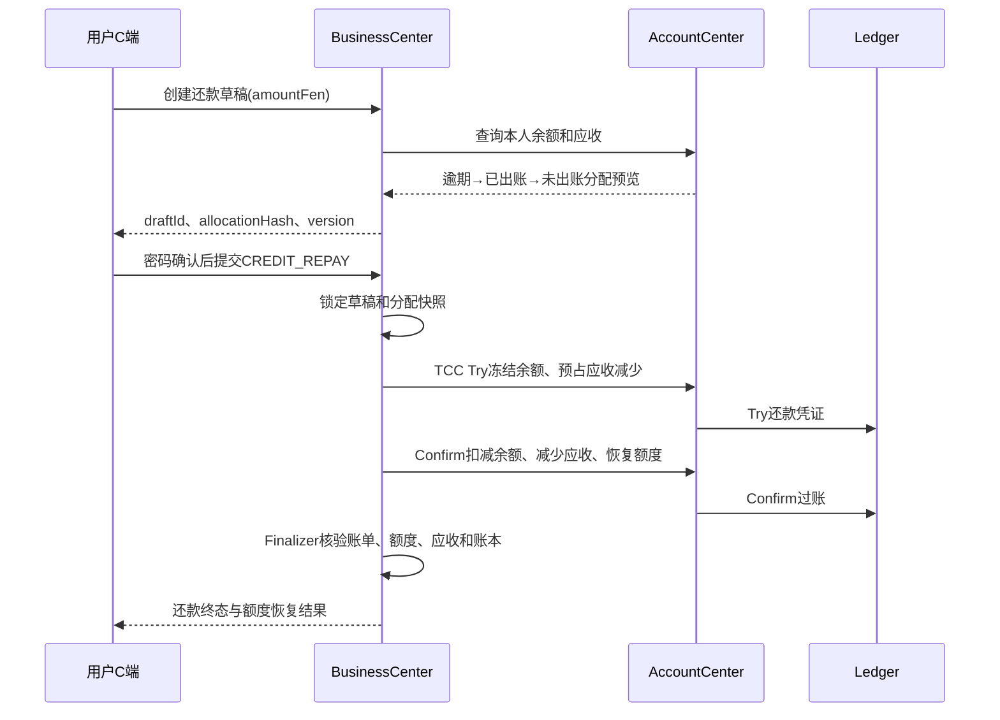

### 7.7 通用失败处理

| 失败阶段 | 是否创建资金主单 | 用户侧状态 | 后端动作 |
|---|---:|---|---|
| 参数、权限、密码或风控拒绝 | 否 | 明确失败/需人工审核 | 不冻结资金；记录脱敏审计 |
| 受理本地事务回滚 | 否 | 可按原幂等键重试 | 令牌、来源状态、主单和 Outbox 全部回滚 |
| 主单已提交但 TCC 未启动 | 是 | `PROCESSING` | 恢复任务按主单启动或接管全局事务 |
| Try 任一分支失败 | 是 | `COMPENSATING` | Cancel 已成功分支并校验冻结释放 |
| Confirm 暂时失败 | 是 | `PROCESSING` | 协调器幂等重试，不提前冲正或宣告失败 |
| 分支事实冲突或长期未知 | 是 | `MANUAL_REVIEW` | 冻结保护、告警和人工工单；禁止重复付款 |
| 已成功后需要修正 | 是 | `REVERSED` | 新建反向凭证和补偿交易，不改删原账 |

## 8. 交易状态与终态发布

| 状态 | 含义 | 是否终态 | 用户展示 |
|---|---|---:|---|
| `PROCESSING` | 已受理，资金处理中 | 否 | 处理中，不允许重复付款 |
| `COMPENSATING` | 自动补偿/冲正中 | 否 | 处理中，说明资金正在恢复 |
| `MANUAL_REVIEW` | 结果未知或需人工核实 | 否 | 人工处理中 |
| `SUCCESS` | TCC、余额、账本全部确认 | 是 | 成功回执 |
| `FAILED` | 未扣款或已完整回滚 | 是 | 失败原因与下一步 |
| `CANCELLED` | 确认前取消或完整撤销 | 是 | 已取消 |
| `REVERSED` | 原成功交易被反向冲正 | 是 | 已冲正 |

终态发布器必须同时验证：全局事务状态、全部 TCC 分支、账户余额版本、账本凭证状态和借贷平衡。HTTP 超时不能直接判定失败或成功。

## 9. TCC 与一致性设计

### 9.1 分支设计

| 业务 | TCC 分支 |
|---|---|
| `TRANSFER` | 付款冻结/扣款、收款预占/入账、账本凭证 |
| `RECHARGE` | 用户入账预占、发行账户凭证 |
| `QR_PAY` | 用户冻结/扣款、商户预占/入账、账本凭证 |
| `CREDIT_PAY` | 额度冻结/占用、信用应收、商户入账、账本凭证 |
| `CREDIT_REPAY` | 用户余额冻结/扣款、信用应收减少、额度恢复、账本凭证 |

### 9.2 分支屏障

每个资源分支只保留一行权威 `tcc_branch` 记录，以 `(xid, branch_type, resource_id)` 唯一键和 `barrier_version` CAS 驱动状态迁移，处理：

- 幂等：重复 Try/Confirm/Cancel 根据当前分支状态返回既有结果。
- 空回滚：Try 未执行时 Cancel 插入 `CANCELLED` 分支行并安全返回。
- 防悬挂：迟到 Try 读到 `CANCELLED` 后拒绝冻结；Confirm 只允许从 `TRIED` 迁移。
- 超时恢复：恢复任务根据全局状态继续 Confirm、Cancel 或转人工。

Redis 不参加资金事实提交，余额、冻结、交易和账本均以 MySQL 本地事务事实为准。

### 9.3 Try、Confirm、Cancel 语义

| 资源分支 | Try | Confirm | Cancel |
|---|---|---|---|
| 付款余额 | 条件扣减可用、增加冻结，创建 `freeze_record` | 扣减冻结，冻结记录置确认 | 释放冻结回可用 |
| 收款余额 | 创建与交易唯一的入账预占 | 增加可用余额并确认预占 | 取消预占，不改变余额 |
| 信用额度 | 条件减少可用、增加冻结 | 冻结转已用 | 释放冻结回可用 |
| 信用应收 | 预占应收增加或减少 | 确认应收和账单分配变化 | 撤销预占 |
| 账本凭证 | 预留凭证号、业务键和分录模板 | 原子写入完整借贷分录并过账 | 取消未过账预留；已过账只能反向冲正 |

每个分支的方法签名必须至少携带 `xid`、`branchId`、`transactionId`、资源 ID、`amountFen` 和请求摘要。分支在单个本地事务内完成屏障检查、资源条件更新、分支状态和本地 Outbox；不得先更新余额再另起事务写屏障。

### 9.4 主单受理与终态发布事务

业务中心先在一个 `business_db` 本地事务中完成：

1. 条件消费当前有效确认令牌。
2. CAS 来源聚合到 `PROCESSING`。
3. 插入 `fund_transaction` 和 `tcc_global`。
4. 回填来源聚合的 `transaction_id`。
5. 写入受理 Outbox。

任一步失败则整体回滚。该事务提交后即使进程崩溃，恢复任务也能从 `PROCESSING` 主单继续启动 TCC。TCC 全局完成不等于可以展示成功；Finalizer 必须按 `transactionId` 核验交易级 `freeze_record`、收款预占、信用冻结/应收变化、账本凭证和每个分支结果快照，而不是要求账户当前版本仍等于交易完成时版本，因为同一账户可能已有后续合法交易。全部交易级事实一致后，Finalizer 才在另一个 `business_db` 本地事务中 CAS 更新主单、同步来源订单和写终态 Outbox。

### 9.5 一致性公式

- 账户金额：`available_fen >= 0`、`frozen_fen >= 0`。
- 单凭证平衡：`sum(DEBIT.amount_fen) = sum(CREDIT.amount_fen)`。
- 余额转账：付款方减少额 = 收款方增加额，手续费固定为 0。
- 信用额度：`total_limit_fen = available_limit_fen + used_limit_fen + frozen_limit_fen`。
- 信用支付：用户余额不变，已用额度、信用应收和商户余额等额增加。
- 信用还款：用户余额、信用应收和已用额度等额减少，可用额度等额恢复。
- 成功条件：主单 `SUCCESS`、全局事务完成、全部分支 `CONFIRMED`、凭证已过账且平衡、来源聚合为成功。
- 失败条件：未发生扣款，或所有已执行资金动作已完整释放/冲正；否则只能保持处理中或转人工。

## 10. 幂等、并发和可靠事件

### 10.1 HTTP 幂等

- 写接口使用 `Idempotency-Key`。
- `idempotency_record` 保存主体、接口、键、请求摘要、资源 ID 和响应摘要。
- 同键同摘要返回原结果；同键不同摘要返回 `IDEMPOTENCY_CONFLICT`。

### 10.2 数据库并发

- 聚合更新使用 `WHERE id=? AND version=?`。
- 交易唯一键：`source_type + source_order_id`。
- 固定请求使用条件更新抢占 `OPEN -> PROCESSING`。
- 账本使用 `voucher_no` 和业务来源唯一约束。

### 10.3 Outbox/Inbox

业务数据与 Outbox 在同一本地事务提交；发布器投递 Redis Streams；消费者以 `event_id` 写 Inbox 去重。事件失败不回滚已确认资金，但必须告警并重试。

## 11. 数据库归属与核心表

| Schema | 所有者 | 核心表 |
|---|---|---|
| `user_db` | user-center | `user`、`credential`、`contact`、`role`、`audit_log` |
| `business_db` | business-center | `recharge_order`、`transfer_draft`、`fund_transaction`、`qr_pay_order`、`qr_pay_token`、`personal_collection_code`、`collection_request`、`collection_order`、`confirmation_subject`、`confirmation`、`risk_decision`、`manual_case`、`tcc_global`、`idempotency_record`、`audit_log`、`outbox_event` |
| `account_db` | account-center | `account`、`account_balance`、`freeze_record`、`tcc_branch`、`credit_account`、`credit_freeze`、`credit_receivable`、`credit_purchase`、`credit_bill`、`credit_bill_item`、`credit_repayment`、`credit_repayment_allocation`、`reconciliation_diff` |
| `ledger_db` | account-center | `ledger_account`、`ledger_voucher`、`ledger_entry` |
| `agent_db` | ai-service | `agent_session`、`agent_message`、`tool_call_log`、`preference` |
| `metrics_db` | business-center/监控模块 | `inbox`、`metric_definition`、`minute_metric`、`daily_metric`、`quality_result`、`monitor_alert` |

数据库迁移使用 Flyway，命名为 `VYYYYMMDDHHMM__description.sql`。已执行迁移不可修改；禁止跨 Schema 外键和跨服务直接写表。

### 11.1 核心实体关系

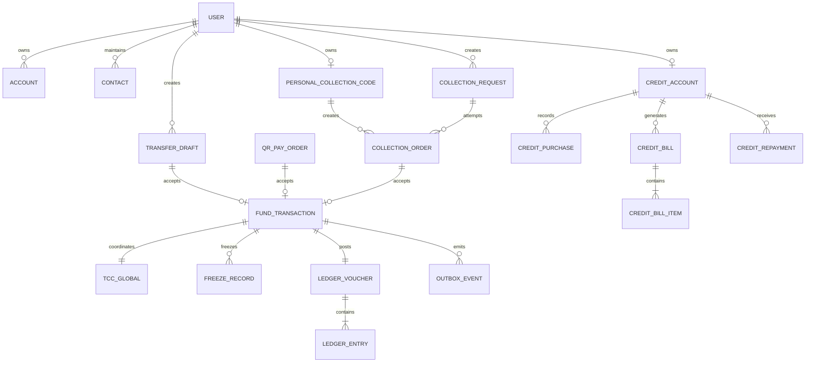

图中的跨 Schema 关系仅表示业务 ID 关联，不建立跨 Schema 外键。查询关联信息时通过内部 API 或事件投影获得，禁止业务中心直接联表查询账户库和账本库。

### 11.2 关键表与约束

| 表 | 关键字段 | 必须约束/索引 |
|---|---|---|
| `user` | `user_id`、`login_name`、`status`、`version` | `login_name` 唯一；状态和版本条件更新 |
| `credential` | `user_id`、`login_hash`、`pay_hash`、失败次数、锁定时间 | 用户唯一；两类密码独立计数和锁定；哈希不可回显 |
| `contact` | `owner_user_id`、`payee_user_id`、成功次数、最近成功时间、置顶、隐藏、备注 | `(owner_user_id,payee_user_id)` 唯一；仅成功转账事件创建/累计，搜索不写入 |
| `account` | `account_id`、`owner_id`、`account_type`、`status` | `(owner_id,account_type,currency)` 唯一 |
| `account_balance` | `account_id`、`available_fen`、`frozen_fen`、`version` | 金额非负；所有写入带 `version` |
| `freeze_record` | `transaction_id`、`account_id`、`purpose`、`amount_fen`、`status` | `(transaction_id,account_id,purpose)` 唯一 |
| `transfer_draft` | 双方 ID、金额、备注、`status`、`version`、`expires_at` | 所有者索引；修改和确认使用版本 CAS |
| `fund_transaction` | 类型、来源、双方账户、金额、状态、幂等键 | `(payer_account_id,idempotency_key)`、`(source_type,source_order_id)` 唯一 |
| `confirmation` | 主体、主体哈希、令牌摘要、状态、过期/消费时间 | 令牌摘要唯一；同主体最多一个有效槽位 |
| `qr_pay_order` | 商户、付款人、金额、资金来源、交易 ID、状态、版本 | 交易 ID 唯一；金额创建后不可修改；状态版本 CAS |
| `qr_pay_token` | `token_digest`、订单、bootstrap/H5 会话、状态 | 只存摘要；令牌唯一；交换和会话绑定原子提交 |
| `personal_collection_code` | 所有人、收款账户、令牌摘要、状态、活动槽、版本 | 每个用户最多一个 `ACTIVE`；换码撤销旧令牌 |
| `collection_request` | 收款人、金额、`active_order_id`、状态、版本、过期时间 | 金额不可变；CAS 保证首个有效订单抢占 |
| `collection_order` | 模式、请求/码、双方、金额、会话、交易 ID、状态 | H5 会话幂等；每订单最多一个 `TRANSFER` |
| `tcc_global`/`tcc_branch` | `xid`、交易、分支类型、资源、状态、`barrier_version`、重试时间 | `(xid,branch_type,resource_id)` 唯一；状态 CAS；按状态和下次重试时间建索引 |
| `ledger_voucher` | 交易、类型、冲正序号、借贷总额、状态 | `(transaction_id,type,reversal_no)` 唯一；借贷总额相等 |
| `ledger_entry` | 凭证、科目、借贷方向、金额 | 凭证索引；只允许插入，不更新或物理删除 |
| `credit_account` | 总/可用/已用/冻结额度、状态、版本 | 用户唯一；额度恒等式；条件更新 |
| `credit_bill` | 信用账户、账期、总额、已还、未还、到期日、状态 | `(credit_account_id,period)` 唯一 |
| `credit_repayment` | 交易、信用账户、金额、状态 | 交易唯一；分配明细合计等于还款金额 |
| `idempotency_record` | 主体、接口、键、请求摘要、响应摘要 | `(principal_key,api_code,idempotency_key)` 唯一 |
| `outbox_event` | 事件、聚合、类型、版本、负载、重试信息 | `event_id` 唯一；待发布扫描索引 |
| `inbox_event` | 消费者、事件、处理状态 | `(consumer_name,event_id)` 唯一 |

### 11.3 字段与迁移规则

- 业务主键使用服务端生成的 `CHAR(26)` ULID 或同等不可枚举 ID；禁止数据库自增 ID 暴露给客户端。
- 金额使用 `BIGINT` 分，时间使用 `DATETIME(3)` 并按 UTC 写入，状态使用受控 `VARCHAR`。
- 可变聚合包含 `version BIGINT NOT NULL DEFAULT 0`、`created_at` 和 `updated_at`；不可变账本分录仅记录创建时间。
- 高频查询必须建立“对象归属 + 状态 + 时间”组合索引；恢复任务建立“状态 + next_retry_at”索引。
- Flyway 文件放在所属服务的 `src/main/resources/db/migration/`，一条迁移只修改一个服务拥有的 Schema。
- 已执行迁移只允许新增向前修复脚本，不修改、删除或重命名旧脚本；涉及金额/状态/唯一键时必须增加容器集成测试。

## 12. API 设计

### 12.1 通用请求头

| 请求头 | 用途 |
|---|---|
| `Authorization` | 登录会话/JWT |
| `X-Request-Id` | 请求关联 |
| `Idempotency-Key` | 写接口防重 |
| `X-CSRF-Token` | Cookie 会话写操作防 CSRF |
| `Last-Event-ID` | SSE 断线续传 |

### 12.2 统一响应

```json
{
  "code": "OK",
  "message": "成功",
  "requestId": "req_xxx",
  "traceId": "6f8b0f0a0ad64fd1b9eb5be13e146a82",
  "data": {}
}
```

错误响应不得包含堆栈、SQL、密码、令牌或完整账号。

### 12.3 核心端点

#### 12.3.1 身份、账户和联系人

| 方法 | 路径 | 权限 | 行为 | 幂等/并发 |
|---|---|---|---|---|
| `POST` | `/api/v1/auth/register` | 匿名 | 注册并自动创建 0 余额账户 | `Idempotency-Key`；登录名唯一 |
| `POST` | `/api/v1/auth/login` | 匿名 | 校验登录密码并建立会话 | IP + 登录名限流 |
| `POST` | `/api/v1/auth/logout` | 登录用户 | 销毁当前会话 | 重复退出成功 |
| `PUT` | `/api/v1/payment-password` | 首次注册/登录用户 | 设置 6 位数字支付密码 | 只存强哈希；已有密码时拒绝覆盖 |
| `PATCH` | `/api/v1/payment-password` | 登录用户 | 验证登录密码后修改支付密码 | 原子更新并撤销全部活动确认令牌 |
| `POST` | `/api/v1/payment-password/verify` | 登录用户 | 校验支付密码并返回 2 分钟一次性证明 | 错误次数原子累加、锁定 |
| `GET` | `/api/v1/users/search?q=` | 登录用户 | 按登录名/昵称搜索最多 10 个脱敏用户 | 只读限流 |
| `GET` | `/api/v1/contacts` | 登录用户 | 查询由成功转账历史生成的常用收款人 | 次数、最近成功时间和置顶排序 |
| `PATCH` | `/api/v1/contacts/{payeeUserId}` | 联系人所有者 | 设置置顶、隐藏或备注 | 只能修改已由成功转账生成的记录；`version` CAS |
| `GET` | `/api/v1/accounts/me` | 登录用户 | 权威余额和账户状态 | 不用缓存判断余额 |
| `POST` | `/api/v1/recharges` | 登录用户 | 受控模拟充值 | 幂等键、单笔/单日限额 |
| `GET` | `/api/v1/accounts/me/entries` | 登录用户 | 本人资金明细 | 游标分页，`limit<=100` |
| `GET` | `/api/v1/accounts/me/analytics` | 登录用户 | 个人收支、资金流和信用分析 | 返回口径版本 |
| `GET` | `/api/v1/merchants/me/analytics` | 商户用户 | 本商户收款和经营统计 | 服务端派生商户账户 |

#### 12.3.2 转账和交易

| 方法 | 路径 | 权限 | 行为 | 幂等/并发 |
|---|---|---|---|---|
| `POST` | `/api/v1/transfer-drafts` | 登录用户 | 创建本人转账草稿 | `Idempotency-Key` |
| `GET` | `/api/v1/transfer-drafts/{id}` | 草稿所有者 | 返回确认前快照 | 对象级权限 |
| `PATCH` | `/api/v1/transfer-drafts/{id}` | 草稿所有者 | 修改收款人、金额或备注 | `version` CAS |
| `POST` | `/api/v1/transfer-drafts/{id}/validate` | 草稿所有者 | 余额/账户/风控预检，不冻结资金 | `version` 必须匹配 |
| `POST` | `/api/v1/confirmations` | 登录用户、可信 UI | 将密码证明与不可变业务快照绑定 | 同主体单一活动令牌 |
| `POST` | `/api/v1/transfers` | 可信确认流程 | 消费令牌并异步受理 `TRANSFER` | 幂等键 + 来源唯一键 |
| `GET` | `/api/v1/transfers/{id}` | 交易双方 | 返回权威交易状态 | 不从 SSE/缓存猜测 |
| `GET` | `/api/v1/transfers/{id}/receipt` | 交易双方 | 返回脱敏回执 | 只对确定终态生成 |

#### 12.3.3 商户扫码支付

| 方法 | 路径 | 权限 | 行为 | 幂等/并发 |
|---|---|---|---|---|
| `POST` | `/api/v1/qr-pay/orders` | 商户用户 | 创建金额锁定订单和动态码 | 幂等键；商户身份服务端派生 |
| `GET` | `/api/v1/qr-pay/orders/by-token?t=` | 匿名 H5 | 返回无业务数据的落地壳 | `no-store`；不消费令牌 |
| `POST` | `/api/v1/qr-pay/token-exchanges` | bootstrap 会话 | 交换令牌并绑定受限 H5 会话 | Origin/CSRF/Fetch Metadata |
| `POST` | `/api/v1/qr-pay/orders/{id}/scan` | 绑定 H5 会话 | `CREATED→SCANNED` | 状态 CAS，重复成功 |
| `POST` | `/api/v1/qr-pay/orders/{id}/confirmations` | 登录付款人 + H5 | 密码、风控和资金来源确认 | 绑定订单版本和快照哈希 |
| `POST` | `/api/v1/qr-pay/orders/{id}/pay` | 已确认付款人 | 受理 `QR_PAY` 或 `CREDIT_PAY` | 跨资金来源共享来源唯一键 |
| `GET` | `/api/v1/qr-pay/orders/{id}` | 交易相关方 | 查询订单和真实资金结果 | 处理中回源主单 |
| `DELETE` | `/api/v1/qr-pay/orders/{id}` | 创建商户/付款人 | 取消未进入资金处理的订单 | 前置状态 CAS |
| `GET` | `/api/v1/qr-pay/orders/{id}/events` | 商户/付款人 | SSE 订阅订单变化 | `Last-Event-ID` 续传 |

#### 12.3.4 个人收款和 Mini 花呗

| 方法 | 路径 | 权限 | 行为 | 幂等/并发 |
|---|---|---|---|---|
| `GET` | `/api/v1/p2p-collections/codes/me` | 普通用户本人 | 查询当前长期个人码 | 只读 |
| `POST` | `/api/v1/p2p-collections/codes/me/regenerations` | 普通用户本人 | 首次生成或原子换码 | 幂等键 + 活动槽唯一 |
| `POST` | `/api/v1/p2p-collections/codes/me/disable` | 普通用户本人 | 停用当前码 | `version` CAS |
| `POST` | `/api/v1/p2p-collections/requests` | 普通用户本人 | 创建 30 分钟固定金额请求 | 金额/备注创建后不可变 |
| `GET` | `/api/v1/p2p-collections/requests/{id}` | 创建者/关联付款人 | 查询脱敏请求和本人尝试 | 付款人不可见他人订单 |
| `POST` | `/api/v1/p2p-collections/requests/{id}/cancel` | 请求创建者 | 取消未受理请求或记录取消意图 | `version` CAS；处理中不猜测结果 |
| `GET` | `/api/v1/p2p-collections/by-token?t=` | 匿名 H5 | 返回不消费令牌的落地壳 | `no-store/no-referrer` |
| `POST` | `/api/v1/p2p-collections/token-exchanges` | bootstrap 会话 | 创建或恢复付款订单 | 同会话幂等 |
| `PATCH` | `/api/v1/p2p-collections/orders/{id}` | 付款人 + H5 | 长期码订单锁定金额/备注 | 只允许 `DRAFT`，`version` CAS |
| `POST` | `/api/v1/p2p-collections/orders/{id}/confirmations` | 付款人 + H5 | 密码/余额/风控确认 | 资金来源固定 `BALANCE` |
| `POST` | `/api/v1/p2p-collections/orders/{id}/pay` | 已确认付款人 | 受理统一 `TRANSFER` | 请求抢占 + 来源唯一 |
| `GET` | `/api/v1/p2p-collections/orders/{id}` | 交易双方/H5 会话 | 查询本人订单真实资金状态 | 处理中回源主单 |
| `GET` | `/api/v1/p2p-collections/requests/{id}/events` | 请求创建者 | SSE 订阅固定请求状态 | `Last-Event-ID` 续传 |
| `GET` | `/api/v1/credit/me` | 登录用户本人 | 查询额度和应收摘要 | 权威回源 |
| `GET` | `/api/v1/credit/purchases` | 登录用户本人 | 查询未出账和历史信用消费 | 游标分页、状态筛选 |
| `GET` | `/api/v1/credit/bills` | 登录用户本人 | 查询账单列表 | 账期/状态/游标分页 |
| `GET` | `/api/v1/credit/bills/{id}` | 账单所有者 | 查询账单和分配明细 | 对象级权限 |
| `POST` | `/api/v1/credit/repayment-drafts` | 登录用户本人 | 生成还款分配预览 | 幂等键 + `allocationHash` |
| `POST` | `/api/v1/credit/repayments` | 可信确认流程 | 受理 `CREDIT_REPAY` | 密码、令牌、幂等、TCC |
| `GET` | `/api/v1/credit/repayments/{id}` | 还款用户本人 | 查询还款和额度恢复结果 | 回源统一交易事实 |

#### 12.3.5 AI、运营和监控

| 方法 | 路径 | 权限 | 行为 |
|---|---|---|---|
| `POST` | `/api/v1/agent/messages` | 登录用户 | 处理一轮消息并返回回复、确认卡片或工具结果 |
| `GET` | `/api/v1/agent/sessions/{id}` | 会话所有者 | 查询脱敏对话和工具轨迹，不返回内部推理 |
| `GET` | `/api/v1/transfers/{id}/trace` | 运营/观察者 | 查询按角色裁剪的交易链路 |
| `GET` | `/api/v1/manual-cases` | 运营/风控 | 条件检索人工工单 |
| `POST` | `/api/v1/manual-cases/{id}/decisions` | 对应审核角色 | 版本 CAS 审批并写审计；不能修改资金字段 |
| `GET` | `/api/v1/ops/realtime-metrics` | 运营/观察者 | 查询分钟级实时指标 |
| `GET` | `/api/v1/ops/daily-reports` | 运营/观察者 | 查询带口径和质量版本的 T+1 报表 |
| `GET` | `/api/v1/ops/alerts` | 运营/观察者 | 查询告警；观察者只读 |
| `POST` | `/api/v1/ops/alerts/{id}/acknowledge` | 运营 | CAS 确认告警并填写说明 |
| `POST` | `/api/v1/ops/alerts/{id}/resolve` | 运营 | 标记已解决并提交证据 |
| `POST` | `/api/v1/ops/alerts/{id}/close` | 运营 | 仅允许 `RESOLVED→CLOSED` |
| `GET` | `/api/v1/ops/data-quality` | 运营/观察者 | 查询质量检查结果 |
| `GET` | `/api/v1/ops/metric-definitions` | 运营/观察者 | 查询指标口径历史版本 |
| `POST` | `/api/v1/ops/credit/statement-runs` | 演示管理员 | 受审计触发指定演示日期出账 |
| `POST` | `/api/v1/ops/credit/due-check-runs` | 演示管理员 | 受审计触发指定演示日期到期检查 |

前端只能访问网关 8080，服务间内部接口禁止暴露给浏览器。

### 12.4 请求字段与 HTTP 语义

- 金额统一为 `amountFen: int64`；转账、扫码和 C2C 范围为 `1..5000000` 分，禁止小数金额。
- C2C `subject` 最长 50 个字符并移除控制字符；分页 `limit` 最大 100。
- 客户端不得提交 `payerAccountId`、本人 `userId`、商户账户、信用账户或账单分配结果，这些字段由服务端从身份和来源对象派生。
- 创建资源成功返回 201；普通查询返回 200；资金受理返回 200/202 且业务状态通常为 `PROCESSING`。
- 参数错误返回 400，未登录/无权限返回 401/403，版本或幂等冲突返回 409，业务规则拒绝返回 422，关键依赖暂不可用返回 503。
- 503 或客户端超时但主单可能已创建时，响应必须携带 `transactionId` 和查询地址；不得把未知结果包装成 `FAILED`。

### 12.5 关键请求示例

```http
POST /api/v1/transfers
Authorization: Bearer <session-token>
Idempotency-Key: 69bb4c20-281c-45dc-b777-da54dbe62023
Content-Type: application/json

{
  "draftId": "01K1DRAFT02GH3JK4MN5PQRSTV",
  "confirmationToken": "cfm_opaque_once_value"
}
```

```json
{
  "code": "OK",
  "message": "已受理",
  "requestId": "req_01K1REQUEST2GH3JK4MN5PQRSTV",
  "traceId": "6f8b0f0a0ad64fd1b9eb5be13e146a82",
  "data": {
    "transactionId": "01K1TX0002GH3JK4MN5PQRSTV",
    "businessType": "TRANSFER",
    "status": "PROCESSING",
    "statusUrl": "/api/v1/transfers/01K1TX0002GH3JK4MN5PQRSTV"
  }
}
```

同一主体以相同幂等键和相同请求摘要重试时返回同一 `transactionId`；相同键但摘要不同返回 409 `IDEMPOTENCY_CONFLICT`。确认令牌只保存摘要，原文不得进入数据库明文字段、URL、日志、Trace 或埋点。

### 12.6 SSE 契约

扫码订单和固定收款请求通过 SSE 推送 `eventId`、`eventType`、业务 ID、可展示状态、发生时间和 `traceId`。服务端只在终态 Outbox 已持久化后推送 `SUCCESS`；断线按 `Last-Event-ID` 补发，历史窗口外则通知客户端回源查询。前端每 2 秒轮询作为降级方案，进入终态后立即停止。

## 13. 角色与权限

采用 RBAC + 对象归属 + 资金二次确认。

| 角色 | 权限范围 |
|---|---|
| 普通用户 | 本人账户、充值、转账、收款、账单、AI 和个人统计 |
| 商户用户 | 本人商户订单、二维码、收款结果和经营统计 |
| 运营人员 | 脱敏用户、交易、充值、Trace 和告警查询 |
| 风控审核员 | 风险工单审核；不能修改金额、双方和余额 |
| 财务/对账 | 账本、对账差异和冲正建议；不能改原分录 |
| 系统管理员 | 角色、权限和非资金配置；无资金写权限 |
| 观察者 | 脱敏只读大盘 |

服务端从登录主体派生 `userId/accountId/merchantAccountId`，拒绝客户端覆盖。运营和管理员不能通过后台直接修改余额、额度、账本或成功状态。

### 13.1 角色码与数据域

| 角色码 | 角色 | 数据域 |
|---|---|---|
| `CUSTOMER` | 普通用户 | 本人用户 ID 和本人个人账户 |
| `MERCHANT` | 商户用户 | 已授权的商户账户；不自动获得其他商户数据 |
| `OPERATOR` | 运营人员 | 全平台脱敏运营数据和告警处置 |
| `RISK_REVIEWER` | 风控审核员 | 风险工单和必要的脱敏交易快照 |
| `FINANCE_RECONCILER` | 财务/对账 | 账本、对账差异和冲正建议 |
| `SYSTEM_ADMIN` | 系统管理员 | 角色、权限、演示任务和非资金配置 |
| `OBSERVER` | 观察者 | 脱敏只读指标、报表和 Trace 摘要 |

一个用户可以同时拥有 `CUSTOMER` 和 `MERCHANT`，但请求必须选择明确身份上下文。个人账户查询始终按 `userId` 派生，商户订单和经营统计始终按授权 `merchantAccountId` 派生；两类数据不能因同一登录主体而合并。运营角色与 C 端角色同时存在时，进入 B 端仍只获得对应后台权限，不能借运营身份操作个人或商户资金。

## 14. AI Agent 与 MCP

AI 工具分级：

- 只读：查用户候选、余额、明细、交易状态、账单。
- 低风险写：创建/修改草稿，不改变资金。
- 高风险写：提交资金交易，只允许调用统一提交入口，必须携带可信确认上下文。

用户拥有一个支付密码，由 user-center 保存强哈希；Agent 会话、Memory、MCP 参数、Trace 和日志均不得保存、回显或推断支付密码。

### 14.1 Agent 执行链路

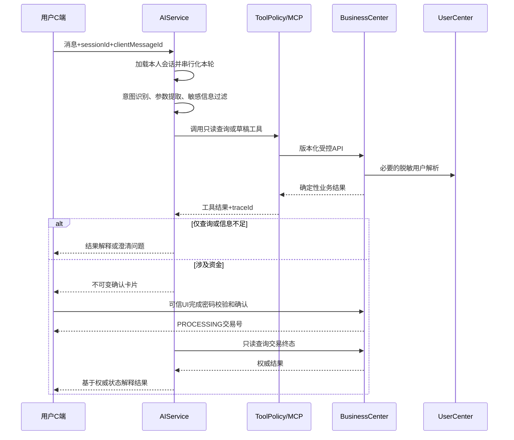

### 14.2 工具权限模型

| 风险级别 | 示例工具 | Agent 可否直接调用 | 约束 |
|---|---|---:|---|
| 只读 | 用户候选、余额、明细、交易、额度、账单查询 | 是 | 只能查当前主体或脱敏公开候选；限流和审计 |
| 低风险写 | 创建/修改转账草稿、生成确认卡片 | 是 | 不冻结、不扣款；返回版本和过期时间 |
| 高风险写 | 转账、扫码支付、信用还款提交 | 否 | 必须跳转可信 UI 完成密码与一次性确认令牌；Agent 不接触密码和令牌 |
| 管理操作 | 余额、额度、账本、角色或成功状态修改 | 否 | 不提供 MCP 工具；只能走受控后台流程或根本禁止 |

每次工具调用记录 `sessionId`、`messageId`、`toolName`、Schema 版本、脱敏参数摘要、调用主体、结果码、耗时、`traceId` 和风险等级。不得记录模型内部推理文本；工具返回的业务状态必须原样保留，结果解释不能把 `PROCESSING` 改写成成功或失败。

## 15. 个人与商户统计设计

### 15.1 普通用户

- 收到成功转账计收入；主动转账和余额扫码计支出。
- Mini 花呗消费计消费支出，余额不变。
- Mini 花呗还款计偿债资金流，不重复计消费。
- 模拟充值计资金流入，不计收入。
- 退款冲减原支出；非确定终态不计成功金额。

### 15.2 商户

- 成功收款只统计 `SUCCESS QR_PAY/CREDIT_PAY` 并按来源订单去重。
- 退款金额和净收款字段属于 `FR-SP-005` 的 P0 统计契约；净收款=成功收款-成功退款。真实原路退款和商户主动退款入口不在本期范围，接口仍必须返回 `refundAmountFen` 和 `netReceiptAmountFen`。只有明确分类为 `REFUND` 且终态成功的事实才计入退款；TCC Cancel、失败补偿和技术冲正不算商户退款。本期没有退款事实时退款金额真实返回 0，并携带口径版本，禁止伪造退款订单。
- 统计按服务端派生 `merchant_account_id` 隔离。
- 同一自然人的个人账户与商户账户分开统计。

统计查询走投影/指标库，不加载账户聚合，也不作为资金事实来源。

## 16. 错误码与失败处理

| 类别 | 示例 | HTTP |
|---|---|---:|
| 参数 | `COMMON_INVALID_REQUEST` | 400 |
| 身份 | `UNAUTHORIZED`、`FORBIDDEN` | 401/403 |
| 业务 | `BALANCE_INSUFFICIENT`、`ACCOUNT_FROZEN` | 409/422 |
| 幂等 | `IDEMPOTENCY_CONFLICT` | 409 |
| 并发 | `VERSION_CONFLICT`、`REQUEST_ALREADY_CLAIMED` | 409 |
| 风控 | `RISK_REVIEW_REQUIRED` | 202 |
| 系统 | `TRANSACTION_PROCESSING`、`INTERNAL_ERROR` | 202/500 |

失败响应要说明是否扣款、是否已恢复和下一步；未知状态返回处理中并提供查询入口，不得提前返回失败或成功。

### 16.1 风控规则与执行顺序

| 规则 | 条件 | 结果 |
|---|---|---|
| `R-01` | 可用余额小于余额支付金额 | 拒绝 |
| `R-02` | 单笔金额大于 5,000,000 分 | 拒绝 |
| `R-03` | 1 分钟内发起超过 5 笔 | 转人工确认 |
| `R-04` | 金额大于等于 500,000 分 | 强风险提示、单独勾选、仍需支付密码 |
| `R-05` | 首次向该对象支付且金额大于等于 100,000 分 | 强风险提示 |
| `R-06` | 30 秒内向同一对象发起相同金额 | 强提示并重新确认 |
| `R-07` | 任一账户冻结或注销 | 拒绝 |
| `R-08` | Mini 花呗可用额度不足 | 拒绝信用支付 |
| `R-09` | 存在逾期账单或信用账户非 `ACTIVE` | 拒绝信用支付，允许查询和还款 |

执行顺序为：参数/对象归属 → 账户状态 → 余额/额度 → 限额/频率 → 对手与重复特征 → 决策聚合。草稿确认前执行预检，提交资金前使用相同 `ruleVersion` 和最新事实再次执行；两次结果取更严格者。`PASS` 才可签发普通确认，`ENHANCED_CONFIRMATION` 绑定风险提示勾选，`MANUAL_REVIEW` 创建 `RISK_PRECHECK` 工单且不创建资金主单，`REJECT` 直接拒绝。

人工批准不能替用户付款，只允许来源对象返回待确认状态；用户必须重新输入支付密码并生成新确认令牌。人工驳回将来源对象置 `REJECTED`。`risk_decision` 保存规则版本、命中规则、脱敏输入摘要和决策，`manual_case` 通过版本 CAS 记录审批人、理由和审计时间。

### 16.2 支付密码闭环

注册必须设置独立 6 位数字支付密码，登录密码与支付密码使用不同盐和强哈希。连续 5 次支付密码错误后锁定支付能力 10 分钟，但查询能力保持可用。修改支付密码必须先验证登录密码，并在同一安全流程中撤销该用户所有未消费的支付证明和确认令牌。业务中心只接收短期 `paymentProof`，不能接触或保存密码明文。

## 17. 可观测性与审计

- 网关生成/透传 `X-Request-Id`，OTel 生成 `traceId/spanId`。
- 交易日志关联 `transactionId/sourceOrderId/xid/branchId`。
- 指标覆盖 API、交易、TCC、账本、信用、Agent、SSE、对账和数据质量。
- 资金链路演示环境 100% Trace 采样。
- 审计登录失败、密码校验结果、确认令牌、交易状态、风控审批、TCC、补偿、冲正、充值、配置和导出。
- 日志和 Trace 禁止记录支付密码、确认令牌、二维码原始令牌和完整账号。

### 17.1 监控数据流

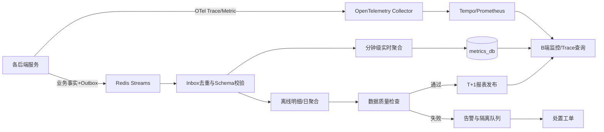

### 17.2 指标、告警与质量

| 领域 | 实时指标 | 关键告警 |
|---|---|---|
| API | QPS、错误率、P95/P99、限流数 | 5xx/超时突增、鉴权异常、限流持续 |
| 交易 | 受理/成功/失败/处理中数量与金额 | 重复来源、处理超时、终态发布失败 |
| TCC/Saga | Try/Confirm/Cancel、重试、冻结年龄 | 分支不一致、悬挂、补偿失败 |
| 账本/对账 | 凭证数、借贷差、证账实差异 | 任一不平凭证、余额/账本不一致 |
| 信用 | 额度使用、应收、账单、还款、逾期 | 额度恒等式破坏、应收与账本不一致 |
| AI | 会话、工具调用、确认转化、错误率、耗时 | 工具越权、敏感信息命中、模型/工具超时 |
| 事件 | Outbox 积压、最大年龄、Inbox 重复、隔离数 | 关键事件超时、Schema 不兼容、消费停滞 |

实时大盘以分钟级投影为准，T+1 报表只在完整性、唯一性、及时性和一致性检查通过后发布。指标库、Trace 和报表均是观测事实，不得作为扣款、额度判断或交易终态的权威来源。

### 17.3 Trace 关联字段

网关创建或透传 `traceId` 和 `X-Request-Id`；跨服务 HTTP、Seata 分支、Outbox 事件、SSE 和 Agent 工具调用必须继续携带关联信息。资金链路最少可按以下键检索：`traceId`、`requestId`、`transactionId`、`sourceOrderId`、`xid`、`branchId`、`eventId`。B 端只展示脱敏 Span 属性，并按角色限制账户、用户和工具参数可见范围。

## 18. 缓存与限流

Redis 用于登录会话、短期 H5 会话、限流、只读缓存和事件流；不得作为余额、额度、账本或交易终态唯一事实。

限流至少覆盖登录、用户搜索、模拟充值、支付密码、二维码交换、确认、交易提交和 AI 消息。资金接口限流后必须返回可解释错误，不能造成已受理交易丢失。

## 19. 任务调度

| 任务 | 周期 | 约束 |
|---|---|---|
| 事务恢复 | 5-10 秒 | 带租约抢占、幂等恢复 |
| Outbox 发布 | 1 秒 | 批量、重试、告警 |
| 二维码/请求过期 | 10 秒 | CAS，不回滚已确认资金 |
| 对账 | 1 分钟/日终 | 证账实差异为 0 |
| 信用出账 | 每月 1 日 | 账期唯一、重复执行幂等 |
| 逾期检查 | 每日 | 到期日后暂停信用消费 |
| T+1 报表 | 每日 01:00 | 数据质量通过后发布 |

## 20. 配置与部署

| 进程 | 默认端口 |
|---|---:|
| Gateway | 8080 |
| User Center | 8081 |
| Business Center | 8082 |
| Account Center | 8083 |
| AI Service | 8084 |
| Seata | 8091 |
| MySQL | 3306 |
| Redis | 6379 |

配置通过环境变量注入，生产密钥不得提交。MVP 使用 Docker Compose；MySQL 可单实例多 Schema，但服务数据库账号只能访问所属 Schema。生产拆分时接口和数据所有权保持不变。

## 21. 测试策略

| 层次 | 内容 |
|---|---|
| 单元测试 | 聚合不变量、状态机、金额、额度、账本模板 |
| 应用测试 | 权限、幂等、确认令牌、失败编排 |
| 集成测试 | MySQL、Redis、Outbox、TCC、Flyway |
| 契约测试 | OpenAPI、错误码、事件 Schema、SSE |
| E2E | 充值、转账、扫码、C2C、信用、AI |
| 故障注入 | 超时、重启、重复请求、Try/Confirm/Cancel 失败 |
| 对账测试 | 双方余额、交易、账本、信用应收和统计口径 |

资金测试不能只断言 HTTP 成功，必须同时断言交易终态、账户余额、TCC 分支和借贷平衡。

## 22. 推荐开发顺序

1. Flyway、认证、错误码、Trace、Outbox/Inbox 和 TCC 屏障。
2. 注册、零余额开户、支付密码、模拟充值和余额查询。
3. 用户搜索、草稿、风控、确认、普通转账、账本、回执和失败恢复。
4. 商户扫码订单、H5 令牌交换、扫码余额支付和 SSE。
5. Agent 多轮意图、查询工具、草稿工具和确定性结果解释。
6. 长期个人码、固定请求、CAS 抢占和 C2C 对账。
7. 信用额度、信用支付、账单、还款和逾期。
8. 个人/商户统计、实时大盘、离线报表、数据质量和发布门禁。
9. P1：模拟身份、智能纠错、偏好、销户、热点缓存、AI 测试辅助和信用 AI 查询。

## 23. 发布门禁

- Java 21 全量编译和测试通过。
- OpenAPI、事件 Schema、数据库迁移和代码一致。
- P0 资金场景通过，重复扣款和账本不平数量为 0。
- TCC 空回滚、悬挂、重复 Confirm/Cancel 和服务重启测试通过。
- 交易、余额、账本、信用与统计口径对账通过。
- 高危越权、密码/令牌泄露和 AI 绕过确认数量为 0。
- 失败交易具备可解释结果或人工处理入口。

## 24. 需求到模块映射

| 需求组 | 后端模块 |
|---|---|
| `FR-UC-*` | user-center，开户调用 account-center |
| `FR-AC-*` | account-center；充值订单与统计编排在 business-center |
| `FR-TR-*` | business-center + account-center |
| `FR-RC-*` | business-center 风控 + user-center 密码 |
| `FR-TX-*` | business-center 协调 + account-center TCC/账本 |
| `FR-SP-*` | business-center + account-center |
| `FR-PC-*` | business-center + account-center |
| `FR-CR-*` | account-center + business-center 商户订单 |
| `FR-AI-*` | ai-service，经受控 API 调用三中心 |
| `FR-OB-*` | 各服务埋点 + business-center 监控/指标模块 |
| `FR-QA-*` | tests 与 AI 辅助，不进入生产资金路径 |

## 附录 A：后端不变量清单

1. 注册开户余额为 0，注册不得产生充值分录。
2. 模拟充值服务端受控，幂等且借贷平衡。
3. 余额、冻结、额度和应收不得为负。
4. 每个来源订单最多一笔成功资金交易。
5. 固定收款请求最多一笔成功，长期个人码可多笔独立成功。
6. `QR_PAY` 与 `CREDIT_PAY` 对同一扫码订单互斥成功。
7. 成功交易的全部 TCC 分支必须 Confirm，账本必须过账且借贷平衡。
8. AI、前端、运营和管理员均不能直接修改资金事实。
9. Redis 缓存不能决定余额是否足够。
10. 未确定资金结果只能展示处理中或人工处理。
