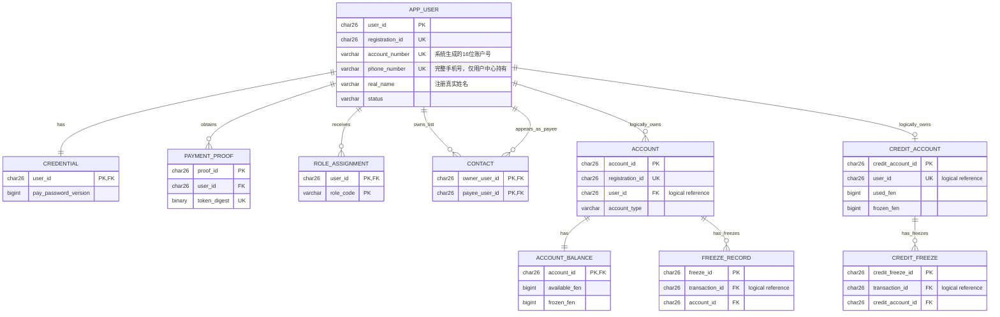
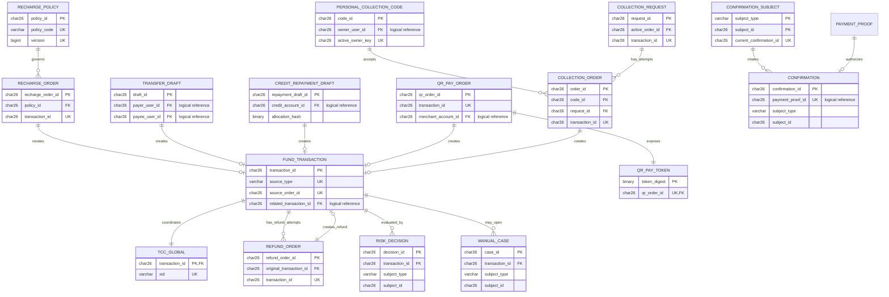
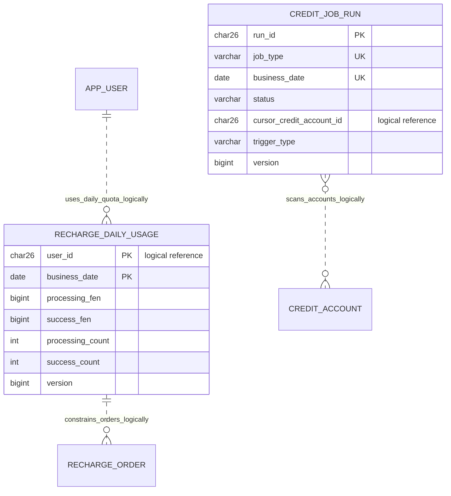
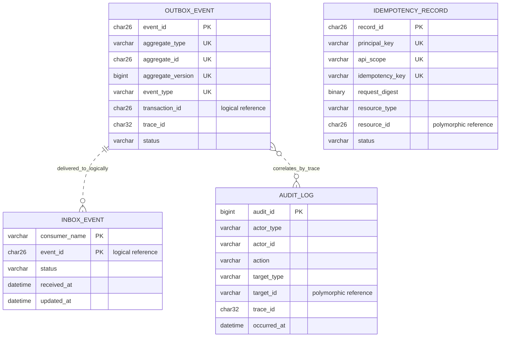
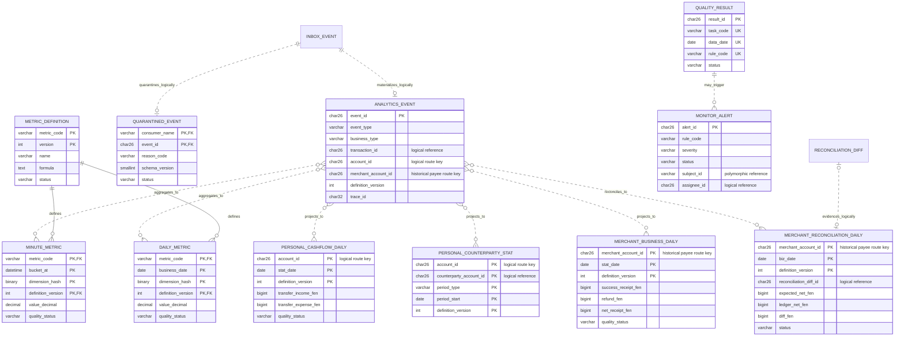
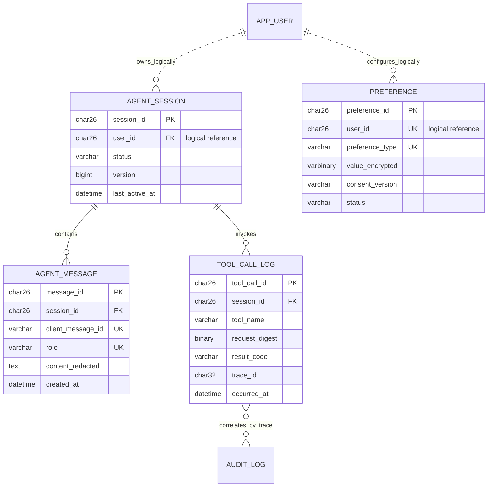

# MiniAlalipay 详细库表设计（修订版）

| 项目 | 内容 |
| --- | --- |
| 产品 | MiniAlalipay |
| 文档版本 | V2.9 |
| 修订日期 | 2026-07-31 |
| 需求基线 | PRD V1.9 |
| 系统分析基线 | 系统分析 V1.12 |
| 数据库 | MySQL 8.0 / InnoDB |
| 金额单位 | 人民币分，`BIGINT UNSIGNED` |
| 时间标准 | UTC `DATETIME(3)`，API 转 ISO 8601 |
| 资金属性 | 仅演示虚拟资金，不接入真实人民币 |

## 0. 修订说明

本版统一 PRD、系统分析和原库表设计中的数据口径，可作为建表脚本、实体模型和迁移脚本的设计基线。完整 DDL 应由本文件生成并纳入代码仓库版本管理，不再由两份文档分别维护同一张表。

基线识别说明：本设计以 PRD V1.9 和系统分析 V1.12 为业务与架构基线。`deploy/mysql/init/00-create-schemas.sql` 已在服务器执行，因此本版不修改既有表、字段、索引或约束，只补充端侧与身份语义。现有 `merchant_*`、`MERCHANT` 等物理标识属于历史兼容命名，不代表独立商户系统角色、商户账户或商户客户端；MVP 业务只给普通用户分配 `USER` 和 `PERSONAL`，扫码收款主体仍是普通用户及其本人账户。过程修改记录不作为独立基线，已批准内容必须合并到总体系统分析后再由本设计引用。

本次修订重点如下：

1. 补齐余额冻结记录、TCC 分支记录、分库 Outbox 和对账差异表。
2. 信用应收统一为“每个信用账户一行的汇总事实”，逐笔消费由 `credit_purchase` 保存。
3. 账单状态统一为 `OPEN`、`PARTIALLY_PAID`、`PAID`、`OVERDUE`；`UNBILLED` 仅用于信用消费明细。
4. `credit_bill_item.purchase_id` 增加唯一约束，保证一笔消费最多进入一个账期。
5. 还款以 `credit_repayment_draft` 为交易来源，确认令牌绑定金额及分配快照。
6. 统一资金交易状态为 `PROCESSING`、`COMPENSATING`、`MANUAL_REVIEW`、`SUCCESS`、`REVERSED`、`CANCELLED`。
7. 补全账本科目性质、正常余额方向和凭证过账约束。
8. 统一表名：`app_user`、`role_assignment`、`inbox_event`、`monitor_alert`。
9. 对齐 V1.7 Monorepo 和 Maven 多模块边界，明确逻辑库对应的可部署单元。
10. 对齐 V1.7 统一事件契约，区分事件版本与聚合版本，并补齐公共事件字段。
11. 对齐 PRD V1.7：开户余额为 0，新增受控模拟充值、充值额度预占及发行权益账务。
12. 增加一次性支付密码证明与凭证版本，支付密码修改后立即阻断旧授权。
13. 合并原库表设计的联系人修订：常用收款人只由成功转账形成，支持置顶、隐藏、备注和成功统计，并明确用户字段与事件字段的写入边界。
14. 对齐 PRD V1.8：增加个人收支、交易对象、商户经营和商户日对账投影。
15. 为退款统计补充受控虚拟全额退款模型，并与对账冲正明确区分。
16. 消除退款重试基数、统计主体 ID、信用退款账单、用户角色来源和还款分配粒度之间的表述冲突。
17. 对齐系统分析补充修改记录：统一联系人字段和索引，补齐改密撤销闭环及演示信用任务运行记录。
18. 统一第 5 至 12 章的库表表达：每张表均按“功能与归属、字段设计、键与索引、写入规则”描述，并为字段补充业务功能。
19. 对齐系统分析 V1.11：增加注册 `registration_id` 和 `PROVISIONING` 状态，支持跨服务开户幂等恢复。
20. 基于 PRD V1.8 和系统分析 V1.11 补充按逻辑库拆分的 ER 图，区分同库物理外键与跨库逻辑引用，并覆盖业务、信用、账本、事件和统计投影关系。
21. 对齐 PRD V1.9 和系统分析 V1.12：不变更已部署物理结构；明确 `merchant_*` 与 `MERCHANT` 是兼容标识，业务统一解释为普通用户的扫码收款数据，禁止据此授予 B 端权限或创建第二账户。
22. 补齐任务运行、充值日额度、通用可靠性、监控统计与 AI 会话 ER 图，使第 5 至 12 章定义的 59 类实体均在第 4 章展示；本次仅完善图示，不修改任何物理表结构。

## 1. 设计原则

1. 服务只写自己拥有的 Schema，跨服务不得直接写表。
2. 账户余额、余额冻结、信用额度、信用应收和复式账本是资金事实；Redis 只用于缓存、会话和限流。
3. 可并发修改的聚合使用 `version` 乐观锁，状态更新必须同时包含旧状态、业务条件和版本号。
4. 所有金额使用整数分，业务金额范围为 `1..5000000` 分；信用消费额还受可用额度限制。
5. `fund_transaction(source_type, source_order_id)` 保证同一来源对象只能受理一次，即使客户端更换幂等键也不能重复交易。
6. 对外创建接口使用 `idempotency_record`；同键异参返回 `IDEMPOTENCY_CONFLICT`。
7. 每个产生业务事实的 Schema 都拥有本地 `outbox_event`，业务事实与事件在同一本地事务提交。
8. 每个事件消费者使用 `inbox_event` 去重，重复事件不得重复修改投影或指标。
9. TCC 参与者必须持久化分支状态、冻结或预占事实，支持幂等、空回滚和防悬挂。
10. 交易、账本、TCC、审计、人工处置和对账差异不可物理删除；允许归档，但归档前必须完成对账。
11. 同一服务 Schema 内使用外键保证引用完整性；跨服务只保存业务 ID，通过 API、事件和对账验证。
12. 资金关键字段使用独立列，JSON 只保存快照、扩展元数据和事件载荷。
13. 已部署物理对象采用向前兼容策略：历史 `merchant_*` 字段在应用逻辑中映射为 `payee*`，只承载收款用户及其本人账户；如未来确需物理重命名，必须新增对应服务的 Flyway 迁移并完成数据回填、双读写兼容和对账，禁止修改已执行初始化脚本。

## 2. 逻辑分库与数据归属

| 逻辑库 | 可部署单元/所有者 | 核心表 |
| --- | --- | --- |
| `user_db` | `user-center` | `app_user`、`credential`、`payment_proof`、`contact`、`role_assignment`、`inbox_event`、`idempotency_record`、`audit_log`、`outbox_event` |
| `account_db` | `account-center` 账户/额度模块 | `account`、`account_balance`、`freeze_record`、`credit_account`、`credit_freeze`、`tcc_branch`、`inbox_event`、`idempotency_record`、`audit_log`、`outbox_event` |
| `ledger_db` | `account-center` 账本/信用模块 | `ledger_account`、`ledger_voucher`、`ledger_entry`、`credit_receivable`、`credit_purchase`、`credit_bill`、`credit_bill_item`、`credit_repayment`、`credit_repayment_allocation`、`credit_repayment_allocation_detail`、`credit_job_run`、`tcc_branch`、`reconciliation_diff`、`outbox_event` |
| `business_db` | `business-center` | `recharge_policy`、`recharge_daily_usage`、`recharge_order`、`refund_order`、`transfer_draft`、`credit_repayment_draft`、`fund_transaction`、`qr_pay_order`、`qr_pay_order_event`、`qr_pay_token`、`personal_collection_code`、`collection_request`、`collection_order`、`collection_order_event`、`confirmation_subject`、`confirmation`、`risk_decision`、`manual_case`、`tcc_global`、`inbox_event`、`idempotency_record`、`audit_log`、`outbox_event` |
| `agent_db` | `ai-service` | `agent_session`、`agent_message`、`tool_call_log`、`preference`、`idempotency_record`、`audit_log`、`outbox_event` |
| `metrics_db` | `business-center` 监控投影模块 | `inbox_event`、`analytics_event`、`personal_cashflow_daily`、`personal_counterparty_stat`、`merchant_business_daily`、`merchant_reconciliation_daily`、`quarantined_event`、`metric_definition`、`minute_metric`、`daily_metric`、`quality_result`、`monitor_alert` |

历史迁移 `V202608050900__create_credit_tables.sql` 在 2026-08-05 已由 Flyway 成功执行，内容同时初始化
`account_db` 与 `ledger_db` 的信用表。依据“已执行迁移不可修改”的规则保留该文件及校验和，不再拆分、删除或重命名；
后续信用变更必须新增向前迁移，并保证每个新迁移文件只修改一个 Schema。该历史迁移的 MySQL 验证结果记录在
`docs/minialalipay/T-02-credit-migration-verification.md`。

项目采用 Monorepo：后端使用 Maven 多模块，B 端和 C 端使用两个独立 Umi 工程并分别构建、部署；代码仓库形态不改变数据所有权。`gateway` 不拥有业务数据库，`business-center` 内部包含收款、风控、运营和监控投影，`account-center` 内部包含余额、账本和 Mini 花呗。

`/api/v1/credit/**` 的外部 Controller 由 `account-center` 承载，但这不改变 `credit_repayment_draft` 和统一资金主单归 `business_db` 所有的事实。账户中心通过版本化内部契约把还款分配哈希和确认上下文提交给业务中心；业务中心在自己的本地事务内持久化草稿、确认消费、资金主单和 Outbox，双方禁止跨库直写。

MVP 可以把这些 Schema 部署在同一个 MySQL 实例，但仍应使用不同数据库用户或代码层访问策略维持所有权边界。不能利用同实例条件把跨服务流程退化成跨 Schema 本地事务。

## 3. 通用字段与命名规范

| 项目 | 规范 |
| --- | --- |
| 业务主键 | `CHAR(26)`，使用 ULID；高频明细可使用 `BIGINT UNSIGNED` 雪花 ID |
| 金额 | `BIGINT UNSIGNED`，单位为分，业务校验和数据库 `CHECK` 同时限制 |
| 时间 | `DATETIME(3)`，服务端按 UTC 写入，不接受客户端时间覆盖 |
| 状态 | `VARCHAR(32)`，应用状态机与 MySQL `CHECK` 双重校验 |
| 乐观锁 | `version BIGINT UNSIGNED NOT NULL DEFAULT 0` |
| 令牌摘要 | `BINARY(32)`，使用 HMAC-SHA-256；不保存原始令牌 |
| Trace ID | `CHAR(32)`，贯穿 API、交易、TCC、账本、事件和审计 |
| 字符集 | `utf8mb4` |
| 排序规则 | `utf8mb4_0900_ai_ci` |
| 删除策略 | 配置类数据允许软删除；资金事实和审计数据禁止删除 |

## 4. 实体关系设计

本章 ER 图以 PRD V1.8 的业务对象和系统分析 V1.11 的限界上下文为输入，并以本文件后续字段、主键和唯一约束为准。为保证图可读性，按逻辑库和业务域拆分展示。

关系实现规则：同一 Schema 内的稳定实体关系优先使用物理外键；跨 Schema 关系只保存业务 ID，属于逻辑引用，不创建跨库外键；`subject_type + subject_id`、`target_type + target_id` 等多态关系由应用校验，不能误建为指向单表的外键。各 Schema 内重复部署的 `outbox_event`、`inbox_event`、`idempotency_record` 和 `audit_log` 在 4.5 节统一表示。

### 4.1 用户、账户与额度主体



说明：`APP_USER -> ACCOUNT/CREDIT_ACCOUNT` 跨 `user_db` 与 `account_db`，是逻辑关系；`CONTACT` 的所有者和收款人均指向 `app_user`，组成单向联系人关系，不表示好友关系。一个用户可按账户类型拥有多个账户，但最多拥有一个信用账户。

### 4.2 业务来源、确认与统一资金交易



说明：`fund_transaction(source_type,source_order_id)` 将不同来源对象映射为最多一笔统一资金交易。`confirmation`、`risk_decision` 和 `manual_case` 对来源对象使用多态逻辑引用；图中只展示其可选交易关联。`collection_request.active_order_id` 表示当前抢占者，和“一请求多尝试”关系共同保证同时最多一笔付款进入资金处理。`refund_order` 同时关联原支付交易和新建退款交易；失败或完整取消的退款尝试允许保留并重试。

### 4.3 信用应收、账单、还款与账本

```mermaid
erDiagram
    CREDIT_ACCOUNT ||--|| CREDIT_RECEIVABLE : logically_summarizes
    CREDIT_ACCOUNT ||--o{ CREDIT_PURCHASE : logically_owns
    CREDIT_ACCOUNT ||--o{ CREDIT_BILL : logically_generates
    CREDIT_ACCOUNT ||--o{ CREDIT_REPAYMENT : logically_repaid_by

    QR_PAY_ORDER ||--o| CREDIT_PURCHASE : originates
    FUND_TRANSACTION ||--o| CREDIT_PURCHASE : records_credit_pay
    CREDIT_BILL ||--|{ CREDIT_BILL_ITEM : contains
    CREDIT_PURCHASE ||--o| CREDIT_BILL_ITEM : billed_once

    CREDIT_REPAYMENT_DRAFT ||--o| CREDIT_REPAYMENT : originates
    FUND_TRANSACTION ||--o| CREDIT_REPAYMENT : records_repayment
    CREDIT_REPAYMENT ||--|{ CREDIT_REPAYMENT_ALLOCATION : allocates
    CREDIT_REPAYMENT_ALLOCATION ||--|{ CREDIT_REPAYMENT_ALLOCATION_DETAIL : expands
    CREDIT_PURCHASE ||--o{ CREDIT_REPAYMENT_ALLOCATION_DETAIL : receives_repayment
    CREDIT_BILL ||--o{ CREDIT_REPAYMENT_ALLOCATION_DETAIL : groups_billed_detail

    FUND_TRANSACTION ||--o{ LEDGER_VOUCHER : posts_or_reverses
    LEDGER_VOUCHER ||--|{ LEDGER_ENTRY : contains
    LEDGER_VOUCHER ||--o{ LEDGER_VOUCHER : reversed_by
    LEDGER_ACCOUNT ||--o{ LEDGER_ENTRY : receives
    FUND_TRANSACTION ||--o{ TCC_BRANCH : has_local_branches
    FUND_TRANSACTION ||--o{ RECONCILIATION_DIFF : reconciled_by
    RECONCILIATION_DIFF ||--o| MANUAL_CASE : opens_logical_case

    CREDIT_RECEIVABLE {
        char26 credit_account_id PK "logical reference"
        bigint unbilled_fen
        bigint billed_fen
        bigint overdue_fen
    }
    CREDIT_PURCHASE {
        char26 purchase_id PK
        char26 credit_transaction_id UK "logical reference"
        char26 credit_account_id FK "logical reference"
        char26 qr_order_id FK "logical reference"
    }
    CREDIT_BILL {
        char26 bill_id PK
        char26 credit_account_id FK "logical reference"
        char7 period UK
    }
    CREDIT_BILL_ITEM {
        char26 bill_id PK, FK
        char26 purchase_id PK, FK, UK
    }
    CREDIT_REPAYMENT {
        char26 repayment_id PK
        char26 repayment_draft_id UK "logical reference"
        char26 transaction_id UK "logical reference"
    }
    CREDIT_REPAYMENT_ALLOCATION {
        char26 repayment_id PK, FK
        smallint sequence_no PK
        varchar target_type
        char26 target_id
    }
    CREDIT_REPAYMENT_ALLOCATION_DETAIL {
        char26 repayment_id PK, FK
        smallint sequence_no PK, FK
        smallint detail_no PK
        char26 purchase_id FK
        char26 bill_id FK
    }
    LEDGER_ACCOUNT {
        char26 ledger_account_id PK
        varchar account_code UK
    }
    LEDGER_VOUCHER {
        char26 voucher_id PK
        char26 transaction_id FK "logical reference"
        char26 original_voucher_id FK
    }
    LEDGER_ENTRY {
        bigint entry_id PK
        char26 voucher_id FK
        char26 ledger_account_id FK
    }
    TCC_BRANCH {
        char26 branch_id PK
        char26 transaction_id FK "logical reference"
        varchar xid
    }
    RECONCILIATION_DIFF {
        char26 diff_id PK
        char26 transaction_id FK "logical reference"
        char26 manual_case_id FK "logical reference"
    }
```



### 4.4 任务运行与充值日额度

本图补充批处理任务和模拟充值额度控制实体。`recharge_daily_usage` 与充值订单通过 `user_id + business_date` 形成同库逻辑关联；`credit_job_run` 通过任务类型、业务日期和信用账户游标驱动批量扫描，不为每个被扫描账户建立物理外键。



### 4.5 幂等、事件与审计通用实体

本图表示各 Schema 按需独立部署的通用表模板，不表示跨 Schema 共用同一张物理表。一次 Outbox 事件可被多个消费者分别写入自己的 Inbox；二者通过全局 `event_id` 形成逻辑关联。幂等记录通过多态的 `resource_type + resource_id` 绑定本地资源，审计记录通过 `target_type + target_id` 和 `trace_id` 关联操作对象，因此不建立指向单一业务表的外键。



### 4.6 监控、指标与统计投影

本图展示 `metrics_db` 从事件接入到实时指标、离线指标、个人统计、扫码收款统计、质量门禁和告警处置的关系。除指标定义与分钟/日指标之间存在同库物理外键外，其余连线均表示由 `event_id`、账户路由键、日期、口径版本或证据字段形成的逻辑投影关系。



### 4.7 AI 会话、消息与工具留痕

本图展示 `agent_db` 的会话上下文、脱敏消息、工具调用和用户偏好。会话与消息、工具调用使用同库物理外键；用户归属是对 `user_db.app_user` 的跨库逻辑引用，工具调用与审计记录仅通过 `trace_id` 关联，不保存敏感请求原文。



## 5. 用户中心表

本章表均归属 `user_db`，由 `user-center` 独占写入。表结构统一使用以下四部分；跨库 ID 只作逻辑引用。

### 5.1 `app_user`

**功能与归属**：保存用户主体、展示资料和账户级状态，不保存密码或 RBAC 角色。

| 字段 | 类型 | 必填/默认 | 功能 |
| --- | --- | --- | --- |
| `user_id` | `CHAR(26)` | PK，必填 | 用户 ULID，跨模块引用用户的稳定标识 |
| `registration_id` | `CHAR(26)` | 必填 | 用户中心生成的注册幂等键，用于开户恢复和既有资源查询 |
| `account_number` | `VARCHAR(64)` | 必填 | 系统生成的 16 位账户号，以 `62` 开头，用于登录和唯一识别 |
| `phone_number` | `VARCHAR(11)` | 新注册必填、历史数据可空 | 完整手机号，用于登录及转账查询；禁止跨上下文透传或写日志 |
| `real_name` | `VARCHAR(64)` | 新注册必填、历史数据可空 | 注册真实姓名，用于转账收款人查询和确认展示 |
| `nickname` | `VARCHAR(64)` | 必填 | 可重复的展示名称和模糊搜索条件 |
| `phone_tail` | `CHAR(4)` | 可空 | 手机号尾号，仅用于辅助检索和脱敏展示 |
| `identity_status` | `VARCHAR(16)` | 必填 | 演示身份状态，不代表真实 KYC |
| `status` | `VARCHAR(16)` | `PROVISIONING` | 用户状态：`PROVISIONING/ACTIVE/DISABLED` |
| `version` | `BIGINT UNSIGNED` | `0` | 用户资料和状态的 CAS 版本 |
| `created_at` | `DATETIME(3)` | 必填 | 用户注册时间 |
| `updated_at` | `DATETIME(3)` | 必填 | 最近资料或状态变更时间 |

**键与索引**：UK `(registration_id)`、UK `(account_number)`、UK `(phone_number)`；索引 `(real_name,status)`、`(nickname,status)`、`(status,created_at)`。手机号唯一索引是并发重复注册的最终一致性防线。

**写入规则**：注册事务以 `PROVISIONING` 创建用户并触发开户，但不得写初始资金；账户中心以 `registration_id` 作为开户幂等键，用户中心核验余额账户和适用的信用账户后才能 CAS 更新为 `ACTIVE`。恢复期间禁止登录，超过自动恢复阈值后仍保持 `PROVISIONING` 并创建人工工单。临时登录锁定只更新 `credential.login_fail_count/login_lock_until`，不修改用户状态；管理停用使用 `DISABLED`。RBAC 角色只写 `role_assignment`，不得在本表重复保存 `user_type`。

### 5.2 `credential`

**功能与归属**：保存登录密码、支付密码的强哈希以及两套独立的失败锁定状态。

| 字段 | 类型 | 必填/默认 | 功能 |
| --- | --- | --- | --- |
| `user_id` | `CHAR(26)` | PK/FK，必填 | 对应 `app_user` 的一对一凭证主体 |
| `login_password_hash` | `VARCHAR(255)` | 必填 | Argon2id 或 BCrypt 登录密码哈希 |
| `payment_password_hash` | `VARCHAR(255)` | 可空 | 独立 6 位支付密码哈希，未设置时为空 |
| `login_fail_count` | `INT UNSIGNED` | `0` | 连续登录密码失败次数 |
| `pay_fail_count` | `INT UNSIGNED` | `0` | 连续支付密码失败次数 |
| `login_lock_until` | `DATETIME(3)` | 可空 | 登录锁定截止时间 |
| `pay_lock_until` | `DATETIME(3)` | 可空 | 支付验证锁定截止时间 |
| `pay_password_version` | `BIGINT UNSIGNED` | `0` | 支付密码世代号，用于废弃旧授权 |
| `version` | `BIGINT UNSIGNED` | `0` | 凭证状态原子更新的 CAS 版本 |
| `updated_at` | `DATETIME(3)` | 必填 | 最近密码、失败次数或锁定状态更新时间 |

**键与索引**：PK/FK `(user_id)`；索引 `(login_lock_until)`、`(pay_lock_until)`。

**写入规则**：首次设置只允许 `payment_password_hash IS NULL` 并把版本置为 1。修改前验证登录密码，并在同一 `user_db` 事务中更新哈希、递增版本、撤销该用户全部活动支付证明、写审计与 `PAYMENT_PASSWORD_CHANGED` Outbox。

### 5.3 `payment_proof`

**功能与归属**：保存支付密码验证成功后签发的短期一次性证明，业务库只保存其逻辑引用。

| 字段 | 类型 | 必填/默认 | 功能 |
| --- | --- | --- | --- |
| `proof_id` | `CHAR(26)` | PK，必填 | 支付证明 ID |
| `token_digest` | `BINARY(32)` | 必填 | 原始证明令牌的 HMAC-SHA-256 摘要 |
| `user_id` | `CHAR(26)` | FK，必填 | 证明所属用户 |
| `purpose` | `VARCHAR(32)` | 必填 | 允许使用证明的确认用途 |
| `pay_password_version` | `BIGINT UNSIGNED` | 必填 | 签发时的支付密码版本 |
| `status` | `VARCHAR(16)` | `ACTIVE` | `ACTIVE/CONSUMED/REVOKED/EXPIRED` |
| `expires_at` | `DATETIME(3)` | 必填 | 证明有效期截止时间 |
| `consumed_at` | `DATETIME(3)` | 可空 | 一次性消费完成时间 |
| `created_at` | `DATETIME(3)` | 必填 | 证明签发时间 |

**键与索引**：UK `(token_digest)`；索引 `(user_id,status,expires_at)`。

**写入规则**：只保存摘要；签发和消费均校验当前支付密码版本。一次确认最多消费一次证明；改密时活动证明原子转为 `REVOKED`。

### 5.4 `contact`

**功能与归属**：保存由成功转账自动形成的单向常用收款人投影，不表示好友或通讯录关系。

| 字段 | 类型 | 必填/默认 | 功能 |
| --- | --- | --- | --- |
| `owner_user_id` | `CHAR(26)` | 联合 PK，必填 | 联系人列表所有者 |
| `payee_user_id` | `CHAR(26)` | 联合 PK，必填 | 成功收款的用户 |
| `alias` | `VARCHAR(64)` | 可空 | 所有者设置的联系人备注 |
| `success_count` | `BIGINT UNSIGNED` | `0` | 与该收款人的成功转账累计次数 |
| `last_success_at` | `DATETIME(3)` | 必填 | 最近一次确定成功的转账时间 |
| `pinned` | `BOOLEAN` | `0` | 是否由所有者置顶 |
| `hidden` | `BOOLEAN` | `0` | 是否从所有者默认列表隐藏 |
| `version` | `BIGINT UNSIGNED` | `0` | 事件累计和用户修改共用的 CAS 版本 |
| `created_at` | `DATETIME(3)` | 必填 | 首次成功转账形成联系人时间 |
| `updated_at` | `DATETIME(3)` | 必填 | 最近统计或用户设置更新时间 |

**键与索引**：PK `(owner_user_id,payee_user_id)`；索引 `(owner_user_id,pinned,hidden,last_success_at)`、`(payee_user_id)`。

**写入规则**：搜索不得写表。成功 `TRANSFER` 事件在 Inbox 去重事务内创建或累计 `success_count/last_success_at`，重复 `event_id` 不得再次累计，且不得覆盖 `alias/pinned/hidden`；所有者只能通过版本 CAS 修改后三项，不能新增或删除联系人。查询默认过滤 `hidden=0`，按 `pinned DESC,last_success_at DESC,success_count DESC` 排序。

### 5.5 `role_assignment`

**功能与归属**：保存 RBAC 角色分配，是系统角色授权的唯一事实来源。

| 字段 | 类型 | 必填/默认 | 功能 |
| --- | --- | --- | --- |
| `user_id` | `CHAR(26)` | 联合 PK/FK，必填 | 被授权用户 |
| `role_code` | `VARCHAR(32)` | 联合 PK，必填 | 物理约束保留 `USER/MERCHANT/OPERATOR/ADMIN/OBSERVER`；`MERCHANT` 为历史保留值，MVP 禁止分配 |
| `created_at` | `DATETIME(3)` | 必填 | 角色授予时间 |

**键与索引**：PK `(user_id,role_code)`；索引 `(role_code)`。

**写入规则**：权限判断从本表读取；普通用户只分配 `USER`，运营维护人员按职责分配 `OPERATOR/ADMIN/OBSERVER`。应用服务禁止写入 `MERCHANT`；历史物理值即使存在也不得获得 B 端权限，必须按普通用户数据迁移或兼容读取。

## 6. 账户与额度表

`account`、`account_balance`、`freeze_record`、`credit_account`、`credit_freeze` 归属 `account_db`；`tcc_branch` 在 `account_db` 和 `ledger_db` 各自独立部署。

### 6.1 `account`

**功能与归属**：保存普通用户虚拟账户的身份、币种与可用状态，不直接保存余额。

| 字段 | 类型 | 必填/默认 | 功能 |
| --- | --- | --- | --- |
| `account_id` | `CHAR(26)` | PK，必填 | 虚拟账户 ID |
| `user_id` | `CHAR(26)` | 必填 | 账户所有者，跨 `user_db` 逻辑引用 |
| `registration_id` | `CHAR(26)` | UK，必填 | 开户请求幂等和恢复查询键，由用户中心生成 |
| `account_type` | `VARCHAR(16)` | 必填 | 物理结构兼容 `PERSONAL/MERCHANT`；MVP 只允许新建 `PERSONAL`，`MERCHANT` 为历史保留值 |
| `currency` | `CHAR(3)` | `CNY` | 账户币种，MVP 固定人民币 |
| `status` | `VARCHAR(16)` | `ACTIVE` | `ACTIVE/FROZEN/CLOSED` |
| `version` | `BIGINT UNSIGNED` | `0` | 账户状态 CAS 版本 |
| `created_at` | `DATETIME(3)` | 必填 | 开户时间 |
| `updated_at` | `DATETIME(3)` | 必填 | 最近状态更新时间 |

**键与索引**：UK `(registration_id)`、UK `(user_id,account_type,currency)`；索引 `(status,updated_at)`。

**写入规则**：注册只创建一个 `PERSONAL` 账户和零余额行，不创建初始化资金凭证；动态扫码收款复用本人 `PERSONAL` 账户，不创建第二账户。重复 `registration_id` 必须返回既有账户，不得重复开户。余额只能由成功充值、成功收款或受控退款增加。

### 6.2 `account_balance`

**功能与归属**：保存每个账户唯一一行的实时可用余额和冻结余额，是余额事实表。

| 字段 | 类型 | 必填/默认 | 功能 |
| --- | --- | --- | --- |
| `account_id` | `CHAR(26)` | PK/FK，必填 | 对应 `account` 的余额主体 |
| `available_fen` | `BIGINT UNSIGNED` | `0` | 当前可直接使用的虚拟余额 |
| `frozen_fen` | `BIGINT UNSIGNED` | `0` | TCC Try 已冻结、尚未确认或释放的金额 |
| `version` | `BIGINT UNSIGNED` | `0` | 余额原子修改 CAS 版本 |
| `updated_at` | `DATETIME(3)` | 必填 | 最近余额变化时间 |

**键与索引**：PK/FK `(account_id)`；索引 `(updated_at)`。

**写入规则**：总余额为 `available_fen + frozen_fen` 的派生值；Try 必须用版本、余额和状态条件原子更新，两个金额不得为负。

### 6.3 `freeze_record`

**功能与归属**：保存余额 TCC 的逐交易冻结事实，为 Confirm、Cancel 和恢复任务提供幂等依据。

| 字段 | 类型 | 必填/默认 | 功能 |
| --- | --- | --- | --- |
| `freeze_id` | `CHAR(26)` | PK，必填 | 冻结记录 ID |
| `transaction_id` | `CHAR(26)` | 必填 | 对应统一资金交易 |
| `account_id` | `CHAR(26)` | FK，必填 | 被冻结或待入账账户 |
| `purpose` | `VARCHAR(24)` | 必填 | 付款、退款、还款等冻结用途 |
| `amount_fen` | `BIGINT UNSIGNED` | 必填 | 冻结金额，必须大于 0 |
| `status` | `VARCHAR(16)` | `FROZEN` | `FROZEN/CONFIRMED/RELEASED` |
| `branch_xid` | `VARCHAR(128)` | 必填 | 所属 TCC 全局事务 XID |
| `version` | `BIGINT UNSIGNED` | `0` | 状态迁移 CAS 版本 |
| `created_at` | `DATETIME(3)` | 必填 | 冻结创建时间 |
| `updated_at` | `DATETIME(3)` | 必填 | 最近状态更新时间 |

**键与索引**：UK `(transaction_id,account_id,purpose)`；索引 `(account_id,status)`、`(status,updated_at)`。

**写入规则**：Confirm 仅允许 `FROZEN -> CONFIRMED`，Cancel 仅允许 `FROZEN -> RELEASED`；已释放记录不得重新冻结。

### 6.4 `credit_account`

**功能与归属**：保存用户 Mini 花呗额度汇总和可用状态，不是余额账户。

| 字段 | 类型 | 必填/默认 | 功能 |
| --- | --- | --- | --- |
| `credit_account_id` | `CHAR(26)` | PK，必填 | 信用账户 ID |
| `user_id` | `CHAR(26)` | UK，必填 | 信用账户所有者，一个用户最多一行 |
| `total_limit_fen` | `BIGINT UNSIGNED` | `500000` | 固定 5000 元虚拟授信总额 |
| `used_fen` | `BIGINT UNSIGNED` | `0` | 已确认但尚未还清或冲销的额度 |
| `frozen_fen` | `BIGINT UNSIGNED` | `0` | 信用支付 Try 阶段冻结额度 |
| `status` | `VARCHAR(16)` | `ACTIVE` | `ACTIVE/SUSPENDED/CLOSED` |
| `suspend_reason` | `VARCHAR(32)` | 可空 | 逾期或人工停用原因 |
| `version` | `BIGINT UNSIGNED` | `0` | 额度和状态 CAS 版本 |
| `created_at` | `DATETIME(3)` | 必填 | 信用账户创建时间 |
| `updated_at` | `DATETIME(3)` | 必填 | 最近额度或状态更新时间 |

**键与索引**：UK `(user_id)`；索引 `(status,updated_at)`。

**写入规则**：检查 `total_limit_fen=500000` 且 `used_fen+frozen_fen<=total_limit_fen`；可用额度为差额，不计入虚拟余额或总资产。

### 6.5 `credit_freeze`

**功能与归属**：保存信用支付 TCC 的逐笔额度冻结事实。

| 字段 | 类型 | 必填/默认 | 功能 |
| --- | --- | --- | --- |
| `credit_freeze_id` | `CHAR(26)` | PK，必填 | 额度冻结记录 ID |
| `transaction_id` | `CHAR(26)` | 必填 | 对应 `CREDIT_PAY` 交易 |
| `credit_account_id` | `CHAR(26)` | FK，必填 | 被冻结的信用账户 |
| `amount_fen` | `BIGINT UNSIGNED` | 必填 | 冻结额度，必须大于 0 |
| `status` | `VARCHAR(16)` | `FROZEN` | `FROZEN/CONFIRMED/RELEASED` |
| `branch_xid` | `VARCHAR(128)` | 必填 | 所属 TCC XID |
| `version` | `BIGINT UNSIGNED` | `0` | 状态迁移 CAS 版本 |
| `created_at` | `DATETIME(3)` | 必填 | 冻结创建时间 |
| `updated_at` | `DATETIME(3)` | 必填 | 最近状态更新时间 |

**键与索引**：UK `(transaction_id,credit_account_id)`；索引 `(credit_account_id,status)`、`(status,updated_at)`。

**写入规则**：状态迁移与 `freeze_record` 一致；Confirm 将冻结额度转为已用，Cancel 完整释放。

### 6.6 `tcc_branch`

**功能与归属**：每个 TCC 参与者本地保存分支状态、幂等屏障和恢复游标；不同 Schema 不共享表。

| 字段 | 类型 | 必填/默认 | 功能 |
| --- | --- | --- | --- |
| `branch_id` | `CHAR(26)` | PK，必填 | 本地分支记录 ID |
| `xid` | `VARCHAR(128)` | 必填 | 全局 TCC XID |
| `transaction_id` | `CHAR(26)` | 必填 | 对应资金交易 |
| `branch_type` | `VARCHAR(32)` | 必填 | 余额、额度、应收或账本分支类型 |
| `resource_id` | `CHAR(26)` | 必填 | 分支锁定的本地聚合 ID |
| `amount_fen` | `BIGINT UNSIGNED` | 必填 | 分支参数快照金额，单位分，用于识别同键异参重试 |
| `status` | `VARCHAR(16)` | `INIT` | `INIT/TRIED/CONFIRMED/CANCELLED/MANUAL_REVIEW` |
| `rollback_type` | `VARCHAR(16)` | 可空 | `NORMAL` 或空回滚 `EMPTY` |
| `barrier_version` | `BIGINT UNSIGNED` | `0` | 防悬挂屏障版本 |
| `retry_count` | `INT UNSIGNED` | `0` | 恢复任务重试次数 |
| `created_at` | `DATETIME(3)` | 必填 | 分支屏障首次创建时间 |
| `updated_at` | `DATETIME(3)` | 必填 | 最近分支处理时间 |

**键与索引**：UK `(xid,branch_type,resource_id)`；索引 `(transaction_id)`、`(status,updated_at)`。

**写入规则**：Cancel 先到时写 `CANCELLED/EMPTY` 屏障，晚到 Try 必须拒绝；普通 Cancel 使用 `NORMAL`，重复 Confirm/Cancel 返回已有终态。`CREDIT_PAY_LEDGER` 是 `ledger_db` 中独立于普通 `LEDGER` 的信用支付账本分支，资源为稳定凭证 ID；它只允许保存 `CREDIT_PAY` 预记账凭证，Confirm 前必须汇总验平，已过账凭证不得由 Cancel 删除。

## 7. 信用应收、账单与还款表

本章表均归属 `ledger_db`，由 `account-center` 的信用/账本模块写入；`credit_account` 的额度汇总仍归属 `account_db`。

### 7.1 `credit_receivable`

**功能与归属**：每个信用账户一行，保存未出账、已出账和逾期应收汇总。

| 字段 | 类型 | 必填/默认 | 功能 |
| --- | --- | --- | --- |
| `credit_account_id` | `CHAR(26)` | PK，必填 | 对应 `account_db.credit_account` 的逻辑引用 |
| `unbilled_fen` | `BIGINT UNSIGNED` | `0` | 尚未进入月账单的未还消费金额 |
| `billed_fen` | `BIGINT UNSIGNED` | `0` | 已进入账单的未还金额 |
| `overdue_fen` | `BIGINT UNSIGNED` | `0` | 已出账金额中的逾期部分 |
| `version` | `BIGINT UNSIGNED` | `0` | 应收汇总 CAS 版本 |
| `updated_at` | `DATETIME(3)` | 必填 | 最近应收变化时间 |

**键与索引**：PK `(credit_account_id)`；索引 `(updated_at)`。

**写入规则**：检查 `overdue_fen<=billed_fen`。应收余额为 `unbilled_fen+billed_fen`，并满足：

```text
credit_account.used_fen
= credit_receivable.unbilled_fen + credit_receivable.billed_fen
= 未出账消费剩余 + 所有账单 outstanding_fen
```

### 7.2 `credit_purchase`

**功能与归属**：保存每笔成功信用消费事实及其还款、退款和出账进度。

| 字段 | 类型 | 必填/默认 | 功能 |
| --- | --- | --- | --- |
| `purchase_id` | `CHAR(26)` | PK，必填 | 信用消费事实 ID |
| `credit_transaction_id` | `CHAR(26)` | 必填 | 原 `CREDIT_PAY` 资金交易 ID |
| `credit_account_id` | `CHAR(26)` | 必填 | 消费所属信用账户 |
| `qr_order_id` | `CHAR(26)` | 必填 | 原动态扫码收款订单 |
| `merchant_account_id` | `CHAR(26)` | 必填 | 历史物理字段名，实际指收款普通用户的本人账户 |
| `amount_fen` | `BIGINT UNSIGNED` | 必填 | 原始信用消费金额 |
| `repaid_fen` | `BIGINT UNSIGNED` | `0` | 已由还款分配覆盖的金额 |
| `refunded_fen` | `BIGINT UNSIGNED` | `0` | 已由经营退款冲销的金额 |
| `outstanding_fen` | `BIGINT UNSIGNED` | 生成列 | `amount_fen-repaid_fen-refunded_fen` |
| `refund_transaction_id` | `CHAR(26)` | 可空 | 成功信用退款交易 ID |
| `billing_status` | `VARCHAR(16)` | `UNBILLED` | `UNBILLED/BILLED/REPAID/REVERSED` |
| `version` | `BIGINT UNSIGNED` | `0` | 出账、还款和退款 CAS 版本 |
| `occurred_at` | `DATETIME(3)` | 必填 | 信用消费成功时间 |
| `updated_at` | `DATETIME(3)` | 必填 | 最近状态更新时间 |

**键与索引**：UK `(credit_transaction_id)`、UK `(refund_transaction_id)`；索引 `(credit_account_id,billing_status,occurred_at)`、`(qr_order_id)`。

**写入规则**：检查 `repaid_fen+refunded_fen<=amount_fen`。出账 CAS 执行 `UNBILLED -> BILLED`；全额退款要求 `repaid_fen=0`，成功后置 `REVERSED`，不得再出账或参与还款。

### 7.3 `credit_bill`

**功能与归属**：保存按月生成的信用账单汇总和结清状态。

| 字段 | 类型 | 必填/默认 | 功能 |
| --- | --- | --- | --- |
| `bill_id` | `CHAR(26)` | PK，必填 | 账单 ID |
| `credit_account_id` | `CHAR(26)` | 必填 | 账单所属信用账户 |
| `period` | `CHAR(7)` | 必填 | 账期，格式 `YYYY-MM` |
| `statement_date` | `DATE` | 必填 | 账单生成业务日期 |
| `due_at` | `DATETIME(3)` | 必填 | 还款到期时间 |
| `total_fen` | `BIGINT UNSIGNED` | 必填 | 账单生成时原始金额，后续不回写减少 |
| `paid_fen` | `BIGINT UNSIGNED` | `0` | 已由余额还款结清金额 |
| `reversed_fen` | `BIGINT UNSIGNED` | `0` | 已由信用退款冲销金额 |
| `outstanding_fen` | `BIGINT UNSIGNED` | 必填 | 当前剩余应还金额 |
| `status` | `VARCHAR(16)` | `OPEN` | `OPEN/PARTIALLY_PAID/PAID/OVERDUE` |
| `version` | `BIGINT UNSIGNED` | `0` | 账单状态和金额 CAS 版本 |
| `created_at` | `DATETIME(3)` | 必填 | 账单创建时间 |
| `updated_at` | `DATETIME(3)` | 必填 | 最近还款、退款或状态更新时间 |

**键与索引**：UK `(credit_account_id,period)`；索引 `(status,due_at)`。

**写入规则**：必须满足 `total_fen=paid_fen+reversed_fen+outstanding_fen`。`PAID` 表示已结清，具体由还款还是退款结清通过金额字段区分。

### 7.4 `credit_bill_item`

**功能与归属**：把逐笔信用消费归入唯一账单，并保存该明细的已还和冲销金额。

| 字段 | 类型 | 必填/默认 | 功能 |
| --- | --- | --- | --- |
| `bill_id` | `CHAR(26)` | 联合 PK/FK，必填 | 所属账单 |
| `purchase_id` | `CHAR(26)` | 联合 PK/FK，必填 | 所属信用消费 |
| `amount_fen` | `BIGINT UNSIGNED` | 必填 | 出账时消费的未还金额 |
| `allocated_paid_fen` | `BIGINT UNSIGNED` | `0` | 已分配到该明细的还款金额 |
| `reversed_fen` | `BIGINT UNSIGNED` | `0` | 已由退款冲销金额 |
| `status` | `VARCHAR(16)` | `ACTIVE` | `ACTIVE/REPAID/REVERSED` |
| `created_at` | `DATETIME(3)` | 必填 | 明细出账时间 |
| `updated_at` | `DATETIME(3)` | 必填 | 最近还款或冲销时间 |

**键与索引**：PK `(bill_id,purchase_id)`；UK `(purchase_id)`，保证每笔消费最多进入一个账期。

**写入规则**：检查 `allocated_paid_fen+reversed_fen<=amount_fen`。退款只允许 `allocated_paid_fen=0`，并同步增加账单 `reversed_fen`、减少 `outstanding_fen`。

### 7.5 `credit_repayment`

**功能与归属**：保存一次信用还款的确定性业务事实和执行状态。

| 字段 | 类型 | 必填/默认 | 功能 |
| --- | --- | --- | --- |
| `repayment_id` | `CHAR(26)` | PK，必填 | 还款事实 ID |
| `repayment_draft_id` | `CHAR(26)` | 必填 | 业务库还款草稿逻辑引用 |
| `transaction_id` | `CHAR(26)` | 必填 | 对应 `CREDIT_REPAY` 交易 |
| `credit_account_id` | `CHAR(26)` | 必填 | 被偿还信用账户 |
| `amount_fen` | `BIGINT UNSIGNED` | 必填 | 本次还款总额 |
| `status` | `VARCHAR(16)` | `PROCESSING` | `PROCESSING/SUCCESS/CANCELLED/MANUAL_REVIEW` |
| `created_at` | `DATETIME(3)` | 必填 | 还款受理时间 |
| `updated_at` | `DATETIME(3)` | 必填 | 最近状态更新时间 |

**键与索引**：UK `(repayment_draft_id)`、UK `(transaction_id)`；索引 `(credit_account_id,status,created_at)`。

**写入规则**：只允许来自已确认还款草稿；金额必须等于全部分配主记录金额合计。

### 7.6 `credit_repayment_allocation`

**功能与归属**：保存还款按逾期账单、普通账单和未出账消费的一级分配顺序。

| 字段 | 类型 | 必填/默认 | 功能 |
| --- | --- | --- | --- |
| `repayment_id` | `CHAR(26)` | 联合 PK/FK，必填 | 所属还款 |
| `sequence_no` | `SMALLINT UNSIGNED` | 联合 PK，必填 | 分配执行顺序 |
| `target_type` | `VARCHAR(16)` | 必填 | `OVERDUE_BILL/BILL/UNBILLED_PURCHASE` |
| `target_id` | `CHAR(26)` | 必填 | 账单 ID 或未出账消费 ID |
| `amount_fen` | `BIGINT UNSIGNED` | 必填 | 分配到该一级目标的金额 |
| `created_at` | `DATETIME(3)` | 必填 | 分配快照创建时间 |

**键与索引**：PK `(repayment_id,sequence_no)`；UK `(repayment_id,target_type,target_id)`；索引 `(target_type,target_id)`。

**写入规则**：顺序固定为逾期、其他已出账、未出账；同级按最早发生时间。父金额必须等于对应明细合计。

### 7.7 `credit_repayment_allocation_detail`

**功能与归属**：把账单级还款分配展开到具体消费，保证 Confirm 使用不可变快照。

| 字段 | 类型 | 必填/默认 | 功能 |
| --- | --- | --- | --- |
| `repayment_id` | `CHAR(26)` | 联合 PK，必填 | 所属还款 |
| `sequence_no` | `SMALLINT UNSIGNED` | 联合 PK，必填 | 对应一级分配序号 |
| `detail_no` | `SMALLINT UNSIGNED` | 联合 PK，必填 | 一级分配内明细顺序 |
| `purchase_id` | `CHAR(26)` | 必填 | 实际被偿还消费 |
| `bill_id` | `CHAR(26)` | 可空 | 已出账消费所属账单，未出账时为空 |
| `amount_fen` | `BIGINT UNSIGNED` | 必填 | 分配到该消费的金额 |
| `created_at` | `DATETIME(3)` | 必填 | 明细快照创建时间 |

**键与索引**：PK `(repayment_id,sequence_no,detail_no)`；UK `(repayment_id,purchase_id)`；索引 `(purchase_id)`、`(bill_id,purchase_id)`。

**写入规则**：账单内按 `occurred_at,purchase_id` 展开。Try 持久化快照；Confirm 只能按快照更新 `allocated_paid_fen/repaid_fen`，Cancel 保留快照但不应用金额。

### 7.8 `credit_job_run`

**功能与归属**：保存出账与到期检查任务的幂等运行、游标、恢复和审计信息。

| 字段 | 类型 | 必填/默认 | 功能 |
| --- | --- | --- | --- |
| `run_id` | `CHAR(26)` | PK，必填 | 任务运行 ID |
| `job_type` | `VARCHAR(16)` | 必填 | `STATEMENT/DUE_CHECK` |
| `business_date` | `DATE` | 必填 | `Asia/Shanghai` 业务日期 |
| `status` | `VARCHAR(16)` | `PENDING` | `PENDING/RUNNING/SUCCESS/FAILED/MANUAL_REVIEW` |
| `cursor_credit_account_id` | `CHAR(26)` | 可空 | 分批续跑的最后信用账户游标 |
| `trigger_type` | `VARCHAR(16)` | 必填 | `SCHEDULED/MANUAL` |
| `triggered_by_user_id` | `CHAR(26)` | 可空 | 手动触发管理员，定时任务为空 |
| `request_digest` | `BINARY(32)` | 必填 | 触发参数摘要，识别同键异参 |
| `retry_count` | `INT UNSIGNED` | `0` | 恢复重试次数 |
| `error_code` | `VARCHAR(32)` | 可空 | 最近一次失败原因 |
| `version` | `BIGINT UNSIGNED` | `0` | 状态和游标 CAS 版本 |
| `started_at` | `DATETIME(3)` | 可空 | 首次开始执行时间 |
| `completed_at` | `DATETIME(3)` | 可空 | 成功或人工终结时间 |
| `created_at` | `DATETIME(3)` | 必填 | 运行记录创建时间 |
| `updated_at` | `DATETIME(3)` | 必填 | 最近任务心跳或状态更新时间 |

**键与索引**：UK `(job_type,business_date)`；索引 `(status,updated_at)`、`(job_type,status,business_date)`。

**写入规则**：成功后不得重跑，失败从游标幂等续跑。`STATEMENT` 按账期唯一键生成账单；`DUE_CHECK` 只推进状态，不修改金额，并通过 Outbox/Inbox 让 `account_db` 暂停逾期信用账户。

## 8. 复式账本表

本章表均归属 `ledger_db`。账本科目、凭证和分录是不可变资金证据，不允许业务模块直接写入。

### 8.1 `ledger_account`

**功能与归属**：保存复式账本科目身份、归属、会计分类和正常余额方向。

| 字段 | 类型 | 必填/默认 | 功能 |
| --- | --- | --- | --- |
| `ledger_account_id` | `CHAR(26)` | PK，必填 | 账本科目 ID |
| `owner_type` | `VARCHAR(24)` | 必填 | 物理约束保留 `SYSTEM/USER/MERCHANT/CREDIT_ACCOUNT`；MVP 不新增 `MERCHANT` 科目主体 |
| `owner_id` | `VARCHAR(64)` | 必填 | 系统常量或业务聚合 ID |
| `account_code` | `VARCHAR(64)` | 必填 | 稳定、可审计的唯一科目编码 |
| `account_type` | `VARCHAR(32)` | 必填 | 用户余额负债、信用应收资产、发行权益等业务科目类型 |
| `account_class` | `VARCHAR(16)` | 必填 | `ASSET/LIABILITY/EQUITY` |
| `normal_direction` | `VARCHAR(8)` | 必填 | 正常余额方向 `DEBIT/CREDIT` |
| `currency` | `CHAR(3)` | `CNY` | 科目币种 |
| `status` | `VARCHAR(16)` | `ACTIVE` | `ACTIVE/CLOSED` |
| `created_at` | `DATETIME(3)` | 必填 | 科目创建时间 |
| `updated_at` | `DATETIME(3)` | 必填 | 最近状态更新时间 |

**键与索引**：UK `(owner_type,owner_id,account_type,currency)`、UK `(account_code)`；索引 `(owner_type,owner_id)`。

**写入规则**：科目编码、分类和正常方向创建后不得修改；关闭只阻止新分录，不删除历史。普通用户开户时创建 `USER_BALANCE_LIABILITY`；同一事务创建的信用账户必须同时创建 `CREDIT_ACCOUNT` 所有的 `CREDIT_RECEIVABLE_ASSET`，其正常方向为借方。`CREDIT_PAY` 只能借记该信用应收资产、贷记收款用户余额负债，禁止将信用账户映射为付款余额科目。普通用户扫码收款使用 `USER` 科目，禁止因现实生活中的商户称谓创建 `MERCHANT` 科目。

模拟充值使用唯一的系统发行权益科目，初始化数据如下：

```text
owner_type       = SYSTEM
owner_id         = MINI_ALALIPAY
account_code     = VIRTUAL_FUND_ISSUANCE
account_type     = VIRTUAL_FUND_ISSUANCE_EQUITY
account_class    = EQUITY
normal_direction = CREDIT
currency         = CNY
status           = ACTIVE
```

### 8.2 `ledger_voucher`

**功能与归属**：保存一笔交易的一组平衡分录及其过账或冲正状态。

| 字段 | 类型 | 必填/默认 | 功能 |
| --- | --- | --- | --- |
| `voucher_id` | `CHAR(26)` | PK，必填 | 凭证 ID |
| `transaction_id` | `CHAR(26)` | 必填 | 对应统一资金交易 |
| `voucher_type` | `VARCHAR(24)` | 必填 | 原始、充值、退款或系统冲正凭证类型 |
| `reversal_no` | `SMALLINT UNSIGNED` | `0` | 同交易同类型的冲正序号 |
| `original_voucher_id` | `CHAR(26)` | 可空 | 冲正凭证引用的原凭证 |
| `reversal_reason` | `VARCHAR(32)` | 可空 | `BUSINESS_REFUND/RECONCILIATION/SYSTEM_CORRECTION` |
| `status` | `VARCHAR(16)` | `PREPARED` | `PREPARED/POSTED/CANCELLED/REVERSED` |
| `total_debit_fen` | `BIGINT UNSIGNED` | 必填 | 凭证预期借方合计 |
| `total_credit_fen` | `BIGINT UNSIGNED` | 必填 | 凭证预期贷方合计 |
| `posted_at` | `DATETIME(3)` | 可空 | 完成过账时间 |
| `created_at` | `DATETIME(3)` | 必填 | 凭证创建时间 |

**键与索引**：UK `(transaction_id,voucher_type,reversal_no)`；索引 `(original_voucher_id)`、`(status,created_at)`。

**写入规则**：借贷合计必须相等；冲正凭证必须引用原凭证且原凭证不可修改。经营退款统计只认 `BUSINESS_REFUND`。

### 8.3 `ledger_entry`

**功能与归属**：保存凭证内不可变的逐科目借贷分录。

| 字段 | 类型 | 必填/默认 | 功能 |
| --- | --- | --- | --- |
| `entry_id` | `BIGINT UNSIGNED` | PK，必填 | 高频分录 ID |
| `voucher_id` | `CHAR(26)` | FK，必填 | 所属凭证 |
| `transaction_id` | `CHAR(26)` | 必填 | 冗余交易 ID，支持链路查询 |
| `ledger_account_id` | `CHAR(26)` | FK，必填 | 借贷科目 |
| `direction` | `VARCHAR(8)` | 必填 | `DEBIT/CREDIT` |
| `amount_fen` | `BIGINT UNSIGNED` | 必填 | 分录金额，必须大于 0 |
| `sequence_no` | `SMALLINT UNSIGNED` | 必填 | 凭证内稳定顺序 |
| `memo` | `VARCHAR(255)` | 可空 | 脱敏分录摘要 |
| `created_at` | `DATETIME(3)` | 必填 | 分录创建时间 |

**键与索引**：UK `(voucher_id,sequence_no)`；索引 `(ledger_account_id,created_at,entry_id)`、`(transaction_id)`。

**写入规则**：分录只随 `PREPARED` 凭证创建，过账后不可修改或删除。

MySQL `CHECK` 不能跨多行验证分录合计。因此凭证从 `PREPARED` 迁移到 `POSTED` 前，账本服务必须锁定凭证、汇总实际分录并验证：

```text
SUM(entry.amount_fen WHERE direction='DEBIT')
= SUM(entry.amount_fen WHERE direction='CREDIT')
= voucher.total_debit_fen
= voucher.total_credit_fen
```

验证、凭证过账和本地 Outbox 必须在同一 `ledger_db` 事务完成。

### 8.4 记账模板

| 交易类型 | 借方 | 贷方 |
| --- | --- | --- |
| `TRANSFER`/`QR_PAY` | 付款方虚拟余额负债 | 收款方虚拟余额负债 |
| `CREDIT_PAY` | 用户信用应收资产 | 收款用户虚拟余额负债 |
| `CREDIT_REPAY` | 用户虚拟余额负债 | 用户信用应收资产 |
| `RECHARGE` | 虚拟资金发行权益 | 用户虚拟余额负债 |
| `REFUND`（余额支付） | 收款用户虚拟余额负债 | 原付款方虚拟余额负债 |
| `REFUND`（信用支付） | 收款用户虚拟余额负债 | 原付款方信用应收资产 |

MVP 退款仅支持单笔全额受控虚拟退款，不接入真实支付通道。信用支付只有在对应消费尚未发生还款分配时才允许退款；退款成功后等额减少应收和已用额度并恢复可用额度。

## 9. 业务中心表

本章表均归属 `business_db`，由 `business-center` 独占写入。

### 9.1 `recharge_policy`

**功能与归属**：保存模拟充值的单笔、单日金额和次数策略版本。当前活动策略固定为单笔上限 `5000000` 分、单用户单日累计上限 `25000000` 分、单用户单日最多 `5` 次；后续调整必须新增策略版本，历史订单继续使用其受理快照。

| 字段 | 类型 | 必填/默认 | 功能 |
| --- | --- | --- | --- |
| `policy_id` | `CHAR(26)` | PK，必填 | 策略版本 ID |
| `policy_code` | `VARCHAR(32)` | 必填 | 稳定策略编码 |
| `single_limit_fen` | `BIGINT UNSIGNED` | 必填，当前 `5000000` | 单笔充值上限 |
| `daily_limit_fen` | `BIGINT UNSIGNED` | 必填，当前 `25000000` | 单用户单日金额上限 |
| `daily_count_limit` | `INT UNSIGNED` | 必填，当前 `5` | 单用户单日次数上限 |
| `status` | `VARCHAR(16)` | `ACTIVE` | `ACTIVE/INACTIVE` |
| `active_slot` | `TINYINT` | 生成/可空 | 活动策略唯一占位键 |
| `version` | `BIGINT UNSIGNED` | `0` | 策略版本号，订单保存其快照版本 |
| `effective_at` | `DATETIME(3)` | 必填 | 策略生效时间 |
| `created_at` | `DATETIME(3)` | 必填 | 策略创建时间 |
| `updated_at` | `DATETIME(3)` | 必填 | 最近状态更新时间 |

**键与索引**：UK `(policy_code,version)`、UK `(active_slot)`。

**写入规则**：活动状态时 `active_slot=1`，否则为空；金额和次数必须大于 0，历史订单口径不得随策略修改。

### 9.2 `recharge_daily_usage`

**功能与归属**：按用户和业务日期保存充值额度的处理中预占与成功累计。

| 字段 | 类型 | 必填/默认 | 功能 |
| --- | --- | --- | --- |
| `user_id` | `CHAR(26)` | 联合 PK，必填 | 充值用户 |
| `business_date` | `DATE` | 联合 PK，必填 | `Asia/Shanghai` 业务日期 |
| `processing_fen` | `BIGINT UNSIGNED` | `0` | 在途充值占用金额 |
| `success_fen` | `BIGINT UNSIGNED` | `0` | 当日成功充值金额 |
| `processing_count` | `INT UNSIGNED` | `0` | 在途充值次数 |
| `success_count` | `INT UNSIGNED` | `0` | 当日成功充值次数 |
| `version` | `BIGINT UNSIGNED` | `0` | 并发额度预占 CAS 版本 |
| `updated_at` | `DATETIME(3)` | 必填 | 最近预占或结算时间 |

**键与索引**：PK `(user_id,business_date)`。

**写入规则**：创建订单时原子增加处理中额度；Confirm 转入成功，完整 Cancel 释放，未知结果保持占用。

### 9.3 `recharge_order`

**功能与归属**：保存一次受控模拟充值的来源订单和策略快照。

| 字段 | 类型 | 必填/默认 | 功能 |
| --- | --- | --- | --- |
| `recharge_order_id` | `CHAR(26)` | PK，必填 | 充值订单 ID |
| `user_id` | `CHAR(26)` | 必填 | 发起充值用户 |
| `target_account_id` | `CHAR(26)` | 必填 | 本人入账账户 |
| `amount_fen` | `BIGINT UNSIGNED` | 必填 | 充值金额，范围 `1..5000000` |
| `business_date` | `DATE` | 必填 | 计入日额度的业务日期 |
| `channel` | `VARCHAR(16)` | `SIMULATED` | 固定模拟渠道 |
| `policy_id` | `CHAR(26)` | 必填 | 受理时使用的策略 |
| `policy_version` | `BIGINT UNSIGNED` | 必填 | 策略快照版本 |
| `status` | `VARCHAR(16)` | `CREATED` | `CREATED/PROCESSING/SUCCESS/REJECTED/CANCELLED/MANUAL_REVIEW` |
| `transaction_id` | `CHAR(26)` | 可空 | 受理后生成的充值交易 |
| `reject_reason_code` | `VARCHAR(32)` | 可空 | 受理前拒绝原因 |
| `version` | `BIGINT UNSIGNED` | `0` | 订单状态 CAS 版本 |
| `created_at` | `DATETIME(3)` | 必填 | 订单创建时间 |
| `updated_at` | `DATETIME(3)` | 必填 | 最近状态更新时间 |
| `completed_at` | `DATETIME(3)` | 可空 | 成功或取消完成时间 |

**键与索引**：UK `(transaction_id)`；索引 `(user_id,business_date,status,created_at)`。

**写入规则**：不要求支付密码，但必须校验登录态、账户、策略、日额度、限流、幂等和审计。`status` 从 `PENDING_CHANNEL` 起，由业务中心内部渠道回调推进：渠道成功经 `acceptFundTransaction` 进入 `PROCESSING` 并创建 `fund_transaction(RECHARGE)`，付款对手为虚拟发行权益科目；渠道拒绝进入 `REJECTED` 并记录 `reject_reason_code`；重复回调幂等。账户中心充值 TCC 参与者与虚拟发行权益科目尚未交付前，成功入账依赖后续资金内核实现。

### 9.4 `refund_order`

**功能与归属**：保存动态扫码收款订单创建用户对成功扫码支付发起的全额虚拟退款尝试。

| 字段 | 类型 | 必填/默认 | 功能 |
| --- | --- | --- | --- |
| `refund_order_id` | `CHAR(26)` | PK，必填 | 退款尝试 ID |
| `original_transaction_id` | `CHAR(26)` | 必填 | 原 `QR_PAY/CREDIT_PAY` 交易 |
| `merchant_user_id` | `CHAR(26)` | 必填 | 历史物理字段名，实际指发起退款的原收款普通用户 |
| `merchant_account_id` | `CHAR(26)` | 必填 | 历史物理字段名，实际指原收款用户的本人账户 |
| `payer_user_id` | `CHAR(26)` | 必填 | 原付款用户 |
| `payer_account_id` | `CHAR(26)` | 必填 | 原付款余额或信用账户映射 |
| `original_business_type` | `VARCHAR(16)` | 必填 | `QR_PAY/CREDIT_PAY` |
| `funding_source` | `VARCHAR(16)` | 必填 | `BALANCE/MINI_CREDIT` |
| `amount_fen` | `BIGINT UNSIGNED` | 必填 | 必须等于原交易全额 |
| `reason_code` | `VARCHAR(32)` | 必填 | 收款用户退款原因 |
| `status` | `VARCHAR(16)` | `CREATED` | `CREATED/PROCESSING/SUCCESS/REJECTED/CANCELLED/MANUAL_REVIEW` |
| `active_original_key` | `CHAR(26)` | 生成/可空 | 有效或成功退款占位键 |
| `transaction_id` | `CHAR(26)` | 可空 | 对应 `REFUND` 资金交易 |
| `version` | `BIGINT UNSIGNED` | `0` | 退款状态 CAS 版本 |
| `created_at` | `DATETIME(3)` | 必填 | 退款申请时间 |
| `updated_at` | `DATETIME(3)` | 必填 | 最近状态更新时间 |
| `completed_at` | `DATETIME(3)` | 可空 | 退款完成时间 |

**键与索引**：UK `(transaction_id)`、UK `(active_original_key)`；索引 `(original_transaction_id,created_at)`、`(merchant_account_id,status,created_at)`。

**写入规则**：活动或成功状态的生成列等于原交易 ID，否则为空。失败/完整 Cancel 可重试，但最多一笔有效或成功退款；所有主体、来源和金额从锁定原交易派生。

### 9.5 `transfer_draft`

**功能与归属**：保存传统或 AI 转账在确认前的服务端可编辑草稿。

| 字段 | 类型 | 必填/默认 | 功能 |
| --- | --- | --- | --- |
| `draft_id` | `CHAR(26)` | PK，必填 | 转账草稿 ID |
| `payer_user_id` | `CHAR(26)` | 必填 | 当前登录付款用户 |
| `payee_user_id` | `CHAR(26)` | 必填 | 明确选择的收款用户 |
| `payer_account_id` | `CHAR(26)` | 必填 | 服务端派生付款账户 |
| `payee_account_id` | `CHAR(26)` | 必填 | 服务端派生收款账户 |
| `amount_fen` | `BIGINT UNSIGNED` | 必填 | 转账金额 `1..5000000` |
| `remark` | `VARCHAR(128)` | 可空 | 用户备注 |
| `status` | `VARCHAR(32)` | `DRAFT` | `DRAFT/VALIDATED/PENDING_CONFIRMATION/SUBMITTED/EXPIRED` |
| `version` | `BIGINT UNSIGNED` | `0` | 草稿编辑 CAS 版本 |
| `expires_at` | `DATETIME(3)` | 必填 | 草稿失效时间 |
| `created_at` | `DATETIME(3)` | 必填 | 草稿创建时间 |
| `updated_at` | `DATETIME(3)` | 必填 | 最近编辑时间 |

**键与索引**：索引 `(payer_user_id,status,updated_at)`、`(status,expires_at)`。

**写入规则**：客户端不能提交账户归属；确认令牌绑定草稿主体、金额和版本，提交后不得再次编辑。

### 9.6 `credit_repayment_draft`

**功能与归属**：保存信用还款确认前的金额、付款账户和服务端分配预览。

| 字段 | 类型 | 必填/默认 | 功能 |
| --- | --- | --- | --- |
| `repayment_draft_id` | `CHAR(26)` | PK，必填 | 还款草稿 ID |
| `user_id` | `CHAR(26)` | 必填 | 还款用户 |
| `credit_account_id` | `CHAR(26)` | 必填 | 本人信用账户 |
| `payer_account_id` | `CHAR(26)` | 必填 | 本人余额付款账户 |
| `amount_fen` | `BIGINT UNSIGNED` | 必填 | 还款金额 |
| `allocation_snapshot` | `JSON` | 必填 | 服务端生成的只读分配预览 |
| `allocation_hash` | `BINARY(32)` | 必填 | 分配预览摘要，绑定确认上下文 |
| `status` | `VARCHAR(16)` | `DRAFT` | `DRAFT/CONFIRMED/CONSUMED/EXPIRED` |
| `version` | `BIGINT UNSIGNED` | `0` | 草稿状态 CAS 版本 |
| `expires_at` | `DATETIME(3)` | 必填 | 草稿有效期 |
| `created_at` | `DATETIME(3)` | 必填 | 草稿创建时间 |
| `updated_at` | `DATETIME(3)` | 必填 | 最近状态更新时间 |

**键与索引**：索引 `(user_id,status,created_at)`、`(status,expires_at)`。

**写入规则**：确认绑定金额、分配哈希、付款账户和信用账户；客户端不得提交分配结果。

### 9.7 `fund_transaction`

**功能与归属**：统一承载所有已受理资金业务，是业务状态与 TCC 协调的主聚合。

| 字段 | 类型 | 必填/默认 | 功能 |
| --- | --- | --- | --- |
| `transaction_id` | `CHAR(26)` | PK，必填 | 统一资金交易 ID |
| `business_type` | `VARCHAR(16)` | 必填 | `TRANSFER/QR_PAY/CREDIT_PAY/CREDIT_REPAY/RECHARGE/REFUND` |
| `source_type` | `VARCHAR(32)` | 必填 | 草稿或订单来源类型 |
| `source_order_id` | `CHAR(26)` | 必填 | 来源对象 ID |
| `initiator_user_id` | `CHAR(26)` | 必填 | 原始登录发起人，恢复任务沿用 |
| `payer_account_id` | `CHAR(26)` | 可空 | 付款账户；充值为空 |
| `payee_account_id` | `CHAR(26)` | 必填 | 收款或入账账户 |
| `funding_source` | `VARCHAR(16)` | 必填 | `BALANCE/MINI_CREDIT/SYSTEM_ISSUANCE` |
| `related_transaction_id` | `CHAR(26)` | 可空 | 退款关联原支付，其余为空 |
| `amount_fen` | `BIGINT UNSIGNED` | 必填 | 交易金额 `1..5000000` |
| `idempotency_key` | `VARCHAR(64)` | 必填 | 调用方幂等键 |
| `status` | `VARCHAR(32)` | `PROCESSING` | `PROCESSING/COMPENSATING/MANUAL_REVIEW/SUCCESS/REVERSED/CANCELLED` |
| `risk_level` | `VARCHAR(16)` | 必填 | 受理时风险等级 |
| `trace_id` | `CHAR(32)` | 必填 | 全链路追踪 ID |
| `version` | `BIGINT UNSIGNED` | `0` | 交易状态 CAS 版本 |
| `created_at` | `DATETIME(3)` | 必填 | 交易受理时间 |
| `updated_at` | `DATETIME(3)` | 必填 | 最近状态更新时间 |

**键与索引**：UK `(source_type,source_order_id)`、UK `(initiator_user_id,business_type,idempotency_key)`；索引 `(status,updated_at)`、`(payee_account_id,created_at)`、`(business_type,created_at)`。

**写入规则**：业务类型必须匹配来源类型。充值强制 `SYSTEM_ISSUANCE` 且付款账户为空；其他业务双方账户非空且不同；退款必须关联原交易。

### 9.8 `qr_pay_order`

**功能与归属**：保存普通用户为本人账户创建的动态扫码收款订单、付款选择、支付和退款状态。

| 字段 | 类型 | 必填/默认 | 功能 |
| --- | --- | --- | --- |
| `qr_order_id` | `CHAR(26)` | PK，必填 | 扫码订单 ID |
| `merchant_user_id` | `CHAR(26)` | 必填 | 历史物理字段名，实际指创建订单的普通用户 |
| `merchant_account_id` | `CHAR(26)` | 必填 | 历史物理字段名，实际指该用户本人的收款账户 |
| `payer_user_id` | `CHAR(26)` | 可空 | 扫码后绑定的付款用户 |
| `transaction_id` | `CHAR(26)` | 可空 | 支付资金交易 |
| `amount_fen` | `BIGINT UNSIGNED` | 必填 | 订单金额 `1..5000000` |
| `subject` | `VARCHAR(128)` | 可空 | 商品或收款说明 |
| `funding_source` | `VARCHAR(16)` | 可空 | `BALANCE/MINI_CREDIT` |
| `refunded_fen` | `BIGINT UNSIGNED` | `0` | 成功退款金额，仅 0 或全额 |
| `refund_status` | `VARCHAR(16)` | `NONE` | `NONE/PROCESSING/SUCCESS/MANUAL_REVIEW` |
| `status` | `VARCHAR(32)` | `CREATED` | 扫码订单完整状态机状态 |
| `version` | `BIGINT UNSIGNED` | `0` | 订单状态 CAS 版本 |
| `scanned_at` | `DATETIME(3)` | 可空 | 首次有效扫码时间 |
| `confirmed_at` | `DATETIME(3)` | 可空 | 付款确认时间 |
| `expires_at` | `DATETIME(3)` | 必填 | 订单失效时间 |
| `created_at` | `DATETIME(3)` | 必填 | 订单创建时间 |
| `updated_at` | `DATETIME(3)` | 必填 | 最近状态更新时间 |

**键与索引**：UK `(transaction_id)`；索引 `(merchant_account_id,status,created_at,qr_order_id)`、`(status,expires_at)`。

**写入规则**：创建时从登录会话派生收款用户及其 `PERSONAL` 账户，客户端不得提交这两个物理字段。原支付成功后支付状态保持 `SUCCESS`；退款只更新退款字段，用于同时支持毛收款与净收款统计。

### 9.8.1 `qr_pay_order_event`

**功能与归属**：保存动态扫码订单 SSE 的可重放最小公开状态事件。订单受理、补偿、人工复核和统一交易终态投影均在同一 `business_db` 事务写入；事件保留七天，过期游标返回 `EVENT_CURSOR_EXPIRED`，客户端必须回源订单详情。

| 字段 | 类型 | 必填/默认 | 功能 |
| --- | --- | --- | --- |
| `event_id` | `VARCHAR(64)` | PK，必填 | SSE 事件 ID，同时作为 `Last-Event-ID` 游标 |
| `qr_order_id` | `CHAR(26)` | 必填 | 动态扫码来源订单 ID |
| `transaction_id` | `CHAR(26)` | 可空 | 已受理的统一资金交易 ID |
| `status` | `VARCHAR(32)` | 必填 | 公开订单状态，终态仅由统一交易事实投影 |
| `occurred_at` | `DATETIME(3)` | 必填 | 状态发生时间 |
| `retention_until` | `DATETIME(3)` | 必填 | 重放保留截止时间 |

**键与索引**：PK `(event_id)`；`(qr_order_id,occurred_at,event_id)` 支持稳定顺序重放，`(retention_until)` 支持清理。

**写入规则**：禁止写入付款/收款账户、H5 会话、二维码原始令牌、确认令牌、支付证明和支付密码。首次订阅发送当前权威快照；断线只补发游标后的保留事件。

### 9.9 `qr_pay_token`

**功能与归属**：保存动态码的一次性令牌和 H5 会话绑定，防止二维码重放。

| 字段 | 类型 | 必填/默认 | 功能 |
| --- | --- | --- | --- |
| `token_digest` | `BINARY(32)` | PK，必填 | 二维码原始令牌摘要 |
| `qr_order_id` | `CHAR(26)` | 必填 | 对应扫码订单 |
| `bootstrap_session_hash` | `BINARY(32)` | 必填 | Web 引导会话摘要 |
| `h5_session_id` | `CHAR(26)` | 可空 | 首个合法 H5 会话绑定 |
| `status` | `VARCHAR(16)` | `ACTIVE` | `ACTIVE/CONSUMED/REVOKED/EXPIRED` |
| `expires_at` | `DATETIME(3)` | 必填 | 五分钟有效期截止时间 |
| `consumed_at` | `DATETIME(3)` | 可空 | 消费时间 |
| `created_at` | `DATETIME(3)` | 必填 | 令牌创建时间 |

**键与索引**：UK `(qr_order_id)`、UK `(h5_session_id)`；索引 `(status,expires_at)`。

**写入规则**：只保存摘要；一枚令牌只能绑定一个 H5 会话并消费一次。

### 9.10 `personal_collection_code`

**功能与归属**：保存普通用户长期个人收款码及唯一活动码占位。

| 字段 | 类型 | 必填/默认 | 功能 |
| --- | --- | --- | --- |
| `code_id` | `CHAR(26)` | PK，必填 | 个人码 ID |
| `owner_user_id` | `CHAR(26)` | 必填 | 个人码所有者 |
| `payee_account_id` | `CHAR(26)` | 必填 | 固定收款账户 |
| `token_digest` | `BINARY(32)` | 必填 | 码令牌摘要 |
| `status` | `VARCHAR(16)` | `ACTIVE` | `ACTIVE/REVOKED` |
| `active_owner_key` | `CHAR(26)` | 生成/可空 | 活动时等于所有者 ID |
| `version` | `BIGINT UNSIGNED` | `0` | 状态 CAS 版本 |
| `created_at` | `DATETIME(3)` | 必填 | 创建时间 |
| `updated_at` | `DATETIME(3)` | 必填 | 最近更新时间 |
| `revoked_at` | `DATETIME(3)` | 可空 | 撤销时间 |

**键与索引**：UK `(token_digest)`、UK `(active_owner_key)`；索引 `(owner_user_id,created_at)`、`(status,updated_at)`。

**写入规则**：每用户最多一枚活动码；换码在同一事务撤销旧码并创建新码。

### 9.11 `collection_request`

**功能与归属**：保存普通用户创建的固定金额一次性收款请求。

| 字段 | 类型 | 必填/默认 | 功能 |
| --- | --- | --- | --- |
| `request_id` | `CHAR(26)` | PK，必填 | 固定请求 ID |
| `requester_user_id` | `CHAR(26)` | 必填 | 请求创建人 |
| `payee_account_id` | `CHAR(26)` | 必填 | 收款账户 |
| `token_digest` | `BINARY(32)` | 必填 | 请求码令牌摘要 |
| `amount_fen` | `BIGINT UNSIGNED` | 必填 | 固定金额 `1..5000000` |
| `subject` | `VARCHAR(50)` | 可空 | 收款说明 |
| `status` | `VARCHAR(32)` | `OPEN` | `OPEN/RESERVED/PROCESSING/SUCCESS/CANCELLED/EXPIRED/MANUAL_REVIEW`；`RESERVED` 仅为受理前仲裁状态 |
| `active_order_id` | `CHAR(26)` | 可空 | 当前抢占付款尝试 |
| `transaction_id` | `CHAR(26)` | 可空 | 最终成功交易 |
| `cancel_requested_at` | `DATETIME(3)` | 可空 | 在途期间的取消意图时间 |
| `version` | `BIGINT UNSIGNED` | `0` | 请求抢占 CAS 版本 |
| `expires_at` | `DATETIME(3)` | 必填 | 请求失效时间 |
| `created_at` | `DATETIME(3)` | 必填 | 创建时间 |
| `updated_at` | `DATETIME(3)` | 必填 | 最近状态更新时间 |

**键与索引**：UK `(token_digest)`、UK `(transaction_id)`；索引 `(status,expires_at)`、`(active_order_id)`、`(requester_user_id,created_at)`。

**写入规则**：使用 `OPEN + active_order_id IS NULL + version` CAS 抢占；抢占失败不得创建交易，未知结果不得清空活动订单。

### 9.12 `collection_order`

**功能与归属**：保存个人码或固定请求的每次 H5 付款尝试。

| 字段 | 类型 | 必填/默认 | 功能 |
| --- | --- | --- | --- |
| `order_id` | `CHAR(26)` | PK，必填 | 尝试订单 ID |
| `mode` | `VARCHAR(24)` | 必填 | `PERSONAL_QR/FIXED_REQUEST` |
| `code_id` | `CHAR(26)` | 可空 | 个人码模式来源 |
| `request_id` | `CHAR(26)` | 可空 | 固定请求模式来源 |
| `payer_user_id` | `CHAR(26)` | 必填 | 付款用户 |
| `payer_account_id` | `CHAR(26)` | 必填 | 付款余额账户 |
| `payee_user_id` | `CHAR(26)` | 必填 | 收款用户 |
| `payee_account_id` | `CHAR(26)` | 必填 | 收款账户 |
| `h5_session_id` | `CHAR(26)` | 必填 | H5 会话唯一标识 |
| `amount_fen` | `BIGINT UNSIGNED` | 必填 | 付款金额 |
| `subject` | `VARCHAR(50)` | 可空 | 收款说明快照 |
| `funding_source` | `VARCHAR(16)` | `BALANCE` | 强制余额支付 |
| `status` | `VARCHAR(32)` | `DRAFT` | 单次个人收款订单状态 |
| `transaction_id` | `CHAR(26)` | 可空 | 对应 `TRANSFER` 交易 |
| `version` | `BIGINT UNSIGNED` | `0` | 订单状态 CAS 版本 |
| `expires_at` | `DATETIME(3)` | 必填 | 尝试失效时间 |
| `created_at` | `DATETIME(3)` | 必填 | 创建时间 |
| `updated_at` | `DATETIME(3)` | 必填 | 最近状态更新时间 |

**键与索引**：UK `(h5_session_id)`、UK `(transaction_id)`；索引 `(request_id,status)`、`(code_id,status)`、`(payer_user_id,created_at)`、`(payee_user_id,created_at)`。

**写入规则**：两种来源字段必须二选一；固定请求只有被 `active_order_id` 选中的订单可进入处理。`status` 取值包括 `DRAFT`、`PENDING_CONFIRMATION`、`RISK_REVIEW`（命中前置风控转人工复核，受理前拦截）、`PROCESSING`、`SUCCESS`、`MANUAL_REVIEW`（统一交易终态发布器回填）、`CANCELLED`、`EXPIRED`；`RISK_REVIEW` 不创建资金交易或冻结，命中转人工规则时同步创建 `RISK_PRECHECK` 工单。`SUCCESS`、`MANUAL_REVIEW`、`FAILED` 是权威资金终态，只能由统一交易终态发布器在同一 `business_db` 事务内回填，Controller 不得自行写入；约束全集见 `V202608061000__restore_collection_order_terminal_states.sql`。

### 9.13 `collection_order_event`

**功能与归属**：保存固定收款请求 SSE 的可重放最小公开状态事件，由 `business-center` 在订单受理和统一交易终态发布的同一 `business_db` 事务中写入。

| 字段 | 类型 | 必填/默认 | 功能 |
| --- | --- | --- | --- |
| `event_id` | `VARCHAR(64)` | PK，必填 | SSE 事件标识，同时作为 `Last-Event-ID` 续传游标 |
| `request_id` | `CHAR(26)` | 必填 | 固定收款请求 ID |
| `order_id` | `CHAR(26)` | 可空 | 当前抢占订单；请求尚未被抢占时为空 |
| `transaction_id` | `CHAR(26)` | 可空 | 已受理统一交易 ID |
| `status` | `VARCHAR(32)` | 必填 | 仅公开 `OPEN/PENDING_CONFIRMATION/PROCESSING/SUCCESS/CANCELLED/EXPIRED/MANUAL_REVIEW` |
| `occurred_at` | `DATETIME(3)` | 必填 | 状态发生时间 |
| `retention_until` | `DATETIME(3)` | 必填 | 可重放保留截止时间，当前为七天 |

**键与索引**：PK `(event_id)`；索引 `(request_id,event_id)` 支持按游标补发，索引 `(retention_until)` 支持清理。

**写入规则**：禁止写入付款/收款账户、H5 会话、原始二维码令牌、确认令牌和支付证明。游标不存在或超出保留期时返回 `EVENT_CURSOR_EXPIRED`，客户端必须回源查询权威请求或订单状态。

### 9.13 `confirmation_subject`

**功能与归属**：保存每个待确认业务主体当前唯一确认上下文。

| 字段 | 类型 | 必填/默认 | 功能 |
| --- | --- | --- | --- |
| `subject_type` | `VARCHAR(24)` | 联合 PK，必填 | 草稿或订单类型 |
| `subject_id` | `CHAR(26)` | 联合 PK，必填 | 待确认主体 ID |
| `current_confirmation_id` | `CHAR(26)` | 必填 | 当前活动确认 ID |
| `version` | `BIGINT UNSIGNED` | `0` | 更换确认上下文的 CAS 版本 |
| `updated_at` | `DATETIME(3)` | 必填 | 最近签发时间 |

**键与索引**：PK `(subject_type,subject_id)`；UK `(current_confirmation_id)`；索引 `(updated_at)`。

**写入规则**：重新编辑主体后撤销旧确认并原子绑定新确认。

### 9.14 `confirmation`

**功能与归属**：保存一次确认令牌、业务快照摘要和支付密码证明版本。

| 字段 | 类型 | 必填/默认 | 功能 |
| --- | --- | --- | --- |
| `confirmation_id` | `CHAR(26)` | PK，必填 | 确认上下文 ID |
| `token_digest` | `BINARY(32)` | 必填 | 原始确认令牌摘要 |
| `subject_type` | `VARCHAR(24)` | 必填 | 被确认主体类型 |
| `subject_id` | `CHAR(26)` | 必填 | 被确认主体 ID |
| `subject_hash` | `BINARY(32)` | 必填 | 金额、账户、版本等不可变快照摘要 |
| `payer_user_id` | `CHAR(26)` | 必填 | 执行确认用户 |
| `payment_proof_id` | `CHAR(26)` | 必填 | 用户库支付证明逻辑引用 |
| `pay_password_version` | `BIGINT UNSIGNED` | 必填 | 签发时支付密码版本 |
| `status` | `VARCHAR(16)` | `ACTIVE` | `ACTIVE/CONSUMED/REVOKED/EXPIRED` |
| `active_subject_key` | `VARCHAR(64)` | 生成/可空 | 活动确认主体唯一占位 |
| `expires_at` | `DATETIME(3)` | 必填 | 确认有效期 |
| `consumed_at` | `DATETIME(3)` | 可空 | 一次性消费时间 |
| `created_at` | `DATETIME(3)` | 必填 | 签发时间 |

**键与索引**：UK `(token_digest)`、UK `(payment_proof_id)`、UK `(active_subject_key)`；索引 `(payer_user_id,status,pay_password_version)`、`(status,expires_at)`。

**写入规则**：执行时同步验证用户中心当前密码版本；改密事件幂等撤销旧版本活动确认。消费确认、CAS 来源、插入交易和 Outbox 同事务提交。

### 9.15 `risk_decision`

**功能与归属**：保存一次可审计风险判断及规则版本。

| 字段 | 类型 | 必填/默认 | 功能 |
| --- | --- | --- | --- |
| `decision_id` | `CHAR(26)` | PK，必填 | 风险决策 ID |
| `subject_type` | `VARCHAR(24)` | 必填 | 被评估主体类型 |
| `subject_id` | `CHAR(26)` | 必填 | 被评估主体 ID |
| `transaction_id` | `CHAR(26)` | 可空 | 交易创建后关联的交易 ID |
| `rule_version` | `VARCHAR(32)` | 必填 | 风控规则版本 |
| `risk_level` | `VARCHAR(16)` | 必填 | 风险等级 |
| `action` | `VARCHAR(16)` | 必填 | `PASS/REJECT/REVIEW` |
| `reason_code` | `VARCHAR(32)` | 必填 | 标准风险原因码 |
| `created_at` | `DATETIME(3)` | 必填 | 决策时间 |

**键与索引**：索引 `(subject_type,subject_id,created_at)`、`(transaction_id)`。

**写入规则**：只追加不修改；交易受理前 `transaction_id` 可空，后续仅允许幂等回填。

### 9.16 `manual_case`

**功能与归属**：保存异常资金、风控或对账的人工处理工单。

| 字段 | 类型 | 必填/默认 | 功能 |
| --- | --- | --- | --- |
| `case_id` | `CHAR(26)` | PK，必填 | 工单 ID |
| `case_type` | `VARCHAR(32)` | 必填 | 工单业务类别 |
| `subject_type` | `VARCHAR(24)` | 必填 | 异常主体类型 |
| `subject_id` | `CHAR(26)` | 必填 | 异常主体 ID |
| `transaction_id` | `CHAR(26)` | 可空 | 关联交易 |
| `reason_code` | `VARCHAR(32)` | 必填 | 转人工原因 |
| `status` | `VARCHAR(16)` | `OPEN` | `OPEN/PROCESSING/RESOLVED/CLOSED` |
| `active_subject_key` | `VARCHAR(64)` | 生成/可空 | 活动工单主体唯一占位 |
| `operator_id` | `CHAR(26)` | 可空 | 当前处理人 |
| `version` | `BIGINT UNSIGNED` | `0` | 抢单和状态 CAS 版本 |
| `created_at` | `DATETIME(3)` | 必填 | 工单创建时间 |
| `updated_at` | `DATETIME(3)` | 必填 | 最近处理时间 |

**键与索引**：UK `(active_subject_key)`；索引 `(status,created_at)`、`(subject_type,subject_id,status)`。

**写入规则**：同一主体最多一个活动工单；处理决定必须写审计，不能直接修改余额或账本证据。

## 10. 事务、幂等和事件表

本章为跨 Schema 复用模板。每个 Schema 物理独立部署需要的表，不共享跨库记录。

### 10.1 `tcc_global`

**功能与归属**：`business_db` 保存一笔资金交易的 TCC 全局协调状态和恢复计划。

| 字段 | 类型 | 必填/默认 | 功能 |
| --- | --- | --- | --- |
| `transaction_id` | `CHAR(26)` | PK，必填 | 被协调资金交易 |
| `xid` | `VARCHAR(128)` | 必填 | 全局 TCC XID |
| `status` | `VARCHAR(32)` | `PROCESSING` | `PROCESSING/COMMITTING/ROLLING_BACK/SUCCESS/CANCELLED/MANUAL_REVIEW` |
| `retry_count` | `INT UNSIGNED` | `0` | 全局恢复重试次数 |
| `next_retry_at` | `DATETIME(3)` | 可空 | 下次允许恢复时间 |
| `started_at` | `DATETIME(3)` | 必填 | 全局事务开始时间 |
| `updated_at` | `DATETIME(3)` | 必填 | 最近协调状态更新时间 |

**键与索引**：UK `(xid)`；索引 `(status,next_retry_at)`。

**写入规则**：只有协调器更新；未知结果进入恢复或人工处理，不得直接标记失败。

### 10.2 `idempotency_record`

**功能与归属**：每个拥有对外创建接口的 Schema 保存请求幂等受理、资源绑定和响应快照。

| 字段 | 类型 | 必填/默认 | 功能 |
| --- | --- | --- | --- |
| `record_id` | `CHAR(26)` | PK，必填 | 幂等记录 ID |
| `principal_key` | `VARCHAR(128)` | 必填 | 登录主体或受信任调用方 |
| `api_scope` | `VARCHAR(64)` | 必填 | 接口或业务动作范围 |
| `idempotency_key` | `VARCHAR(64)` | 必填 | 调用方幂等键 |
| `request_digest` | `BINARY(32)` | 必填 | 规范化请求摘要，检测同键异参 |
| `resource_type` | `VARCHAR(32)` | 可空 | 已创建资源类型 |
| `resource_id` | `CHAR(26)` | 可空 | 已创建资源 ID |
| `response_json` | `JSON` | 可空 | 可安全重放的脱敏响应快照 |
| `status` | `VARCHAR(16)` | `PROCESSING` | `PROCESSING/COMPLETED/FAILED` |
| `expires_at` | `DATETIME(3)` | 必填 | 幂等记录保留截止时间 |
| `created_at` | `DATETIME(3)` | 必填 | 首次受理时间 |
| `updated_at` | `DATETIME(3)` | 必填 | 最近处理时间 |

**键与索引**：UK `(principal_key,api_scope,idempotency_key)`；索引 `(status,updated_at)`、`(expires_at)`。

**写入规则**：同键同参返回原资源或响应，同键异参返回冲突；业务事实和完成状态在同一本地事务提交。

### 10.3 `outbox_event`

**功能与归属**：每个产生事实的 Schema 在本地事务中记录待可靠发布事件。

| 字段 | 类型 | 必填/默认 | 功能 |
| --- | --- | --- | --- |
| `event_id` | `CHAR(26)` | PK，必填 | 全局事件 ID |
| `aggregate_type` | `VARCHAR(32)` | 必填 | 事件所属聚合类型 |
| `aggregate_id` | `CHAR(26)` | 必填 | 聚合 ID |
| `aggregate_version` | `BIGINT UNSIGNED` | 必填 | 产生事件的聚合版本 |
| `event_type` | `VARCHAR(64)` | 必填 | 事件名称 |
| `event_version` | `SMALLINT UNSIGNED` | 必填 | 事件 Schema 版本 |
| `business_type` | `VARCHAR(16)` | 可空 | 资金业务类型 |
| `source_type` | `VARCHAR(32)` | 可空 | 来源订单类型 |
| `source_order_id` | `CHAR(26)` | 可空 | 来源订单 ID |
| `funding_source` | `VARCHAR(16)` | 可空 | `BALANCE/MINI_CREDIT/SYSTEM_ISSUANCE` |
| `transaction_id` | `CHAR(26)` | 可空 | 关联资金交易 |
| `producer` | `VARCHAR(32)` | 必填 | 发布模块 |
| `account_id` | `CHAR(26)` | 可空 | 受限个人账户路由键 |
| `merchant_account_id` | `CHAR(26)` | 可空 | 历史物理字段名，实际为受限扫码收款账户路由键 |
| `user_id_hash` | `BINARY(32)` | 可空 | 脱敏用户维度 |
| `trace_id` | `CHAR(32)` | 必填 | 全链路追踪 ID |
| `occurred_at` | `DATETIME(3)` | 必填 | 业务事实发生时间 |
| `payload` | `JSON` | 必填 | 版本化事件载荷 |
| `status` | `VARCHAR(16)` | `PENDING` | `PENDING/PUBLISHED/DEAD` |
| `retry_count` | `INT UNSIGNED` | `0` | 发布重试次数 |
| `next_retry_at` | `DATETIME(3)` | 可空 | 下次发布时间 |
| `created_at` | `DATETIME(3)` | 必填 | Outbox 行创建时间 |
| `published_at` | `DATETIME(3)` | 可空 | 首次成功发布时间 |

**键与索引**：UK `(aggregate_type,aggregate_id,aggregate_version,event_type)`；索引 `(status,next_retry_at)`、`(transaction_id,event_type)`、`(occurred_at,event_type)`。

**写入规则**：业务事实与 Outbox 同事务提交；发布失败只更新重试字段，不回滚事实。原始账户路由键不得进入外部日志或导出。

### 10.4 `inbox_event`

**功能与归属**：每个事件消费者在自己的 Schema 保存消费幂等和接管状态。

| 字段 | 类型 | 必填/默认 | 功能 |
| --- | --- | --- | --- |
| `consumer_name` | `VARCHAR(64)` | 联合 PK，必填 | 消费者逻辑名称 |
| `event_id` | `CHAR(26)` | 联合 PK，必填 | 被消费事件 ID |
| `status` | `VARCHAR(16)` | `PROCESSING` | `PROCESSING/DONE/FAILED` |
| `received_at` | `DATETIME(3)` | 必填 | 首次接收时间 |
| `updated_at` | `DATETIME(3)` | 必填 | 最近接管或完成时间 |

**键与索引**：PK `(consumer_name,event_id)`；索引 `(status,updated_at)`。

**写入规则**：插入/接管 Inbox、更新本地投影和标记 `DONE` 必须同事务完成；重复事件不得重复产生副作用。

### 10.5 `audit_log`

**功能与归属**：各所有者 Schema 独立保存不可变、脱敏的安全和业务操作证据。

| 字段 | 类型 | 必填/默认 | 功能 |
| --- | --- | --- | --- |
| `audit_id` | `BIGINT UNSIGNED` | PK，必填 | 审计流水 ID |
| `actor_type` | `VARCHAR(16)` | 必填 | `USER/SYSTEM/OPERATOR` |
| `actor_id` | `VARCHAR(128)` | 必填 | 操作者 ID 或系统任务标识 |
| `action` | `VARCHAR(64)` | 必填 | 设置密码、确认交易、人工处置等动作 |
| `target_type` | `VARCHAR(32)` | 必填 | 操作目标类型 |
| `target_id` | `VARCHAR(128)` | 必填 | 操作目标 ID |
| `result_code` | `VARCHAR(32)` | 必填 | 标准结果码 |
| `trace_id` | `CHAR(32)` | 必填 | 全链路追踪 ID |
| `detail_json` | `JSON` | 可空 | 脱敏证据和变更摘要 |
| `occurred_at` | `DATETIME(3)` | 必填 | 操作发生时间 |

**键与索引**：索引 `(actor_id,occurred_at)`、`(target_type,target_id,occurred_at)`、`(trace_id)`。

**写入规则**：只追加，不更新、不删除；禁止保存密码、原始令牌、完整账号和未脱敏对话。

## 11. 对账与监控表

除 `reconciliation_diff` 归属 `ledger_db` 外，本章其余表归属 `metrics_db`。事件消费者复用第 10.4 节 `inbox_event` 模板。

### 11.1 `reconciliation_diff`

**功能与归属**：保存交易、账户、信用和账本之间的对账差异证据及处置状态。

| 字段 | 类型 | 必填/默认 | 功能 |
| --- | --- | --- | --- |
| `diff_id` | `CHAR(26)` | PK，必填 | 对账差异 ID |
| `biz_date` | `DATE` | 必填 | 差异所属业务日期 |
| `transaction_id` | `CHAR(26)` | 必填 | 关联资金交易 |
| `diff_type` | `VARCHAR(32)` | 必填 | 余额、额度、应收或账本差异类型 |
| `expected_json` | `JSON` | 必填 | 预期值及计算证据 |
| `actual_json` | `JSON` | 必填 | 实际值及来源证据 |
| `status` | `VARCHAR(16)` | `OPEN` | `OPEN/PROCESSING/RESOLVED/IGNORED` |
| `manual_case_id` | `CHAR(26)` | 可空 | 业务库人工工单逻辑引用 |
| `trace_id` | `CHAR(32)` | 必填 | 关联链路 ID |
| `created_at` | `DATETIME(3)` | 必填 | 差异发现时间 |
| `resolved_at` | `DATETIME(3)` | 可空 | 处置完成时间 |

**键与索引**：UK `(biz_date,transaction_id,diff_type)`；索引 `(status,created_at)`。

**写入规则**：差异必须保留证据；只能通过受控冲正修复，不得直接改余额、额度或账本。

### 11.2 `analytics_event`

**功能与归属**：把业务事件标准化为普通用户本人统计和平台运营指标可共同消费的分析事实。

| 字段 | 类型 | 必填/默认 | 功能 |
| --- | --- | --- | --- |
| `event_id` | `CHAR(26)` | PK，必填 | 原事件 ID，兼作去重键 |
| `event_type` | `VARCHAR(64)` | 必填 | 标准分析事件类型 |
| `event_version` | `SMALLINT UNSIGNED` | 必填 | 输入事件 Schema 版本 |
| `business_type` | `VARCHAR(16)` | 可空 | 资金业务类型 |
| `source_type` | `VARCHAR(32)` | 可空 | 来源订单类型 |
| `source_order_id` | `CHAR(26)` | 可空 | 来源订单 ID |
| `funding_source` | `VARCHAR(16)` | 可空 | 余额、信用或发行来源 |
| `transaction_id` | `CHAR(26)` | 可空 | 当前交易 ID |
| `original_transaction_id` | `CHAR(26)` | 可空 | 退款关联原交易 |
| `account_id` | `CHAR(26)` | 可空 | 受限个人投影路由键 |
| `merchant_account_id` | `CHAR(26)` | 可空 | 历史物理字段名，实际为受限扫码收款账户投影路由键 |
| `account_id_hash` | `BINARY(32)` | 可空 | 脱敏个人维度 |
| `merchant_account_id_hash` | `BINARY(32)` | 可空 | 历史物理字段名，实际为脱敏收款账户维度 |
| `direction` | `VARCHAR(16)` | 可空 | `INCOME/EXPENSE/NEUTRAL` |
| `stat_category` | `VARCHAR(32)` | 可空 | 收入、支出、充值、还款或退款类别 |
| `amount_fen` | `BIGINT UNSIGNED` | 可空 | 确定终态统计金额 |
| `occurred_at` | `DATETIME(3)` | 必填 | 业务事实发生时间 |
| `definition_version` | `INT UNSIGNED` | 必填 | 指标口径版本 |
| `dimensions_json` | `JSON` | 可空 | 扩展脱敏维度 |
| `metrics_json` | `JSON` | 可空 | 扩展指标值 |
| `trace_id` | `CHAR(32)` | 必填 | 链路追踪 ID |

**键与索引**：索引 `(account_id,occurred_at)`、`(merchant_account_id,occurred_at)`、`(business_type,occurred_at)`。

**写入规则**：正式金额只来自确定终态；生命周期事件只更新状态计数。原始账户 ID 仅用于授权投影，哈希 ID 用于脱敏聚合。

### 11.3 `quarantined_event`

**功能与归属**：隔离 Schema 不兼容、字段缺失或口径无法判定的事件，避免污染指标。

| 字段 | 类型 | 必填/默认 | 功能 |
| --- | --- | --- | --- |
| `consumer_name` | `VARCHAR(64)` | 联合 PK，必填 | 隔离事件的消费者 |
| `event_id` | `CHAR(26)` | 联合 PK，必填 | 原事件 ID |
| `reason_code` | `VARCHAR(32)` | 必填 | 隔离原因 |
| `schema_version` | `SMALLINT UNSIGNED` | 必填 | 输入事件版本 |
| `payload` | `JSON` | 必填 | 原始脱敏载荷 |
| `status` | `VARCHAR(16)` | `OPEN` | `OPEN/REPROCESSED/IGNORED` |
| `quarantined_at` | `DATETIME(3)` | 必填 | 隔离时间 |
| `resolved_at` | `DATETIME(3)` | 可空 | 重放或忽略时间 |

**键与索引**：PK `(consumer_name,event_id)`；索引 `(status,quarantined_at)`。

**写入规则**：只有修复解析规则并通过质量校验后才能重放；重放仍复用原 `event_id`。

### 11.4 `metric_definition`

**功能与归属**：版本化保存指标名称、公式、维度和负责团队。

| 字段 | 类型 | 必填/默认 | 功能 |
| --- | --- | --- | --- |
| `metric_code` | `VARCHAR(64)` | 联合 PK，必填 | 稳定指标编码 |
| `version` | `INT UNSIGNED` | 联合 PK，必填 | 指标口径版本 |
| `name` | `VARCHAR(128)` | 必填 | 指标展示名称 |
| `formula` | `TEXT` | 必填 | 可审计计算公式 |
| `dimensions_json` | `JSON` | 必填 | 允许维度及定义 |
| `owner_id` | `CHAR(26)` | 必填 | 指标负责人或团队 ID |
| `status` | `VARCHAR(16)` | `ACTIVE` | `DRAFT/ACTIVE/RETIRED` |
| `effective_at` | `DATETIME(3)` | 必填 | 口径生效时间 |

**键与索引**：PK `(metric_code,version)`；索引 `(status,effective_at)`。

**写入规则**：已生效版本不可覆盖；新口径创建新版本，历史投影保留原版本。

### 11.5 `minute_metric`

**功能与归属**：保存实时看板使用的分钟级指标桶。

| 字段 | 类型 | 必填/默认 | 功能 |
| --- | --- | --- | --- |
| `metric_code` | `VARCHAR(64)` | 联合 PK，必填 | 指标编码 |
| `bucket_at` | `DATETIME(3)` | 联合 PK，必填 | 分钟桶起始时间 |
| `dimension_hash` | `BINARY(32)` | 联合 PK，必填 | 规范化维度摘要 |
| `definition_version` | `INT UNSIGNED` | 联合 PK，必填 | 指标口径版本 |
| `dimensions_json` | `JSON` | 必填 | 脱敏维度值 |
| `value_decimal` | `DECIMAL(24,6)` | 必填 | 指标数值 |
| `quality_status` | `VARCHAR(16)` | `PENDING` | `PENDING/PASSED/FAILED` |
| `updated_at` | `DATETIME(3)` | 必填 | 最近聚合时间 |

**键与索引**：PK `(metric_code,bucket_at,dimension_hash,definition_version)`；索引 `(bucket_at,quality_status)`。

**写入规则**：按事件 ID 去重聚合；质量失败数据不得进入正式实时看板。

### 11.6 `daily_metric`

**功能与归属**：保存 T+1 和趋势查询使用的日级通用指标。

| 字段 | 类型 | 必填/默认 | 功能 |
| --- | --- | --- | --- |
| `metric_code` | `VARCHAR(64)` | 联合 PK，必填 | 指标编码 |
| `business_date` | `DATE` | 联合 PK，必填 | 指标业务日期 |
| `dimension_hash` | `BINARY(32)` | 联合 PK，必填 | 规范化维度摘要 |
| `definition_version` | `INT UNSIGNED` | 联合 PK，必填 | 指标口径版本 |
| `dimensions_json` | `JSON` | 必填 | 脱敏维度值 |
| `value_decimal` | `DECIMAL(24,6)` | 必填 | 日指标数值 |
| `quality_status` | `VARCHAR(16)` | `PENDING` | `PENDING/PASSED/FAILED` |
| `updated_at` | `DATETIME(3)` | 必填 | 最近计算时间 |

**键与索引**：PK `(metric_code,business_date,dimension_hash,definition_version)`；索引 `(business_date,quality_status)`。

**写入规则**：只有完整性、唯一性和对账质量通过后才发布。

### 11.7 `quality_result`

**功能与归属**：保存每个数据任务、日期和质量规则的执行证据与门禁结果。

| 字段 | 类型 | 必填/默认 | 功能 |
| --- | --- | --- | --- |
| `result_id` | `CHAR(26)` | PK，必填 | 质量检查结果 ID |
| `task_code` | `VARCHAR(64)` | 必填 | 数据任务编码 |
| `data_date` | `DATE` | 必填 | 被检查数据日期 |
| `rule_code` | `VARCHAR(64)` | 必填 | 质量规则编码 |
| `status` | `VARCHAR(16)` | 必填 | `PASSED/FAILED` |
| `expected_value` | `DECIMAL(24,6)` | 可空 | 预期值 |
| `actual_value` | `DECIMAL(24,6)` | 可空 | 实际值 |
| `evidence_json` | `JSON` | 必填 | 差异样本和链路证据 |
| `checked_at` | `DATETIME(3)` | 必填 | 检查完成时间 |

**键与索引**：UK `(task_code,data_date,rule_code)`；索引 `(status,checked_at)`。

**写入规则**：失败结果阻断相应报表和指标发布，并可触发告警。

### 11.8 `monitor_alert`

**功能与归属**：保存监控告警、证据、负责人和完整处置生命周期。

| 字段 | 类型 | 必填/默认 | 功能 |
| --- | --- | --- | --- |
| `alert_id` | `CHAR(26)` | PK，必填 | 告警 ID |
| `rule_code` | `VARCHAR(64)` | 必填 | 触发规则编码 |
| `severity` | `VARCHAR(8)` | 必填 | `P0/P1/P2` |
| `status` | `VARCHAR(16)` | `OPEN` | `OPEN/ACKNOWLEDGED/RESOLVED/CLOSED` |
| `subject_id` | `VARCHAR(128)` | 必填 | 告警主体 ID |
| `evidence_json` | `JSON` | 必填 | 指标、交易和 Trace 证据 |
| `assignee_id` | `CHAR(26)` | 可空 | 当前处理人 |
| `opened_at` | `DATETIME(3)` | 必填 | 告警打开时间 |
| `updated_at` | `DATETIME(3)` | 必填 | 最近处置时间 |
| `closed_at` | `DATETIME(3)` | 可空 | 人工关闭时间 |

**键与索引**：索引 `(status,severity,opened_at)`、`(subject_id,opened_at)`。

**写入规则**：恢复正常只生成恢复证据，P0/P1 仍需人工确认后关闭；证据不得删除。

### 11.8.1 `monitor_alert_rule`

**功能与归属**：保存告警规则及阈值配置，属于运营投影，不持有资金事实；阈值由管理员在版本 CAS 下修改，规则结构（指标、算符、级别）不可变更。迁移见 `V202608061100__create_monitor_alert_rule.sql`。

| 字段 | 类型 | 必填/默认 | 功能 |
| --- | --- | --- | --- |
| `rule_code` | `VARCHAR(64)` | PK，必填 | 规则编码 |
| `rule_name` | `VARCHAR(100)` | 必填 | 规则名称 |
| `metric_code` | `VARCHAR(64)` | 必填 | 触发指标代码 |
| `severity` | `VARCHAR(16)` | 必填 | `CRITICAL/WARNING/INFO` |
| `operator` | `VARCHAR(8)` | 必填 | 比较算子 `GT/GTE/LT/LTE` |
| `threshold_value` | `BIGINT UNSIGNED` | 必填 | 触发阈值 |
| `enabled` | `TINYINT(1)` | `1` | 是否启用 |
| `version` | `BIGINT UNSIGNED` | `0` | 阈值 CAS 版本 |
| `updated_by` | `VARCHAR(128)` | 必填 | 最近更新操作者 |
| `created_at` | `DATETIME(3)` | 必填 | 创建时间 |
| `updated_at` | `DATETIME(3)` | 必填 | 最近更新时间 |

**键与索引**：PK `(rule_code)`、索引 `(metric_code)`。

**写入规则**：阈值更新必须携带读取版本，CAS 冲突拒绝；`updated_by` 记录操作者用于审计；种子规则对应系统分析 16.3 的 P0 告警，初始阈值为 0 表示出现即告警。

### 11.9 `personal_cashflow_daily`

**功能与归属**：按个人账户和日期保存收支、余额资金流、信用消费、还款与退款投影。

| 字段 | 类型 | 必填/默认 | 功能 |
| --- | --- | --- | --- |
| `account_id` | `CHAR(26)` | 联合 PK，必填 | 个人账户 ID |
| `stat_date` | `DATE` | 联合 PK，必填 | 统计日期 |
| `definition_version` | `INT UNSIGNED` | 联合 PK，必填 | 指标口径版本 |
| `transfer_income_fen` | `BIGINT UNSIGNED` | `0` | 收到成功转账收入 |
| `transfer_expense_fen` | `BIGINT UNSIGNED` | `0` | 主动转账支出 |
| `balance_payment_fen` | `BIGINT UNSIGNED` | `0` | 余额扫码消费支出 |
| `credit_consumption_fen` | `BIGINT UNSIGNED` | `0` | Mini 花呗消费金额 |
| `credit_repayment_fen` | `BIGINT UNSIGNED` | `0` | 信用偿债资金流 |
| `recharge_inflow_fen` | `BIGINT UNSIGNED` | `0` | 模拟充值资金流入，非收入 |
| `refund_fen` | `BIGINT UNSIGNED` | `0` | 经营退款冲减金额 |
| `success_count` | `INT UNSIGNED` | `0` | 确定终态交易次数 |
| `quality_status` | `VARCHAR(16)` | `PENDING` | `PENDING/PASSED/FAILED` |
| `updated_at` | `DATETIME(3)` | 必填 | 最近投影更新时间 |

**键与索引**：PK `(account_id,stat_date,definition_version)`；索引 `(stat_date,quality_status)`。

**写入规则**：充值不计收入、还款不重复计消费，`BUSINESS_REFUND` 冲减原支出；查询主体从登录用户服务端派生。

### 11.10 `personal_counterparty_stat`

**功能与归属**：按个人账户、交易对象和周期保存收支分布。

| 字段 | 类型 | 必填/默认 | 功能 |
| --- | --- | --- | --- |
| `account_id` | `CHAR(26)` | 联合 PK，必填 | 本人账户 |
| `counterparty_account_id` | `CHAR(26)` | 联合 PK，必填 | 交易对方账户 |
| `period_type` | `VARCHAR(8)` | 联合 PK，必填 | `DAY/MONTH` |
| `period_start` | `DATE` | 联合 PK，必填 | 周期起始日期 |
| `income_fen` | `BIGINT UNSIGNED` | `0` | 来自该对象的收入 |
| `expense_fen` | `BIGINT UNSIGNED` | `0` | 向该对象的支出 |
| `success_count` | `INT UNSIGNED` | `0` | 成功交易次数 |
| `last_success_at` | `DATETIME(3)` | 可空 | 最近成功交易时间 |
| `definition_version` | `INT UNSIGNED` | 联合 PK，必填 | 口径版本 |
| `updated_at` | `DATETIME(3)` | 必填 | 最近投影时间 |

**键与索引**：PK `(account_id,counterparty_account_id,period_type,period_start,definition_version)`；索引 `(account_id,period_type,period_start)`。

**写入规则**：退款按原对象冲减支出；充值和系统科目不进入对象分布。

### 11.11 `merchant_business_daily`

**功能与归属**：表名为已部署历史物理名称，实际按普通用户本人收款账户和日期保存动态扫码订单状态、收款方式、退款和净收款投影。

| 字段 | 类型 | 必填/默认 | 功能 |
| --- | --- | --- | --- |
| `merchant_account_id` | `CHAR(26)` | 联合 PK，必填 | 历史物理字段名，实际为普通用户本人收款账户 ID |
| `stat_date` | `DATE` | 联合 PK，必填 | 统计日期 |
| `definition_version` | `INT UNSIGNED` | 联合 PK，必填 | 口径版本 |
| `success_order_count` | `INT UNSIGNED` | `0` | 成功扫码订单数 |
| `failed_order_count` | `INT UNSIGNED` | `0` | 已明确失败订单数 |
| `processing_order_count` | `INT UNSIGNED` | `0` | 当前处理中订单数 |
| `success_receipt_fen` | `BIGINT UNSIGNED` | `0` | 毛成功收款金额 |
| `balance_receipt_fen` | `BIGINT UNSIGNED` | `0` | 余额支付收款金额 |
| `credit_receipt_fen` | `BIGINT UNSIGNED` | `0` | 信用支付收款金额 |
| `refund_fen` | `BIGINT UNSIGNED` | `0` | 成功经营退款金额 |
| `net_receipt_fen` | `BIGINT` | `0` | 毛收款减退款后的净额 |
| `quality_status` | `VARCHAR(16)` | `PENDING` | `PENDING/PASSED/FAILED` |
| `updated_at` | `DATETIME(3)` | 必填 | 最近投影时间 |

**键与索引**：PK `(merchant_account_id,stat_date,definition_version)`；索引 `(stat_date,quality_status)`。

**写入规则**：`success_receipt_fen=balance_receipt_fen+credit_receipt_fen`，`net_receipt_fen=success_receipt_fen-refund_fen`。成功金额只按原订单终态聚合一次，客单价查询时派生。

### 11.12 `merchant_reconciliation_daily`

**功能与归属**：表名为已部署历史物理名称，实际保存普通用户扫码收款日订单净额与账本净额的核对结果。

| 字段 | 类型 | 必填/默认 | 功能 |
| --- | --- | --- | --- |
| `merchant_account_id` | `CHAR(26)` | 联合 PK，必填 | 历史物理字段名，实际为被对账的普通用户本人收款账户 |
| `biz_date` | `DATE` | 联合 PK，必填 | 对账业务日期 |
| `definition_version` | `INT UNSIGNED` | 联合 PK，必填 | 对账口径版本 |
| `successful_order_fen` | `BIGINT UNSIGNED` | `0` | 成功支付毛额 |
| `successful_refund_fen` | `BIGINT UNSIGNED` | `0` | 成功经营退款额 |
| `expected_net_fen` | `BIGINT` | 必填 | 订单毛额减退款额 |
| `ledger_net_fen` | `BIGINT` | 必填 | 账本收款账户净变动 |
| `diff_fen` | `BIGINT` | 必填 | 账本净额减预期净额 |
| `status` | `VARCHAR(16)` | `PENDING` | `PENDING/MATCHED/DIFF/RESOLVED` |
| `reconciliation_diff_id` | `CHAR(26)` | 可空 | 差异证据逻辑引用 |
| `checked_at` | `DATETIME(3)` | 必填 | 对账完成时间 |

**键与索引**：PK `(merchant_account_id,biz_date,definition_version)`；索引 `(status,biz_date)`。

**写入规则**：差异非 0 时必须创建 `reconciliation_diff`，不得标记 `MATCHED`。所有投影在 Inbox 去重同事务更新；本人综合收支与本人扫码收款统计是同一普通用户的不同统计视图，不形成不同系统身份。

## 12. AI 与审计表

本章业务表归属 `agent_db`。审计记录统一使用第 10.5 节 `audit_log` 模板，不在 AI 模块建立另一套结构。

### 12.1 `agent_session`

**功能与归属**：保存一次用户 AI 对话会话的脱敏摘要、结构化槽位和生命周期。

| 字段 | 类型 | 必填/默认 | 功能 |
| --- | --- | --- | --- |
| `session_id` | `CHAR(26)` | PK，必填 | AI 会话 ID |
| `user_id` | `CHAR(26)` | 必填 | 会话所属用户 |
| `summary` | `TEXT` | 可空 | 上下文压缩后的脱敏摘要 |
| `slots_json` | `JSON` | 可空 | 当前意图的结构化槽位，不含可信资金终态 |
| `status` | `VARCHAR(16)` | `ACTIVE` | `ACTIVE/CLOSED/EXPIRED` |
| `version` | `BIGINT UNSIGNED` | `0` | 会话上下文 CAS 版本 |
| `last_active_at` | `DATETIME(3)` | 必填 | 最近消息或工具调用时间 |
| `created_at` | `DATETIME(3)` | 必填 | 会话创建时间 |

**键与索引**：索引 `(user_id,last_active_at)`、`(status,last_active_at)`。

**写入规则**：AI 槽位只用于草稿编排，不能替代业务库金额、账户或交易状态。

### 12.2 `agent_message`

**功能与归属**：保存用户和助手的脱敏消息，用于恢复对话和审计 AI 解释。

| 字段 | 类型 | 必填/默认 | 功能 |
| --- | --- | --- | --- |
| `message_id` | `CHAR(26)` | PK，必填 | 消息 ID |
| `session_id` | `CHAR(26)` | FK，必填 | 所属 AI 会话 |
| `client_message_id` | `VARCHAR(64)` | 必填 | 客户端消息幂等键 |
| `role` | `VARCHAR(16)` | 必填 | `USER/ASSISTANT/SYSTEM` |
| `content_redacted` | `TEXT` | 必填 | 脱敏消息正文 |
| `token_count` | `INT UNSIGNED` | `0` | 上下文预算和成本统计 |
| `created_at` | `DATETIME(3)` | 必填 | 消息创建时间 |

**键与索引**：UK `(session_id,client_message_id,role)`；索引 `(session_id,created_at)`。

**写入规则**：同一客户端消息不得重复生成同角色消息；禁止保存密码、令牌、完整账号或未脱敏输入。

### 12.3 `tool_call_log`

**功能与归属**：保存 AI/MCP 工具调用的摘要、结果、耗时和 Trace 证据。

| 字段 | 类型 | 必填/默认 | 功能 |
| --- | --- | --- | --- |
| `tool_call_id` | `CHAR(26)` | PK，必填 | 工具调用 ID |
| `session_id` | `CHAR(26)` | FK，必填 | 发起调用的 AI 会话 |
| `tool_name` | `VARCHAR(64)` | 必填 | 工具契约名称 |
| `request_digest` | `BINARY(32)` | 必填 | 脱敏规范化请求摘要 |
| `result_code` | `VARCHAR(32)` | 必填 | 标准工具结果码 |
| `duration_ms` | `INT UNSIGNED` | 必填 | 调用耗时毫秒 |
| `trace_id` | `CHAR(32)` | 必填 | 跨服务 Trace ID |
| `occurred_at` | `DATETIME(3)` | 必填 | 调用发生时间 |

**键与索引**：索引 `(trace_id,occurred_at)`、`(session_id,occurred_at)`。

**写入规则**：只保存请求摘要和标准结果，不保存原始支付密码、令牌或资金敏感响应。

### 12.4 `preference`

**功能与归属**：在用户明确同意后保存低敏 AI 偏好，不保存可跳过确认的资金决策。

| 字段 | 类型 | 必填/默认 | 功能 |
| --- | --- | --- | --- |
| `preference_id` | `CHAR(26)` | PK，必填 | 偏好记录 ID |
| `user_id` | `CHAR(26)` | 必填 | 偏好所属用户 |
| `preference_type` | `VARCHAR(32)` | 必填 | 常用备注、展示偏好等类型 |
| `value_encrypted` | `VARBINARY(1024)` | 必填 | 加密偏好值 |
| `consent_version` | `VARCHAR(16)` | 必填 | 用户同意版本 |
| `status` | `VARCHAR(16)` | `ACTIVE` | `ACTIVE/REVOKED` |
| `created_at` | `DATETIME(3)` | 必填 | 首次同意保存时间 |
| `updated_at` | `DATETIME(3)` | 必填 | 最近修改或撤销时间 |

**键与索引**：UK `(user_id,preference_type)`；索引 `(user_id,status)`。

**写入规则**：用户可查看、修改和撤销；偏好只能影响候选排序，不能自动确定收款人、金额或绕过确认。

## 13. 状态模型

### 13.1 统一资金交易

```text
PROCESSING -> SUCCESS
PROCESSING -> COMPENSATING -> CANCELLED
PROCESSING/COMPENSATING -> MANUAL_REVIEW
MANUAL_REVIEW -> PROCESSING/CANCELLED
SUCCESS -> REVERSED
```

`FAILED` 不作为资金交易终态。校验或风控拒绝发生在创建资金交易前，由来源订单记录 `REJECTED`；已经受理的交易必须收敛到成功、撤销、冲正或人工处理。

### 13.2 信用账单

```text
OPEN -> PARTIALLY_PAID/PAID/OVERDUE
PARTIALLY_PAID -> PAID/OVERDUE
OVERDUE -> PARTIALLY_PAID/PAID
PAID -> terminal
```

### 13.3 固定收款请求

```text
OPEN -> PROCESSING/CANCELLED/EXPIRED
PROCESSING -> SUCCESS/OPEN/CANCELLED/EXPIRED/MANUAL_REVIEW
MANUAL_REVIEW -> SUCCESS/OPEN/CANCELLED/EXPIRED
```

`PROCESSING` 期间发生取消或到期时只记录 `cancel_requested_at` 或过期意图，不立即改变资金方向。只有确认完整 Cancel/补偿且请求仍有效时才能清空 `active_order_id` 并恢复为 `OPEN`；已取消或过期则分别进入 `CANCELLED`、`EXPIRED`。结果未知时必须进入 `MANUAL_REVIEW`，不得清空 `active_order_id`。

### 13.4 单次个人收款订单

```text
DRAFT -> PENDING_CONFIRMATION/EXPIRED
PENDING_CONFIRMATION -> PROCESSING/CANCELLED/EXPIRED
PROCESSING -> SUCCESS/FAILED/MANUAL_REVIEW
MANUAL_REVIEW -> SUCCESS/FAILED
```

这里的 `FAILED` 仅表示该来源订单已经确认完整 Cancel 或完整补偿，资金交易本身仍不使用 `FAILED` 状态。长期个人码订单彼此独立；固定请求只有被 `active_order_id` 选中的订单才能进入 `PROCESSING`。

### 13.5 模拟充值订单

```text
CREATED -> PROCESSING/REJECTED
PROCESSING -> SUCCESS/CANCELLED/MANUAL_REVIEW
MANUAL_REVIEW -> SUCCESS/CANCELLED
```

限额预占完成后才能进入 `PROCESSING`。余额、账本或终态结果未知时进入 `MANUAL_REVIEW`，不得释放日额度后重新创建第二笔充值。

### 13.6 虚拟退款订单

```text
CREATED -> PROCESSING/REJECTED
PROCESSING -> SUCCESS/CANCELLED/MANUAL_REVIEW
MANUAL_REVIEW -> SUCCESS/CANCELLED
```

原支付、退款订单、退款交易和原凭证冲正原因必须完整关联。只有 `SUCCESS` 且 `reversal_reason='BUSINESS_REFUND'` 的退款进入个人和本人扫码收款统计。

## 14. 写入事务边界

### 14.1 主动转账和个人码付款

`business_db` 本地事务：消费确认令牌 -> CAS 来源草稿/订单 -> 插入 `fund_transaction` -> 回填交易号 -> 写业务 Outbox。随后 TCC 分别操作账户和账本参与者。

### 14.2 固定金额请求

`business_db` 本地事务：消费确认令牌 -> CAS 请求 `OPEN -> PROCESSING` 并绑定 `active_order_id` -> CAS 当前订单 -> 插入交易 -> 写业务 Outbox。抢占失败不得创建第二笔交易。

### 14.3 余额支付

- Try：插入或命中 `freeze_record`，冻结付款方余额；账本分支创建 `PREPARED` 凭证。
- Confirm：冻结记录转 `CONFIRMED`，收款方余额增加；账本凭证校验并 `POSTED`。
- Cancel：冻结记录转 `RELEASED`，释放余额；账本预制凭证取消。

### 14.4 Mini 花呗支付

- Try：冻结信用额度，预占收款用户入账和信用应收凭证。
- Confirm：冻结额度转已用，增加应收汇总和消费明细，收款用户入账，凭证过账。
- Cancel：释放额度冻结，取消收款用户入账和账本预占，不生成有效消费事实。

### 14.5 Mini 花呗还款

`business_db` 先消费还款草稿和确认令牌，并以草稿作为交易来源。TCC：

- Try：冻结用户虚拟余额，持久化还款分配，预占应收减少和凭证。
- Confirm：严格按已持久化的分配明细扣减余额，减少应收及已用额度，累计账单明细和消费的已还金额，恢复可用额度并过账；不得在 Confirm 阶段重新计算分配。
- Cancel：释放余额冻结，撤销分配和账本预占。

### 14.6 模拟充值

`business_db` 本地事务：校验幂等和策略 -> CAS `recharge_daily_usage` 预占额度 -> 插入 `recharge_order` -> 插入 `fund_transaction(RECHARGE)` -> 写业务 Outbox。账户和账本分支：

- Try：预占用户入账并创建 `PREPARED` 充值凭证，不直接增加可用余额。
- Confirm：增加用户可用余额，凭证按“借发行权益、贷用户余额负债”过账，将日额度从处理中转成功。
- Cancel：撤销预占和预制凭证，释放日额度；任何结果未知场景保持占用并转人工。

### 14.7 受控虚拟退款

`business_db` 本地事务：锁定原 `SUCCESS QR_PAY/CREDIT_PAY` -> 验证未退款及退款资格 -> 插入并占用 `refund_order.active_original_key` -> 插入 `fund_transaction(REFUND)` -> CAS 原订单 `refund_status=PROCESSING` -> 写业务 Outbox。TCC：

- 余额支付退款：Try 冻结原收款用户余额；Confirm 扣减原收款用户余额并增加原付款方余额；Cancel 释放收款方冻结。
- 信用支付退款：Try 锁定 `credit_purchase` 及关联账单明细，确认 `repaid_fen=0` 后冻结原收款用户余额并预占信用应收减少；Confirm 扣减原收款用户余额、减少未出账应收或账单应收、同步账单/明细冲销、减少已用额度、恢复可用额度并将消费转 `REVERSED`；Cancel 完整释放。退款与还款必须按相同锁顺序串行，二者只能有一个成功。
- 账本分支必须创建引用原凭证且 `reversal_reason='BUSINESS_REFUND'` 的反向凭证。
- 终态发布器验证退款资金和凭证后，在一个 `business_db` 事务中将退款交易/退款订单置为 `SUCCESS`、原资金交易置为 `REVERSED`、原扫码订单 `refund_status` 置为 `SUCCESS` 并写 Outbox；原扫码订单支付状态仍保留 `SUCCESS`，用于毛收款统计。

## 15. 一致性不变量

每笔成功交易必须满足：

```text
1. 同一 source_type + source_order_id 只有一笔 fund_transaction
2. 同一确认令牌最多消费一次
3. TRANSFER/QR_PAY：付款减少 = 收款增加 = 借方合计 = 贷方合计
4. CREDIT_PAY：已用额度增加 = 信用应收增加 = 收款用户余额增加
5. CREDIT_REPAY：用户余额减少 = 信用应收减少 = 已用额度减少 = 可用额度恢复
6. used_fen = unbilled_fen + billed_fen
7. billed_fen = 全部未结账单 outstanding_fen 合计
8. 每个 purchase_id 最多属于一个 credit_bill
9. 固定请求最终最多一笔 SUCCESS
10. POSTED 凭证的实际分录借贷相等
11. RECHARGE：用户余额增加 = 发行权益借方 = 充值成功金额
12. REFUND：原订单最多一笔有效或成功退款；失败/完整 Cancel 历史可保留并重试；成功退款金额 = 原订单金额
13. 余额退款：收款用户余额减少 = 原付款方余额增加
14. 信用退款：收款用户余额减少 = 信用应收减少 = 已用额度减少
15. personal_cashflow_daily 只按确定终态且 event_id 去重
16. merchant_business_daily.success_receipt_fen
    = balance_receipt_fen + credit_receipt_fen
17. merchant_business_daily.net_receipt_fen
    = success_receipt_fen - refund_fen
18. merchant_reconciliation_daily.diff_fen
    = ledger_net_fen - expected_net_fen
19. credit_bill.total_fen
    = paid_fen + reversed_fen + outstanding_fen
20. 每条 credit_repayment_allocation.amount_fen
    = 其全部 credit_repayment_allocation_detail.amount_fen 合计
21. 同一 job_type + business_date 只有一条 credit_job_run；SUCCESS 后不得再次执行
```

跨 Schema 恒等式不能依赖外键或单库 `CHECK`，由 Outbox 事件、终态发布器和每分钟对账任务共同验证。对账未通过不得发布资金交易 `SUCCESS` 投影或 T+1 报表。

## 16. 索引、归档与分片

- 交易恢复：`fund_transaction(status,updated_at)`。
- 充值受理：`recharge_order(user_id,business_date,status,created_at)`；日额度 PK `(user_id,business_date)`。
- 退款受理：UK `refund_order(active_original_key)`，其中 `active_original_key` 必须为生成列；索引 `(original_transaction_id,created_at)`、`(merchant_account_id,status,created_at)`。
- 订单过期：`qr_pay_order(status,expires_at)`、`collection_request(status,expires_at)`。
- 动态扫码收款订单：`qr_pay_order(merchant_account_id,status,created_at,qr_order_id)`；`merchant_account_id` 为已部署兼容字段名。
- 固定请求：`collection_order(request_id,status)`、`collection_request(active_order_id)`。
- 账户明细：`ledger_entry(ledger_account_id,created_at,entry_id)`，使用游标分页。
- 信用出账：`credit_purchase(credit_account_id,billing_status,occurred_at)`。
- 还款查询：`credit_repayment(credit_account_id,status,created_at)`。
- 还款分配追踪：`credit_repayment_allocation_detail(purchase_id)`、`(bill_id,purchase_id)`。
- 信用任务恢复：UK `credit_job_run(job_type,business_date)`，索引 `(status,updated_at)`、`(job_type,status,business_date)`。
- 事务恢复：`tcc_global(status,next_retry_at)`、`tcc_branch(status,updated_at)`。
- 事件发布：`outbox_event(status,next_retry_at)`。
- 原始交易、账本、TCC、审计和对账记录保留 30 天热数据后归档，归档记录仍不可删除。
- 账户按 `account_id` 路由到唯一写分片，同一账户余额不得多主写入。
- 主从切换期间暂停资金写入；只读副本不得用于余额、额度或支付判定。

## 17. 建表与迁移顺序

1. `user_db`：`app_user` -> `credential` -> `payment_proof` -> `contact`/`role_assignment` -> 通用表。
2. `account_db`：`account` -> `account_balance` -> `freeze_record` -> `credit_account` -> `credit_freeze` -> `tcc_branch` -> 通用表。
3. `ledger_db`：`ledger_account` -> `ledger_voucher` -> `ledger_entry` -> `credit_receivable` -> `credit_purchase` -> `credit_bill` -> `credit_bill_item` -> `credit_repayment` -> `credit_repayment_allocation` -> `credit_repayment_allocation_detail` -> `credit_job_run` -> `tcc_branch` -> `reconciliation_diff` -> `outbox_event`。
4. `business_db`：充值策略/日额度 -> `recharge_order`/`refund_order` -> 草稿 -> 扫码/收款来源对象 -> 确认/风控 -> `fund_transaction` -> `tcc_global` -> 通用表。
5. `agent_db`：会话、消息、工具、偏好和通用表。
6. `metrics_db`：Inbox/隔离事件 -> 分析事件 -> 个人/扫码收款投影 -> 指标定义 -> 分钟/日指标 -> 质量结果 -> 告警。

每次迁移必须包含前置检查、正向 SQL、回滚说明、数据回填、约束验证和对账结果。禁止在未清理重复数据前直接添加唯一键。

## 18. 设计验收清单

- [ ] 所有表名、状态枚举和字段在文档、DDL、实体类、API Schema 中一致。
- [ ] `freeze_record` 和各参与者 `tcc_branch` 能覆盖幂等、空回滚和防悬挂。
- [ ] 每个产生事实的 Schema 都有本地 Outbox，消费者均有 Inbox 去重。
- [ ] 同一来源订单更换幂等键仍只能生成一笔交易。
- [ ] `credit_bill_item.purchase_id` 唯一，重复出账任务不会重复汇总。
- [ ] 还款草稿、确认令牌、交易、还款事实和分配记录可完整追踪。
- [ ] 账单级还款分配已展开为不可变消费明细，Confirm 不重新计算，父分配金额等于明细合计。
- [ ] 开户余额为 0 且不生成资金凭证；充值通过来源订单、日额度、统一交易和发行权益凭证入账。
- [ ] 设置支付密码不能覆盖已有密码；修改后旧 `payment_proof` 和确认令牌立即不可执行，并由事件最终收敛为 `REVOKED`。
- [ ] 搜索用户不写联系人；成功转账事件经 Inbox 幂等更新成功统计且不覆盖用户字段；备注、置顶和隐藏只能由所有者通过 `version` CAS 修改。
- [ ] 同一业务日期的出账/到期检查分别只有一条任务记录；重复调用幂等续跑，且到期检查不修改账单金额。
- [ ] 同一原支付最多一笔有效或成功的全额虚拟退款；失败/完整 Cancel 历史可重试，对账冲正不会计入经营退款。
- [ ] 账单只使用 `OPEN/PARTIALLY_PAID/PAID/OVERDUE`。
- [ ] 账单原始金额等于已还、已冲销和未还金额之和，退款结清不会伪装成余额还款金额。
- [ ] 资金交易只使用统一资金状态，不使用含义不明确的 `FAILED`。
- [ ] 交易及来源表均限制金额 `1..5000000` 分。
- [ ] 账本科目包含科目性质和正常余额方向，凭证过账时按实际分录验证借贷平衡。
- [ ] 固定请求 100 路竞争最终最多一笔成功，结果未知不会错误重新开放。
- [ ] 信用额度、应收汇总、消费、账单、还款分配和账本能够交叉对账。
- [ ] 对账差异保存证据并关联人工工单，禁止直接修改余额修数。
- [ ] 个人统计区分收入、支出、信用消费、还款、充值和退款，不发生重复计数。
- [ ] 本人扫码收款统计按兼容字段 `merchant_account_id` 隔离，收款、支付方式、退款、净收款和对账恒等式成立，且该字段不得用于推导商户角色或 B 端权限。
- [ ] Redis、事件投递或 SSE 不可用时，资金判断仍回源 MySQL 且不重复扣款。
- [ ] 迁移、备份恢复、归档和 T+1 数据质量门禁均有自动化验证。
