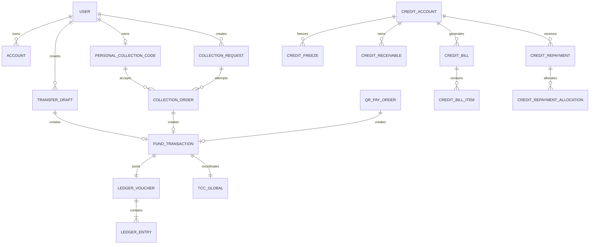

# MiniAlalipay 详细库表设计

| 项目 | 内容 |
|---|---|
| 产品 | MiniAlalipay |
| 适用文档 | PRD V1.6、系统分析 V1.4 |
| 数据库 | MySQL 8.0 / InnoDB |
| 金额单位 | 人民币分，`BIGINT UNSIGNED` |
| 时间标准 | UTC `DATETIME(3)`，API 转 ISO 8601 |
| 资金属性 | 仅演示虚拟资金，不接入真实人民币 |

本文件说明分库、字段、关系、约束、索引和事务边界；18 张核心资金/信用/收款表的完整可执行 DDL 同步维护在[系统分析文档第 11.8 节](./minialalipay-system-analysis.md)，实现时必须以两份文档的字段和约束交叉校验。

## 1. 设计原则

1. 业务服务按 Schema 拥有数据，禁止跨服务直接写其他 Schema 的表。
2. 账户余额、信用额度、应收和账本是资金事实，Redis 只用于缓存、会话和限流。
3. 所有并发修改表都使用 `version` 乐观锁；状态更新必须带旧状态和业务条件。
4. 所有交易金额使用整数分，禁止使用浮点数。
5. 交易主单通过 `(source_type, source_order_id)` 防止不同幂等键重复受理。
6. 所有资金事实和关键事件使用本地事务 Outbox 同步提交。
7. 跨 Schema 外键不落库，使用服务 API、TCC 分支、事件和对账验证关联。
8. 原始账本、审计日志、TCC 记录和交易主单不可物理删除。

## 2. 逻辑分库与数据归属

| 逻辑库 | 所有者 | 核心表 | 说明 |
|---|---|---|---|
| `user_db` | 用户中心 | `user`、`credential`、`contact`、`role`、`audit_log` | 身份、角色、登录和支付密码 |
| `account_db` | 账户中心 | `account`、`account_balance`、`credit_account`、`credit_freeze`、`credit_receivable`、`credit_purchase`、`credit_bill`、`credit_bill_item`、`credit_repayment`、`credit_repayment_allocation` | 余额、冻结、信用额度、应收和还款 |
| `ledger_db` | 账户中心账本模块 | `ledger_account`、`ledger_voucher`、`ledger_entry` | 不可变复式账本 |
| `business_db` | 业务中心 | `transfer_draft`、`fund_transaction`、`qr_pay_order`、`qr_pay_token`、`personal_collection_code`、`collection_request`、`collection_order`、`confirmation_subject`、`confirmation`、`risk_decision`、`manual_case`、`tcc_global`、`idempotency_record`、`outbox_event` | 订单、交易、收款、风控、事务和事件 |
| `agent_db` | AI 服务 | `agent_session`、`agent_message`、`tool_call_log`、`preference` | AI 会话和工具调用审计 |
| `metrics_db` | 监控模块 | `inbox`、`metric_definition`、`minute_metric`、`daily_metric`、`quality_result`、`monitor_alert` | 事件消费、指标、质量和告警 |

MVP 可以把多个 Schema 放在同一个 MySQL 实例中，但必须使用独立数据库用户或代码层访问策略模拟数据所有权；生产环境可以按上述逻辑库拆分实例。

## 3. ER 关系



## 4. 通用字段规范

| 字段 | 类型 | 规则 |
|---|---|---|
| 主键 | `CHAR(26)` | 使用 ULID/业务 ID，禁止自增暴露数量 |
| 金额 | `BIGINT UNSIGNED` | 单位为分；产品金额范围由检查约束和 API Schema 同时限制 |
| 版本 | `BIGINT UNSIGNED` | 初始 0，每次成功状态迁移加 1 |
| 时间 | `DATETIME(3)` | 服务端写 UTC，不接受客户端时间覆盖 |
| 状态 | `VARCHAR(32)` | API Schema 白名单 + MySQL `CHECK` |
| 摘要 | `BINARY(32)` | SHA-256/HMAC 摘要，不存原始令牌 |
| JSON | `JSON` | 只放扩展元数据，资金关键字段必须有独立列 |

所有表默认：

```sql
ENGINE = InnoDB
DEFAULT CHARSET = utf8mb4
COLLATE = utf8mb4_0900_ai_ci;
```

## 5. 用户中心表

### 5.1 `user`

| 字段 | 类型 | 约束/说明 |
|---|---|---|
| `user_id` | `CHAR(26)` | PK |
| `login_name` | `VARCHAR(64)` | UK，规范化后唯一 |
| `nickname` | `VARCHAR(64)` | 可重复，查询时脱敏 |
| `phone_tail` | `CHAR(4)` | 可选，只用于辅助检索 |
| `user_type` | `VARCHAR(16)` | `NORMAL`/`MERCHANT`/`OPERATOR` |
| `status` | `VARCHAR(16)` | `ACTIVE`/`LOCKED`/`CLOSED` |
| `identity_status` | `VARCHAR(16)` | 演示身份状态 |
| `version` | `BIGINT UNSIGNED` | CAS |
| `created_at/updated_at` | `DATETIME(3)` | 审计时间 |

索引：`UK(login_name)`、`(nickname,status)`、`(status,created_at)`。

### 5.2 `credential`

保存登录密码和支付密码的强哈希，不保存明文。

| 字段 | 类型 | 约束/说明 |
|---|---|---|
| `credential_id` | `CHAR(26)` | PK |
| `user_id` | `CHAR(26)` | UK，一个用户一行 |
| `login_hash` | `VARBINARY(255)` | Argon2id/BCrypt |
| `pay_hash` | `VARBINARY(255)` | 独立支付密码哈希 |
| `login_fail_count` / `pay_fail_count` | `INT UNSIGNED` | 分别计数 |
| `login_lock_until` / `pay_lock_until` | `DATETIME(3)` | 分别锁定 |
| `version` | `BIGINT UNSIGNED` | CAS |

### 5.3 `contact` 与 `role`

`contact(contact_id, owner_user_id, payee_user_id, alias, success_count, last_success_at, pinned, hidden, version, created_at, updated_at)` 使用 `(owner_user_id,payee_user_id)` 唯一键。它是由成功转账事件创建和累计的单向常用收款人投影，不表示好友关系；用户搜索不得写入该表。用户只能通过版本 CAS 修改 `alias`、`pinned` 和 `hidden`，成功次数和最近成功时间只能由确定终态的转账事件更新。

`role(user_id, role_code, created_at)` 使用 `(user_id,role_code)` 联合主键，角色包括 `USER`、`MERCHANT`、`OPERATOR`、`ADMIN`、`OBSERVER`。

## 6. 账户与信用表

### 6.1 `account` 与 `account_balance`

`account` 保存账户身份和状态；`account_balance` 保存余额事实，按账户一行。

```sql
CREATE TABLE account_balance (
  account_id CHAR(26) NOT NULL,
  available_fen BIGINT UNSIGNED NOT NULL DEFAULT 0,
  frozen_fen BIGINT UNSIGNED NOT NULL DEFAULT 0,
  version BIGINT UNSIGNED NOT NULL DEFAULT 0,
  updated_at DATETIME(3) NOT NULL,
  PRIMARY KEY (account_id),
  CONSTRAINT ck_balance_nonnegative CHECK (available_fen >= 0 AND frozen_fen >= 0)
) ENGINE=InnoDB DEFAULT CHARSET=utf8mb4 COLLATE=utf8mb4_0900_ai_ci;
```

余额扣款必须使用：

```sql
UPDATE account_balance
SET available_fen = available_fen - :amount,
    frozen_fen = frozen_fen + :amount,
    version = version + 1
WHERE account_id = :accountId
  AND version = :version
  AND available_fen >= :amount;
```

### 6.2 `credit_account`

| 字段 | 类型 | 约束 |
|---|---|---|
| `credit_account_id` | `CHAR(26)` | PK |
| `user_id` | `CHAR(26)` | UK |
| `total_limit_fen` | `BIGINT UNSIGNED` | 固定 500000 |
| `used_fen` | `BIGINT UNSIGNED` | 已用额度 |
| `frozen_fen` | `BIGINT UNSIGNED` | Try 阶段冻结 |
| `status` | `VARCHAR(16)` | `ACTIVE`/`SUSPENDED`/`CLOSED` |
| `version` | `BIGINT UNSIGNED` | CAS |

约束：`total_limit_fen = 500000`，`used_fen + frozen_fen <= total_limit_fen`。额度不计入虚拟余额。

### 6.3 信用消费、应收和账单

`credit_freeze(credit_freeze_id, credit_account_id, transaction_id, amount_fen, status, version)`：额度冻结分支，`(transaction_id)` 唯一。

`credit_receivable(receivable_id, credit_account_id, transaction_id, principal_fen, outstanding_fen, status, created_at, updated_at)`：信用应收资产，`(transaction_id)` 唯一。

`credit_purchase(purchase_id, transaction_id, credit_account_id, merchant_account_id, amount_fen, statement_period, status)`：`CREDIT_PAY` 消费事实，`transaction_id` 唯一。

`credit_bill(bill_id, credit_account_id, period, total_fen, paid_fen, remaining_fen, status, statement_at, due_at, version)`：`(credit_account_id,period)` 唯一；状态为 `UNBILLED`、`BILLED`、`OVERDUE`、`SETTLED`。

`credit_bill_item(item_id, bill_id, purchase_id, amount_fen, paid_fen, remaining_fen, status)`：消费明细只能进入一个账期。

### 6.4 还款表

`credit_repayment(repayment_id, transaction_id, credit_account_id, amount_fen, status, allocation_hash, version)`：`CREDIT_REPAY` 主事实，交易唯一。

`credit_repayment_allocation(allocation_id, repayment_id, bill_id, bill_item_id, allocated_fen, allocation_order)`：同一还款内分配顺序唯一，按逾期账单、已出账、未出账分配。

还款成功必须同时满足：虚拟余额减少 = 应收减少 = 已用额度减少 = 账单已还增加。

## 7. 账本表

### 7.1 `ledger_account`

系统账户、用户虚拟余额账户、商户虚拟余额账户、信用应收资产账户均在此登记。

| 字段 | 类型 | 约束 |
|---|---|---|
| `ledger_account_id` | `CHAR(26)` | PK |
| `owner_type` / `owner_id` | `VARCHAR(24)` / `CHAR(26)` | 业务归属 |
| `account_type` | `VARCHAR(32)` | `USER_BALANCE_LIABILITY`、`MERCHANT_BALANCE_LIABILITY`、`CREDIT_RECEIVABLE_ASSET` 等 |
| `status` | `VARCHAR(16)` | `ACTIVE`/`CLOSED` |

唯一键：`(owner_type,owner_id,account_type)`。

### 7.2 `ledger_voucher` 与 `ledger_entry`

`ledger_voucher(voucher_id, transaction_id, voucher_type, reversal_no, total_debit_fen, total_credit_fen, status, original_voucher_id, created_at)` 使用 `(transaction_id,voucher_type,reversal_no)` 唯一键。

`ledger_entry(entry_id, voucher_id, ledger_account_id, direction, amount_fen, line_no, memo)` 使用 `(voucher_id,line_no)` 唯一键；`direction` 为 `DEBIT`/`CREDIT`。

成功凭证必须满足：

```text
SUM(DEBIT) = SUM(CREDIT)
TRANSFER / QR_PAY：借付款方虚拟余额负债，贷收款方虚拟余额负债
CREDIT_PAY：借用户信用应收资产，贷商户虚拟余额负债
CREDIT_REPAY：借用户虚拟余额负债，贷用户信用应收资产
```

## 8. 业务中心表

### 8.1 `transfer_draft`

保存传统表单和 AI Talk 共享草稿：`draft_id`、付款方/收款方、`amount_fen`、`remark`、`status`、`version`、`expires_at`。状态为 `DRAFT`、`VALIDATED`、`PENDING_CONFIRMATION`、`SUBMITTED`、`EXPIRED`。

### 8.2 `fund_transaction`

这是统一交易主单，核心字段：

| 字段 | 约束 |
|---|---|
| `transaction_id` | PK |
| `business_type` | `TRANSFER`/`QR_PAY`/`CREDIT_PAY`/`CREDIT_REPAY` |
| `source_type` | `TRANSFER_DRAFT`/`QR_PAY_ORDER`/`PERSONAL_QR_ORDER`/`COLLECTION_REQUEST_ORDER`/`CREDIT_REPAYMENT` |
| `source_order_id` | 与 `source_type` 联合唯一 |
| `payer_account_id` / `payee_account_id` | 服务端派生 |
| `amount_fen` | `1..5000000` 分 |
| `idempotency_key` | 与付款账户联合唯一 |
| `status` | `PROCESSING`、`SUCCESS`、`FAILED`、`MANUAL_REVIEW`、`REVERSED` |
| `trace_id` | 全链路关联 |

### 8.3 商户扫码表

`qr_pay_order` 保存商户、金额、`funding_source`、状态和版本；`qr_pay_token` 保存 5 分钟一次性令牌摘要、H5 会话绑定和消费时间。

### 8.4 普通用户个人收款表

`personal_collection_code`：长期可复用令牌，`owner_user_id`、`payee_account_id`、`token_digest`、`status`、生成列 `active_owner_key`。通过活动槽位唯一键保证每个用户最多一个 `ACTIVE` 码。

`collection_request`：固定金额请求，字段包括 `amount_fen`、`subject`、`expires_at`、`active_order_id`、`cancel_requested_at`、`version`。金额范围 `1..5000000` 分，备注 `VARCHAR(50)`，创建后不可变。

`collection_order`：每个个人码 H5 会话或固定请求付款尝试一行。`mode=PERSONAL_QR` 时 `code_id` 非空；`mode=FIXED_REQUEST` 时 `request_id` 非空。固定请求通过 `active_order_id` CAS 仲裁，个人码订单彼此独立。

### 8.5 确认、风控和人工处理

`confirmation_subject(subject_type,subject_id,current_confirmation_id,version)` 保存主体当前确认令牌槽位。

`confirmation(confirmation_id,token_digest,subject_type,subject_id,subject_hash,payer_user_id,status,expires_at,consumed_at)`：令牌摘要唯一，活动主体只能有一个 `ACTIVE` 令牌。

`risk_decision(decision_id,subject_type,subject_id,transaction_id,rule_version,risk_level,action,reason_code)`：交易前可没有 `transaction_id`。

`manual_case(case_id,case_type,subject_type,subject_id,transaction_id,status,operator_id,version)`：活跃主体唯一；运营只能审批，不可直接改余额。

## 9. 事务、幂等和事件表

### 9.1 `tcc_global`

保存 `transaction_id`、Seata `xid`、全局状态、重试次数和下一次重试时间。`xid` 唯一，恢复任务扫描 `PROCESSING`、`COMMITTING`、`ROLLING_BACK`。

### 9.2 `idempotency_record`

```sql
CREATE TABLE idempotency_record (
  record_id CHAR(26) NOT NULL,
  principal_key VARCHAR(128) NOT NULL,
  api_scope VARCHAR(64) NOT NULL,
  idempotency_key VARCHAR(64) NOT NULL,
  request_digest BINARY(32) NOT NULL,
  resource_type VARCHAR(32) NULL,
  resource_id CHAR(26) NULL,
  response_json JSON NULL,
  status VARCHAR(16) NOT NULL,
  expires_at DATETIME(3) NOT NULL,
  created_at DATETIME(3) NOT NULL,
  updated_at DATETIME(3) NOT NULL,
  PRIMARY KEY (record_id),
  UNIQUE KEY uk_idempotency (principal_key, api_scope, idempotency_key),
  KEY idx_idempotency_status (status, updated_at),
  CONSTRAINT ck_idempotency_status
    CHECK (status IN ('PROCESSING', 'COMPLETED', 'FAILED'))
) ENGINE=InnoDB DEFAULT CHARSET=utf8mb4 COLLATE=utf8mb4_0900_ai_ci;
```

同一主体、API 范围和幂等键使用不同请求摘要时返回 `IDEMPOTENCY_CONFLICT`；完成重试返回原交易号和原响应。

### 9.3 `outbox_event`

字段：`event_id`、`aggregate_type`、`aggregate_id`、`event_type`、`event_version`、`business_type`、`source_type`、`source_order_id`、`transaction_id`、`trace_id`、`payload`、`status`、`retry_count`、`next_retry_at`。

唯一键：`event_id`。事件必须和业务事实在同一本地事务提交，投递失败只重试，不回滚已提交资金。

## 10. AI 与监控表

### 10.1 AI 表

| 表 | 关键字段 | 约束 |
|---|---|---|
| `agent_session` | `session_id`、`user_id`、`status`、`last_message_at` | 用户对象授权；会话超时 |
| `agent_message` | `message_id`、`session_id`、`role`、`content_redacted`、`schema_version` | 不存密码、确认令牌和完整账号 |
| `tool_call_log` | `tool_call_id`、`session_id`、`tool_name`、`trace_id`、`request_digest`、`result_code`、`latency_ms` | 工具调用可追溯、参数脱敏 |
| `preference` | `preference_id`、`user_id`、`key`、`value_redacted`、`version` | 仅保存用户明确授权的低敏偏好 |

### 10.2 监控表

| 表 | 关键字段 | 约束 |
|---|---|---|
| `inbox` | `event_id`、`consumer_name`、`consumed_at`、`status` | `(event_id,consumer_name)` 唯一 |
| `metric_definition` | `metric_code`、`formula`、`source_event`、`dimension_schema`、`version` | 指标口径版本化 |
| `minute_metric` | `metric_code`、`bucket_at`、`dimensions_json`、`value` | `(metric_code,bucket_at,dimensions_hash)` 唯一 |
| `daily_metric` | `metric_code`、`business_date`、`value`、`quality_status`、`definition_version` | 数据日期和口径版本唯一 |
| `quality_result` | `quality_id`、`data_date`、`rule_code`、`status`、`bad_count`、`evidence_json` | `FAILED` 禁止报表发布 |
| `monitor_alert` | `alert_id`、`rule_code`、`severity`、`status`、`subject_id`、`evidence_json`、`assignee_id` | 状态 `OPEN→ACKNOWLEDGED→RESOLVED→CLOSED` |

## 11. 关键 DDL 约束汇总

```sql
-- 个人码每个用户最多一个 ACTIVE
UNIQUE KEY uk_personal_code_active_owner (active_owner_key)

-- 一个来源订单最多一笔交易
UNIQUE KEY uk_tx_source (source_type, source_order_id)

-- 一个付款账户和幂等键最多一个操作
UNIQUE KEY uk_tx_payer_idempotency (payer_account_id, idempotency_key)

-- 固定请求金额范围
CHECK (amount_fen BETWEEN 1 AND 5000000)

-- C2C 只能使用虚拟余额
CHECK (funding_source = 'BALANCE')

-- 账本借贷平衡由事务校验和终态发布器双重验证
CHECK (total_debit_fen = total_credit_fen)
```

## 12. 写入事务边界

### 12.1 主动转账/个人码付款

在 `business_db` 本地事务中：消费确认令牌 → CAS 来源聚合 → 插入 `fund_transaction` → 回填来源交易号 → 写 `outbox_event`。随后由 TCC 修改 `account_db`、`ledger_db`。

### 12.2 固定金额请求

在同一 `business_db` 本地事务中：消费令牌 → `collection_request OPEN→PROCESSING` 并绑定 `active_order_id` → 当前 `collection_order PENDING_CONFIRMATION→PROCESSING` → 插入交易 → 写 Outbox。竞争失败不创建第二笔交易。

### 12.3 Mini 花呗支付

账户中心 Try 冻结额度，账本分支预留信用应收和商户入账凭证；Confirm 后更新 `used_fen`、应收和账单消费。成功账务为：借信用应收资产，贷商户虚拟余额负债。

### 12.4 Mini 花呗还款

服务端生成还款分配快照；余额分支冻结并扣减虚拟余额，信用分支减少应收/账单/已用额度，账本分录借用户虚拟余额负债、贷信用应收资产。

## 13. 索引、归档和分片

- 热点查询：`(user_id,status,created_at)`、`(account_id,created_at)`、`(status,updated_at)`。
- 订单过期：`(status,expires_at)`；恢复任务：`(status,updated_at)`。
- 游标分页：使用 `(created_at,id)`，禁止资金明细大 OFFSET。
- 事件：`(status,next_retry_at)`；监控事件按 `event_id` 去重。
- 账本按账户和时间分区，分区键不改变凭证全局唯一性。
- 交易、账本、审计和事件原始数据保留 30 天热数据；日指标保留 180 天；归档前必须完成对账。
- 账户按 `account_id` 路由到唯一写分片；同一账户余额不能在多个主库同时写入。
- MySQL 主从切换期间暂停资金写入，读副本只服务非关键查询。

## 14. 备份、恢复和数据质量

1. MySQL 每日全量备份、每小时增量/binlog 归档，恢复目标为演示环境 RPO 15 分钟、RTO 30 分钟。
2. 恢复后先校验 `fund_transaction`、账户余额、冻结、额度、应收和账本四方/多方一致，再开放写入。
3. 每日质量任务检查完整性、唯一性、合法性、及时性和一致性；`FAILED` 时禁止发布 T+1 报表。
4. 发现余额差异只能创建对账工单和受控冲正，不允许直接 `UPDATE account_balance` 修数。
5. 所有迁移脚本必须包含前置检查、正向迁移、回滚说明和执行后的约束验证。

## 15. 建表与迁移顺序

```text
1. user_db：user -> credential -> role/contact/audit_log
2. account_db：account -> account_balance -> ledger_account
3. ledger_db：ledger_voucher -> ledger_entry
4. business_db：draft/order -> confirmation/risk -> fund_transaction
5. business_db：qr_pay -> personal_collection_code -> collection_request/order
6. account_db：credit_account -> credit_freeze/receivable/purchase -> bill/item
7. account_db：credit_repayment -> repayment_allocation -> repayment_draft
8. business_db：tcc_global -> idempotency_record -> outbox_event
9. agent_db：agent_session/message/tool_call_log/preference
10. metrics_db：inbox -> metric_definition -> minute/daily_metric -> quality/alert
```

所有跨库关联在初始化数据完成后执行一致性校验；不得用跨库外键替代服务边界和对账机制。

## 16. 设计验收清单

- [ ] 18 张核心物理表 DDL 与本设计字段、状态、唯一键一致。
- [ ] `TRANSFER`、`QR_PAY`、`CREDIT_PAY`、`CREDIT_REPAY` 的账务模板借贷平衡。
- [ ] C2C 个人码可并发多笔成功，固定请求 100 路竞争最多一笔成功。
- [ ] 同一来源订单更换幂等键仍不能重复交易。
- [ ] Mini 花呗额度恒等式、应收、账单和还款分配可对账。
- [ ] Outbox 与业务事实同事务，Inbox 消费幂等。
- [ ] Redis 不可用时资金判断仍回源 MySQL，不重复扣款。
- [ ] 迁移、回滚、备份恢复和数据质量门禁通过测试。
