# MiniAlalipay 系统分析文档

## 0. 文档信息

| 项目 | 内容 |
|---|---|
| 系统名称 | MiniAlalipay |
| 文档类型 | 系统分析文档 |
| 文档版本 | V1.11 |
| 编制日期 | 2026-07-29 |
| 需求基线 | MiniAlalipay PRD V1.8 |
| PRD 文件 | `minialalipay-prd.md` |
| 项目周期 | 2 周 |
| 团队规模 | 5 人 |
| 资金属性 | 系统虚拟资金，不接入真实人民币通道 |
| 目标读者 | 架构、后端、前端、AI 工程、测试、运维、产品和评委 |

### 0.1 变更记录

| 版本 | 日期 | 修订人 | 内容 |
|---|---|---|---|
| V1.0 | 2026-07-28 | 项目组 | 基于 PRD V1.4 建立完整系统分析基线 |
| V1.1 | 2026-07-28 | 项目组 | 完善终态发布、扫码原子受理、可靠事件、Trace 和 MVP 技术栈 |
| V1.2 | 2026-07-28 | 项目组 | 增补流程图、UML 组件/类图、物理数据库设计和详细 API 契约 |
| V1.3 | 2026-07-29 | 项目组 | 对齐 PRD V1.6：补齐 Mini 花呗信用支付/还款，并新增 C2C 长期个人码与固定金额收款请求 |
| V1.4 | 2026-07-29 | 项目组 | 增加技术选型、架构模式决策、功能实现详述、库表总览和端到端流程图 |
| V1.5 | 2026-07-29 | 项目组 | 固定 B 端/C 端 React 技术栈，补充 Umi H5 工程约束、目录结构、页面映射及移动端兼容要求 |
| V1.6 | 2026-07-29 | 项目组 | 明确后端 Maven 模块、限界上下文包结构、依赖方向、数据所有权和测试边界 |
| V1.7 | 2026-07-29 | 项目组 | 固定 Monorepo 单仓库方案：后端 Maven 多模块、前端单 Umi 工程，并以 `/admin`、`/h5` 隔离 B/C 端 |
| V1.8 | 2026-07-29 | 项目组 | 调整为同一 Monorepo 下 B 端与 C 端两个独立 Umi 前端工程，分别构建和部署 |
| V1.9 | 2026-07-29 | 项目组 | 对齐 PRD V1.7：开户初始余额改为 0，新增模拟充值资金来源与对应账户、账本、接口约束 |
| V1.10 | 2026-07-30 | 项目组 | 对齐 PRD V1.8：补充普通用户个人收支投影与商户经营收款、订单、退款和对账统计 |
| V1.11 | 2026-07-30 | 项目组 | 明确文档权威层级，补齐注册开户中间状态和幂等恢复事实，专项实现改由派生文档引用 |

## 1. 文档目的与范围

### 1.1 文档目的

本文档把 PRD 中的产品目标、功能需求和验收条件转换为可实施的系统模型，回答以下问题：

1. MiniAlalipay 的系统边界、参与者和核心用例是什么。
2. 用户中心、业务中心、账户中心、AI Agent、MCP Server 和监控链路如何协作。
3. `TRANSFER`、`QR_PAY`、`CREDIT_PAY` 与 `CREDIT_REPAY` 如何共享确定性交易核心并保持余额、额度、应收和账本一致。
4. AI 如何完成自然语言交互，同时无法绕过支付密码、风控和用户确认。
5. 实时/离线监控、告警、数据质量和审计如何贯穿全链路。
6. 两周、5 人约束下，哪些能力独立部署，哪些能力以模块方式共部署。
7. 如何通过自动化测试、故障注入和对账证明“钱不少、账不乱”。

本文档同时给出开发所需的流程、UML、逻辑数据模型、接口分组和协议约束。第 11、12 章是系统架构视图；可执行 DDL 的物理结构以数据库设计为准，可执行 HTTP/SSE 契约以 OpenAPI 3.1 文件为准，部署脚本以 `deploy/` 中受版本管理的配置为准，并通过迁移测试和契约测试防止实现漂移。

### 1.2 分析范围

纳入范围：

- 用户名/密码注册登录、自动开户（初始余额为 0）和受控模拟充值。
- 支付密码、用户搜索、常用收款人和模拟身份状态。
- 传统表单转账、AI Talk 转账、余额、明细、回执和资产分析。
- Web 商户收银台、动态二维码、手机 H5 和 `QR_PAY` 虚拟资金支付。
- Mini 花呗固定 5000 元虚拟额度、商户 `CREDIT_PAY`、应收/账单和余额 `CREDIT_REPAY`。
- 普通用户长期个人收款码、30 分钟固定金额收款请求和统一 `TRANSFER` 余额付款。
- 风控、确认令牌、幂等、TCC、Saga、恢复任务、人工确认和证账实对账。
- AI 多轮对话、上下文记忆、MCP 工具、策略网关和执行 Trace。
- 实时指标、T+1 报表、告警处置、数据质量和指标口径治理。

不纳入范围：

- 真实支付宝、银行卡、清算机构或真实人民币资金通道。
- 真实 KYC、反洗钱、监管报送、商户结算和原路退款。
- 多币种、跨境、真实信贷/征信/放贷、理财、保险和生产级多地域容灾。
- C2C 好友申请、双向好友关系、群收款、AA 收款、手续费和信用付款。

### 1.3 关键假设

- 系统运行于演示/教学环境，但资金一致性、安全门槛和审计要求按准生产标准设计。
- 所有金额以人民币“分”为最小单位，使用 64 位整数计算。
- 用户和商户均持有系统虚拟账户；商户账号由演示数据预置，不建设商户入驻流程。
- Mini 花呗仅为演示虚拟授信：固定额度 500000 分，账单日为每月 1 日，到期日为每月 10 日，不计利息、罚息和手续费。
- 个人收款不依赖好友关系，个人码和固定请求均只能使用 `BALANCE`，禁止 `MINI_CREDIT`。
- PRD 中的 P0 为两周必须交付，P1 可在 P0 稳定后实现。
- 真实大模型、规则模型或演示兜底模型可以替换，但 Agent 输出必须经过同一 Schema 和策略校验。

### 1.4 图表与设计交付物索引

| 类型 | 图表/设计 | 位置 | 主要用途 |
|---|---|---|---|
| 流程图 | 统一功能实现、资金交易活动、事务恢复与对账流程 | 9.5、9.8、9.7 | 说明正常、风控、补偿和人工分支 |
| UML 用例视图 | 参与者与核心用例 | 4.2 | 明确系统参与者和功能边界 |
| UML 组件图 | 五个部署单元、核心组件和依赖 | 7.4 | 指导模块分工与接口归属 |
| UML 类图 | 核心聚合、实体和值对象 | 8.4 | 指导领域对象与关系实现 |
| UML 时序图 | 注册、转账、商户扫码、信用支付/还款、个人码和固定请求 | 第 9 章 | 明确跨端、跨服务调用顺序 |
| UML 状态图 | QR 订单、信用账户/账单、个人码、固定请求/订单、TCC 分支、告警 | 第 10 章 | 约束合法状态迁移 |
| ER 图 | 用户、账户、交易、账本和 Agent 关系 | 8.2 | 说明逻辑数据关系 |
| 数据架构 | 数据所有权、逻辑实体关系、关键约束和分片边界 | 第 11 章 | 为物理数据库设计提供系统架构输入 |
| 接口架构 | 能力分组、权限边界、交互协议和集成约束 | 第 12 章 | 为 OpenAPI、SSE/MCP 和事件契约提供系统架构输入 |
| 技术选型 | 语言、框架、中间件、部署和选型取舍 | 7.5、7.6、7.7、19.1 | 固定 MVP 技术基线及前后端工程约束 |
| 功能实现详述 | 功能点、后端处理、数据表、事务和结果 | 6.4、9.8 | 指导按功能实现和联调 |
| 库表总览 | 服务数据所有权、核心表关系和分片边界 | 11.10 | 解释库表设计与 DDL 的对应关系 |

第 11 章出现的字段目录和第 12 章出现的端点、请求响应 Schema 用于表达架构约束与设计意图，不构成第二份可执行契约。发生字段级或协议级差异时，分别以[数据库设计](./minialalipay-database-design.md)和 [`contracts/openapi/minialalipay-api.yaml`](../../contracts/openapi/minialalipay-api.yaml)为准，并同步回写本文受影响的逻辑模型或架构约束。

### 1.5 文档权威与派生关系

本文档是 MiniAlalipay 的**系统架构事实来源**，统一维护系统边界、服务职责、业务流程、状态模型、领域关系、数据所有权、资金不变量、安全规则、质量属性和跨端协作方式。后端、前端、AI、测试和部署设计不得在各自专项文档中重新定义或覆盖这些系统事实。

项目文档按以下职责分层：

1. [产品需求文档](./minialalipay-prd.md)是需求与验收事实来源，定义系统需要实现什么。
2. 本文档是系统架构事实来源，定义各能力如何组成、协作和保持一致。
3. [`contracts/openapi/minialalipay-api.yaml`](../../contracts/openapi/minialalipay-api.yaml)是 HTTP/SSE 路径、方法、字段、响应和协议的接口契约事实来源。
4. [数据库设计](./minialalipay-database-design.md)是物理表、字段、索引、约束和 Schema 所有权的事实来源。
5. [后端系统分析](./minialalipay-backend-system-analysis.md)是派生的后端实现设计，只描述上述事实如何映射到 Java 模块、包、组件、事务、配置和测试。
6. [前端系统分析](./miniaialipay%20-frontend-system-analysis.md)是派生的前端实现设计，只描述总体交互和接口契约如何映射到 B/C 端工程。

专项文档不得通过复制形成第二套业务流程、状态、接口或数据定义。确需说明上下文时，应引用本文档的稳定章节标题，然后只补充本专项的实现增量。引用不得依赖易变化的物理行号。

发现文档冲突时必须停止实现或合并：PRD 与本文档先统一需求和架构语义；本文档与 OpenAPI 或数据库设计再统一专项契约；后端或前端系分必须服从已批准的上层基线。代码和测试不能被当作默认事实来源，也不得通过兼容逻辑隐藏未说明行为。

## 2. 系统目标与质量属性

### 2.1 系统目标

| 目标 | 系统含义 | 可验证结果 |
|---|---|---|
| 双端对齐 | Web/H5 与 AI Talk 使用同一草稿、校验、确认和交易核心 | 同一交易在双端数据一致 |
| 确定性资金 | 模型不直接控制资金，资金动作由后端规则和事务执行 | 无确认令牌时资金接口拒绝 |
| 一致性 | 跨服务、跨库交易最终成功或完整恢复 | 无重复扣款，借贷差异为 0 |
| 可追溯 | 请求、Agent、MCP、风控、事务和账本可关联 | 交易号/Trace ID 可查完整链路 |
| 可恢复 | 超时、重启和部分失败可重试、补偿或转人工 | 故障注入后 60 秒内收敛或入人工 |
| 可监控 | 实时、离线、告警和数据质量形成闭环 | 关键事件 2 分钟内可见，T+1 有发布门禁 |
| 渠道统一 | 主动转账、个人码和固定请求均形成 `TRANSFER`，商户码按资金来源形成 `QR_PAY`/`CREDIT_PAY` | 同一核心按 `source_type` 区分且金额不重复统计 |
| 信用闭环 | 额度、冻结、应收、账单和还款可独立对账 | 总额=可用+已用+冻结，已用=信用应收 |

### 2.2 核心质量属性优先级

1. 资金一致性与安全。
2. 幂等、故障恢复和审计。
3. 核心流程可用性和可观察性。
4. AI 交互自然度和响应速度。
5. 页面美观、扩展能力和非核心分析功能。

任何进度冲突都必须按上述顺序取舍，不能用简化资金模型换取更多页面或 AI 效果。

## 3. 可行性分析

### 3.1 技术可行性

| 能力 | 可行性判断 | 实施要点 |
|---|---|---|
| 三中心 | 高 | 使用独立服务边界和独立 Schema，接口契约明确 |
| TCC/Saga | 中高 | 四类资金交易复用分支模板；余额与信用参与者按业务类型组合 |
| AI Agent | 高 | 使用结构化输出、白名单工具和策略网关，降低模型不确定性 |
| MCP Server | 中高 | P0 固定工具集，保留动态发现；高风险工具由确认上下文解锁 |
| H5 扫码 | 高 | 二维码编码可访问 URL，系统相机打开 H5，无需小程序资质 |
| Mini 花呗 | 中高 | 固定额度与轻量月账单，不接征信、计息或真实放贷 |
| C2C 个人收款 | 中高 | 业务中心内新增聚合，复用 H5、确认、`TRANSFER`、TCC 和账本 |
| 实时监控 | 高 | Micrometer/OpenTelemetry Collector + Prometheus/Tempo/Grafana |
| T+1 报表 | 高 | 基于事件日志的定时批处理，避免建设重型大数据集群 |
| 故障注入 | 中高 | 提供受控超时/异常开关，测试 TCC、Saga 和恢复任务 |

### 3.2 工期可行性

两周内不宜把每个逻辑模块都拆成独立进程。冻结为 5 个后端部署单元：网关、用户中心、账户中心、业务中心、AI 服务。MCP Server 与 Agent 共进程；风控、商户扫码、P2P Collection、人工工单、对账、监控聚合和运营 API 作为业务中心内的独立模块共进程部署；Mini Credit 作为账户中心内模块。逻辑与数据库边界保持稳定，MVP 不再增加应用进程。

### 3.3 运行可行性

- 使用 Docker Compose 一键启动服务和基础设施。
- 演示数据、商户账号、虚拟资金、故障开关可重复初始化。
- 手机 H5 使用局域网可达地址或 HTTPS 临时域名。
- 监控后台和故障注入入口只对运营/管理员开放。

### 3.4 主要约束

- 5 人团队需要并行开发，接口与事件契约必须在第 2 天前冻结 P0 版本。
- AI 外部服务可能不稳定，需要超时、重试、熔断和演示兜底。
- TCC 与账本是评分生命线，不能用单库本地事务替代。
- 监控实时/离线链路不能直接扫描业务数据库生成指标。
- C2C 不得使用信用额度；固定请求未知 `PROCESSING` 结果不得重新开放。

## 4. 参与者与用例分析

### 4.1 参与者

| 参与者 | 类型 | 核心行为 |
|---|---|---|
| 普通用户 | C 端 | 注册、转账、商户扫码、Mini 花呗支付/还款、管理个人码/固定请求、查询余额和账单 |
| 模拟商户 | C/B 端 | 创建商户扫码订单、展示收款码、接收 `QR_PAY`/`CREDIT_PAY` 并查看结果 |
| 运营人员 | B 端 | 查看异常交易、处理人工工单和告警 |
| 系统管理员 | B 端 | 管理演示用户、非资金配置、故障开关和权限 |
| 观察者/评委 | B 端只读 | 查看脱敏监控、Trace、事务和对账结果 |
| AI Agent | 系统参与者 | 理解意图、管理上下文、调用受控工具和解释结果 |
| 外部大模型 | 外部依赖 | 返回自然语言和结构化意图，不持有业务身份或资金权限 |
| 定时任务 | 系统参与者 | 恢复事务、执行对账、生成 T+1 报表和质量检查 |

### 4.2 UML 用例视图

下图采用 UML 用例语义表达参与者与系统用例；连线表示参与或触发关系，资金类用例均隐含“身份校验、风控与可信确认”。

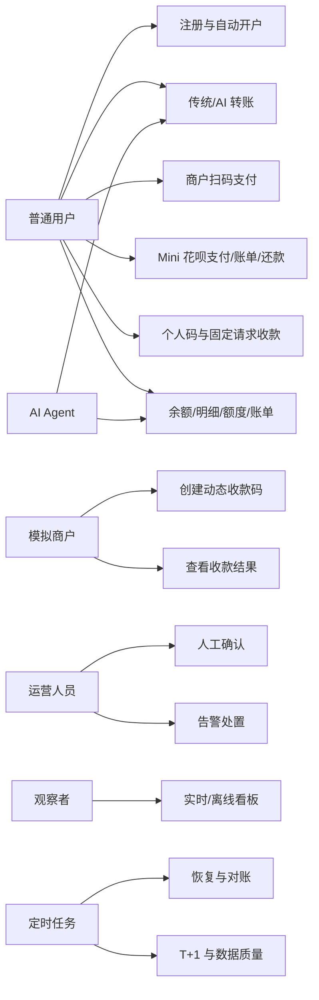
```mermaid
flowchart LR
    User[普通用户] --> Register[注册与自动开户]
    User --> Transfer[传统/AI 转账]
    User --> QrPay[商户扫码支付]
    User --> Credit[Mini 花呗支付/账单/还款]
    User --> P2P[个人码与固定请求收款]
    User --> Query[余额/明细/额度/账单]
    Merchant[模拟商户] --> QrOrder[创建动态收款码]
    Merchant --> QrResult[查看收款结果]
    Agent[AI Agent] --> Transfer
    Agent --> Query
    Operator[运营人员] --> Manual[人工确认]
    Operator --> Alert[告警处置]
    Observer[观察者] --> Dashboard[实时/离线看板]
    Scheduler[定时任务] --> Recovery[恢复与对账]
    Scheduler --> Report[T+1 与数据质量]
```

### 4.3 核心用例目录

| 用例编号 | 用例 | 主参与者 | 前置条件 | 成功结果 |
|---|---|---|---|---|
| UC-01 | 注册并自动开户 | 普通用户 | 登录名未占用 | 用户、初始余额为 0 的账户和独立 5000 元信用额度一致 |
| UC-01A | 模拟充值 | 登录用户 | 账户正常、未超过限额 | 充值交易、余额、账本和审计记录一致 |
| UC-02 | 登录 | 普通用户 | 用户正常且未锁定 | 获得有效会话 |
| UC-03 | 传统表单转账 | 普通用户 | 已登录、账户正常 | `TRANSFER` 成功并生成回执 |
| UC-04 | AI 多轮转账 | 普通用户、Agent | 已登录 | 澄清槽位、人工确认后执行 `TRANSFER` |
| UC-05 | 查询余额/明细 | 普通用户、Agent | 已登录 | 返回本人实时余额和账本明细 |
| UC-06 | 创建动态收款码 | 模拟商户 | 商户已登录且账户正常 | 创建 5 分钟有效 `QR_PAY` 订单 |
| UC-07 | H5 扫码支付 | 普通用户 | 有效二维码、余额充足 | 付款方扣款、商户入账、账本平衡 |
| UC-08 | 查询交易与回执 | 普通用户/商户 | 有访问权限 | 返回交易核心真实状态 |
| UC-09 | 风控前置人工确认 | 运营人员 | 命中转人工规则 | 批准后用户重新确认或驳回 |
| UC-10 | 事务恢复人工确认 | 运营人员 | 自动补偿未收敛 | 冻结资金得到安全处置 |
| UC-11 | 证账实对账 | 定时任务/运营 | 存在交易与账本数据 | 差异自动修复或生成工单 |
| UC-12 | 查看全链路 Trace | 运营/观察者 | 有查询权限 | 定位 Agent、接口、事务或账本阶段 |
| UC-13 | 处理告警 | 运营人员 | 告警已产生 | 完成确认、解决、恢复和关闭闭环 |
| UC-14 | 生成 T+1 报表 | 定时任务 | 事件日志完整 | 质量通过后发布版本化指标 |
| UC-15 | 管理长期个人收款码 | 普通用户 | 已登录、账户正常 | 获得唯一有效个人码，可停用或原子换码 |
| UC-16 | 创建和取消固定金额收款请求 | 普通用户 | 已登录、金额有效 | 创建 30 分钟不可改金额请求，或在未受理时取消 |
| UC-17 | 扫码或打开请求完成 C2C 余额付款 | 普通用户 | 非本人收款对象、余额充足 | 形成 `TRANSFER`，双方余额变化且账本平衡 |
| UC-18 | 查看 C2C 跨端状态与回执 | 付款人/收款人 | 有对象级访问权 | SSE/轮询返回交易核心真实状态 |
| UC-19 | Mini 花呗商户扫码支付 | 普通用户 | 额度账户正常、额度充足 | 形成 `CREDIT_PAY`，增加应收与商户余额 |
| UC-20 | 查询账单并余额还款 | 普通用户 | 存在应收且余额充足 | 形成 `CREDIT_REPAY`，减少余额与应收并恢复额度 |

## 5. 系统边界与上下文

### 5.1 系统上下文图

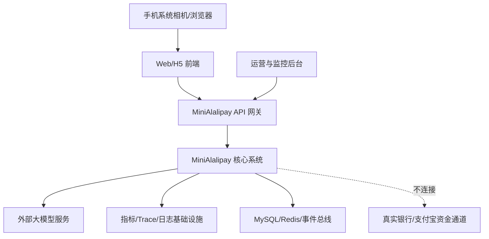
```mermaid
flowchart TB
    Web[Web/H5 前端] --> Gateway[MiniAlalipay API 网关]
    Mobile[手机系统相机/浏览器] --> Web
    Admin[运营与监控后台] --> Gateway
    Gateway --> Core[MiniAlalipay 核心系统]
    Core --> LLM[外部大模型服务]
    Core --> Obs[指标/Trace/日志基础设施]
    Core --> Store[MySQL/Redis/事件总线]
    Core -. 不连接 .-> RealPay[真实银行/支付宝资金通道]
```

### 5.2 边界说明

- MiniAlalipay 负责虚拟账户、信用额度/应收/账单、交易、账本、AI 编排、商户与个人收款 H5、监控和审计。
- 手机系统相机只负责识别二维码并打开 URL，不属于系统内部能力。
- 外部大模型是不可信计算依赖；身份、权限、余额、风控和交易结果均由后端决定。
- 真实支付通道明确位于边界之外，任何页面和回执都必须标注虚拟资金属性。

## 6. 功能分解与服务边界

### 6.1 逻辑分层

| 层次 | 组件 | 职责 |
|---|---|---|
| 交互层 | Web、H5、AI Talk、运营后台 | 展示、输入、结构化确认和状态反馈 |
| 接入层 | API 网关、认证过滤器、限流器 | 路由、鉴权、Trace、CSRF、防重放和限流 |
| 智能层 | Agent 服务、Memory、Tool Router | 意图、槽位、上下文、工具编排和解释 |
| 工具层 | MCP Server、策略网关 | 工具发现、Schema、权限和确认上下文校验 |
| 业务层 | 用户、业务、账户三中心 | 用户、订单、风控、交易、余额和账本 |
| 一致性层 | TCC 协调器、Saga、恢复、对账 | 跨服务一致性、补偿和最终收敛 |
| 数据层 | MySQL、Redis、事件总线、日志存储 | 持久化、缓存、事件和审计 |
| 可观测层 | OTel、Prometheus、Grafana、离线任务 | Trace、指标、告警、质量和报表 |

### 6.2 部署单元建议

| 部署单元 | 内部模块 | 数据所有权 | 主要依赖 |
|---|---|---|---|
| `api-gateway` | 鉴权、路由、限流、Trace | 无业务数据 | Redis、服务注册 |
| `user-center` | 用户、身份、登录密码、支付密码、联系人 | `user_db` | Redis、事件总线 |
| `account-center` | 账户、余额、信用额度、应收、账单、还款分配、账本 | `account_db`、`ledger_db` | TCC、事件总线 |
| `business-center` | 草稿、交易、风控、商户扫码、P2P Collection、工单、恢复、对账、监控聚合、T+1、告警、质量、运营 API | `business_db`、`metrics_db` | user/account、Seata、Redis Streams、Tempo |
| `ai-service` | Agent、会话、Memory、提示、Tool Router、MCP 工具目录、Schema、策略网关 | `agent_db`/Redis | LLM、三中心 API |

以上固定为 5 个后端部署单元。逻辑模块边界必须稳定，但扫码、风控、人工工单、对账和监控暂与业务中心共部署，MCP 暂与 Agent 共部署；后续可按负载和团队边界拆分。

### 6.3 三大中心职责

#### 用户中心

- 用户身份、角色、登录会话、登录锁定和支付锁定。
- 登录密码、支付密码的强哈希和校验。
- 用户搜索、联系人、模拟实名和商户身份。
- 不保存账户余额，不决定资金交易成功。

#### 业务中心

- 统一交易主单，业务类型包括 `TRANSFER`、`QR_PAY`、`CREDIT_PAY`、`CREDIT_REPAY`。
- 转账草稿、确认、风控、幂等、商户扫码订单、个人码、固定请求/尝试、人工工单。
- TCC 全局事务发起、Saga 恢复、定时扫描和对账编排。
- 不直接修改账户余额和账本分录。

#### 账户中心

- 虚拟账户、可用余额、冻结金额、账户状态。
- Mini 花呗额度账户、额度冻结、信用应收、消费明细、月度账单和还款分配。
- TCC 付款冻结/扣款、收款预占/入账和账本凭证分支。
- TCC 信用额度冻结/占用、应收确认/释放及余额还款分支。
- 不可变复式账本、个人收支投影与商户经营统计数据来源。
- 账本是资金事实来源，任何余额修复必须通过冲正分录。

### 6.4 功能实现总览

系统按“入口层、编排层、领域服务、资金执行、事件与监控”五步实现功能。前端页面只负责采集和展示，业务中心负责确定性状态机，账户中心负责资金事实，所有跨服务资金动作由 TCC 协调。

| 功能点 | 入口 | 业务中心实现 | 账户/账本实现 | 持久化事实 | 结果反馈 |
|---|---|---|---|---|---|
| 注册与开户 | C 端 H5 | 校验用户名、创建身份和开户事件 | 创建余额为 0 的虚拟账户 | `user`、`account`、`account_balance` | 登录成功和余额摘要 |
| 模拟充值 | C 端 H5 | 校验登录态、限额、幂等与模拟渠道结果 | 发行账户向用户余额账户入账并写平衡分录 | `recharge_order`、`fund_transaction`、`voucher`、`ledger_entry` | 充值状态、余额、明细和回执 |
| 主动 C2C 转账 | Web 表单/AI Talk | 草稿版本、收款人解析、风控、确认令牌、`TRANSFER` 受理 | TCC 冻结付款方、增加收款方、写借贷分录 | `transfer_draft`、`confirmation`、`fund_transaction` | 交易状态、回执、明细 |
| 商户扫码余额支付 | 商户 Web + 手机 H5 | `QrPayOrder`、令牌交换、订单 CAS、SSE | `QR_PAY` TCC 扣款和商户入账 | `qr_pay_order`、`qr_pay_token`、交易和账本 | 商户 Web 实时结果、H5 回执 |
| 商户扫码信用支付 | 手机 H5 | 同一扫码订单切换 `CREDIT_PAY`，重新确认 | 冻结/占用额度、增加信用应收、商户入账 | `credit_account`、`credit_purchase`、`credit_receivable` | 额度变化、账单明细、商户回执 |
| 个人长期收款码 | C 端收款页 + H5 | 个人码生命周期、独立 `CollectionOrder`、余额 `TRANSFER` | 付款方余额减少、收款方余额增加、账本平衡 | `personal_collection_code`、`collection_order` | 收款明细、付款回执、可选 SSE |
| 固定金额收款请求 | C 端收款页 + H5 | 请求不可变、30 分钟过期、`active_order_id` CAS 仲裁 | 仅抢占成功订单进入 TCC | `collection_request`、`collection_order`、交易和 Outbox | 请求状态、并发冲突和最终回执 |
| Mini 花呗出账/还款 | C 端信用页 | 账期任务、应还分配、还款确认和 `CREDIT_REPAY` | 额度、应收、余额和账本 TCC | `credit_bill`、`credit_bill_item`、`credit_repayment` | 账单、还款结果和额度恢复 |
| AI 助理 | AI Talk | 意图、槽位、草稿和工具编排，不直接执行资金 | 所有写操作回到确认 UI 和统一交易核心 | `agent_session`、`tool_call_log`、业务草稿 | 结构化卡片、解释和 Trace |
| 监控与对账 | B 端运营后台 | 消费 Outbox、聚合实时指标、生成工单 | 对比余额、额度、应收和账本事实 | `outbox_event`、`inbox`、`daily_metric`、`quality_result` | 看板、告警、T+1 报表 |

统一实现约束：

1. 业务中心先做身份、对象权限、字段白名单、版本和幂等校验，再创建资金主单。
2. 账户中心的余额/额度判断必须回源 MySQL 权威数据；Redis 只能缓存和限流。
3. 资金主单创建、来源聚合 CAS、确认令牌消费和 Outbox 写入必须在业务库一个本地事务内完成。
4. TCC 成功后由 Finalizer 读取全部分支、余额、额度/应收和账本凭证，验证后才发布 `SUCCESS`。
5. 任何未知结果进入恢复扫描和人工处置，不由客户端根据超时推断成功。

## 7. 总体架构分析

### 7.1 逻辑架构

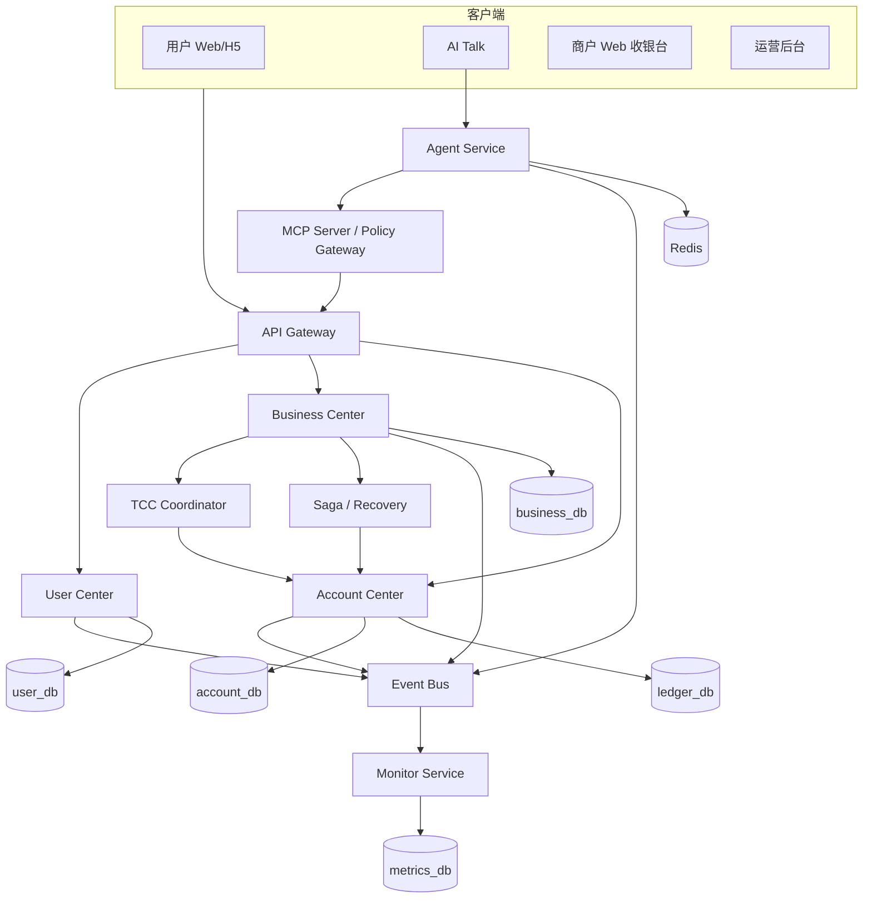
```mermaid
flowchart TB
    subgraph Client[客户端]
      CWeb[用户 Web/H5]
      Talk[AI Talk]
      Cashier[商户 Web 收银台]
      Ops[运营后台]
    end

    Client --> GW[API Gateway]
    Talk --> Agent[Agent Service]
    Agent --> MCP[MCP Server / Policy Gateway]
    MCP --> GW

    GW --> UC[User Center]
    GW --> BC[Business Center]
    GW --> AC[Account Center]

    BC --> TC[TCC Coordinator]
    TC --> AC
    BC --> Saga[Saga / Recovery]
    Saga --> AC

    UC --> Event[Event Bus]
    BC --> Event
    AC --> Event
    Agent --> Event
    Event --> Monitor[Monitor Service]

    UC --> UDB[(user_db)]
    BC --> BDB[(business_db)]
    AC --> ADB[(account_db)]
    AC --> LDB[(ledger_db)]
    Agent --> Redis[(Redis)]
    Monitor --> MDB[(metrics_db)]
```

### 7.2 关键架构决策

| 决策 | 选择 | 原因 |
|---|---|---|
| 资金核心 | 统一交易模型 | 四类业务共享幂等、风控、TCC、终态发布、账本和恢复 |
| 分布式事务 | TCC 主路径 + Saga 异常恢复 | 确定性强，便于展示 Try/Confirm/Cancel 和补偿 |
| 账本 | 不可变复式账本 | 可审计、可冲正、可对账，避免直接改余额 |
| AI 权限 | Agent 无资金权限 | 模型只理解/编排，策略网关和交易服务持有执行权 |
| 确认 | 一次性确认令牌 | 绑定用户、双方、金额、订单哈希和有效期，防篡改/重放 |
| 扫码 | Web 二维码 + 手机 H5 | 无小程序资质依赖，复用现有安全与交易核心 |
| C2C 收款 | 独立个人码/固定请求聚合 + `TRANSFER` | 与商户码隔离，长期码可复用，固定请求以 CAS 仲裁多尝试 |
| Mini 花呗 | 账户中心信用子域 | 额度不是余额；支付生成应收，还款消减应收并恢复额度 |
| 监控数据 | 事件驱动 | 实时/离线统一来源，禁止报表直连业务 DB |
| MVP 拆分 | 有限部署单元 | 保持领域边界，同时控制两周集成成本 |

### 7.3 架构不变量

1. 任何 `SUCCESS` 资金交易必须存在借贷平衡分录。
2. 同一 `source_type + source_order_id` 最多存在一笔资金交易；商户扫码即使切换余额/信用资金来源也只能成功一次。
3. 任何资金执行必须持有未过期、未消费且字段完全匹配的确认令牌。
4. AI、前端、运营后台都不能直接修改余额或账本。
5. 交易状态未确定时只能展示处理中、补偿中或人工确认，不能提前显示成功。
6. 四类业务都进入交易、账本、Trace 和对账；C2C 统一记为 `TRANSFER`，只按 `source_type` 拆渠道且不得重复统计金额。
7. 原始账本、审计、告警和人工处置记录不可物理删除。
8. 只有终态发布器验证全局事务、全部 TCC 分支、余额版本和账本凭证后，才能原子发布 `SUCCESS`。
9. 资金事实与关键事件使用本地事务 Outbox 同步提交，监控消费者使用 Inbox 去重，禁止提交数据库后直接“尽力而为”发送事件。
10. C2C 付款账户来自登录会话、收款账户来自个人码/请求服务端事实；客户端不得提交或覆盖任一账户。
11. 长期个人码每用户最多一个 `ACTIVE`，换码原子撤销旧码；每次支付创建独立 `CollectionOrder`，允许并发多笔成功。
12. 固定请求金额和备注创建后不可变且不绑定付款人；可有多个付款尝试，但 `active_order_id` 保证同时最多一笔处理中、最终最多一笔成功。
13. 固定请求只有在 TCC 完整 Cancel 且终态发布器验证余额、冻结、账本全部恢复后才可回到 `OPEN`；未知结果必须保持 `PROCESSING`/`MANUAL_REVIEW`。
14. Mini 花呗只允许商户 `CREDIT_PAY`，禁止转账、C2C、提现或以信用偿还信用；额度不计入虚拟余额。
15. 信用不变量为 `总额度 = 可用额度 + 已用额度 + 冻结额度`，且 `已用额度 = 信用应收余额 = 未出账剩余 + 账单剩余应还`。

### 7.4 UML 组件图

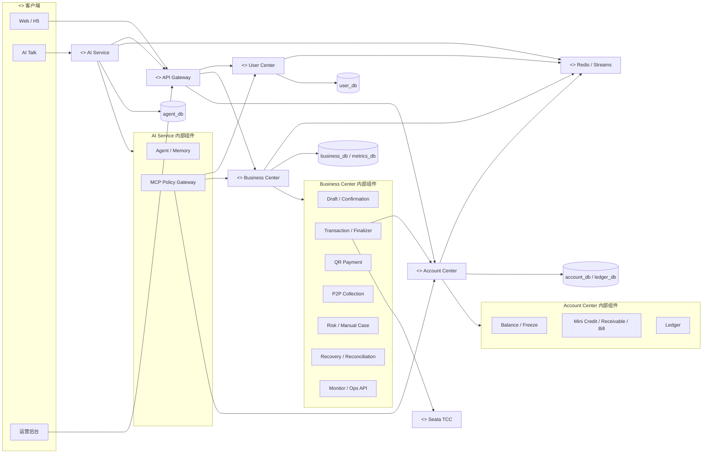
```mermaid
flowchart LR
    subgraph Clients["<<client>> 客户端"]
      Web["Web / H5"]
      Talk["AI Talk"]
      Ops["运营后台"]
    end

    GW["<<component>> API Gateway"]
    UC["<<component>> User Center"]
    BC["<<component>> Business Center"]
    AC["<<component>> Account Center"]
    AI["<<component>> AI Service"]

    subgraph BizModules["Business Center 内部组件"]
      Draft["Draft / Confirmation"]
      Tx["Transaction / Finalizer"]
      QR["QR Payment"]
      P2P["P2P Collection"]
      Risk["Risk / Manual Case"]
      Recover["Recovery / Reconciliation"]
      Monitor["Monitor / Ops API"]
    end

    subgraph AccountModules["Account Center 内部组件"]
      Balance["Balance / Freeze"]
      Credit["Mini Credit / Receivable / Bill"]
      Ledger["Ledger"]
    end

    subgraph AiModules["AI Service 内部组件"]
      Agent["Agent / Memory"]
      MCP["MCP Policy Gateway"]
    end

    Web --> GW
    Ops --> GW
    Talk --> AI
    AI --> GW
    GW --> UC
    GW --> BC
    GW --> AC
    BC --> BizModules
    AC --> AccountModules
    AI --> AiModules
    MCP --> UC
    MCP --> BC
    MCP --> AC
    Tx --> AC
    Tx --> Seata["<<infrastructure>> Seata TCC"]
    UC --> Redis["<<infrastructure>> Redis / Streams"]
    BC --> Redis
    AC --> Redis
    AI --> Redis
    UC --> UserDB[(user_db)]
    BC --> BizDB[(business_db / metrics_db)]
    AC --> AccountDB[(account_db / ledger_db)]
    AI --> AgentDB[(agent_db)]
```

组件依赖规则：客户端只能经网关访问业务 API；AI 高风险工具只能经 MCP 策略网关调用；业务中心不直接写账户或账本表；监控模块只消费事件与 Trace，不跨库扫描资金表。

### 7.5 技术选型与架构模式决策

#### 7.5.1 架构模式结论

本项目采用 **逻辑微服务、MVP 有限合并部署**，不是传统单体，也不是两周内把每个模块拆成独立进程的完整微服务集群。

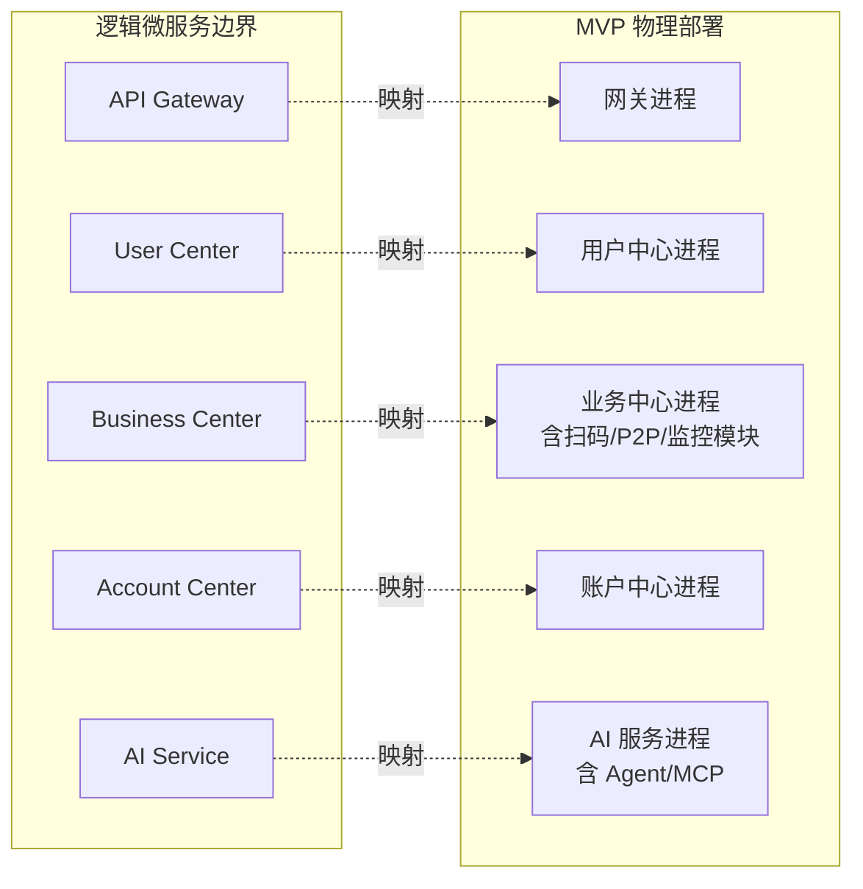
```mermaid
flowchart LR
    subgraph Logical[逻辑微服务边界]
      GW[API Gateway]
      UC[User Center]
      BC[Business Center]
      AC[Account Center]
      AI[AI Service]
    end
    subgraph Physical[MVP 物理部署]
      P1[网关进程]
      P2[用户中心进程]
      P3[业务中心进程\n含扫码/P2P/监控模块]
      P4[账户中心进程]
      P5[AI 服务进程\n含 Agent/MCP]
    end
    GW -.映射.-> P1
    UC -.映射.-> P2
    BC -.映射.-> P3
    AC -.映射.-> P4
    AI -.映射.-> P5
```

| 方案 | 优点 | 不足 | 本项目结论 |
|---|---|---|---|
| 单体架构 | 开发和部署简单，联调成本低 | 领域边界弱，无法真实演示跨服务 TCC、服务数据所有权和独立扩展 | 不采用作为逻辑架构 |
| 完整微服务 | 服务边界清晰，可独立扩缩容 | 需要服务治理、配置、部署、联调和故障处理，超出两周交付能力 | 不采用作为 MVP 物理拆分 |
| 逻辑微服务 + 合并部署 | 保留领域、数据库和 API 边界，降低进程数量，后续可拆分 | 进程内部模块仍需严格禁止跨域直写 | **采用** |

#### 7.5.2 MVP 技术基线

| 层次 | 选型 | 用途与约束 |
|---|---|---|
| 开发语言 | Java 21 | 统一后端运行时，使用强类型 DTO、金额 `long` 分和不可变命令对象 |
| Web 框架 | Spring Boot 3.x | 用户、业务、账户和 AI 服务；每个逻辑服务独立包和配置 |
| 服务治理 | Spring Cloud Gateway + OpenFeign/HTTP Client | 网关路由、认证、限流、服务间契约调用；MVP 不引入复杂服务网格 |
| 数据访问 | MyBatis-Plus 或 Spring JDBC + Flyway | 参数化 SQL、显式版本 CAS、迁移可回滚；禁止手写字符串拼接 SQL |
| 主数据库 | MySQL 8.0/InnoDB | 业务事实、账户、账本和信用数据；MVP 单实例多 Schema，保留服务数据所有权 |
| 缓存/短期状态 | Redis 7 | 会话、限流、只读缓存、短期 H5 会话；不保存资金唯一事实 |
| 事件总线 | Redis Streams | Outbox 投递、SSE 投影、监控和离线消费；消费者使用 Inbox 去重 |
| 分布式事务 | Seata TCC | `Try/Confirm/Cancel` 资金分支、分支屏障、超时恢复；Saga 处理异常补偿 |
| AI | Spring AI + MCP Server | Agent 会话、工具 Schema、策略网关；高风险工具必须有可信确认上下文 |
| 前端 | React + TypeScript；B/C 端分别按 7.6 约束实现 | B 端运营与商户 Web、C 端独立 H5；按路由拆包，禁止使用 Vue |
| 观测 | Micrometer/OpenTelemetry + Collector + Prometheus + Tempo + Grafana | 指标、Trace、日志关联、实时看板和告警 |
| 部署 | Docker Compose + Nginx | 两周演示环境；服务、MySQL、Redis、OTel 组件可一键启动，后续迁移 Kubernetes |

#### 7.5.3 数据库与服务器部署

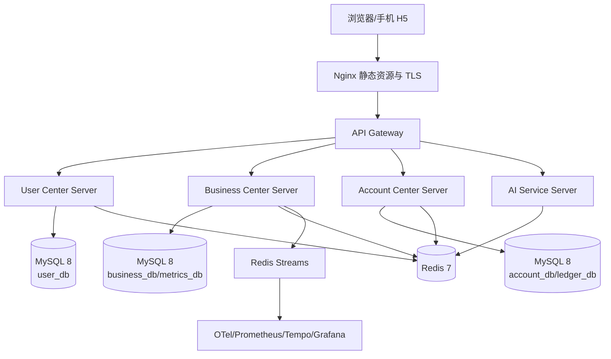
```mermaid
flowchart TB
    Internet[浏览器/手机 H5] --> Nginx[Nginx 静态资源与 TLS]
    Nginx --> GW[API Gateway]
    GW --> S1[User Center Server]
    GW --> S2[Business Center Server]
    GW --> S3[Account Center Server]
    GW --> S4[AI Service Server]
    S1 --> DB[(MySQL 8\nuser_db)]
    S2 --> DB2[(MySQL 8\nbusiness_db/metrics_db)]
    S3 --> DB3[(MySQL 8\naccount_db/ledger_db)]
    S4 --> Redis[(Redis 7)]
    S1 --> Redis
    S2 --> Redis
    S3 --> Redis
    S2 --> Streams[Redis Streams]
    Streams --> OTel[OTel/Prometheus/Tempo/Grafana]
```

MVP 可以让多个 Schema 位于同一个 MySQL 实例，但服务只能访问自己拥有的 Schema；生产扩展时按 `user_db`、`business_db`、`account_db/ledger_db` 拆成独立实例。账户按 `account_id` 路由到唯一写分片，读副本只用于非资金查询，不能以读副本或 Redis 判断余额。

### 7.6 B/C 端前端技术与工程约束

#### 7.6.1 端侧技术栈

| 端 | 技术栈 | 关键约束 |
|---|---|---|
| B 端 Web | React + TypeScript；Umi、Vite | 不使用 Vue；面向商户、运营、风控和数据监控后台 |
| B 端请求与数据 | Umi `request`、TanStack Query、Axios | `request` 为标准 API 客户端；Query 管理服务端状态、缓存、重试和失效；Axios 仅用于第三方、文件/二进制或流式特殊场景 |
| B 端组件与可视化 | Ant Design、AntV | 表格、表单、权限菜单、监控大盘和趋势图统一使用既定组件/图表库 |
| B 端工具与路由 | Lodash、Day.js、Moment、aHooks；React Router 或 Umi 路由 | Umi 应用优先使用 Umi 路由；仅独立非 Umi 模块使用 React Router；同一应用不得存在两个路由权威 |
| B 端状态与样式 | Zustand；CSS、Less | Zustand 只保存登录态、权限、筛选条件等客户端状态，不复制资金服务端事实 |
| C 端 H5 | React + TypeScript；独立 Umi H5 工程、Vite 构建 | 不使用 Vue；独立浏览器 H5 构建产物，不内嵌 App，不开发支付宝小程序 |
| C 端请求与数据 | Umi `request`、TanStack Query、Axios | 与 B 端职责规则一致；支付状态查询必须以服务端状态为准 |
| C 端组件与可视化 | Ant Design Mobile、AntV F2 | 移动端表单、确认页、账单和轻量数据图表采用移动组件和 F2 |
| C 端工具、路由、状态 | Lodash、Day.js、aHooks；React Router 或 Umi 路由；Zustand | 统一会话、扫码订单、转账草稿和 AI 会话的客户端状态边界 |
| C 端样式与适配 | CSS、Less、CSS Modules | 移动端响应式布局、触控交互、安全区和主流浏览器兼容必须纳入验收 |

#### 7.6.2 前端依赖职责与实现边界

1. Umi 提供构建、运行时配置、约定式路由和部署入口；Vite 负责开发服务器与生产构建能力。若使用 Umi 路由，页面不得再注册一套平行路由表。
2. API 服务层集中放在 `src/services`，统一注入 `Authorization`、`X-Request-Id`、幂等键和错误归一化逻辑。组件不得直接拼接 URL 或修改账户金额。
3. TanStack Query 负责用户、订单、交易、账单、告警和监控指标等服务端数据；成功/失败状态通过失效和重新查询更新，禁止用 Zustand 复制余额、账本或交易终态。
4. Zustand 负责跨页面客户端状态，例如登录用户摘要、端侧主题、筛选器、扫码会话和 AI 对话草稿；刷新后需恢复的状态使用受控持久化并排除敏感令牌。
5. Day.js 为日期处理首选；Moment 仅用于遗留接口或兼容性适配，不得在新模块混用两套时区和格式化规则。金额统一使用后端返回的分值和格式化函数。
6. 交易确认、支付密码、二维码原始令牌、`confirmationToken` 等敏感值不得写入 URL、日志、埋点、Query 持久化缓存或 AI 消息。

#### 7.6.3 Umi 工程目录基线

B 端与 C 端 H5 分别建立 `frontend-admin` 和 `frontend-h5` 两个独立 Umi 工程，分别安装依赖、构建、部署和维护路由。两端仅通过 Monorepo 的 `contracts` 共享 OpenAPI 类型、错误码和无副作用工具；不得共享路由、Layout、页面级 Zustand Store、全局样式或依赖端侧环境的业务组件。

```text
frontend-admin/ 或 frontend-h5/
├── config/
│   ├── config.ts
│   └── routes.ts
├── mock/
│   └── afs2demo/
├── public/
├── src/
├── test/
├── docs/
├── .husky/
├── .vscode/
├── .claude/
├── CLAUDE.md
├── package.json
├── tsconfig.json
├── .eslintrc.js
├── .prettierrc.js
├── .stylelintrc.js
├── .editorconfig
└── README.md
```

```text
src/
├── access.ts
├── app.tsx
├── type.d.ts
├── overrides.css
├── assets/
├── components/                   # 当前端专属组件
├── constants/
├── hooks/
├── icons/
├── layouts/                      # B 端或 H5 专属布局
├── models/                       # 当前端客户端状态
├── pages/                        # 当前端页面
├── services/
├── typings/
└── utils/
```

两个工程均启用路由级懒加载；C 端 H5 不得下载 B 端大盘和完整 AntV 桌面图表代码。B 端路由以 `/admin/**` 为前缀，C 端路由以 `/h5/**` 为前缀。

```typescript
// frontend-admin/config/routes.ts
export default [
  { path: '/admin/dashboard', component: '@/pages/Dashboard' },
  { path: '/admin/transactions', component: '@/pages/Transactions' },
];

// frontend-h5/config/routes.ts
export const h5Routes = [
  { path: '/h5/home', component: '@/pages/Home' },
  { path: '/h5/transfer', component: '@/pages/Transfer' },
  { path: '/h5/qr-pay/:token', component: '@/pages/QrPay' },
];
```

两个工程分别使用 Ant Design 与 Ant Design Mobile，不共享全局样式。B 端权限仍由后端 RBAC 和对象级授权控制，不能依赖隐藏菜单或 `/admin` 路径实现安全隔离。

#### 7.6.4 MiniAlalipay 页面映射

| 端 | 页面模块 | 主要职责 |
|---|---|---|
| B 端 | `Dashboard`、`Users`、`Transactions` | 全平台脱敏运营概览、用户审计、交易查询与回执 |
| B 端 | `ManualCases`、`Alerts`、`DataQuality`、`Trace` | 人工确认、告警处置、离线质量、链路追溯 |
| C 端 H5 | `Login`、`Home`、`Transfer`、`Collection` | 登录、余额摘要、C2C 转账、个人收款码/收款请求 |
| C 端 H5 | `QrPay`、`AITalk`、`Credit`、`Bills`、`Receipt` | 扫码支付确认、AI 助理、Mini 花呗、账单和支付结果 |
| 商户 C 端 Web | `MerchantCashier`、`MerchantAnalytics`、`MerchantOrders` | 创建动态收款码、查看本人订单、收款趋势、退款和对账摘要 |

页面只负责交互和展示，所有资金扣减、信用额度变更、订单终态和资金不变的模拟支付结果均由服务端状态机与查询接口决定。

#### 7.6.5 用户与商户统计边界

- 普通用户统计按个人账户归属生成，只包含本人成功交易及账本投影；模拟充值属于资金流入而非收入，Mini 花呗还款属于偿债而非重复消费。
- 商户经营统计按 `merchant_account_id` 隔离，只统计本人商户的 `SUCCESS QR_PAY/CREDIT_PAY`，退款冲减净收款；失败、处理中、补偿中和人工处理订单不计入成功金额。
- 同一自然人同时拥有个人账户和商户账户时分别统计，不得合并为一个资产或经营口径。
- B 端只查看全平台聚合、脱敏运营与异常数据，不复用普通用户或商户的本人统计权限。

### 7.7 单仓库与后端模块包结构基线

#### 7.7.1 模块划分原则

项目采用 Monorepo：前端、后端、接口契约、跨系统测试、部署配置和文档位于同一个 Git 仓库，但保持独立构建和依赖边界。后端采用 Maven 多模块工程，以限界上下文定义代码、数据和接口边界。MVP 保留 `gateway`、`user-center`、`business-center`、`account-center` 和 `ai-service` 五个可部署单元；`business-center` 内部合并 P2P Collection、风控、监控投影和运营能力，`account-center` 内部合并余额、账本与 Mini 花呗。

```text
minialalipay/
├── backend/
│   ├── pom.xml                          # 父 POM：Java 21、依赖版本、质量插件
│   ├── platform-common/                 # 仅技术性公共能力
│   ├── gateway/
│   ├── user-center/
│   ├── business-center/
│   ├── account-center/
│   └── ai-service/
├── frontend-admin/                      # B 端独立 React + TypeScript + Umi 工程
├── frontend-h5/                         # C 端独立 React + TypeScript + Umi H5 工程
├── contracts/
│   ├── openapi/                         # REST/SSE 接口契约及生成配置
│   ├── events/                          # 可靠事件 Schema
│   └── error-codes/                     # 前后端统一错误码字典
├── tests/
│   ├── api/                             # 跨服务接口测试
│   ├── e2e/                             # B/C 端端到端测试
│   ├── performance/                     # 容量与并发测试
│   └── fault-injection/                 # TCC、网络、事件故障测试
├── deploy/
│   ├── docker-compose.yml
│   ├── nginx/
│   ├── mysql/
│   ├── seata/
│   └── otel/
├── docs/                                # PRD、系分、数据库、API 和运行手册
├── .github/workflows/                   # 或等价 CI 配置
├── .husky/
├── .editorconfig
├── .gitignore
└── README.md
```

`backend` 与 `frontend` 分别使用 Maven 和 Node/Umi 独立构建，任何一方不得成为另一方的编译依赖；二者只通过 `contracts/openapi` 中的版本化 HTTP 契约交互。根目录 Docker Compose 负责组合运行，不改变服务的数据所有权。`platform-common` 只允许包含异常基类、Trace 上下文、时间/ID 工具、统一序列化配置和测试工具；禁止放入 `User`、`Account`、`Transaction`、`Money` 等领域模型。

| Maven 模块 | 限界上下文 | 主要职责 | 数据所有权 | 部署单元 |
|---|---|---|---|---|
| `gateway` | 接入上下文 | TLS、认证转发、限流、CORS、Trace 与安全头 | 无业务表 | `gateway` |
| `user-center` | 用户上下文 | 注册、身份、登录/支付凭证、联系人 | `user_db` | `user-center` |
| `business-center` | 业务上下文 | 草稿、交易、商户扫码、个人收款、风控、工单、对账编排、监控投影 | `business_db`、`metrics_db` | `business-center` |
| `account-center` | 账户/账本/信用上下文 | 余额、冻结、TCC、借贷分录、额度、账单和还款 | `account_db`、`ledger_db` | `account-center` |
| `ai-service` | AI Agent 上下文 | 会话、记忆、工具路由、MCP 策略与调用留痕 | `agent_db`、受控 Redis Key | `ai-service` |

#### 7.7.2 单个服务的标准包结构

每个中心遵循 `interfaces -> application -> domain <- infrastructure` 的依赖方向。领域层不依赖 Spring MVC、MyBatis、Feign、Redis 或 Controller；基础设施层实现领域定义的仓储和外部能力端口。

```text
<service>/src/main/java/com/minialalipay/<context>/
├── <Context>Application.java             # Spring Boot 启动类
├── interfaces/                           # 入站适配器
│   ├── web/                              # 对外 REST/SSE Controller、请求/响应 DTO
│   ├── internal/                         # 受服务鉴权保护的内部 TCC/查询接口
│   ├── messaging/                        # 事件消费者、消息 DTO 适配
│   └── scheduler/                        # 超时恢复、对账、离线任务触发器
├── application/                          # 用例编排，不保存领域状态
│   ├── command/                          # Command 与 CommandHandler
│   ├── query/                            # Query Service、只读 DTO/Projection
│   ├── service/                          # Application Service、事务边界
│   └── port/                             # 外部上下文调用端口
├── domain/                               # 业务规则与一致性边界
│   ├── model/                            # 聚合根、实体、值对象、枚举
│   ├── service/                          # 领域服务
│   ├── repository/                       # 仓储接口
│   ├── event/                            # 领域事件
│   └── policy/                           # 风控/状态迁移等可替换规则
└── infrastructure/                       # 出站适配器
    ├── persistence/                      # MyBatis Mapper、PO、仓储实现、Flyway
    ├── client/                           # HTTP/Feign 客户端、OpenAPI 适配
    ├── messaging/                        # Outbox、Redis Streams、Inbox 实现
    ├── cache/                            # Redis 缓存与分布式限流实现
    └── config/                           # Spring、Seata、OTel、序列化配置
```

`interfaces.web` 只接受/返回 API DTO，不能返回聚合根或持久化 PO；`application.query` 可以直接使用只读 SQL/投影生成页面 DTO，不要求加载完整聚合；任何会改变资金事实的命令必须经 `application.service` 调用聚合根和本地事务。

#### 7.7.3 各中心业务包

```text
user-center/domain/
├── user/                 # User：注册、状态、资料
├── identity/             # 登录凭证、支付密码、会话身份
└── contact/              # Contact：联系人与搜索索引

business-center/domain/
├── transfer/             # TransferDraft、Transaction、确认状态机
├── qrpay/                # QrPayOrder、扫码 H5 会话引用
├── collection/           # PersonalCollectionCode、CollectionRequest、CollectionOrder
├── risk/                 # RiskDecision、人工确认策略
├── manualcase/           # 人工工单与处置记录
├── reconciliation/       # 交易/账本对账编排与差异单
└── monitoring/           # 指标定义、告警、数据质量聚合

account-center/domain/
├── account/              # Account、AccountBalance、余额冻结/入账
├── tcc/                  # BranchReservation、Try/Confirm/Cancel 屏障
├── ledger/               # LedgerVoucher、LedgerEntry、复式记账
├── credit/               # CreditAccount、CreditReceivable、额度占用
├── bill/                 # CreditBill、CreditBillItem
└── repayment/            # CreditRepayment、还款分配

ai-service/domain/
├── agent/                # AgentSession、Message、上下文摘要
├── memory/               # 可授权的跨会话记忆
├── tool/                 # 工具 Schema、调用记录和结果摘要
├── mcp/                  # MCP 工具目录与协议适配
└── policy/               # 高风险工具确认、脱敏和注入防护
```

领域模型按聚合分包。例如 `account/` 内的 `Account` 是余额变更唯一入口，`ledger/` 内的 `LedgerVoucher` 是凭证与分录写入入口；`business-center` 不能导入这些类或其 Mapper，只能调用账户中心公开契约。

#### 7.7.4 跨模块依赖与契约

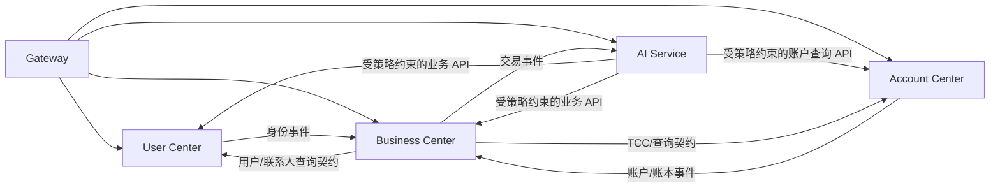
```mermaid
flowchart LR
    G[Gateway] --> U[User Center]
    G --> B[Business Center]
    G --> A[Account Center]
    G --> AI[AI Service]
    AI -->|受策略约束的业务 API| U
    AI -->|受策略约束的业务 API| B
    AI -->|受策略约束的账户查询 API| A
    B -->|TCC/查询契约| A
    B -->|用户/联系人查询契约| U
    U -->|身份事件| B
    A -->|账户/账本事件| B
    B -->|交易事件| AI
```

跨中心交互规则：

1. 同步交互使用版本化 OpenAPI/HTTP 契约；契约 DTO 放在接口模块或由 OpenAPI 生成，禁止共享领域实体、PO、Mapper 和 Repository。
2. 异步交互使用 Outbox + Redis Streams + Inbox，事件只表达已发生事实；事件消费者不得反向修改事件生产方的表。
3. `business-center` 发起资金全局事务，`account-center` 作为 TCC 分支参与者；任何中心不得以 Redis 缓存作为资金事实或分支提交依据。
4. 同进程模块仍通过 Application Service 接口访问；只有同一聚合内部允许通过仓储在一个本地事务中修改其拥有的表。
5. 包依赖由 ArchUnit 门禁检查：`domain` 不依赖 `interfaces/infrastructure`，非账户模块不得依赖 `..account..persistence..`，非账本模块不得依赖 `..ledger..persistence..`。

#### 7.7.5 测试模块与交付边界

```text
<service>/src/test/java/com/minialalipay/<context>/
├── domain/                # 聚合不变量、状态机、金额和版本 CAS 单元测试
├── application/           # 用例、幂等、权限、失败补偿集成测试
├── infrastructure/        # MySQL/Redis/Outbox/TCC Testcontainers 测试
├── interfaces/            # REST、SSE、OpenAPI 契约测试
└── architecture/          # ArchUnit 包依赖和禁止跨上下文访问测试
```

资金 P0 交付以 `business-center` 与 `account-center` 的集成测试为边界：必须验证 TCC 重试、空回滚、悬挂、重复提交、账本平衡和最终状态发布。前端仅通过 OpenAPI/Mock Server 联调，不能直接访问服务数据库。

## 8. 领域模型分析

### 8.1 限界上下文

| 上下文 | 聚合根 | 负责规则 |
|---|---|---|
| Identity | User | 用户唯一性、角色、凭证和锁定 |
| Contact | Contact | 用户可见收款人和别名 |
| Account | Account | 账户状态、余额版本和冻结 |
| Ledger | LedgerVoucher | 借贷平衡、不可变分录和冲正 |
| Transfer Draft | TransferDraft | 双端共享、版本冲突和过期 |
| Transaction | Transaction | 幂等、业务类型和交易状态 |
| QR Payment | QrPayOrder | 动态码、扫码会话、订单 CAS 和源订单唯一性 |
| P2P Collection | PersonalCollectionCode/CollectionRequest/CollectionOrder | 长期码生命周期、固定请求多尝试仲裁、跨端状态投影 |
| Mini Credit | CreditAccount/CreditReceivable/CreditBill/CreditRepayment | 固定额度、应收、出账、逾期暂停和余额还款 |
| Risk | RiskDecision | 规则命中、动作和主体关联 |
| Manual Case | ManualCase | 前置风控和事务恢复处置 |
| Agent | AgentSession | 上下文、槽位、摘要和工具调用 |
| Observability | MonitorAlert/MetricDefinition | 告警状态、指标口径和质量门禁 |

### 8.2 领域关系

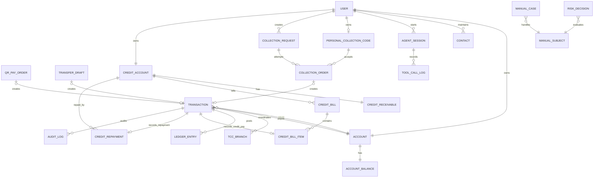
```mermaid
erDiagram
    USER ||--|| ACCOUNT : owns
    USER ||--o{ CONTACT : maintains
    USER ||--o{ AGENT_SESSION : starts
    ACCOUNT ||--|| ACCOUNT_BALANCE : has
    TRANSACTION }o--|| ACCOUNT : payer
    TRANSACTION }o--|| ACCOUNT : payee
    TRANSACTION ||--o{ TCC_BRANCH : coordinates
    TRANSACTION ||--o{ LEDGER_ENTRY : posts
    QR_PAY_ORDER o|--o| TRANSACTION : creates
    TRANSFER_DRAFT o|--o| TRANSACTION : creates
    USER ||--o| PERSONAL_COLLECTION_CODE : owns
    USER ||--o{ COLLECTION_REQUEST : creates
    PERSONAL_COLLECTION_CODE ||--o{ COLLECTION_ORDER : accepts
    COLLECTION_REQUEST ||--o{ COLLECTION_ORDER : attempts
    COLLECTION_ORDER o|--o| TRANSACTION : creates
    USER ||--|| CREDIT_ACCOUNT : owns
    CREDIT_ACCOUNT ||--|| CREDIT_RECEIVABLE : has
    CREDIT_ACCOUNT ||--o{ CREDIT_BILL : bills
    CREDIT_BILL ||--o{ CREDIT_BILL_ITEM : contains
    CREDIT_ACCOUNT ||--o{ CREDIT_REPAYMENT : repaid_by
    TRANSACTION ||--o| CREDIT_BILL_ITEM : records_credit_pay
    TRANSACTION ||--o| CREDIT_REPAYMENT : records_repayment
    RISK_DECISION }o--|| MANUAL_SUBJECT : evaluates
    MANUAL_CASE }o--|| MANUAL_SUBJECT : handles
    AGENT_SESSION ||--o{ TOOL_CALL_LOG : records
    TRANSACTION ||--o{ AUDIT_LOG : audits
```

`MANUAL_SUBJECT` 是逻辑多态关联，通过 `subject_type + subject_id` 指向草稿、商户扫码订单、个人收款订单、固定请求或交易，不是单独数据库表。`CollectionRequest` 与 `CollectionOrder` 是一对多尝试关系；只有 `active_order_id` 指向的订单可以进入资金处理。

### 8.3 聚合边界原则

- 一个聚合内使用本地事务和乐观锁；跨聚合/服务使用 TCC、Saga 或事件。
- `AccountBalance` 只能由账户中心领域服务修改。
- `LedgerEntry` 创建后不可更新或删除；修复通过新冲正凭证完成。
- `QrPayOrder` 负责扫码交互状态，进入 `PROCESSING` 后资金状态以 `Transaction` 为准。
- `PersonalCollectionCode` 是可复用公开入口，不承载金额或交易终态；每次扫码付款都创建独立 `CollectionOrder`。
- `CollectionRequest` 保存不可变金额/备注与请求级仲裁，`CollectionOrder` 保存单次付款尝试；不得把多个尝试合并为一笔交易。
- `CreditAccount` 的额度字段只能由信用领域服务修改；账单汇总不得反向改写已确认的信用消费事实。
- `Confirmation` 是短期授权凭证，不是支付结果，也不能重复消费。

### 8.4 UML 核心领域类图

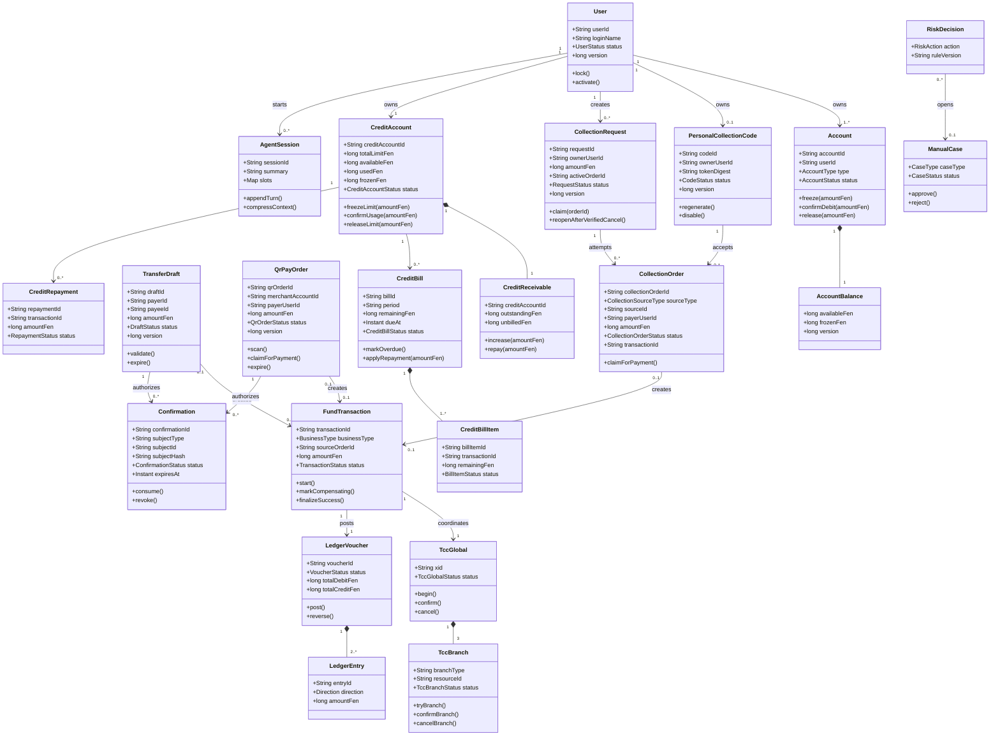
```mermaid
classDiagram
    class User {
      +String userId
      +String loginName
      +UserStatus status
      +long version
      +lock()
      +activate()
    }
    class Account {
      +String accountId
      +String userId
      +AccountType type
      +AccountStatus status
      +freeze(amountFen)
      +confirmDebit(amountFen)
      +release(amountFen)
    }
    class AccountBalance {
      +long availableFen
      +long frozenFen
      +long version
    }
    class TransferDraft {
      +String draftId
      +String payerId
      +String payeeId
      +long amountFen
      +DraftStatus status
      +long version
      +validate()
      +expire()
    }
    class QrPayOrder {
      +String qrOrderId
      +String merchantAccountId
      +String payerUserId
      +long amountFen
      +QrOrderStatus status
      +long version
      +scan()
      +claimForPayment()
      +expire()
    }
    class PersonalCollectionCode {
      +String codeId
      +String ownerUserId
      +String tokenDigest
      +CodeStatus status
      +long version
      +regenerate()
      +disable()
    }
    class CollectionRequest {
      +String requestId
      +String ownerUserId
      +long amountFen
      +String activeOrderId
      +RequestStatus status
      +long version
      +claim(orderId)
      +reopenAfterVerifiedCancel()
    }
    class CollectionOrder {
      +String collectionOrderId
      +CollectionSourceType sourceType
      +String sourceId
      +String payerUserId
      +long amountFen
      +CollectionOrderStatus status
      +String transactionId
      +claimForPayment()
    }
    class CreditAccount {
      +String creditAccountId
      +long totalLimitFen
      +long availableFen
      +long usedFen
      +long frozenFen
      +CreditAccountStatus status
      +freezeLimit(amountFen)
      +confirmUsage(amountFen)
      +releaseLimit(amountFen)
    }
    class CreditReceivable {
      +String creditAccountId
      +long outstandingFen
      +long unbilledFen
      +increase(amountFen)
      +repay(amountFen)
    }
    class CreditBill {
      +String billId
      +String period
      +long remainingFen
      +Instant dueAt
      +CreditBillStatus status
      +markOverdue()
      +applyRepayment(amountFen)
    }
    class CreditBillItem {
      +String billItemId
      +String transactionId
      +long remainingFen
      +BillItemStatus status
    }
    class CreditRepayment {
      +String repaymentId
      +String transactionId
      +long amountFen
      +RepaymentStatus status
    }
    class Confirmation {
      +String confirmationId
      +String subjectType
      +String subjectId
      +String subjectHash
      +ConfirmationStatus status
      +Instant expiresAt
      +consume()
      +revoke()
    }
    class FundTransaction {
      +String transactionId
      +BusinessType businessType
      +String sourceOrderId
      +long amountFen
      +TransactionStatus status
      +start()
      +markCompensating()
      +finalizeSuccess()
    }
    class TccGlobal {
      +String xid
      +TccGlobalStatus status
      +begin()
      +confirm()
      +cancel()
    }
    class TccBranch {
      +String branchType
      +String resourceId
      +TccBranchStatus status
      +tryBranch()
      +confirmBranch()
      +cancelBranch()
    }
    class LedgerVoucher {
      +String voucherId
      +VoucherStatus status
      +long totalDebitFen
      +long totalCreditFen
      +post()
      +reverse()
    }
    class LedgerEntry {
      +String entryId
      +Direction direction
      +long amountFen
    }
    class RiskDecision {
      +RiskAction action
      +String ruleVersion
    }
    class ManualCase {
      +CaseType caseType
      +CaseStatus status
      +approve()
      +reject()
    }
    class AgentSession {
      +String sessionId
      +String summary
      +Map slots
      +appendTurn()
      +compressContext()
    }

    User "1" --> "1..*" Account : owns
    Account "1" *-- "1" AccountBalance
    TransferDraft "0..1" --> "0..1" FundTransaction : creates
    QrPayOrder "0..1" --> "0..1" FundTransaction : creates
    User "1" --> "0..1" PersonalCollectionCode : owns
    User "1" --> "0..*" CollectionRequest : creates
    PersonalCollectionCode "1" --> "0..*" CollectionOrder : accepts
    CollectionRequest "1" --> "0..*" CollectionOrder : attempts
    CollectionOrder "0..1" --> "0..1" FundTransaction : creates
    User "1" --> "1" CreditAccount : owns
    CreditAccount "1" *-- "1" CreditReceivable
    CreditAccount "1" --> "0..*" CreditBill
    CreditBill "1" *-- "1..*" CreditBillItem
    CreditAccount "1" --> "0..*" CreditRepayment
    TransferDraft "1" --> "0..*" Confirmation : authorizes
    QrPayOrder "1" --> "0..*" Confirmation : authorizes
    FundTransaction "1" --> "1" TccGlobal : coordinates
    TccGlobal "1" *-- "3" TccBranch
    FundTransaction "1" --> "1" LedgerVoucher : posts
    LedgerVoucher "1" *-- "2..*" LedgerEntry
    RiskDecision "0..*" --> "0..1" ManualCase : opens
    User "1" --> "0..*" AgentSession : starts
```

类图表达领域职责而非 ORM 直接映射。跨限界上下文只保存外部 ID，不创建跨服务对象引用；金额值统一使用 `long amountFen`，状态变化必须通过领域方法完成。

## 9. 关键业务流程分析

### 9.1 注册与自动开户

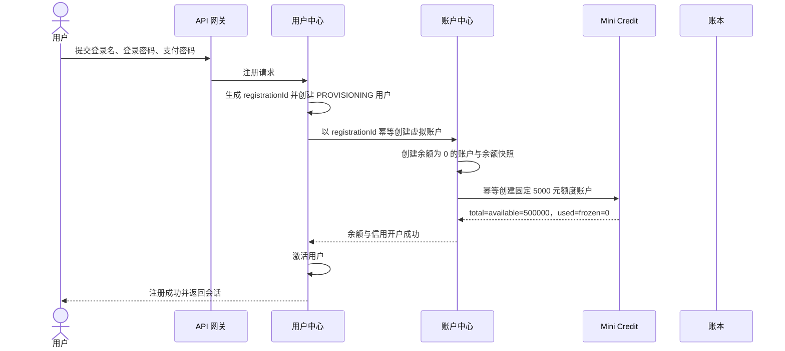
```mermaid
sequenceDiagram
    actor U as 用户
    participant G as API 网关
    participant UC as 用户中心
    participant AC as 账户中心
    participant CR as Mini Credit
    participant L as 账本

    U->>G: 提交登录名、登录密码、支付密码
    G->>UC: 注册请求
    UC->>UC: 生成 registrationId 并创建 PROVISIONING 用户
    UC->>AC: 以 registrationId 幂等创建虚拟账户
    AC->>AC: 创建余额为 0 的账户与余额快照
    AC->>CR: 幂等创建固定 5000 元额度账户
    CR-->>AC: total=available=500000，used=frozen=0
    AC-->>UC: 余额与信用开户成功
    UC->>UC: 激活用户
    UC-->>U: 注册成功并返回会话
```

异常规则：

- 用户创建失败：不调用账户中心。
- 开户失败：用户保持 `PROVISIONING` 并进入可重试/补偿，不得形成可登录但无账户的用户。
- `registrationId` 由用户中心生成并持久化，是账户中心开户和恢复查询的幂等键；账户或信用账户已存在时返回原资源，不重复开户或发放额度。
- 注册不得创建虚拟资金分录；模拟充值使用唯一业务键 `RECHARGE + recharge_order_id`，重复请求不得重复入账。
- 信用开户使用唯一业务键 `CREDIT_ACCOUNT_INIT + user_id`，额度不写入余额或虚拟金初始化凭证；任一步失败时用户保持不可用并由恢复任务接续。

### 9.2 传统转账

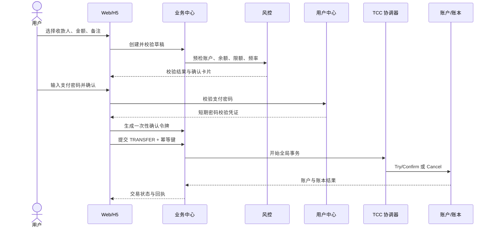
```mermaid
sequenceDiagram
    actor U as 用户
    participant W as Web/H5
    participant B as 业务中心
    participant R as 风控
    participant UC as 用户中心
    participant T as TCC 协调器
    participant A as 账户/账本

    U->>W: 选择收款人、金额、备注
    W->>B: 创建并校验草稿
    B->>R: 预检账户、余额、限额、频率
    R-->>W: 校验结果与确认卡片
    U->>W: 输入支付密码并确认
    W->>UC: 校验支付密码
    UC-->>W: 短期密码校验凭证
    W->>B: 生成一次性确认令牌
    W->>B: 提交 TRANSFER + 幂等键
    B->>T: 开始全局事务
    T->>A: Try/Confirm 或 Cancel
    A-->>B: 账户与账本结果
    B-->>W: 交易状态与回执
```

### 9.3 AI Talk 转账

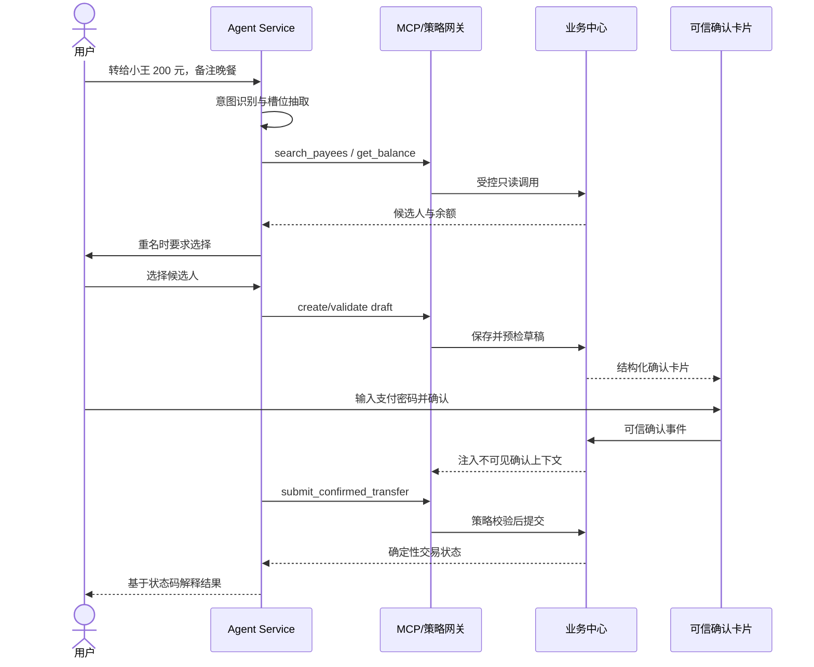
```mermaid
sequenceDiagram
    actor U as 用户
    participant AI as Agent Service
    participant M as MCP/策略网关
    participant B as 业务中心
    participant UI as 可信确认卡片

    U->>AI: 转给小王 200 元，备注晚餐
    AI->>AI: 意图识别与槽位抽取
    AI->>M: search_payees / get_balance
    M->>B: 受控只读调用
    B-->>AI: 候选人与余额
    AI->>U: 重名时要求选择
    U->>AI: 选择候选人
    AI->>M: create/validate draft
    M->>B: 保存并预检草稿
    B-->>UI: 结构化确认卡片
    U->>UI: 输入支付密码并确认
    UI->>B: 可信确认事件
    B-->>M: 注入不可见确认上下文
    AI->>M: submit_confirmed_transfer
    M->>B: 策略校验后提交
    B-->>AI: 确定性交易状态
    AI-->>U: 基于状态码解释结果
```

关键点：支付密码不进入对话；确认句柄不作为模型参数；Agent 不能自行选择重名用户或修改确认字段。

### 9.4 扫码支付

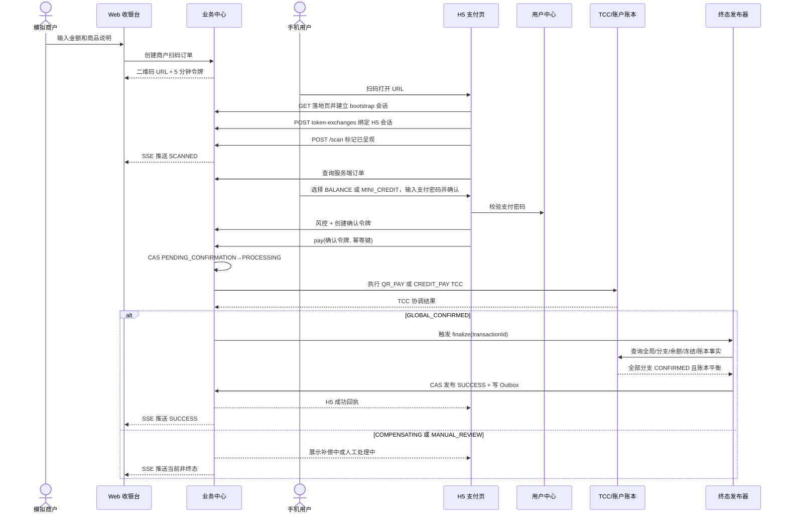
```mermaid
sequenceDiagram
    actor M as 模拟商户
    participant C as Web 收银台
    participant B as 业务中心
    actor U as 手机用户
    participant H as H5 支付页
    participant UC as 用户中心
    participant T as TCC/账户账本
    participant F as 终态发布器

    M->>C: 输入金额和商品说明
    C->>B: 创建商户扫码订单
    B-->>C: 二维码 URL + 5 分钟令牌
    U->>H: 扫码打开 URL
    H->>B: GET 落地页并建立 bootstrap 会话
    H->>B: POST token-exchanges 绑定 H5 会话
    H->>B: POST /scan 标记已呈现
    B-->>C: SSE 推送 SCANNED
    H->>B: 查询服务端订单
    U->>H: 选择 BALANCE 或 MINI_CREDIT，输入支付密码并确认
    H->>UC: 校验支付密码
    H->>B: 风控 + 创建确认令牌
    H->>B: pay(确认令牌, 幂等键)
    B->>B: CAS PENDING_CONFIRMATION→PROCESSING
    B->>T: 执行 QR_PAY 或 CREDIT_PAY TCC
    T-->>B: TCC 协调结果
    alt GLOBAL_CONFIRMED
        B->>F: 触发 finalize(transactionId)
        F->>T: 查询全局/分支/余额/冻结/账本事实
        T-->>F: 全部分支 CONFIRMED 且账本平衡
        F->>B: CAS 发布 SUCCESS + 写 Outbox
        B-->>H: H5 成功回执
        B-->>C: SSE 推送 SUCCESS
    else COMPENSATING 或 MANUAL_REVIEW
        B-->>H: 展示补偿中或人工处理中
        B-->>C: SSE 推送当前非终态
    end
```

并发规则：

- 数据库唯一约束 `source_type=QR_PAY_ORDER + source_order_id` 防止不同幂等键或不同资金来源重复交易。
- 订单版本 CAS 决定支付、取消、过期中的唯一赢家。
- 订单进入 `PROCESSING` 后，取消和过期任务只能查询，不能修改终态。
- 响应丢失后重试返回原交易号和当前状态。

#### 9.4.1 Mini 花呗信用支付

商户扫码订单沿用 9.4 的交互状态，选择 `MINI_CREDIT` 后只替换资金分支，不创建第二个扫码订单：

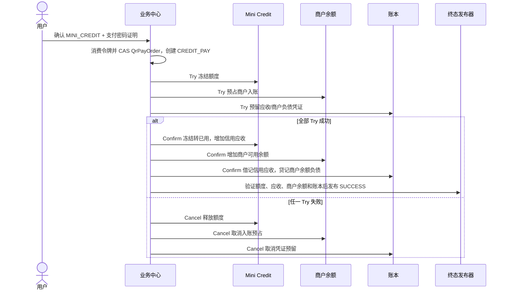
```mermaid
sequenceDiagram
    actor U as 用户
    participant B as 业务中心
    participant C as Mini Credit
    participant M as 商户余额
    participant L as 账本
    participant F as 终态发布器
    U->>B: 确认 MINI_CREDIT + 支付密码证明
    B->>B: 消费令牌并 CAS QrPayOrder，创建 CREDIT_PAY
    B->>C: Try 冻结额度
    B->>M: Try 预占商户入账
    B->>L: Try 预留应收/商户负债凭证
    alt 全部 Try 成功
      B->>C: Confirm 冻结转已用，增加信用应收
      B->>M: Confirm 增加商户可用余额
      B->>L: Confirm 借记信用应收，贷记商户余额负债
      B->>F: 验证额度、应收、商户余额和账本后发布 SUCCESS
    else 任一 Try 失败
      B->>C: Cancel 释放额度
      B->>M: Cancel 取消入账预占
      B->>L: Cancel 取消凭证预留
    end
```

`CREDIT_PAY` 不改变用户虚拟余额。仅 `ACTIVE` 且无逾期账单的信用账户可受理；固定额度为 500000 分，额度不足在确认前拒绝。

#### 9.4.2 Mini 花呗出账与余额还款

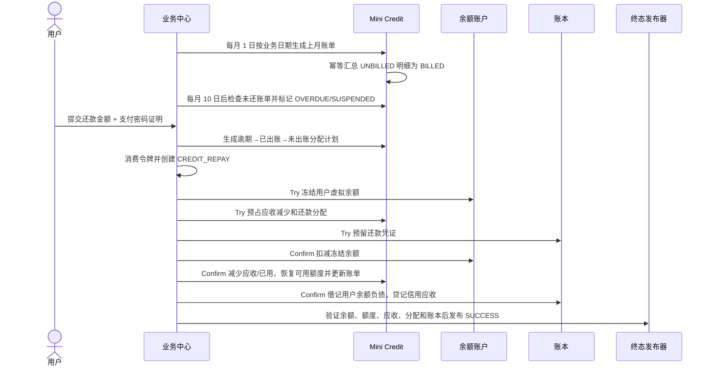
```mermaid
sequenceDiagram
    actor U as 用户
    participant B as 业务中心
    participant C as Mini Credit
    participant A as 余额账户
    participant L as 账本
    participant F as 终态发布器
    B->>C: 每月 1 日按业务日期生成上月账单
    C->>C: 幂等汇总 UNBILLED 明细为 BILLED
    B->>C: 每月 10 日后检查未还账单并标记 OVERDUE/SUSPENDED
    U->>B: 提交还款金额 + 支付密码证明
    B->>C: 生成逾期→已出账→未出账分配计划
    B->>B: 消费令牌并创建 CREDIT_REPAY
    B->>A: Try 冻结用户虚拟余额
    B->>C: Try 预占应收减少和还款分配
    B->>L: Try 预留还款凭证
    B->>A: Confirm 扣减冻结余额
    B->>C: Confirm 减少应收/已用、恢复可用额度并更新账单
    B->>L: Confirm 借记用户余额负债，贷记信用应收
    B->>F: 验证余额、额度、应收、分配和账本后发布 SUCCESS
```

还款支持提前、部分和全额，金额不得超过虚拟可用余额或信用应收；不得以 Mini 花呗额度偿还自身。出账日为每月 1 日，到期日为每月 10 日 23:59:59，费率、利息、罚息和最低还款额均为 0。

#### 9.4.3 长期个人码付款

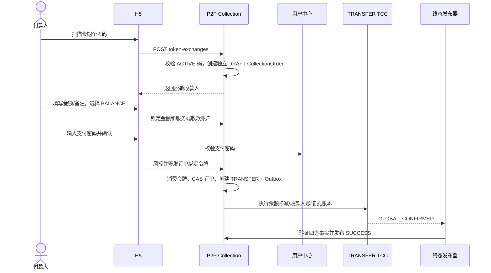
```mermaid
sequenceDiagram
    actor P as 付款人
    participant H as H5
    participant B as P2P Collection
    participant U as 用户中心
    participant T as TRANSFER TCC
    participant F as 终态发布器
    P->>H: 扫描长期个人码
    H->>B: POST token-exchanges
    B->>B: 校验 ACTIVE 码，创建独立 DRAFT CollectionOrder
    B-->>H: 返回脱敏收款人
    P->>H: 填写金额/备注，选择 BALANCE
    H->>B: 锁定金额和服务端收款账户
    P->>H: 输入支付密码并确认
    H->>U: 校验支付密码
    H->>B: 风控并签发订单绑定令牌
    B->>B: 消费令牌、CAS 订单、创建 TRANSFER + Outbox
    B->>T: 执行余额扣减/收款入账/复式账本
    T-->>F: GLOBAL_CONFIRMED
    F->>B: 验证四方事实并发布 SUCCESS
```

个人码长期复用，每个付款会话对应独立订单，因此两名付款人可并发成功。付款账户由登录会话确定，收款账户由个人码确定；自付、`MINI_CREDIT`、客户端收款账户和非正金额均拒绝。

#### 9.4.4 固定金额请求的多尝试仲裁

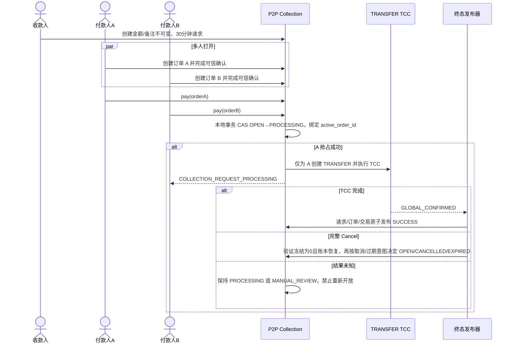
```mermaid
sequenceDiagram
    actor R as 收款人
    actor P1 as 付款人A
    actor P2 as 付款人B
    participant B as P2P Collection
    participant T as TRANSFER TCC
    participant F as 终态发布器
    R->>B: 创建金额/备注不可变、30分钟请求
    par 多人打开
      P1->>B: 创建订单 A 并完成可信确认
      P2->>B: 创建订单 B 并完成可信确认
    end
    P1->>B: pay(orderA)
    P2->>B: pay(orderB)
    B->>B: 本地事务 CAS OPEN→PROCESSING，绑定 active_order_id
    alt A 抢占成功
      B->>T: 仅为 A 创建 TRANSFER 并执行 TCC
      B-->>P2: COLLECTION_REQUEST_PROCESSING
      alt TCC 完成
        T-->>F: GLOBAL_CONFIRMED
        F->>B: 请求/订单/交易原子发布 SUCCESS
      else 完整 Cancel
        F->>B: 验证冻结为0且账本恢复，再按取消/过期意图决定 OPEN/CANCELLED/EXPIRED
      else 结果未知
        B->>B: 保持 PROCESSING 或 MANUAL_REVIEW，禁止重新开放
      end
    end
```

余额不足发生在抢占前时不创建交易，请求保持 `OPEN`。抢占后的任何未知资金状态都不得释放 `active_order_id`；只有经验证的完整回滚才能允许下一次尝试。

### 9.5 功能实现落地流程

下图展示所有资金功能从入口到最终结果的共同处理路径。差异仅在来源聚合和账户中心参与的 TCC 分支，不能由前端直接选择绕过。

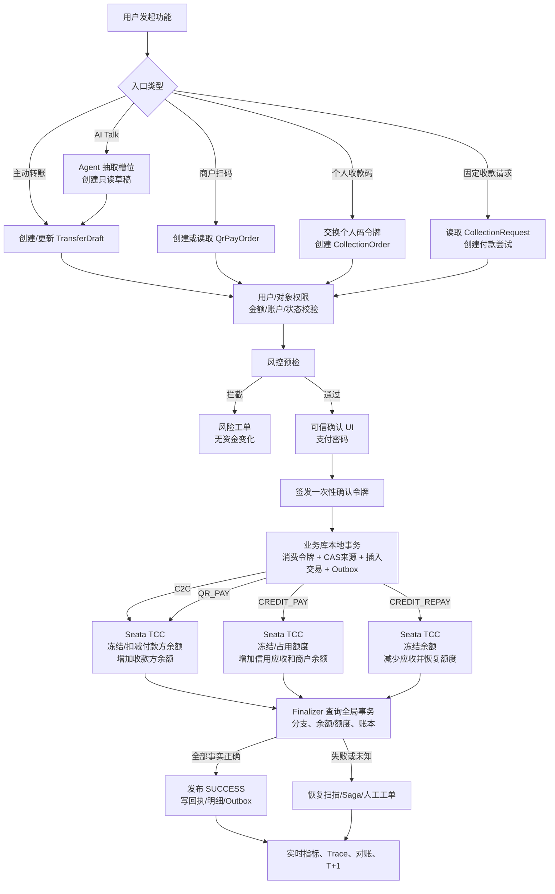
```mermaid
flowchart TD
    Start[用户发起功能] --> Entry{入口类型}
    Entry -->|主动转账| Draft[创建/更新 TransferDraft]
    Entry -->|商户扫码| Merchant[创建或读取 QrPayOrder]
    Entry -->|个人收款码| Personal[交换个人码令牌\n创建 CollectionOrder]
    Entry -->|固定收款请求| Request[读取 CollectionRequest\n创建付款尝试]
    Entry -->|AI Talk| Agent[Agent 抽取槽位\n创建只读草稿]
    Agent --> Draft
    Draft --> Validate[用户/对象权限\n金额/账户/状态校验]
    Merchant --> Validate
    Personal --> Validate
    Request --> Validate
    Validate --> Risk[风控预检]
    Risk -->|拦截| Review[风险工单\n无资金变化]
    Risk -->|通过| Confirm[可信确认 UI\n支付密码]
    Confirm --> Token[签发一次性确认令牌]
    Token --> Accept[业务库本地事务\n消费令牌 + CAS来源 + 插入交易 + Outbox]
    Accept -->|C2C| Balance[Seata TCC\n冻结/扣减付款方余额\n增加收款方余额]
    Accept -->|QR_PAY| Balance
    Accept -->|CREDIT_PAY| Credit[Seata TCC\n冻结/占用额度\n增加信用应收和商户余额]
    Accept -->|CREDIT_REPAY| Repay[Seata TCC\n冻结余额\n减少应收并恢复额度]
    Balance --> Finalizer[Finalizer 查询全局事务\n分支、余额/额度、账本]
    Credit --> Finalizer
    Repay --> Finalizer
    Finalizer -->|全部事实正确| Success[发布 SUCCESS\n写回执/明细/Outbox]
    Finalizer -->|失败或未知| Recover[恢复扫描/Saga/人工工单]
    Success --> Monitor[实时指标、Trace、对账、T+1]
    Recover --> Monitor
```

| 实现阶段 | 必须完成的动作 | 禁止行为 |
|---|---|---|
| 创建/扫描 | 服务端创建来源聚合，令牌只存摘要，返回脱敏数据 | 客户端提交或覆盖账户、金额、订单状态 |
| 预检 | 回源用户/账户服务，执行对象权限、账户状态、余额/额度和风控规则 | 以 Redis 缓存余额作为扣款依据 |
| 确认 | 可信 UI 展示结构化字段，密码服务校验后签发绑定令牌 | AI 消息、前端按钮或可重放字符串直接扣款 |
| 受理 | 本地事务消费令牌、CAS 状态、插入交易、写 Outbox | 先提交数据库再尽力发送事件；不同幂等键重复建单 |
| TCC | 各分支本地事务执行 Try/Confirm/Cancel，写屏障和分支状态 | 一个服务成功后直接宣告全局成功 |
| 终态 | Finalizer 验证资金和账本事实，原子写成功投影 | 超时响应直接展示成功或删除处理中主单 |
| 查询/监控 | 交易核心回源，事件消费者幂等，报表走指标库 | 运营页面直接扫描或修改资金表 |

### 9.6 风控人工确认

前置风控和事务恢复必须区分：

| 场景 | 工单类型 | 是否创建交易 | 资金状态 | 批准后行为 |
|---|---|---:|---|---|
| 高频/异常金额 | `RISK_PRECHECK` | 否 | 无变化 | 回到待确认，用户重新输入支付密码 |
| TCC/Saga 未收敛 | `TRANSACTION_RECOVERY` | 是 | 可能冻结 | 继续受控恢复或补偿 |

`RISK_PRECHECK` 使用 `subject_type + subject_id` 关联转账草稿、商户扫码订单、个人收款订单、固定请求或信用还款草案。来源过期、换码失效或请求已被其他订单抢占时工单同步失效，运营审批必须重新检查来源状态、资金来源和版本 CAS。

### 9.7 事务恢复与对账

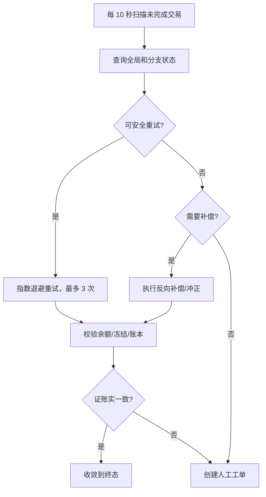
```mermaid
flowchart TD
    Scan[每 10 秒扫描未完成交易] --> Query[查询全局和分支状态]
    Query --> Retry{可安全重试?}
    Retry -- 是 --> DoRetry[指数退避重试，最多 3 次]
    Retry -- 否 --> Saga{需要补偿?}
    DoRetry --> Verify[校验余额/冻结/账本]
    Saga -- 是 --> Comp[执行反向补偿/冲正]
    Saga -- 否 --> Manual[创建人工工单]
    Comp --> Verify
    Verify --> Consistent{证账实一致?}
    Consistent -- 是 --> Close[收敛到终态]
    Consistent -- 否 --> Manual
```

### 9.8 统一资金交易活动流程图

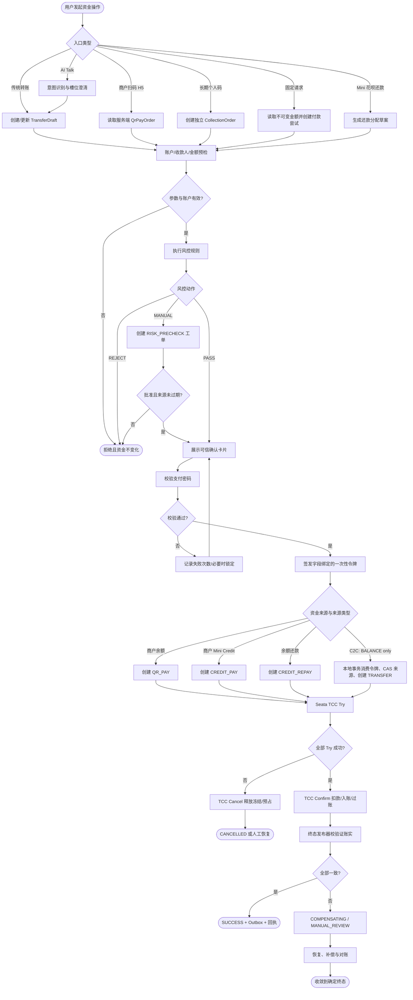
```mermaid
flowchart TD
    Start([用户发起资金操作]) --> Entry{入口类型}
    Entry -->|传统转账| Draft[创建/更新 TransferDraft]
    Entry -->|AI Talk| Intent[意图识别与槽位澄清]
    Entry -->|商户扫码 H5| Qr[读取服务端 QrPayOrder]
    Entry -->|长期个人码| Personal[创建独立 CollectionOrder]
    Entry -->|固定请求| Request[读取不可变金额并创建付款尝试]
    Entry -->|Mini 花呗还款| Repay[生成还款分配草案]
    Intent --> Draft
    Draft --> Validate[账户/收款人/金额预检]
    Qr --> Validate
    Personal --> Validate
    Request --> Validate
    Repay --> Validate
    Validate --> Valid{参数与账户有效?}
    Valid -->|否| Reject([拒绝且资金不变化])
    Valid -->|是| Risk[执行风控规则]
    Risk --> RiskAction{风控动作}
    RiskAction -->|REJECT| Reject
    RiskAction -->|MANUAL| RiskReview[创建 RISK_PRECHECK 工单]
    RiskReview --> Approved{批准且来源未过期?}
    Approved -->|否| Reject
    Approved -->|是| Confirm
    RiskAction -->|PASS| Confirm[展示可信确认卡片]
    Confirm --> Password[校验支付密码]
    Password --> PasswordOk{校验通过?}
    PasswordOk -->|否| Retry[记录失败次数/必要时锁定]
    Retry --> Confirm
    PasswordOk -->|是| Token[签发字段绑定的一次性令牌]
    Token --> Funding{资金来源与来源类型}
    Funding -->|C2C: BALANCE only| Accept[本地事务消费令牌、CAS 来源、创建 TRANSFER]
    Funding -->|商户余额| AcceptQr[创建 QR_PAY]
    Funding -->|商户 Mini Credit| AcceptCredit[创建 CREDIT_PAY]
    Funding -->|余额还款| AcceptRepay[创建 CREDIT_REPAY]
    AcceptQr --> Tcc
    AcceptCredit --> Tcc
    AcceptRepay --> Tcc
    Accept --> Tcc[Seata TCC Try]
    Tcc --> TryOk{全部 Try 成功?}
    TryOk -->|否| Cancel[TCC Cancel 释放冻结/预占]
    Cancel --> Cancelled([CANCELLED 或人工恢复])
    TryOk -->|是| ConfirmTcc[TCC Confirm 扣款/入账/过账]
    ConfirmTcc --> Finalize[终态发布器校验证账实]
    Finalize --> Consistent{全部一致?}
    Consistent -->|是| Success([SUCCESS + Outbox + 回执])
    Consistent -->|否| Recovery[COMPENSATING / MANUAL_REVIEW]
    Recovery --> Reconcile[恢复、补偿与对账]
    Reconcile --> EndState([收敛到确定终态])
```

该流程按来源聚合和资金来源选择 TCC 分支，但共享受理、确认、恢复与终态发布模板。主动转账、个人码和固定请求都创建 `TRANSFER`；商户余额/信用扫码分别创建 `QR_PAY`/`CREDIT_PAY`；还款创建 `CREDIT_REPAY`。任何拒绝或前置人工审核都不创建资金交易；只有进入 `PROCESSING` 后才可能出现余额或额度冻结。

## 10. 状态模型分析

### 10.1 统一资金流程状态视图

该视图用于统一前端语义，不表示所有状态都存放在 `transaction` 表。物理资金交易只在受理成功时创建，并从 `PROCESSING` 开始；此前的状态由来源聚合持有，避免两套事实源。

| 状态 | 状态所有者 | 含义 | 资金可能变化 | 终态 |
|---|---|---|---:|---:|
| `DRAFT` | `TransferDraft` | 草稿 | 否 | 否 |
| `PENDING_CONFIRMATION` | `TransferDraft`/`QrPayOrder`/`CollectionOrder`/还款草案 | 等待用户确认 | 否 | 否 |
| `RISK_REVIEW` | 来源聚合 | 交易前人工风控 | 否 | 否 |
| `PROCESSING` | `Transaction` | 交易已创建，TCC 执行中 | 可能冻结 | 否 |
| `COMPENSATING` | `Transaction` | 补偿/冲正中 | 可能冻结或部分分录 | 否 |
| `MANUAL_REVIEW` | `Transaction` | 事务恢复人工处置 | 可能冻结 | 否 |
| `SUCCESS` | `Transaction` | 扣款、入账和账本全部完成 | 已完成 | 是，可被冲正 |
| `REVERSED` | `Transaction` | 成功后通过反向分录冲正 | 已恢复 | 是 |
| `CANCELLED` | 来源聚合或 `Transaction` | 撤销/补偿完成 | 已恢复 | 是 |
| `REJECTED` | 来源聚合 | 校验或风控拒绝 | 否 | 是 |
| `EXPIRED` | 来源聚合 | 草稿/确认过期 | 否 | 是 |

禁止使用无法表达资金确定性的笼统 `FAILED` 终态。

### 10.2 QR_PAY 订单状态

```mermaid
stateDiagram-v2
    [*] --> CREATED
    CREATED --> SCANNED
    CREATED --> CANCELLED
    CREATED --> EXPIRED
    SCANNED --> PENDING_CONFIRMATION
    SCANNED --> CANCELLED
    SCANNED --> EXPIRED
    PENDING_CONFIRMATION --> RISK_REVIEW
    RISK_REVIEW --> PENDING_CONFIRMATION
    RISK_REVIEW --> REJECTED
    RISK_REVIEW --> EXPIRED
    PENDING_CONFIRMATION --> PROCESSING
    PENDING_CONFIRMATION --> REJECTED
    PENDING_CONFIRMATION --> CANCELLED
    PENDING_CONFIRMATION --> EXPIRED
    PROCESSING --> SUCCESS
    PROCESSING --> COMPENSATING
    PROCESSING --> MANUAL_REVIEW
    COMPENSATING --> CANCELLED
    COMPENSATING --> MANUAL_REVIEW
    MANUAL_REVIEW --> PROCESSING
    MANUAL_REVIEW --> CANCELLED
```

密码错误不迁移状态；只累积用户支付密码失败次数。`RISK_REVIEW` 尚未创建资金交易，`MANUAL_REVIEW` 已经进入资金事务，两者不能合并。`PROCESSING` 可关联 `QR_PAY` 或 `CREDIT_PAY`，但同一 `QrPayOrder` 受 `source_type + source_order_id` 唯一约束，只能选择一种资金来源。

### 10.3 TCC 分支状态

```mermaid
stateDiagram-v2
    [*] --> INIT
    INIT --> TRIED: Try 成功
    INIT --> CANCELLED: Cancel 先到/空回滚
    TRIED --> CONFIRMED: Confirm
    TRIED --> CANCELLED: Cancel
    CONFIRMED --> [*]
    CANCELLED --> [*]
```

- 同一 `xid + branch_type + resource_id` 唯一。
- `CONFIRMED`、`CANCELLED` 为分支终态，重复调用返回原结果。
- Cancel 先到时记录空回滚屏障；晚到 Try 发现屏障后拒绝执行。

### 10.4 告警状态

```mermaid
stateDiagram-v2
    [*] --> OPEN
    OPEN --> ACKNOWLEDGED: 运营确认
    ACKNOWLEDGED --> RESOLVED: 提交解决证据
    RESOLVED --> CLOSED: 指标恢复并复核
    RESOLVED --> OPEN: 问题复发
    CLOSED --> [*]
```

P0/P1 即使指标恢复也必须人工确认后关闭；原始触发证据不可删除。

### 10.5 Mini 花呗额度、账单与明细状态

```mermaid
stateDiagram-v2
    state CreditAccount {
      [*] --> ACTIVE
      ACTIVE --> SUSPENDED: 存在逾期账单
      SUSPENDED --> ACTIVE: 逾期清零且无异常冻结
      ACTIVE --> CLOSED: 满足销户条件
      SUSPENDED --> CLOSED: 清偿后销户
    }
    state CreditBill {
      [*] --> OPEN
      OPEN --> PARTIALLY_PAID: 部分还款
      OPEN --> PAID: 全额还款
      OPEN --> OVERDUE: 到期仍未还清
      PARTIALLY_PAID --> PAID: 剩余清零
      PARTIALLY_PAID --> OVERDUE: 到期仍有余额
      OVERDUE --> PARTIALLY_PAID: 逾期部分还款
      OVERDUE --> PAID: 逾期全额还款
    }
    state CreditBillItem {
      [*] --> UNBILLED
      UNBILLED --> BILLED: 月度出账
      UNBILLED --> REPAID: 提前还清
      BILLED --> REPAID: 分配后剩余为0
    }
```

- `SUSPENDED` 只禁止新的 `CREDIT_PAY`，不得阻止余额支付、`TRANSFER`、查询或 `CREDIT_REPAY`。
- 出账任务以 `credit_transaction_id` 和账期幂等；重复运行不重复建账单或汇总消费。
- 账单金额只由已确认 `CREDIT_PAY`、`CREDIT_REPAY` 和受控冲正驱动，后台不能直接编辑。

### 10.6 长期个人收款码状态

```mermaid
stateDiagram-v2
    [*] --> ACTIVE
    ACTIVE --> DISABLED: 用户停用
    ACTIVE --> REVOKED: 原子换码
    DISABLED --> ACTIVE: 启用新码
    REVOKED --> [*]
```

`REVOKED` 令牌永久失效。停用或换码仅终止尚未进入 `PROCESSING` 的订单；已受理交易继续按交易核心收敛。

### 10.7 固定收款请求状态

```mermaid
stateDiagram-v2
    [*] --> OPEN
    OPEN --> PROCESSING: 订单 CAS 抢占并绑定 active_order_id
    OPEN --> CANCELLED: 收款人取消
    OPEN --> EXPIRED: 到期或惰性过期
    PROCESSING --> SUCCESS: 终态发布器验证成功
    PROCESSING --> OPEN: 完整 Cancel 且仍有效
    PROCESSING --> CANCELLED: 完整 Cancel 且已请求取消
    PROCESSING --> EXPIRED: 完整 Cancel 且已过期
    PROCESSING --> MANUAL_REVIEW: 资金结果未知
    MANUAL_REVIEW --> SUCCESS: 恢复确认成功
    MANUAL_REVIEW --> OPEN: 完整补偿且仍有效
    MANUAL_REVIEW --> CANCELLED: 完整补偿且取消意图生效
    MANUAL_REVIEW --> EXPIRED: 完整补偿且已过期
```

`PROCESSING` 期间的取消或过期只记录待生效意图，不强制改变资金方向。任何未知结果均不得清空 `active_order_id` 或回到 `OPEN`。

### 10.8 单次个人收款订单状态

```mermaid
stateDiagram-v2
    [*] --> DRAFT
    DRAFT --> PENDING_CONFIRMATION: 锁定金额和收款人
    DRAFT --> EXPIRED
    PENDING_CONFIRMATION --> PROCESSING: 消费确认令牌
    PENDING_CONFIRMATION --> CANCELLED
    PENDING_CONFIRMATION --> EXPIRED
    PROCESSING --> SUCCESS: 终态发布
    PROCESSING --> FAILED: 完整 Cancel 已验证
    PROCESSING --> MANUAL_REVIEW: 结果未知
    MANUAL_REVIEW --> SUCCESS
    MANUAL_REVIEW --> FAILED: 完整补偿已验证
```

长期个人码订单彼此独立；固定请求订单只有被 `active_order_id` 选中的尝试可进入 `PROCESSING`，未抢占订单保持非资金终态并可查询最终请求结果。

### 10.9 用户注册开户状态

```mermaid
stateDiagram-v2
    [*] --> PROVISIONING: 注册请求校验通过
    PROVISIONING --> ACTIVE: 余额账户和适用的信用账户均创建成功
    PROVISIONING --> PROVISIONING: 按 registrationId 幂等恢复
    ACTIVE --> DISABLED: 管理停用
    DISABLED --> ACTIVE: 管理恢复
```

`PROVISIONING` 用户不能登录或发起业务。用户中心持久化唯一 `registrationId`，账户中心使用该键幂等返回既有开户结果；恢复任务只有在余额账户和适用的信用账户均可核验后才能把用户 CAS 激活为 `ACTIVE`。恢复超过自动处理阈值时，用户仍保持 `PROVISIONING` 并创建人工工单。临时登录锁定只由 `credential.login_fail_count/login_lock_until` 表达，不修改 `app_user.status`；账户销户只改变账户状态，不关闭用户身份。

## 11. 数据架构与数据库分析

### 11.1 数据所有权

| 数据库 | 核心表 | 写入者 | 读取者 |
|---|---|---|---|
| `user_db` | user、credential、contact、role、idempotency_record、audit_log、outbox_event | 用户中心 | 用户中心，其他服务经 API |
| `business_db` | draft、confirmation、transaction、qr_order、personal_collection_code、collection_request、collection_order、credit_repayment_draft、risk、manual_case、tcc_global、idempotency_record、audit_log、outbox_event | 业务中心 | 业务中心/运营 API |
| `account_db` | account、account_balance、freeze_record、credit_account、credit_freeze、tcc_branch、outbox_event | 账户中心 | 账户中心 |
| `ledger_db` | ledger_voucher、ledger_entry、credit_receivable、credit_purchase、credit_bill、credit_bill_item、credit_repayment、credit_repayment_allocation、reconciliation_diff、outbox_event | 账户/账本模块 | 账户、对账模块 |
| `agent_db` | agent_session、preference、tool_call_log、idempotency_record、audit_log、outbox_event | AI 服务 | Agent/审计 API |
| `metrics_db` | inbox_event、analytics_event、quarantined_event、metric_definition、daily_metric、alert、quality_result | 业务中心监控模块 | 监控后台 |

服务不得跨库直接访问其他服务的表；只允许通过 API、TCC 分支或事件交互。

### 11.2 核心表分析

#### 用户与凭证

| 表 | 关键字段 | 约束 |
|---|---|---|
| `user` | user_id、registration_id、login_name、nickname、status、version | registration_id、login_name 唯一；开户完成前保持 `PROVISIONING` |
| `credential` | user_id、login_hash、pay_hash、login/pay_fail_count、login/pay_lock_until | 密码强哈希，登录与支付失败分别原子锁定 |
| `contact` | owner_id、payee_user_id、alias | owner + payee 唯一 |

#### 账户与账本

| 表 | 关键字段 | 约束 |
|---|---|---|
| `account` | account_id、user_id、registration_id、type、currency、status | registration_id 唯一；user + type + currency 唯一 |
| `account_balance` | account_id、available_fen、frozen_fen、version | 金额非负，乐观锁 |
| `freeze_record` | freeze_id、transaction_id、account_id、amount_fen、status | transaction + account + purpose 唯一 |
| `credit_account` | credit_account_id、user_id、total/used/frozen_limit_fen、status、version | 用户唯一；固定额度 500000 分；总额 = 可用 + 已用 + 冻结 |
| `credit_freeze` | credit_freeze_id、transaction_id、credit_account_id、amount_fen、status | transaction + credit_account 唯一；TCC 分支幂等 |
| `credit_receivable` | credit_account_id、unbilled/billed/overdue_fen、version | PK credit_account；应收合计与已用额度一致 |
| `credit_purchase` | purchase_id、credit_transaction_id、credit_account_id、qr_order_id、amount_fen、billing_status | credit_transaction 唯一；只能来自 CREDIT_PAY |
| `credit_bill` | bill_id、credit_account_id、period、total/paid/outstanding_fen、due_at、status、version | credit_account + period 唯一；账单日 1 日、到期日 10 日 |
| `credit_bill_item` | bill_id、purchase_id、amount_fen、allocated_paid_fen | bill + purchase 唯一，金额不可物理修改 |
| `credit_repayment` | repayment_id、transaction_id、credit_account_id、amount_fen、status | transaction 唯一；只能来自 CREDIT_REPAY |
| `credit_repayment_allocation` | repayment_id、target_type、target_id、amount_fen、sequence_no | repayment + sequence 唯一；按逾期、已出账、未出账顺序 |
| `ledger_voucher` | voucher_id、transaction_id、voucher_type、reversal_no、original_voucher_id、status、total_debit、total_credit | transaction + type + reversal_no 唯一，借贷相等，反向凭证关联原凭证 |
| `ledger_entry` | entry_id、voucher_id、account_id、direction、amount_fen | 只增不改，不物理删除 |

#### 交易与扫码

| 表 | 关键字段 | 约束 |
|---|---|---|
| `transaction` | transaction_id、business_type、source_type、source_order_id、idempotency_key、payer、payee、amount、status | payer + idempotency 唯一；source_type + source_order 唯一；物理状态从 PROCESSING 开始 |
| `confirmation_subject` | subject_type、subject_id、current_confirmation_id、version | 主体主键唯一；签发时锁定该活动槽位 |
| `confirmation` | confirmation_id、subject_type、subject_id、draft_hash、active_subject_key、status、expires_at、consumed_at | 令牌摘要与活动主体键唯一；状态为 ACTIVE/CONSUMED/REVOKED/EXPIRED |
| `qr_pay_order` | qr_order_id、merchant_account_id、payer_user_id、transaction_id、amount、status、version、expires_at | version CAS；transaction_id 唯一 |
| `qr_pay_token` | token_digest、qr_order_id、bootstrap_session_hash、h5_session_id、status、expires_at、consumed_at | token_digest 唯一，只存摘要；POST 交换并绑定浏览器引导会话 |
| `personal_collection_code` | code_id、owner_user_id、payee_account_id、token_digest、status、active_owner_key、version | token_digest 唯一；生成列保证每个用户最多一个 ACTIVE 码 |
| `collection_request` | request_id、requester_user_id、payee_account_id、token_digest、amount_fen、status、active_order_id、transaction_id、version、expires_at | 金额创建后不可变；30 分钟过期；请求 CAS 仲裁付款尝试 |
| `collection_order` | order_id、mode、code_id/request_id、payer/payee、h5_session_id、amount_fen、funding_source、status、transaction_id、version | H5 会话唯一；仅 BALANCE；每个订单最多一笔 TRANSFER |
| `credit_repayment_draft` | repayment_draft_id、user_id、credit_account_id、amount_fen、allocation_hash、status、version、expires_at | 本人短期草稿；金额与分配快照绑定确认令牌 |
| `tcc_global` | transaction_id、xid、status、started_at、updated_at | transaction_id 唯一；启动分支前持久化 xid |
| `outbox_event` | event_id、aggregate_type、aggregate_id、event_type、payload、status、retry_count、next_retry_at | 与业务事实同库提交；event_id 唯一 |
| `inbox_event` | consumer_name、event_id、received_at、status | consumer_name + event_id 唯一 |
| `quarantined_event` | event_id、reason、payload、quarantined_at、resolved_at | Schema/业务校验失败事件隔离，不进入正式指标 |

#### 风控与人工

| 表 | 关键字段 | 约束 |
|---|---|---|
| `risk_decision` | decision_id、subject_type、subject_id、transaction_id、rule_version、action | transaction 创建前允许为空 |
| `manual_case` | case_id、case_type、subject_type、subject_id、transaction_id、active_subject_key、status、operator_id | 生成列 + 唯一索引保证活跃主体工单唯一 |
| `audit_log` | audit_id、actor_type、actor_id、action、target、occurred_at | 追加写，不删除 |
| `idempotency_record` | principal_key、api_scope、idempotency_key、request_digest、resource_id、response_json、status、expires_at | principal + scope + key 唯一，同键异参冲突 |

### 11.3 金额与时间规则

- 金额存储为 `BIGINT` 分，禁止 `float`/`double`。
- 货币字段固定 `CNY`，为未来多币种预留但 MVP 不扩展。
- 所有数据库时间存储带明确时区语义，接口使用 ISO 8601。
- 服务端时间为令牌和订单过期的唯一依据，客户端倒计时只用于展示。

### 11.4 索引建议

- `fund_transaction(payer_account_id, idempotency_key)` 唯一索引。
- `fund_transaction(source_type, source_order_id)` 唯一索引，覆盖同一扫码订单在余额/信用资金来源间的竞争，以及每个 C2C 收款订单的单次受理。
- `fund_transaction(status, updated_at)` 支持恢复扫描。
- `qr_pay_order(status, expires_at)` 支持过期任务。
- `collection_request(status, expires_at)`、`collection_request(active_order_id)` 支持惰性过期、恢复扫描和竞争查询。
- `collection_order(request_id, status)`、`collection_order(code_id, status)`、`collection_order(transaction_id)` 支持请求/个人码尝试与真实交易回源。
- `credit_account(user_id)` 唯一，`credit_bill(credit_account_id, period)` 唯一，`credit_purchase(credit_transaction_id)` 唯一。
- `ledger_entry(transaction_id)`、`ledger_entry(account_id, created_at)` 支持回执和明细。
- `tool_call_log(trace_id, occurred_at)` 支持 Agent 链路查询。
- `outbox_event(status, next_retry_at)` 支持可靠发布扫描。
- `inbox_event(consumer_name, event_id)` 唯一索引和 `analytics_event(event_id)` 唯一索引用于消费去重。

### 11.5 数据生命周期

- 原始事件 30 天，分钟指标 90 天，日指标和口径 180 天。
- 账本、审计、人工处置和对账记录在项目周期内永久保留。
- 草稿 30 分钟过期；确认令牌 2 分钟；商户二维码令牌 5 分钟；固定收款请求及其未确认订单 30 分钟过期。
- 长期个人码在停用或换码前不按时间过期；换码必须保留已撤销记录并使旧 token 立即失效，已进入 `PROCESSING` 的订单继续按交易事实收敛。
- 清理任务只删除允许清理的会话/缓存数据，不删除资金事实。

### 11.6 物理模型统一规范

| 项目 | 约定 |
|---|---|
| 数据库 | MySQL 8.0，字符集 `utf8mb4`，排序规则 `utf8mb4_0900_ai_ci` |
| 主键 | 业务实体使用 `CHAR(26)` ULID；高频明细可使用 `BIGINT UNSIGNED` 雪花 ID |
| 金额 | `BIGINT UNSIGNED`，单位为分；业务校验必须大于 0，禁止浮点数 |
| 时间 | `DATETIME(3)`，服务端统一按 UTC 写入，API 转为 ISO 8601 |
| 状态 | `VARCHAR(32)` + 应用状态机校验；核心表增加 `CHECK` 防止非法值 |
| 乐观锁 | 可并发更新的聚合使用 `version BIGINT UNSIGNED NOT NULL DEFAULT 0` |
| 软删除 | 用户配置可用 `deleted_at`；交易、账本、审计、工单不允许删除 |
| JSON | 仅用于事件载荷、快照和可扩展维度；可检索核心字段必须独立成列 |
| 外键 | 同一服务 Schema 内可建外键；跨服务只保存 ID 并通过 API/事件校验 |
| 命名 | 物理表使用小写下划线；逻辑 `Transaction` 映射为 `fund_transaction`，避免保留字 |

### 11.7 物理表目录与字段设计

#### 11.7.1 用户中心 `user_db`

| 表 | 字段及类型 | 主键/唯一键 | 主要索引 |
|---|---|---|---|
| `app_user` | `user_id/registration_id CHAR(26)`、`login_name VARCHAR(64)`、`nickname VARCHAR(64)`、`identity_status/status VARCHAR(16)`、`version BIGINT UNSIGNED`、`created_at/updated_at DATETIME(3)` | PK `user_id`；UK `registration_id`；UK `login_name` | `(status, created_at)` |
| `credential` | `user_id CHAR(26)`、`login_password_hash/payment_password_hash VARCHAR(255)`、`login_fail_count/pay_fail_count INT UNSIGNED`、`login_lock_until/pay_lock_until DATETIME(3)`、`updated_at DATETIME(3)` | PK/FK `user_id` | `(login_lock_until)`、`(pay_lock_until)` |
| `contact` | `owner_user_id/payee_user_id CHAR(26)`、`alias VARCHAR(64)`、`success_count BIGINT UNSIGNED`、`last_success_at DATETIME(3)`、`pinned/hidden BOOLEAN`、`version BIGINT UNSIGNED`、`created_at/updated_at DATETIME(3)` | PK `(owner_user_id, payee_user_id)`；仅成功转账事件创建/累计 | `(owner_user_id, pinned, hidden, last_success_at)`、`(payee_user_id)` |
| `role_assignment` | `user_id CHAR(26)`、`role_code VARCHAR(32)`、`created_at DATETIME(3)` | PK `(user_id, role_code)` | `(role_code)` |
| `idempotency_record` | `record_id CHAR(26)`、`principal_key VARCHAR(128)`、`api_scope VARCHAR(64)`、`idempotency_key VARCHAR(64)`、`request_digest BINARY(32)`、`resource_type VARCHAR(32)`、`resource_id CHAR(26)`、`response_json JSON`、`status VARCHAR(16)`、`expires_at/created_at/updated_at DATETIME(3)` | PK `record_id`；UK `(principal_key, api_scope, idempotency_key)` | `(status, updated_at)`、`(expires_at)` |
| `audit_log` | `audit_id BIGINT UNSIGNED`、`actor_type VARCHAR(16)`、`actor_id VARCHAR(128)`、`action VARCHAR(64)`、`target_type VARCHAR(32)`、`target_id VARCHAR(128)`、`result_code VARCHAR(32)`、`trace_id CHAR(32)`、`detail_json JSON`、`occurred_at DATETIME(3)` | PK `audit_id` | `(actor_id, occurred_at)`、`(target_type, target_id, occurred_at)` |

#### 11.7.2 账户与账本 `account_db` / `ledger_db`

| 表 | 字段及类型 | 主键/唯一键 | 主要索引 |
|---|---|---|---|
| `account` | `account_id CHAR(26)`、`user_id/registration_id CHAR(26)`、`account_type VARCHAR(16)`、`currency CHAR(3)`、`status VARCHAR(16)`、`created_at/updated_at DATETIME(3)` | PK `account_id`；UK `registration_id`；UK `(user_id, account_type, currency)` | `(status, updated_at)` |
| `account_balance` | `account_id CHAR(26)`、`available_fen BIGINT UNSIGNED`、`frozen_fen BIGINT UNSIGNED`、`version BIGINT UNSIGNED`、`updated_at DATETIME(3)` | PK/FK `account_id` | `(updated_at)` |
| `freeze_record` | `freeze_id CHAR(26)`、`transaction_id CHAR(26)`、`account_id CHAR(26)`、`purpose VARCHAR(24)`、`amount_fen BIGINT UNSIGNED`、`status VARCHAR(16)`、`created_at/updated_at DATETIME(3)` | PK `freeze_id`；UK `(transaction_id, account_id, purpose)` | `(account_id, status)`、`(status, updated_at)` |
| `credit_account` | `credit_account_id CHAR(26)`、`user_id CHAR(26)`、`total_limit_fen/used_fen/frozen_fen BIGINT UNSIGNED`、`status VARCHAR(16)`、`suspend_reason VARCHAR(32)`、`version BIGINT UNSIGNED`、`created_at/updated_at DATETIME(3)` | PK `credit_account_id`；UK `user_id` | `(status, updated_at)` |
| `credit_freeze` | `credit_freeze_id CHAR(26)`、`transaction_id CHAR(26)`、`credit_account_id CHAR(26)`、`amount_fen BIGINT UNSIGNED`、`status VARCHAR(16)`、`created_at/updated_at DATETIME(3)` | PK `credit_freeze_id`；UK `(transaction_id, credit_account_id)` | `(credit_account_id, status)`、`(status, updated_at)` |
| `tcc_branch` | `branch_id CHAR(26)`、`xid VARCHAR(128)`、`transaction_id CHAR(26)`、`branch_type VARCHAR(24)`、`resource_id CHAR(26)`、`status VARCHAR(16)`、`barrier_version BIGINT UNSIGNED`、`updated_at DATETIME(3)` | PK `branch_id`；UK `(xid, branch_type, resource_id)` | `(transaction_id)`、`(status, updated_at)` |
| `ledger_voucher` | `voucher_id CHAR(26)`、`transaction_id CHAR(26)`、`voucher_type VARCHAR(24)`、`reversal_no SMALLINT UNSIGNED`、`original_voucher_id CHAR(26)`、`status VARCHAR(16)`、`total_debit_fen/total_credit_fen BIGINT UNSIGNED`、`posted_at DATETIME(3)`、`created_at DATETIME(3)` | PK `voucher_id`；UK `(transaction_id, voucher_type, reversal_no)` | `(original_voucher_id)`、`(status, created_at)` |
| `ledger_entry` | `entry_id BIGINT UNSIGNED`、`voucher_id CHAR(26)`、`transaction_id CHAR(26)`、`account_id CHAR(26)`、`direction VARCHAR(8)`、`amount_fen BIGINT UNSIGNED`、`sequence_no SMALLINT UNSIGNED`、`created_at DATETIME(3)` | PK `entry_id`；UK `(voucher_id, sequence_no)` | `(account_id, created_at)`、`(transaction_id)` |
| `credit_receivable` | `credit_account_id CHAR(26)`、`unbilled_fen/billed_fen/overdue_fen BIGINT UNSIGNED`、`version BIGINT UNSIGNED`、`updated_at DATETIME(3)` | PK `credit_account_id` | `(updated_at)` |
| `credit_purchase` | `purchase_id CHAR(26)`、`credit_transaction_id CHAR(26)`、`credit_account_id CHAR(26)`、`qr_order_id CHAR(26)`、`merchant_account_id CHAR(26)`、`amount_fen BIGINT UNSIGNED`、`billing_status VARCHAR(16)`、`occurred_at/updated_at DATETIME(3)` | PK `purchase_id`；UK `credit_transaction_id` | `(credit_account_id, billing_status, occurred_at)`、`(qr_order_id)` |
| `credit_bill` | `bill_id CHAR(26)`、`credit_account_id CHAR(26)`、`period CHAR(7)`、`statement_date DATE`、`due_at DATETIME(3)`、`total_fen/paid_fen/outstanding_fen BIGINT UNSIGNED`、`status VARCHAR(16)`、`version BIGINT UNSIGNED`、`created_at/updated_at DATETIME(3)` | PK `bill_id`；UK `(credit_account_id, period)` | `(status, due_at)` |
| `credit_bill_item` | `bill_id/purchase_id CHAR(26)`、`amount_fen/allocated_paid_fen BIGINT UNSIGNED`、`created_at/updated_at DATETIME(3)` | PK `(bill_id, purchase_id)` | `(purchase_id)` |
| `credit_repayment` | `repayment_id CHAR(26)`、`transaction_id CHAR(26)`、`credit_account_id CHAR(26)`、`amount_fen BIGINT UNSIGNED`、`status VARCHAR(16)`、`created_at/updated_at DATETIME(3)` | PK `repayment_id`；UK `transaction_id` | `(credit_account_id, status, created_at)` |
| `credit_repayment_allocation` | `repayment_id CHAR(26)`、`target_type VARCHAR(16)`、`target_id CHAR(26)`、`amount_fen BIGINT UNSIGNED`、`sequence_no SMALLINT UNSIGNED`、`created_at DATETIME(3)` | PK `(repayment_id, sequence_no)` | `(target_type, target_id)` |
| `reconciliation_diff` | `diff_id CHAR(26)`、`biz_date DATE`、`transaction_id CHAR(26)`、`diff_type VARCHAR(32)`、`expected_json/actual_json JSON`、`status VARCHAR(16)`、`manual_case_id CHAR(26)`、`created_at/resolved_at DATETIME(3)` | PK `diff_id`；UK `(biz_date, transaction_id, diff_type)` | `(status, created_at)` |

#### 11.7.3 业务中心 `business_db`

| 表 | 字段及类型 | 主键/唯一键 | 主要索引 |
|---|---|---|---|
| `transfer_draft` | `draft_id CHAR(26)`、`payer_user_id/payee_user_id CHAR(26)`、`payer_account_id/payee_account_id CHAR(26)`、`amount_fen BIGINT UNSIGNED`、`remark VARCHAR(128)`、`status VARCHAR(32)`、`version BIGINT UNSIGNED`、`expires_at/created_at/updated_at DATETIME(3)` | PK `draft_id` | `(payer_user_id, status, updated_at)`、`(status, expires_at)` |
| `fund_transaction` | `transaction_id CHAR(26)`、`business_type VARCHAR(16)`、`source_type VARCHAR(32)`、`source_order_id CHAR(26)`、`idempotency_key VARCHAR(64)`、`payer/payee_account_id CHAR(26)`、`amount_fen BIGINT UNSIGNED`、`status VARCHAR(32)`、`risk_level VARCHAR(16)`、`trace_id CHAR(32)`、`version BIGINT UNSIGNED`、`created_at/updated_at DATETIME(3)` | PK `transaction_id`；UK `(payer_account_id, idempotency_key)`；UK `(source_type, source_order_id)` | `(status, updated_at)`、`(payee_account_id, created_at)`、`(business_type, created_at)` |
| `confirmation_subject` | `subject_type VARCHAR(24)`、`subject_id CHAR(26)`、`current_confirmation_id CHAR(26)`、`version BIGINT UNSIGNED`、`updated_at DATETIME(3)` | PK `(subject_type, subject_id)`；UK `current_confirmation_id` | `(updated_at)` |
| `confirmation` | `confirmation_id CHAR(26)`、`token_digest BINARY(32)`、`subject_type VARCHAR(24)`、`subject_id CHAR(26)`、`subject_hash BINARY(32)`、`payer_user_id CHAR(26)`、`status VARCHAR(16)`、`active_subject_key VARCHAR(64) GENERATED`、`expires_at/consumed_at/created_at DATETIME(3)` | PK `confirmation_id`；UK `token_digest`；UK `active_subject_key` | `(subject_type, subject_id, status)`、`(expires_at)` |
| `qr_pay_order` | `qr_order_id CHAR(26)`、`merchant_user_id/merchant_account_id CHAR(26)`、`payer_user_id CHAR(26)`、`transaction_id CHAR(26)`、`amount_fen BIGINT UNSIGNED`、`subject VARCHAR(128)`、`funding_source VARCHAR(16)`、`status VARCHAR(32)`、`version BIGINT UNSIGNED`、`scanned_at/confirmed_at/expires_at/created_at/updated_at DATETIME(3)` | PK `qr_order_id`；UK `transaction_id` | `(merchant_user_id, status, created_at)`、`(status, expires_at)` |
| `qr_pay_token` | `token_digest BINARY(32)`、`qr_order_id CHAR(26)`、`bootstrap_session_hash BINARY(32)`、`h5_session_id CHAR(26)`、`status VARCHAR(16)`、`expires_at/consumed_at/created_at DATETIME(3)` | PK `token_digest`；UK `qr_order_id`；UK `h5_session_id` | `(status, expires_at)` |
| `personal_collection_code` | `code_id CHAR(26)`、`owner_user_id/payee_account_id CHAR(26)`、`token_digest BINARY(32)`、`status VARCHAR(16)`、`active_owner_key CHAR(26) GENERATED`、`version BIGINT UNSIGNED`、`created_at/updated_at/revoked_at DATETIME(3)` | PK `code_id`；UK `token_digest`；UK `active_owner_key` | `(owner_user_id, created_at)`、`(status, updated_at)` |
| `collection_request` | `request_id CHAR(26)`、`requester_user_id/payee_account_id CHAR(26)`、`token_digest BINARY(32)`、`amount_fen BIGINT UNSIGNED`、`subject VARCHAR(50)`、`status VARCHAR(32)`、`active_order_id/transaction_id CHAR(26)`、`cancel_requested_at DATETIME(3)`、`version BIGINT UNSIGNED`、`expires_at/created_at/updated_at DATETIME(3)` | PK `request_id`；UK `token_digest`；UK `transaction_id` | `(status, expires_at)`、`(active_order_id)`、`(requester_user_id, created_at)` |
| `collection_order` | `order_id CHAR(26)`、`mode VARCHAR(24)`、`code_id/request_id CHAR(26)`、`payer_user_id/payer_account_id/payee_user_id/payee_account_id CHAR(26)`、`h5_session_id CHAR(26)`、`amount_fen BIGINT UNSIGNED`、`subject VARCHAR(50)`、`funding_source VARCHAR(16)`、`status VARCHAR(32)`、`transaction_id CHAR(26)`、`version BIGINT UNSIGNED`、`expires_at/created_at/updated_at DATETIME(3)` | PK `order_id`；UK `h5_session_id`；UK `transaction_id` | `(request_id, status)`、`(code_id, status)`、`(payer_user_id, created_at)`、`(payee_user_id, created_at)` |
| `credit_repayment_draft` | `repayment_draft_id/user_id/credit_account_id CHAR(26)`、`amount_fen BIGINT UNSIGNED`、`allocation_hash BINARY(32)`、`status VARCHAR(16)`、`version BIGINT UNSIGNED`、`expires_at/created_at/updated_at DATETIME(3)` | PK `repayment_draft_id` | `(user_id, status, created_at)`、`(status, expires_at)` |
| `risk_decision` | `decision_id CHAR(26)`、`subject_type VARCHAR(24)`、`subject_id CHAR(26)`、`transaction_id CHAR(26)`、`rule_version VARCHAR(32)`、`risk_level VARCHAR(16)`、`action VARCHAR(16)`、`reason_code VARCHAR(32)`、`created_at DATETIME(3)` | PK `decision_id` | `(subject_type, subject_id, created_at)`、`(transaction_id)` |
| `manual_case` | `case_id CHAR(26)`、`case_type VARCHAR(32)`、`subject_type VARCHAR(24)`、`subject_id CHAR(26)`、`transaction_id CHAR(26)`、`reason_code VARCHAR(32)`、`status VARCHAR(16)`、`active_subject_key VARCHAR(64) GENERATED`、`operator_id CHAR(26)`、`version BIGINT UNSIGNED`、`created_at/updated_at DATETIME(3)` | PK `case_id`；UK `active_subject_key` | `(status, created_at)`、`(subject_type, subject_id, status)` |
| `tcc_global` | `transaction_id CHAR(26)`、`xid VARCHAR(128)`、`status VARCHAR(32)`、`retry_count INT UNSIGNED`、`next_retry_at/started_at/updated_at DATETIME(3)` | PK `transaction_id`；UK `xid` | `(status, next_retry_at)` |
| `idempotency_record` | 字段同 `user_db.idempotency_record`，`principal_key` 使用登录用户 ID | PK `record_id`；UK `(principal_key, api_scope, idempotency_key)` | `(status, updated_at)`、`(expires_at)` |
| `audit_log` | 字段同 `user_db.audit_log`，记录草稿、确认、交易、风控、工单和恢复动作 | PK `audit_id` | `(target_type, target_id, occurred_at)`、`(trace_id)` |

#### 11.7.4 Agent 与监控 `agent_db` / `metrics_db`

| 表 | 字段及类型 | 主键/唯一键 | 主要索引 |
|---|---|---|---|
| `agent_session` | `session_id CHAR(26)`、`user_id CHAR(26)`、`summary TEXT`、`slots_json JSON`、`status VARCHAR(16)`、`version BIGINT UNSIGNED`、`last_active_at/created_at DATETIME(3)` | PK `session_id` | `(user_id, last_active_at)` |
| `agent_message` | `message_id CHAR(26)`、`session_id CHAR(26)`、`client_message_id VARCHAR(64)`、`role VARCHAR(16)`、`content_redacted TEXT`、`token_count INT UNSIGNED`、`created_at DATETIME(3)` | PK `message_id`；UK `(session_id, client_message_id, role)` | `(session_id, created_at)` |
| `preference` | `preference_id CHAR(26)`、`user_id CHAR(26)`、`preference_type VARCHAR(32)`、`value_encrypted VARBINARY(1024)`、`consent_version VARCHAR(16)`、`status VARCHAR(16)`、`created_at/updated_at DATETIME(3)` | PK `preference_id`；UK `(user_id, preference_type)` | `(user_id, status)` |
| `tool_call_log` | `tool_call_id CHAR(26)`、`session_id CHAR(26)`、`tool_name VARCHAR(64)`、`request_digest BINARY(32)`、`result_code VARCHAR(32)`、`duration_ms INT UNSIGNED`、`trace_id CHAR(32)`、`occurred_at DATETIME(3)` | PK `tool_call_id` | `(trace_id, occurred_at)`、`(session_id, occurred_at)` |
| `outbox_event` | `event_id CHAR(26)`、`aggregate_type VARCHAR(32)`、`aggregate_id CHAR(26)`、`event_type VARCHAR(64)`、`event_version SMALLINT UNSIGNED`、`payload JSON`、`status VARCHAR(16)`、`retry_count INT UNSIGNED`、`next_retry_at/created_at/published_at DATETIME(3)` | PK `event_id` | `(status, next_retry_at)` |
| `idempotency_record` | 字段同 `user_db.idempotency_record`，用于 Agent `clientMessageId` 与副作用工具入口 | PK `record_id`；UK `(principal_key, api_scope, idempotency_key)` | `(status, updated_at)`、`(expires_at)` |
| `audit_log` | 字段同 `user_db.audit_log`，只保存脱敏 Agent/MCP 行为证据 | PK `audit_id` | `(trace_id)`、`(actor_id, occurred_at)` |
| `inbox_event` | `consumer_name VARCHAR(64)`、`event_id CHAR(26)`、`status VARCHAR(16)`、`received_at/updated_at DATETIME(3)` | PK `(consumer_name, event_id)` | `(status, updated_at)` |
| `analytics_event` | `event_id CHAR(26)`、`event_type VARCHAR(64)`、`business_type VARCHAR(16)`、`occurred_at DATETIME(3)`、`dimensions_json/metrics_json JSON`、`trace_id CHAR(32)` | PK `event_id` | `(event_type, occurred_at)`、`(business_type, occurred_at)` |
| `quarantined_event` | `event_id CHAR(26)`、`consumer_name VARCHAR(64)`、`reason_code VARCHAR(32)`、`schema_version SMALLINT UNSIGNED`、`payload JSON`、`status VARCHAR(16)`、`quarantined_at/resolved_at DATETIME(3)` | PK `(consumer_name, event_id)` | `(status, quarantined_at)` |
| `metric_definition` | `metric_code VARCHAR(64)`、`version INT UNSIGNED`、`name VARCHAR(128)`、`formula TEXT`、`dimensions_json JSON`、`owner_id CHAR(26)`、`status VARCHAR(16)`、`effective_at DATETIME(3)` | PK `(metric_code, version)` | `(status, effective_at)` |
| `quality_result` | `result_id CHAR(26)`、`task_code VARCHAR(64)`、`data_date DATE`、`rule_code VARCHAR(64)`、`status VARCHAR(16)`、`expected_value/actual_value DECIMAL(24,6)`、`evidence_json JSON`、`checked_at DATETIME(3)` | PK `result_id`；UK `(task_code, data_date, rule_code)` | `(status, checked_at)` |
| `monitor_alert` | `alert_id CHAR(26)`、`rule_code VARCHAR(64)`、`severity VARCHAR(8)`、`status VARCHAR(16)`、`subject_id VARCHAR(128)`、`evidence_json JSON`、`assignee_id CHAR(26)`、`opened_at/updated_at/closed_at DATETIME(3)` | PK `alert_id` | `(status, severity, opened_at)` |
| `daily_metric` | `metric_date DATE`、`metric_code VARCHAR(64)`、`dimension_hash BINARY(32)`、`dimensions_json JSON`、`value_decimal DECIMAL(24,6)`、`quality_status VARCHAR(16)`、`version INT UNSIGNED` | PK `(metric_date, metric_code, dimension_hash, version)` | `(metric_code, metric_date)` |

每个业务 Schema 都拥有结构一致的 `outbox_event`，但不共享表；所有对外创建接口的所有者 Schema 拥有 `idempotency_record`。监控侧 `inbox_event` 与指标投影在同一个 `metrics_db` 本地事务中提交。

### 11.8 核心资金表 DDL 基线

以下 DDL 展示必须落库的关键约束；其余表按 11.7 的同一规范生成迁移脚本。

```sql
CREATE TABLE fund_transaction (
  transaction_id CHAR(26) NOT NULL,
  business_type VARCHAR(16) NOT NULL,
  source_type VARCHAR(32) NOT NULL,
  source_order_id CHAR(26) NOT NULL,
  idempotency_key VARCHAR(64) NOT NULL,
  payer_account_id CHAR(26) NOT NULL,
  payee_account_id CHAR(26) NOT NULL,
  amount_fen BIGINT UNSIGNED NOT NULL,
  status VARCHAR(32) NOT NULL,
  risk_level VARCHAR(16) NOT NULL DEFAULT 'LOW',
  trace_id CHAR(32) NOT NULL,
  version BIGINT UNSIGNED NOT NULL DEFAULT 0,
  created_at DATETIME(3) NOT NULL,
  updated_at DATETIME(3) NOT NULL,
  PRIMARY KEY (transaction_id),
  UNIQUE KEY uk_tx_payer_idempotency (payer_account_id, idempotency_key),
  UNIQUE KEY uk_tx_source (source_type, source_order_id),
  KEY idx_tx_recovery (status, updated_at),
  KEY idx_tx_payee_time (payee_account_id, created_at),
  CONSTRAINT ck_tx_amount CHECK (amount_fen > 0),
  CONSTRAINT ck_tx_accounts CHECK (payer_account_id <> payee_account_id),
  CONSTRAINT ck_tx_type CHECK (
    business_type IN ('TRANSFER', 'QR_PAY', 'CREDIT_PAY', 'CREDIT_REPAY')
  ),
  CONSTRAINT ck_tx_source_type CHECK (
    source_type IN ('TRANSFER_DRAFT', 'QR_PAY_ORDER', 'PERSONAL_QR_ORDER',
                    'COLLECTION_REQUEST_ORDER', 'CREDIT_REPAYMENT')
  ),
  CONSTRAINT ck_tx_business_source CHECK (
    (business_type = 'TRANSFER' AND source_type IN
      ('TRANSFER_DRAFT', 'PERSONAL_QR_ORDER', 'COLLECTION_REQUEST_ORDER')) OR
    (business_type IN ('QR_PAY', 'CREDIT_PAY') AND source_type = 'QR_PAY_ORDER') OR
    (business_type = 'CREDIT_REPAY' AND source_type = 'CREDIT_REPAYMENT')
  ),
  CONSTRAINT ck_tx_status CHECK (
    status IN ('PROCESSING', 'COMPENSATING', 'MANUAL_REVIEW',
               'SUCCESS', 'REVERSED', 'CANCELLED')
  )
) ENGINE=InnoDB DEFAULT CHARSET=utf8mb4 COLLATE=utf8mb4_0900_ai_ci;

CREATE TABLE personal_collection_code (
  code_id CHAR(26) NOT NULL,
  owner_user_id CHAR(26) NOT NULL,
  payee_account_id CHAR(26) NOT NULL,
  token_digest BINARY(32) NOT NULL,
  status VARCHAR(16) NOT NULL,
  active_owner_key CHAR(26) GENERATED ALWAYS AS (
    CASE WHEN status = 'ACTIVE' THEN owner_user_id ELSE NULL END
  ) STORED,
  version BIGINT UNSIGNED NOT NULL DEFAULT 0,
  created_at DATETIME(3) NOT NULL,
  updated_at DATETIME(3) NOT NULL,
  revoked_at DATETIME(3) NULL,
  PRIMARY KEY (code_id),
  UNIQUE KEY uk_personal_code_token (token_digest),
  UNIQUE KEY uk_personal_code_active_owner (active_owner_key),
  KEY idx_personal_code_owner_time (owner_user_id, created_at),
  KEY idx_personal_code_status (status, updated_at),
  CONSTRAINT ck_personal_code_status
    CHECK (status IN ('ACTIVE', 'DISABLED', 'REVOKED'))
) ENGINE=InnoDB DEFAULT CHARSET=utf8mb4 COLLATE=utf8mb4_0900_ai_ci;

CREATE TABLE collection_request (
  request_id CHAR(26) NOT NULL,
  requester_user_id CHAR(26) NOT NULL,
  payee_account_id CHAR(26) NOT NULL,
  token_digest BINARY(32) NOT NULL,
  amount_fen BIGINT UNSIGNED NOT NULL,
  subject VARCHAR(50) NOT NULL DEFAULT '',
  status VARCHAR(32) NOT NULL,
  active_order_id CHAR(26) NULL,
  transaction_id CHAR(26) NULL,
  cancel_requested_at DATETIME(3) NULL,
  version BIGINT UNSIGNED NOT NULL DEFAULT 0,
  expires_at DATETIME(3) NOT NULL,
  created_at DATETIME(3) NOT NULL,
  updated_at DATETIME(3) NOT NULL,
  PRIMARY KEY (request_id),
  UNIQUE KEY uk_collection_request_token (token_digest),
  UNIQUE KEY uk_collection_request_transaction (transaction_id),
  KEY idx_collection_request_owner (requester_user_id, created_at),
  KEY idx_collection_request_expire (status, expires_at),
  KEY idx_collection_request_active_order (active_order_id),
  CONSTRAINT ck_collection_request_amount
    CHECK (amount_fen BETWEEN 1 AND 5000000),
  CONSTRAINT ck_collection_request_status CHECK (
    status IN ('OPEN', 'PROCESSING', 'SUCCESS', 'CANCELLED',
               'EXPIRED', 'MANUAL_REVIEW')
  )
) ENGINE=InnoDB DEFAULT CHARSET=utf8mb4 COLLATE=utf8mb4_0900_ai_ci;

CREATE TABLE collection_order (
  order_id CHAR(26) NOT NULL,
  mode VARCHAR(24) NOT NULL,
  code_id CHAR(26) NULL,
  request_id CHAR(26) NULL,
  payer_user_id CHAR(26) NULL,
  payer_account_id CHAR(26) NULL,
  payee_user_id CHAR(26) NOT NULL,
  payee_account_id CHAR(26) NOT NULL,
  h5_session_id CHAR(26) NOT NULL,
  amount_fen BIGINT UNSIGNED NULL,
  subject VARCHAR(50) NOT NULL DEFAULT '',
  funding_source VARCHAR(16) NOT NULL DEFAULT 'BALANCE',
  status VARCHAR(32) NOT NULL,
  transaction_id CHAR(26) NULL,
  version BIGINT UNSIGNED NOT NULL DEFAULT 0,
  expires_at DATETIME(3) NOT NULL,
  created_at DATETIME(3) NOT NULL,
  updated_at DATETIME(3) NOT NULL,
  PRIMARY KEY (order_id),
  UNIQUE KEY uk_collection_order_h5_session (h5_session_id),
  UNIQUE KEY uk_collection_order_transaction (transaction_id),
  KEY idx_collection_order_request (request_id, status),
  KEY idx_collection_order_code (code_id, status),
  KEY idx_collection_order_payer (payer_user_id, created_at),
  KEY idx_collection_order_payee (payee_user_id, created_at),
  CONSTRAINT ck_collection_order_source CHECK (
    (mode = 'PERSONAL_QR' AND code_id IS NOT NULL AND request_id IS NULL) OR
    (mode = 'FIXED_REQUEST' AND code_id IS NULL AND request_id IS NOT NULL)
  ),
  CONSTRAINT ck_collection_order_amount
    CHECK (amount_fen IS NULL OR amount_fen BETWEEN 1 AND 5000000),
  CONSTRAINT ck_collection_order_funding
    CHECK (funding_source = 'BALANCE'),
  CONSTRAINT ck_collection_order_status CHECK (
    status IN ('DRAFT', 'PENDING_CONFIRMATION', 'PROCESSING', 'SUCCESS',
               'FAILED', 'MANUAL_REVIEW', 'CANCELLED', 'EXPIRED')
  )
) ENGINE=InnoDB DEFAULT CHARSET=utf8mb4 COLLATE=utf8mb4_0900_ai_ci;

CREATE TABLE qr_pay_order (
  qr_order_id CHAR(26) NOT NULL,
  merchant_user_id CHAR(26) NOT NULL,
  merchant_account_id CHAR(26) NOT NULL,
  payer_user_id CHAR(26) NULL,
  transaction_id CHAR(26) NULL,
  amount_fen BIGINT UNSIGNED NOT NULL,
  subject VARCHAR(128) NOT NULL,
  funding_source VARCHAR(16) NULL,
  status VARCHAR(32) NOT NULL,
  version BIGINT UNSIGNED NOT NULL DEFAULT 0,
  scanned_at DATETIME(3) NULL,
  confirmed_at DATETIME(3) NULL,
  expires_at DATETIME(3) NOT NULL,
  created_at DATETIME(3) NOT NULL,
  updated_at DATETIME(3) NOT NULL,
  PRIMARY KEY (qr_order_id),
  UNIQUE KEY uk_qr_transaction (transaction_id),
  KEY idx_qr_merchant (merchant_user_id, status, created_at),
  KEY idx_qr_expire (status, expires_at),
  CONSTRAINT ck_qr_amount CHECK (amount_fen > 0),
  CONSTRAINT ck_qr_funding
    CHECK (funding_source IS NULL OR funding_source IN ('BALANCE', 'MINI_CREDIT')),
  CONSTRAINT ck_qr_status CHECK (
    status IN ('CREATED', 'SCANNED', 'PENDING_CONFIRMATION', 'RISK_REVIEW',
               'PROCESSING', 'COMPENSATING', 'MANUAL_REVIEW', 'SUCCESS',
               'REJECTED', 'CANCELLED', 'EXPIRED')
  )
) ENGINE=InnoDB DEFAULT CHARSET=utf8mb4 COLLATE=utf8mb4_0900_ai_ci;

CREATE TABLE credit_account (
  credit_account_id CHAR(26) NOT NULL,
  user_id CHAR(26) NOT NULL,
  total_limit_fen BIGINT UNSIGNED NOT NULL DEFAULT 500000,
  used_fen BIGINT UNSIGNED NOT NULL DEFAULT 0,
  frozen_fen BIGINT UNSIGNED NOT NULL DEFAULT 0,
  status VARCHAR(16) NOT NULL DEFAULT 'ACTIVE',
  suspend_reason VARCHAR(32) NULL,
  version BIGINT UNSIGNED NOT NULL DEFAULT 0,
  created_at DATETIME(3) NOT NULL,
  updated_at DATETIME(3) NOT NULL,
  PRIMARY KEY (credit_account_id),
  UNIQUE KEY uk_credit_account_user (user_id),
  KEY idx_credit_account_status (status, updated_at),
  CONSTRAINT ck_credit_fixed_limit CHECK (total_limit_fen = 500000),
  CONSTRAINT ck_credit_limit_usage
    CHECK (used_fen + frozen_fen <= total_limit_fen),
  CONSTRAINT ck_credit_account_status
    CHECK (status IN ('ACTIVE', 'SUSPENDED', 'CLOSED'))
) ENGINE=InnoDB DEFAULT CHARSET=utf8mb4 COLLATE=utf8mb4_0900_ai_ci;

CREATE TABLE credit_freeze (
  credit_freeze_id CHAR(26) NOT NULL,
  transaction_id CHAR(26) NOT NULL,
  credit_account_id CHAR(26) NOT NULL,
  amount_fen BIGINT UNSIGNED NOT NULL,
  status VARCHAR(16) NOT NULL,
  created_at DATETIME(3) NOT NULL,
  updated_at DATETIME(3) NOT NULL,
  PRIMARY KEY (credit_freeze_id),
  UNIQUE KEY uk_credit_freeze_tx_account (transaction_id, credit_account_id),
  KEY idx_credit_freeze_account (credit_account_id, status),
  CONSTRAINT ck_credit_freeze_amount CHECK (amount_fen > 0),
  CONSTRAINT ck_credit_freeze_status
    CHECK (status IN ('FROZEN', 'CONFIRMED', 'RELEASED'))
) ENGINE=InnoDB DEFAULT CHARSET=utf8mb4 COLLATE=utf8mb4_0900_ai_ci;

CREATE TABLE credit_receivable (
  credit_account_id CHAR(26) NOT NULL,
  unbilled_fen BIGINT UNSIGNED NOT NULL DEFAULT 0,
  billed_fen BIGINT UNSIGNED NOT NULL DEFAULT 0,
  overdue_fen BIGINT UNSIGNED NOT NULL DEFAULT 0,
  version BIGINT UNSIGNED NOT NULL DEFAULT 0,
  updated_at DATETIME(3) NOT NULL,
  PRIMARY KEY (credit_account_id),
  KEY idx_credit_receivable_updated (updated_at),
  CONSTRAINT ck_credit_receivable_overdue
    CHECK (overdue_fen <= billed_fen)
) ENGINE=InnoDB DEFAULT CHARSET=utf8mb4 COLLATE=utf8mb4_0900_ai_ci;

CREATE TABLE credit_purchase (
  purchase_id CHAR(26) NOT NULL,
  credit_transaction_id CHAR(26) NOT NULL,
  credit_account_id CHAR(26) NOT NULL,
  qr_order_id CHAR(26) NOT NULL,
  merchant_account_id CHAR(26) NOT NULL,
  amount_fen BIGINT UNSIGNED NOT NULL,
  billing_status VARCHAR(16) NOT NULL,
  occurred_at DATETIME(3) NOT NULL,
  updated_at DATETIME(3) NOT NULL,
  PRIMARY KEY (purchase_id),
  UNIQUE KEY uk_credit_purchase_transaction (credit_transaction_id),
  KEY idx_credit_purchase_account
    (credit_account_id, billing_status, occurred_at),
  KEY idx_credit_purchase_qr (qr_order_id),
  CONSTRAINT ck_credit_purchase_amount CHECK (amount_fen > 0),
  CONSTRAINT ck_credit_purchase_status
    CHECK (billing_status IN ('UNBILLED', 'BILLED', 'REPAID', 'REVERSED'))
) ENGINE=InnoDB DEFAULT CHARSET=utf8mb4 COLLATE=utf8mb4_0900_ai_ci;

CREATE TABLE credit_bill (
  bill_id CHAR(26) NOT NULL,
  credit_account_id CHAR(26) NOT NULL,
  period CHAR(7) NOT NULL,
  statement_date DATE NOT NULL,
  due_at DATETIME(3) NOT NULL,
  total_fen BIGINT UNSIGNED NOT NULL,
  paid_fen BIGINT UNSIGNED NOT NULL DEFAULT 0,
  outstanding_fen BIGINT UNSIGNED NOT NULL,
  status VARCHAR(16) NOT NULL,
  version BIGINT UNSIGNED NOT NULL DEFAULT 0,
  created_at DATETIME(3) NOT NULL,
  updated_at DATETIME(3) NOT NULL,
  PRIMARY KEY (bill_id),
  UNIQUE KEY uk_credit_bill_period (credit_account_id, period),
  KEY idx_credit_bill_due (status, due_at),
  CONSTRAINT ck_credit_bill_amounts
    CHECK (total_fen = paid_fen + outstanding_fen),
  CONSTRAINT ck_credit_bill_status
    CHECK (status IN ('OPEN', 'PARTIALLY_PAID', 'PAID', 'OVERDUE'))
) ENGINE=InnoDB DEFAULT CHARSET=utf8mb4 COLLATE=utf8mb4_0900_ai_ci;

CREATE TABLE credit_bill_item (
  bill_id CHAR(26) NOT NULL,
  purchase_id CHAR(26) NOT NULL,
  amount_fen BIGINT UNSIGNED NOT NULL,
  allocated_paid_fen BIGINT UNSIGNED NOT NULL DEFAULT 0,
  created_at DATETIME(3) NOT NULL,
  updated_at DATETIME(3) NOT NULL,
  PRIMARY KEY (bill_id, purchase_id),
  KEY idx_credit_bill_item_purchase (purchase_id),
  CONSTRAINT ck_credit_bill_item_amount
    CHECK (amount_fen > 0 AND allocated_paid_fen <= amount_fen)
) ENGINE=InnoDB DEFAULT CHARSET=utf8mb4 COLLATE=utf8mb4_0900_ai_ci;

CREATE TABLE credit_repayment (
  repayment_id CHAR(26) NOT NULL,
  transaction_id CHAR(26) NOT NULL,
  credit_account_id CHAR(26) NOT NULL,
  amount_fen BIGINT UNSIGNED NOT NULL,
  status VARCHAR(16) NOT NULL,
  created_at DATETIME(3) NOT NULL,
  updated_at DATETIME(3) NOT NULL,
  PRIMARY KEY (repayment_id),
  UNIQUE KEY uk_credit_repayment_transaction (transaction_id),
  KEY idx_credit_repayment_account (credit_account_id, status, created_at),
  CONSTRAINT ck_credit_repayment_amount CHECK (amount_fen > 0),
  CONSTRAINT ck_credit_repayment_status
    CHECK (status IN ('PROCESSING', 'SUCCESS', 'CANCELLED', 'MANUAL_REVIEW'))
) ENGINE=InnoDB DEFAULT CHARSET=utf8mb4 COLLATE=utf8mb4_0900_ai_ci;

CREATE TABLE credit_repayment_allocation (
  repayment_id CHAR(26) NOT NULL,
  sequence_no SMALLINT UNSIGNED NOT NULL,
  target_type VARCHAR(16) NOT NULL,
  target_id CHAR(26) NOT NULL,
  amount_fen BIGINT UNSIGNED NOT NULL,
  created_at DATETIME(3) NOT NULL,
  PRIMARY KEY (repayment_id, sequence_no),
  KEY idx_credit_allocation_target (target_type, target_id),
  CONSTRAINT ck_credit_allocation_amount CHECK (amount_fen > 0),
  CONSTRAINT ck_credit_allocation_target
    CHECK (target_type IN ('OVERDUE_BILL', 'BILL', 'UNBILLED'))
) ENGINE=InnoDB DEFAULT CHARSET=utf8mb4 COLLATE=utf8mb4_0900_ai_ci;

CREATE TABLE credit_repayment_draft (
  repayment_draft_id CHAR(26) NOT NULL,
  user_id CHAR(26) NOT NULL,
  credit_account_id CHAR(26) NOT NULL,
  amount_fen BIGINT UNSIGNED NOT NULL,
  allocation_hash BINARY(32) NOT NULL,
  status VARCHAR(16) NOT NULL,
  version BIGINT UNSIGNED NOT NULL DEFAULT 0,
  expires_at DATETIME(3) NOT NULL,
  created_at DATETIME(3) NOT NULL,
  updated_at DATETIME(3) NOT NULL,
  PRIMARY KEY (repayment_draft_id),
  KEY idx_credit_repay_draft_user (user_id, status, created_at),
  KEY idx_credit_repay_draft_expire (status, expires_at),
  CONSTRAINT ck_credit_repay_draft_amount CHECK (amount_fen > 0),
  CONSTRAINT ck_credit_repay_draft_status
    CHECK (status IN ('DRAFT', 'CONFIRMED', 'CONSUMED', 'EXPIRED'))
) ENGINE=InnoDB DEFAULT CHARSET=utf8mb4 COLLATE=utf8mb4_0900_ai_ci;

CREATE TABLE confirmation_subject (
  subject_type VARCHAR(24) NOT NULL,
  subject_id CHAR(26) NOT NULL,
  current_confirmation_id CHAR(26) NULL,
  version BIGINT UNSIGNED NOT NULL DEFAULT 0,
  updated_at DATETIME(3) NOT NULL,
  PRIMARY KEY (subject_type, subject_id),
  UNIQUE KEY uk_confirmation_current (current_confirmation_id)
) ENGINE=InnoDB DEFAULT CHARSET=utf8mb4 COLLATE=utf8mb4_0900_ai_ci;

CREATE TABLE confirmation (
  confirmation_id CHAR(26) NOT NULL,
  token_digest BINARY(32) NOT NULL,
  subject_type VARCHAR(24) NOT NULL,
  subject_id CHAR(26) NOT NULL,
  subject_hash BINARY(32) NOT NULL,
  payer_user_id CHAR(26) NOT NULL,
  status VARCHAR(16) NOT NULL,
  active_subject_key VARCHAR(64) GENERATED ALWAYS AS (
    CASE WHEN status = 'ACTIVE'
      THEN CONCAT(subject_type, ':', subject_id)
      ELSE NULL
    END
  ) STORED,
  expires_at DATETIME(3) NOT NULL,
  consumed_at DATETIME(3) NULL,
  created_at DATETIME(3) NOT NULL,
  PRIMARY KEY (confirmation_id),
  UNIQUE KEY uk_confirmation_token (token_digest),
  UNIQUE KEY uk_confirmation_active_subject (active_subject_key),
  KEY idx_confirmation_subject (subject_type, subject_id, status),
  KEY idx_confirmation_expire (expires_at),
  CONSTRAINT ck_confirmation_status
    CHECK (status IN ('ACTIVE', 'CONSUMED', 'REVOKED', 'EXPIRED'))
) ENGINE=InnoDB DEFAULT CHARSET=utf8mb4 COLLATE=utf8mb4_0900_ai_ci;

CREATE TABLE outbox_event (
  event_id CHAR(26) NOT NULL,
  aggregate_type VARCHAR(32) NOT NULL,
  aggregate_id CHAR(26) NOT NULL,
  event_type VARCHAR(64) NOT NULL,
  event_version SMALLINT UNSIGNED NOT NULL,
  payload JSON NOT NULL,
  status VARCHAR(16) NOT NULL DEFAULT 'PENDING',
  retry_count INT UNSIGNED NOT NULL DEFAULT 0,
  next_retry_at DATETIME(3) NOT NULL,
  created_at DATETIME(3) NOT NULL,
  published_at DATETIME(3) NULL,
  PRIMARY KEY (event_id),
  KEY idx_outbox_publish (status, next_retry_at),
  CONSTRAINT ck_outbox_status CHECK (status IN ('PENDING', 'PUBLISHED', 'DEAD'))
) ENGINE=InnoDB DEFAULT CHARSET=utf8mb4 COLLATE=utf8mb4_0900_ai_ci;

CREATE TABLE idempotency_record (
  record_id CHAR(26) NOT NULL,
  principal_key VARCHAR(128) NOT NULL,
  api_scope VARCHAR(64) NOT NULL,
  idempotency_key VARCHAR(64) NOT NULL,
  request_digest BINARY(32) NOT NULL,
  resource_type VARCHAR(32) NULL,
  resource_id CHAR(26) NULL,
  response_json JSON NULL,
  status VARCHAR(16) NOT NULL,
  expires_at DATETIME(3) NOT NULL,
  created_at DATETIME(3) NOT NULL,
  updated_at DATETIME(3) NOT NULL,
  PRIMARY KEY (record_id),
  UNIQUE KEY uk_idempotency_scope
    (principal_key, api_scope, idempotency_key),
  KEY idx_idempotency_recovery (status, updated_at),
  KEY idx_idempotency_expire (expires_at),
  CONSTRAINT ck_idempotency_status
    CHECK (status IN ('PROCESSING', 'COMPLETED', 'FAILED'))
) ENGINE=InnoDB DEFAULT CHARSET=utf8mb4 COLLATE=utf8mb4_0900_ai_ci;
```

### 11.9 数据完整性与事务边界

- `business_db` 受理事务：消费确认令牌、来源聚合 CAS、插入 `fund_transaction`、回填来源 `transaction_id`、写受理 Outbox，必须一次提交。
- `account_db` TCC 分支：余额版本、冻结记录、分支屏障和账户 Outbox 在同一分支本地事务提交。
- `ledger_db` TCC 分支：凭证、至少两条分录、借贷合计和账本 Outbox 在同一事务提交；不允许只写一侧分录。
- Mini 花呗额度与余额分属不同资金资源：`CREDIT_PAY` 在 `account_db` 原子冻结/确认额度，在 `ledger_db` 原子写信用应收、信用消费、商户入账凭证和 Outbox；`CREDIT_REPAY` 原子冻结/扣减本人余额，并按分配快照减少应收、账单剩余和已用额度。任何分支不得直接跨 Schema 更新对方表。
- 信用账单任务以 `(credit_account_id, period)` 防重，固定每月 1 日生成上月账单、每月 10 日 23:59:59 到期；逾期只把信用账户置为 `SUSPENDED`，不得阻止查询或 `CREDIT_REPAY`。
- `personal_collection_code` 换码事务必须 CAS 当前 ACTIVE 码为 `REVOKED`、插入新 ACTIVE 码并写 Outbox；生成列唯一键保证并发换码最多提交一个新码。
- 固定收款请求创建时锁定 `payee_account_id`、`amount_fen`、`subject` 与 `expires_at`，后续 API 不提供金额或收款账户修改路径；`collection_order` 只保存服务端解析的收付款账户，C2C `funding_source` 固定为 `BALANCE`。
- 冲正使用同一 `transaction_id` 下的新 `REVERSAL` 凭证：原凭证键为 `(transaction_id, PAYMENT, 0)`，反向凭证键为 `(transaction_id, REVERSAL, 1)`，并通过 `original_voucher_id` 关联。凭证唯一键为 `(transaction_id, voucher_type, reversal_no)`，原凭证和反向凭证均不可修改或删除。
- `ledger_voucher` 必须校验 `total_debit_fen = total_credit_fen`，`ledger_entry` 必须校验 `amount_fen > 0`、`direction IN ('DEBIT','CREDIT')`；终态发布器再次执行跨行借贷合计校验。
- 活跃工单键使用生成列表达式 `CASE WHEN status IN ('OPEN','IN_PROGRESS') THEN CONCAT(subject_type, ':', subject_id) ELSE NULL END` 并建立唯一索引；终态工单生成 `NULL`，允许保留历史记录。
- 通用幂等流程先插入 `PROCESSING` 记录并锁定 `(principal_key, api_scope, idempotency_key)`；业务资源、响应摘要和 `COMPLETED` 在同一所有者本地事务提交。重试读取 `COMPLETED` 原响应；同键不同 `request_digest` 返回冲突；超时 `PROCESSING` 由恢复任务接管。
- `principal_key` 取值固定：登录接口使用 `user_id`；匿名注册使用 `HMAC-SHA256(idempotency_secret, normalize(login_name))`，不得保存登录名明文；其他匿名安全交换使用 bootstrap 会话 ID。HMAC 密钥只存在于服务端密钥配置并支持版本轮换。
- 终态发布事务：CAS `fund_transaction`、同步来源订单投影和写 `transaction.status.changed` Outbox 一次提交。
- 来源唯一键统一为 `(source_type, source_order_id)`：同一 `QR_PAY_ORDER` 在 `QR_PAY` 与 `CREDIT_PAY` 间只能成功受理一次；每个 `PERSONAL_QR_ORDER` 或 `COLLECTION_REQUEST_ORDER` 只能形成一笔 `TRANSFER`；长期个人码本身不作为交易来源键，因此可生成多笔彼此独立的订单。
- 跨 Schema 不创建数据库级外键；对外部 ID 的存在性通过入口校验、事件投影和每日对账共同保证。
- 所有列表查询使用稳定排序键 `(created_at, id)` 做游标分页，禁止大偏移量 `OFFSET` 扫描资金明细。

### 11.10 库表设计总览与关系

系统采用“按服务拥有 Schema、按领域拥有表”的库表设计。MVP 可以将多个 Schema 放在同一个 MySQL 实例，逻辑上仍禁止跨服务直接写表；生产拆分时只替换连接和路由，不改变表归属与事务边界。

| Schema | 核心表 | 写入服务 | 关键一致性约束 |
|---|---|---|---|
| `user_db` | `user`、`credential`、`contact`、`role`、`audit_log` | 用户中心 | 用户登录名唯一；登录/支付密码独立锁定；敏感字段摘要或加密 |
| `account_db` | `account`、`account_balance`、`credit_account`、`credit_freeze`、`credit_receivable`、`credit_purchase`、`credit_bill`、`credit_repayment` | 账户中心 | `account_id` 唯一写归属；余额/额度条件更新；额度恒等式 |
| `ledger_db` | `ledger_voucher`、`ledger_entry`、`ledger_account` | 账户中心账本模块 | 每张凭证借贷相等；凭证和分录不可更新/删除；冲正关联原凭证 |
| `business_db` | `transfer_draft`、`fund_transaction`、`qr_pay_order`、`qr_pay_token`、`personal_collection_code`、`collection_request`、`collection_order`、`confirmation`、`risk_decision`、`manual_case`、`tcc_global`、`idempotency_record`、`outbox_event` | 业务中心 | 来源唯一、状态版本 CAS、幂等键、令牌一次消费、Outbox 同事务提交 |
| `agent_db` | `agent_session`、`agent_message`、`tool_call_log`、`preference` | AI 服务 | 会话归属、工具 Schema、敏感信息不入 Memory |
| `metrics_db` | `inbox`、`metric_definition`、`minute_metric`、`daily_metric`、`quality_result`、`monitor_alert` | 监控模块 | 事件去重、指标口径版本、质量门禁后发布 |

```mermaid
erDiagram
    USER ||--o{ ACCOUNT : owns
    USER ||--o{ TRANSFER_DRAFT : creates
    USER ||--o| PERSONAL_COLLECTION_CODE : owns
    PERSONAL_COLLECTION_CODE ||--o{ COLLECTION_ORDER : creates
    USER ||--o{ COLLECTION_REQUEST : creates
    COLLECTION_REQUEST ||--o{ COLLECTION_ORDER : attempts
    COLLECTION_ORDER ||--o| FUND_TRANSACTION : accepts
    TRANSFER_DRAFT ||--o| FUND_TRANSACTION : creates
    QR_PAY_ORDER ||--o| FUND_TRANSACTION : creates
    FUND_TRANSACTION ||--|| TCC_GLOBAL : coordinates
    FUND_TRANSACTION ||--|| LEDGER_VOUCHER : posts
    LEDGER_VOUCHER ||--|{ LEDGER_ENTRY : contains
    CREDIT_ACCOUNT ||--o{ CREDIT_BILL : generates
    CREDIT_BILL ||--o{ CREDIT_BILL_ITEM : contains
    CREDIT_ACCOUNT ||--o{ CREDIT_REPAYMENT : receives
    FUND_TRANSACTION ||--o{ OUTBOX_EVENT : emits
```

核心字段约定：

- 所有业务主键使用 `CHAR(26)`，金额使用 `BIGINT UNSIGNED` 分，时间使用 `DATETIME(3)` UTC。
- 所有可并发修改的聚合包含 `version`；所有状态迁移必须带旧状态、旧版本和业务条件。
- `fund_transaction(source_type, source_order_id)` 是跨幂等键的资金防重边界；`(payer_account_id, idempotency_key)` 是客户端重试边界。
- `personal_collection_code` 通过生成列活动槽位保证每个用户最多一个 ACTIVE 码；个人码本身不作为交易来源键。
- `collection_request` 通过 `active_order_id` 仲裁多笔尝试；`collection_order` 是每个 H5 会话的独立付款尝试。
- `credit_account` 的状态必须使用 `ACTIVE`、`SUSPENDED`、`CLOSED`，额度固定 500000 分；不可把额度字段并入 `account_balance`。

推荐迁移顺序：基础用户与账户表 → 账本表 → 业务交易与扫码/P2P 表 → 信用额度/账单/还款表 → 确认、TCC、幂等、Outbox 表 → 监控指标与质量表。每个迁移必须提供回滚脚本，并在容器中验证唯一键、检查约束和索引。

## 12. 接口与集成分析

### 12.1 REST 约定

- 路径版本：`/api/v1/...`。
- 请求身份由网关和服务端会话确定，不信任客户端传入 user_id。
- 写接口携带 `Idempotency-Key`、CSRF Token 和 Trace ID。
- 统一响应：`code`、`message`、`data`、`traceId`。
- 业务拒绝使用稳定错误码，HTTP 状态表达协议层结果。
- 错误响应不得返回堆栈、SQL、密钥、密码或完整账号。

### 12.2 核心接口分组

| 分组 | 代表接口 | 分析重点 |
|---|---|---|
| Auth | register、login、payment-password/verify | 限流、锁定、强哈希 |
| User | users/search、contacts | 脱敏、对象级权限 |
| Account | accounts/me、transactions、analytics | 实时余额、分页、只读缓存 |
| Draft | transfer-drafts、validate | 版本冲突、Schema、无资金副作用 |
| Confirmation | confirmations | 密码凭证、主体哈希、一次性消费 |
| Transfer | transfers | 幂等、TCC、状态查询 |
| QR Pay | qr-pay/orders、scan、confirmations、pay、events | 令牌、CAS、源订单唯一、SSE |
| Mini Credit | credit/me、purchases、bills、repayment-drafts、repayments | 固定额度、账单、余额还款、额度/应收一致性 |
| P2P Collection | p2p-collections/codes、requests、token-exchanges、orders、events | 长期码、固定请求 CAS、仅余额、对象授权、SSE |
| Manual | manual-cases/decisions | 角色、状态机、审计 |
| Ops | metrics、alerts、quality、trace | 脱敏、只读/处置权限 |

### 12.3 关键错误码

| 错误码 | HTTP | 可重试 | 含义与客户端处理 |
|---|---:|---:|---|
| `AUTH_REQUIRED` | 401 | 否 | 会话无效，跳转登录并保留安全返回状态 |
| `PAY_PASSWORD_INVALID` | 422 | 是 | 展示剩余次数，不结束订单 |
| `PAYMENT_LOCKED` | 429 | 到期后 | 展示锁定结束时间 |
| `CONFIRMATION_EXPIRED` | 409 | 重新确认 | 重新校验密码并生成确认卡片 |
| `CONFIRMATION_MISMATCH` | 409 | 否 | 确认字段已变化，拒绝并重新生成确认卡片 |
| `INSUFFICIENT_BALANCE` | 422 | 调整金额后 | 余额不足，调低金额或结束流程 |
| `ACCOUNT_UNAVAILABLE` | 422 | 否 | 账户冻结/注销，拒绝执行 |
| `IDEMPOTENCY_CONFLICT` | 409 | 否 | 同幂等键参数不同，展示原资源并提示冲突 |
| `VERSION_CONFLICT` | 409 | 读取后 | 资源版本已变化，读取最新状态后决定是否重试 |
| `ORDER_ALREADY_CLAIMED` | 409 | 查询 | 源订单已有交易，返回原交易号和状态 |
| `ORDER_EXPIRED` | 410 | 否 | 订单已过期，关闭支付入口 |
| `QR_TOKEN_INVALID` | 404 | 否 | 令牌不存在、篡改或已过期，只展示通用无效提示 |
| `QR_TOKEN_CONSUMED` | 409 | 同会话可恢复 | 令牌已绑定其他 H5 会话，不泄露订单详情 |
| `P2P_CODE_INVALID` | 404 | 否 | 个人码无效、停用或已撤销，不泄露所有者信息 |
| `COLLECTION_REQUEST_EXPIRED` | 410 | 否 | 固定请求已过期，隐藏支付入口 |
| `COLLECTION_REQUEST_CANCELLED` | 409 | 否 | 固定请求已取消，禁止继续确认 |
| `COLLECTION_REQUEST_PROCESSING` | 409 | 查询 | 已有付款尝试处理中，查询请求最终状态 |
| `COLLECTION_REQUEST_PAID` | 409 | 查询 | 固定请求已成功，不得再次付款 |
| `SELF_PAYMENT_FORBIDDEN` | 422 | 否 | 付款账户与收款账户相同，拒绝且不改变资金 |
| `AMOUNT_IMMUTABLE` | 422 | 否 | 固定请求金额不可修改，个人码订单金额锁定后不可修改 |
| `FUNDING_SOURCE_NOT_ALLOWED` | 422 | 否 | C2C 只允许 `BALANCE`，不得占用 Mini 花呗额度 |
| `CONFIRMATION_STALE` | 409 | 重新确认 | 订单、请求版本或字段哈希已变化，旧确认失效 |
| `TRANSACTION_PENDING` | 202 | 查询 | 资金结果未知，保持处理中并进入恢复流程 |
| `CREDIT_NOT_AVAILABLE` | 422 | 否 | Mini 花呗未开通、关闭或暂停信用消费 |
| `CREDIT_LIMIT_INSUFFICIENT` | 422 | 调整金额后 | 可用额度不足，不创建信用交易 |
| `CREDIT_OVERDUE` | 422 | 还款后 | 存在逾期，禁止 `CREDIT_PAY` 但允许查询和还款 |
| `REPAYMENT_AMOUNT_INVALID` | 422 | 调整金额后 | 还款额超过虚拟余额或信用应收，或小于 1 分 |
| `RISK_MANUAL_REVIEW` | 202 | 审批后 | 前置人工风控，展示审核状态且资金不变化 |
| `TRANSACTION_PROCESSING` | 202 | 查询 | 状态未确定，轮询/SSE 查询且不重复创建 |
| `RATE_LIMITED` | 429 | `Retry-After` 后 | 达到登录、扫码或 Agent 频率限制 |

### 12.4 MCP 工具接口

| 工具 | 权限 | 服务 | 副作用 |
|---|---|---|---|
| `search_payees` | 登录用户 | 用户中心 | 无 |
| `get_balance` | 本人 | 账户中心 | 无 |
| `list_transactions` | 本人 | 业务/账户 | 无 |
| `get_transaction_status` | 本人 | 业务中心 | 无 |
| `create_transfer_draft` | 本人 | 业务中心 | 仅草稿 |
| `validate_transfer_draft` | 本人 | 业务/风控 | 无资金变化 |
| `prepare_confirmation_card` | 本人 | 业务中心 | 仅准备 UI |
| `submit_confirmed_transfer` | 可信确认上下文 | 策略网关/业务中心 | 高风险资金写入 |
| `get_credit_summary` | 本人 | 账户中心 | 无 |
| `list_credit_bills` | 本人 | 账户/账本 | 无 |
| `create_credit_repayment_draft` | 本人 | 业务/账户 | 仅草稿和分配预览 |
| `submit_confirmed_credit_repayment` | 可信确认上下文 | 策略网关/业务中心 | 高风险余额还款 |

高风险工具的确认句柄由服务端调用上下文注入，不出现在模型可生成的 JSON Schema 中。

### 12.5 事件接口

统一事件至少包含：`eventId`、`eventType`、`eventVersion`、`businessType`、`sourceType`、`sourceOrderId`、`fundingSource`、`occurredAt`、`producer`、`traceId`、`transactionId`、`userIdHash`、`payload`。非资金事件允许交易字段为空；C2C 成功金额只从 `businessType=TRANSFER` 的交易事实聚合一次，`sourceType=PERSONAL_QR_ORDER|COLLECTION_REQUEST_ORDER` 仅作渠道维度，不得重复累加生命周期事件金额。

核心事件：

- `user.registered`、`account.opened`、`virtual_fund.initialized`。
- `transfer.draft.validated`、`transaction.status.changed`。
- `qr_pay.order.created`、`qr_pay.order.scanned`、`qr_pay.order.status_changed`。
- `credit.account.opened`、`credit.limit.changed`、`credit.purchase.posted`、`credit.bill.generated`、`credit.bill.overdue`、`credit.repayment.status_changed`。
- `P2P_COLLECTION_CODE_CREATED`、`P2P_COLLECTION_CODE_REVOKED`、`P2P_COLLECTION_REQUEST_CREATED`、`P2P_COLLECTION_REQUEST_CANCELLED`、`P2P_COLLECTION_REQUEST_EXPIRED`、`P2P_COLLECTION_ORDER_ACCEPTED`、`P2P_COLLECTION_ORDER_SUCCEEDED`、`P2P_COLLECTION_ORDER_FAILED`。
- `tcc.branch.changed`、`ledger.voucher.posted`、`reconciliation.diff.detected`。
- `agent.intent.recognized`、`mcp.tool.completed`、`risk.decision.created`。
- `alert.status.changed`、`data_quality.check.completed`。

关键事件采用事务 Outbox/Inbox：

1. 各生产服务在写业务事实的同一本地事务内追加 `outbox_event`，不得在提交后直接依赖一次消息发送。
2. 发布器按 `status + next_retry_at` 扫描，发送成功后标记 `PUBLISHED`；发送不确定时允许重发。
3. 监控消费者在同一个 `metrics_db` 本地事务中插入 `PROCESSING` Inbox、写入 `analytics_event`/聚合指标并把 Inbox 标记为 `DONE`；三者整体提交或整体回滚。唯一冲突时只有 `DONE` 可直接返回成功，超时的 `PROCESSING` 由恢复任务重新接管，避免“已去重但未投影”的永久数据缺口。
4. Schema 或业务口径校验失败的事件进入 `quarantined_event`，告警后可修复并重放；不得静默丢弃。
5. Outbox 积压、最大事件年龄、重试次数和隔离数量进入实时告警；恢复任务可从 Outbox 或原始事件日志重放。
6. 事件版本升级需保持当前和前一版本兼容；资金关键事件只有在 Outbox 已持久化后才视为业务提交完成。

### 12.6 SSE 接口

- 仅推送订单 ID、状态、事件 ID、发生时间和可展示摘要。
- 使用 `Last-Event-ID` 恢复断线位置。
- 服务端授权商户或付款用户订阅对应订单。
- 固定收款请求 SSE 仅允许请求创建者订阅；关联付款人通过订单查询获取本人尝试状态，不能枚举其他付款人的订单。
- 个人收款码可并行产生多笔独立订单，不提供“个人码整体成功”终态流；固定请求事件同时携带 `requestId`、当前 `activeOrderId` 和可展示状态。
- SSE 不传递支付密码、确认令牌、二维码原始令牌或完整账号。
- 断线超过阈值时前端自动降级为 2 秒轮询，终态后停止。

### 12.7 REST API 端点目录

#### 12.7.1 身份、用户与账户

| 方法 | 路径 | 权限 | 用途 | 幂等/并发要求 |
|---|---|---|---|---|
| POST | `/api/v1/auth/register` | 匿名 | 注册并创建初始余额为 0 的账户 | `Idempotency-Key`；登录名唯一 |
| POST | `/api/v1/recharges` | 登录用户 | 创建模拟充值订单 | `Idempotency-Key`；单笔/单日限额与限流 |
| POST | `/api/v1/auth/login` | 匿名 | 登录并建立会话 | IP + 登录名限流 |
| POST | `/api/v1/auth/logout` | 登录用户 | 销毁当前会话 | 重复退出返回成功 |
| PUT | `/api/v1/payment-password` | 首次注册/登录用户 | 设置独立 6 位支付密码 | 已设置时拒绝覆盖；只存强哈希 |
| PATCH | `/api/v1/payment-password` | 登录用户 | 验证登录密码后修改支付密码 | 原子更新并撤销全部活动确认令牌 |
| POST | `/api/v1/payment-password/verify` | 登录用户 | 校验支付密码并签发短期凭证 | 错误次数原子累加与锁定 |
| GET | `/api/v1/users/search?q=` | 登录用户 | 搜索脱敏收款人 | 只读，最多返回 10 项 |
| GET | `/api/v1/contacts` | 登录用户 | 查询成功转账历史生成的常用收款人 | 次数、最近成功时间和置顶排序；游标分页 |
| PATCH | `/api/v1/contacts/{payeeUserId}` | 登录用户 | 设置已有常用收款人的置顶、隐藏或备注 | 只能修改成功转账生成的记录；`version` CAS |
| GET | `/api/v1/accounts/me` | 登录用户 | 查询本人账户和实时余额 | 不使用过期缓存代替资金事实 |
| GET | `/api/v1/accounts/me/entries` | 登录用户 | 查询本人账本明细 | `cursor` + `limit<=100` |
| GET | `/api/v1/accounts/me/analytics?range=7d\|30d\|month` | 登录用户 | 查询本人收支、余额资金流、信用消费/还款和对象分布 | 返回指标口径版本；充值不计收入、还款不重复计消费 |
| GET | `/api/v1/merchants/me/analytics?range=today\|month` | 商户用户 | 查询本人商户收款、订单、支付方式、退款、净收款和对账摘要 | 服务端派生商户账户；只统计确定终态并按订单去重 |

#### 12.7.2 转账、交易与人工处置

| 方法 | 路径 | 权限 | 用途 | 幂等/并发要求 |
|---|---|---|---|---|
| POST | `/api/v1/transfer-drafts` | 登录用户 | 创建转账草稿 | `Idempotency-Key` |
| GET | `/api/v1/transfer-drafts/{id}` | 草稿所有者 | 查询草稿 | 对象级权限 |
| PATCH | `/api/v1/transfer-drafts/{id}` | 草稿所有者 | 更新金额、收款人或备注 | 请求携带 `version`，CAS 更新 |
| POST | `/api/v1/transfer-drafts/{id}/validate` | 草稿所有者 | 校验并执行前置风控 | 无资金副作用 |
| POST | `/api/v1/confirmations` | 登录用户/可信 UI | 为草稿生成一次性确认令牌 | 活动槽位锁 + 2 分钟过期 |
| POST | `/api/v1/transfers` | 可信确认流程 | 创建并执行 `TRANSFER` | 强制幂等键与来源唯一键 |
| GET | `/api/v1/transfers/{id}` | 付款人/收款人 | 查询交易唯一事实状态 | 状态回源业务中心 |
| GET | `/api/v1/transfers/{id}/receipt` | 付款人/收款人 | 查询脱敏电子回执 | 仅确定终态生成 |
| GET | `/api/v1/transfers/{id}/trace` | 运营/观察者 | 查询脱敏全链路 | 按角色裁剪 Span |
| GET | `/api/v1/manual-cases` | 运营 | 查询工单 | 状态、类型、时间游标分页 |
| POST | `/api/v1/manual-cases/{id}/decisions` | 运营 | 批准或驳回 | 工单版本 CAS + 审计日志 |

#### 12.7.3 扫码支付

| 方法 | 路径 | 权限 | 用途 | 幂等/并发要求 |
|---|---|---|---|---|
| POST | `/api/v1/qr-pay/orders` | 模拟商户 | 创建订单和动态收款码 | `Idempotency-Key`；金额创建后锁定 |
| GET | `/api/v1/qr-pay/orders/by-token?t=` | 匿名 H5 | 加载无业务数据的 H5 落地页和 bootstrap 会话 | `no-store`；不消费令牌，防预取/链接扫描 |
| POST | `/api/v1/qr-pay/token-exchanges` | 匿名 bootstrap 会话 | 原子绑定原始令牌并返回脱敏订单 | 校验 Origin/Fetch Metadata；同浏览器幂等恢复 |
| POST | `/api/v1/qr-pay/orders/{id}/scan` | H5 会话 | 标记已扫码 | `CREATED→SCANNED` 幂等 CAS |
| POST | `/api/v1/qr-pay/orders/{id}/confirmations` | 登录付款人 + H5 会话 | 校验密码、风控并签发确认令牌 | 绑定付款人、商户、金额、资金来源和订单哈希 |
| POST | `/api/v1/qr-pay/orders/{id}/pay` | 登录付款人 + H5 会话 | 创建并执行 `QR_PAY` 或 `CREDIT_PAY` | 令牌消费、订单 CAS、跨资金来源唯一键、交易插入同事务 |
| GET | `/api/v1/qr-pay/orders/{id}` | 商户/付款人/H5 会话 | 查询订单和真实资金状态 | 进入处理中后回源交易核心 |
| DELETE | `/api/v1/qr-pay/orders/{id}` | 创建商户/付款人 | 取消未处理订单 | 仅前置状态可 CAS 取消 |
| GET | `/api/v1/qr-pay/orders/{id}/events` | 商户/付款人 | SSE 订阅跨端状态 | 支持 `Last-Event-ID` |

#### 12.7.4 Mini 花呗

| 方法 | 路径 | 权限 | 用途 | 幂等/并发要求 |
|---|---|---|---|---|
| GET | `/api/v1/credit/me` | 登录用户本人 | 查询总/已用/冻结/可用额度及应收摘要 | 实时回源，不并入虚拟余额 |
| GET | `/api/v1/credit/purchases` | 登录用户本人 | 查询未出账和历史信用消费 | 游标分页；状态筛选 |
| GET | `/api/v1/credit/bills` | 登录用户本人 | 查询账单列表 | 账期、状态、游标分页 |
| GET | `/api/v1/credit/bills/{id}` | 账单所有者 | 查询账单、明细和还款分配 | 对象级授权；金额口径一致 |
| POST | `/api/v1/credit/repayment-drafts` | 登录用户本人 | 创建还款草稿和分配预览 | `Idempotency-Key`；金额不超过余额和应收 |
| POST | `/api/v1/credit/repayments` | 可信确认流程 | 创建并执行 `CREDIT_REPAY` | 密码证明、确认令牌、幂等、TCC、账本 |
| GET | `/api/v1/credit/repayments/{id}` | 还款用户本人 | 查询还款和额度恢复状态 | 回源统一交易事实 |

Mini 花呗接口只能操作当前登录用户的信用账户。客户端不能提交 `creditAccountId`、商户账户、账单分配结果或额度变更值；还款分配由服务端按“逾期账单、其他已出账、未出账”顺序生成并以 `allocationHash` 绑定确认。

#### 12.7.5 C2C 个人收款

| 方法 | 路径 | 权限 | 用途 | 幂等/并发要求 |
|---|---|---|---|---|
| GET | `/api/v1/p2p-collections/codes/me` | 普通用户本人 | 查询当前长期个人码和状态 | 安全只读；无 ACTIVE 码时返回空状态并引导 POST 换码/生成 |
| POST | `/api/v1/p2p-collections/codes/me/regenerations` | 普通用户本人 | 无有效码时生成首个码，否则撤销旧码并生成新码 | `Idempotency-Key`；活动槽位唯一；同事务写 Outbox |
| POST | `/api/v1/p2p-collections/codes/me/disable` | 普通用户本人 | 停用当前个人码 | 请求携带 `version`，CAS；重复停用成功 |
| POST | `/api/v1/p2p-collections/requests` | 普通用户本人 | 创建 30 分钟固定金额收款请求 | `Idempotency-Key`；金额/备注创建后不可变 |
| GET | `/api/v1/p2p-collections/requests/{id}` | 创建者或关联付款人 | 查询脱敏请求和本人尝试状态 | 对象级授权；付款人不可见其他尝试 |
| POST | `/api/v1/p2p-collections/requests/{id}/cancel` | 请求创建者 | 取消未受理请求或记录处理中取消意图 | `version` CAS；处理中不得猜测资金结果 |
| GET | `/api/v1/p2p-collections/by-token?t=` | 匿名 H5 | 加载无业务数据的 H5 壳和 bootstrap 会话 | `no-store/no-referrer`；不消费令牌 |
| POST | `/api/v1/p2p-collections/token-exchanges` | 匿名 bootstrap 会话 | 校验长期码/固定请求并创建或恢复 H5 订单 | Origin/CSRF/Fetch Metadata；同会话幂等 |
| PATCH | `/api/v1/p2p-collections/orders/{id}` | 登录付款人 + H5 会话 | 个人码订单填写并锁定金额、备注 | 仅 `PERSONAL_QR` 的 `DRAFT`；请求携带 `version` |
| POST | `/api/v1/p2p-collections/orders/{id}/confirmations` | 登录付款人 + H5 会话 | 校验密码、余额、风控并签发确认令牌 | 绑定双方、金额、订单/请求版本和 `BALANCE` |
| POST | `/api/v1/p2p-collections/orders/{id}/pay` | 登录付款人 + H5 会话 | 创建并执行 `TRANSFER` | `Idempotency-Key`；确认消费、CAS、来源唯一 |
| GET | `/api/v1/p2p-collections/orders/{id}` | 交易双方或绑定 H5 会话 | 查询订单和真实资金状态 | 进入处理中后回源交易核心 |
| GET | `/api/v1/p2p-collections/requests/{id}/events` | 请求创建者 | SSE 订阅固定请求状态 | `Last-Event-ID` 续传；终态后结束 |

所有 C2C 写接口从登录身份解析付款账户，从个人码或固定请求解析收款账户；请求体出现 `payerAccountId`、`payeeAccountId`、`payeeUserId` 或非 `BALANCE` 资金来源时直接拒绝。主动转账、个人码订单和固定请求订单分别使用 `TRANSFER_DRAFT`、`PERSONAL_QR_ORDER`、`COLLECTION_REQUEST_ORDER` 来源类型，但业务类型均为 `TRANSFER`。

C2C 创建请求与个人码订单金额锁定共用以下 OpenAPI 字段约束；实现生成的 Schema 必须设置 `additionalProperties: false`：

| 字段 | OpenAPI 约束 | 适用接口 |
|---|---|---|
| `amountFen` | `type: integer`、`format: int64`、`minimum: 1`、`maximum: 5000000` | 创建固定请求、锁定个人码订单金额 |
| `subject` | `type: string`、`maxLength: 50`，服务端移除控制字符 | 创建固定请求、锁定个人码订单备注 |
| `version` | `type: integer`、`format: int64`、`minimum: 0` | 换码/停用、取消请求、锁定订单和确认 |

固定请求后续接口的 Schema 不定义 `amountFen`、`subject` 或收款账户字段；客户端额外提交时按非法字段拒绝，不能静默忽略。

#### 12.7.6 AI Agent 与运营监控

| 方法 | 路径 | 权限 | 用途 | 幂等/并发要求 |
|---|---|---|---|---|
| POST | `/api/v1/agent/messages` | 登录用户 | 发送消息并获得 Agent 回复 | `sessionId` 隔离；同会话串行 |
| GET | `/api/v1/agent/sessions/{id}` | 会话所有者 | 查询脱敏对话与工具轨迹 | 不返回内部推理和确认句柄 |
| DELETE | `/api/v1/agent/sessions/{id}/memory` | 会话所有者 | 清除可删除记忆 | 不删除资金审计日志 |
| GET | `/api/v1/ops/realtime-metrics` | 运营/观察者 | 查询分钟级指标 | `metricCode` + 时间范围限制 |
| GET | `/api/v1/ops/daily-reports` | 运营/观察者 | 查询 T+1 报表 | 返回口径与质量版本 |
| GET | `/api/v1/ops/alerts` | 运营/观察者 | 查询告警 | 游标分页；观察者只读 |
| POST | `/api/v1/ops/alerts/{id}/acknowledge` | 运营 | 确认告警 | 状态 CAS + 说明必填 |
| POST | `/api/v1/ops/alerts/{id}/resolve` | 运营 | 标记已解决 | 证据必填 |
| POST | `/api/v1/ops/alerts/{id}/close` | 运营 | 关闭已恢复告警 | 仅 `RESOLVED→CLOSED` |
| GET | `/api/v1/ops/data-quality` | 运营/观察者 | 查询质量检查 | 数据日期、任务、规则筛选 |
| GET | `/api/v1/ops/metric-definitions` | 运营/观察者 | 查询指标口径版本 | 只读历史版本 |
| POST | `/api/v1/ops/credit/statement-runs` | 演示管理员 | 受审计触发指定演示日期出账 | 业务日期唯一；重复执行幂等 |
| POST | `/api/v1/ops/credit/due-check-runs` | 演示管理员 | 受审计触发指定演示日期到期检查 | 只推进合法状态，不修改账单金额 |

#### 12.7.7 MVP 优先级与裁剪

| 范围 | 优先级 | 说明 |
|---|---|---|
| PRD 核心接口目录 | P0 | 身份、资金、Mini 花呗和 C2C 个人收款路径必须实现，作为需求验收契约 |
| `POST /qr-pay/token-exchanges` | P0 | GET 防预取所需的安全交换步骤 |
| `/credit/...` 与 `/p2p-collections/...` | P0 | Mini 花呗闭环及长期个人码、固定请求、H5 余额支付的必要契约 |
| 退出、联系人 CRUD、账户明细、草稿查询、回执、工单列表、扫码取消 | P0 | 支撑 PRD P0 的完整用户/运营闭环 |
| `GET /agent/sessions/{id}` | P1 | 可先只在当前会话返回脱敏轨迹 |
| `DELETE /agent/sessions/{id}/memory` | P1 | 与跨会话偏好一同后置，不影响核心转账 |

P1 端点未完成时不得保留返回假数据的空接口；应从前端入口隐藏，并在 OpenAPI 中标记 `x-mvp-priority: P1`。

### 12.8 通用 HTTP 契约

#### 12.8.1 请求头

| 请求头 | 必填范围 | 说明 |
|---|---|---|
| `Content-Type: application/json` | JSON 写请求 | UTF-8 编码 |
| `Authorization: Bearer <session-token>` | 登录态 API | 也可由同站 HttpOnly Cookie 承载；二者不能混用 |
| `X-CSRF-Token` | Cookie 登录态写请求 | 与会话绑定，失败返回 403 |
| `Idempotency-Key` | 创建草稿、订单、资金交易 | 16-64 位随机字符串，同用户保留 24 小时 |
| `X-Request-ID` | 推荐 | 客户端请求标识；缺失时网关生成 |
| `Last-Event-ID` | SSE 重连 | 服务端从该事件之后补发 |

#### 12.8.2 成功响应

```json
{
  "code": "OK",
  "message": "success",
  "data": {},
  "traceId": "6f8b0f0a0ad64fd1b9eb5be13e146a82"
}
```

创建接口返回 HTTP 201；查询和受理成功返回 200；异步资金接口的 `data.status` 通常先返回 `PROCESSING`，不得为了迎合 HTTP 200 而伪造业务成功。

#### 12.8.3 错误响应与 HTTP 映射

```json
{
  "code": "IDEMPOTENCY_CONFLICT",
  "message": "相同幂等键对应的请求参数不一致",
  "data": {
    "originalTransactionId": "01K1ABCDEF2GH3JK4MN5PQRSTV"
  },
  "traceId": "6f8b0f0a0ad64fd1b9eb5be13e146a82"
}
```

| HTTP | 使用场景 |
|---:|---|
| 400 | JSON/字段格式错误 |
| 401 | 未登录或会话过期 |
| 403 | CSRF、角色或对象级权限拒绝 |
| 404 | 资源不存在或无权感知其存在 |
| 409 | 版本、状态、幂等或唯一约束冲突 |
| 422 | 余额不足、账户不可用、风控拒绝等可理解业务拒绝 |
| 429 | 登录、密码、扫码或 Agent 调用限流 |
| 500 | 未分类内部错误；响应不得带内部细节 |
| 503 | TCC、LLM 或关键依赖暂不可用；资金状态不确定时返回交易号和 `PROCESSING` |

### 12.9 关键 API 请求与响应

#### 12.9.1 创建与校验转账草稿

```http
POST /api/v1/transfer-drafts
Idempotency-Key: 8f5918cf-7e53-41c4-84c6-4e7258e9e48a
Content-Type: application/json

{
  "payeeUserId": "01K1PAYEE02GH3JK4MN5PQRSTV",
  "amountFen": 20000,
  "remark": "晚餐"
}
```

```json
{
  "code": "OK",
  "message": "success",
  "data": {
    "draftId": "01K1DRAFT02GH3JK4MN5PQRSTV",
    "payerDisplayName": "王**",
    "payeeDisplayName": "小王（尾号 1024）",
    "amountFen": 20000,
    "remark": "晚餐",
    "status": "DRAFT",
    "version": 0,
    "expiresAt": "2026-07-28T10:30:00+08:00"
  },
  "traceId": "6f8b0f0a0ad64fd1b9eb5be13e146a82"
}
```

校验接口使用 `POST /api/v1/transfer-drafts/{id}/validate`，请求携带当前 `version`。返回 `PASS` 时只生成确认卡片数据；返回 `MANUAL` 时创建 `RISK_PRECHECK` 工单；两者均不修改余额。

#### 12.9.2 支付密码校验与确认令牌

```http
POST /api/v1/payment-password/verify
Content-Type: application/json

{
  "paymentPassword": "******",
  "purpose": "TRANSFER_CONFIRM"
}
```

```json
{
  "code": "OK",
  "message": "success",
  "data": {
    "paymentProof": "ppf_opaque_once_value",
    "expiresInSeconds": 120
  },
  "traceId": "6f8b0f0a0ad64fd1b9eb5be13e146a82"
}
```

```http
POST /api/v1/confirmations
Content-Type: application/json

{
  "subjectType": "TRANSFER_DRAFT",
  "subjectId": "01K1DRAFT02GH3JK4MN5PQRSTV",
  "subjectVersion": 0,
  "paymentProof": "ppf_opaque_once_value"
}
```

```json
{
  "code": "OK",
  "message": "success",
  "data": {
    "confirmationToken": "cfm_opaque_once_value",
    "subjectHash": "sha256:05bcb7...",
    "expiresAt": "2026-07-28T10:02:00+08:00"
  },
  "traceId": "6f8b0f0a0ad64fd1b9eb5be13e146a82"
}
```

服务端只保存令牌摘要。`paymentProof` 和 `confirmationToken` 都是一次性短期值，不写入前端日志、URL、埋点或 Agent 消息。

#### 12.9.3 提交转账

```http
POST /api/v1/transfers
Idempotency-Key: 69bb4c20-281c-45dc-b777-da54dbe62023
Content-Type: application/json

{
  "draftId": "01K1DRAFT02GH3JK4MN5PQRSTV",
  "confirmationToken": "cfm_opaque_once_value"
}
```

```json
{
  "code": "OK",
  "message": "accepted",
  "data": {
    "transactionId": "01K1TX0002GH3JK4MN5PQRSTV",
    "businessType": "TRANSFER",
    "status": "PROCESSING",
    "statusUrl": "/api/v1/transfers/01K1TX0002GH3JK4MN5PQRSTV"
  },
  "traceId": "6f8b0f0a0ad64fd1b9eb5be13e146a82"
}
```

重试命中同一幂等键和相同参数时返回同一 `transactionId`；参数不同返回 409 `IDEMPOTENCY_CONFLICT`。

#### 12.9.4 商户创建扫码订单

```http
POST /api/v1/qr-pay/orders
Idempotency-Key: 9062a77f-021e-46ad-96f0-6f1cd164527e
Content-Type: application/json

{
  "amountFen": 8800,
  "subject": "演示商品 A"
}
```

```json
{
  "code": "OK",
  "message": "success",
  "data": {
    "qrOrderId": "01K1QR0002GH3JK4MN5PQRSTV",
    "amountFen": 8800,
    "subject": "演示商品 A",
    "status": "CREATED",
    "qrCodeUrl": "https://demo.example/h5/qr-pay?t=qr_opaque_random_value",
    "expiresAt": "2026-07-28T10:05:00+08:00",
    "version": 0
  },
  "traceId": "6f8b0f0a0ad64fd1b9eb5be13e146a82"
}
```

`merchantAccountId` 不接受客户端传入，必须从登录商户身份解析。二维码 URL 中不得包含金额、商户账号或内部订单字段。

#### 12.9.5 H5 查询与确认扫码订单

首次访问 `GET /api/v1/qr-pay/orders/by-token?t=<opaque-token>` 时只返回 H5 壳页面，设置短期 bootstrap Cookie 和 CSRF nonce，并发送 `Cache-Control: no-store`、`Referrer-Policy: no-referrer`、`X-Robots-Tag: noindex`。该 GET 不消费令牌，也不返回商户、金额或订单状态，避免浏览器预取、安全扫描器和链接预览烧毁二维码。

H5 JavaScript 随即清理地址栏中的原始令牌，并在同源上下文发起受保护的交换请求：

```http
POST /api/v1/qr-pay/token-exchanges
Content-Type: application/json
X-CSRF-Token: bootstrap_csrf_nonce

{
  "token": "qr_opaque_random_value"
}
```

服务端校验 `Origin`、`Sec-Fetch-Site`、bootstrap Cookie、令牌摘要和过期时间，在事务中把令牌绑定到该 bootstrap 会话，升级为 `Secure; HttpOnly; SameSite=Lax` 的 H5 会话 Cookie，并返回脱敏订单：

```json
{
  "code": "OK",
  "message": "success",
  "data": {
    "qrOrderId": "01K1QR0002GH3JK4MN5PQRSTV",
    "merchantDisplayName": "Mini 商户",
    "amountFen": 8800,
    "subject": "演示商品 A",
    "status": "CREATED",
    "expiresAt": "2026-07-28T10:05:00+08:00"
  },
  "traceId": "ad21dd3df0894713a728357e5af54233"
}
```

相同 bootstrap 会话重试同一令牌时返回既有 H5 会话和相同订单；其他会话使用已绑定令牌返回 `QR_TOKEN_CONSUMED`。H5 完成首屏渲染后立即调用 `POST /api/v1/qr-pay/orders/{id}/scan`。该接口使用 H5 会话绑定的订单 ID 做 CAS，首次调用迁移为 `SCANNED` 并写 Outbox，重复调用返回当前状态；Web 收银台据此在 3 秒内收到 SSE 更新。

确认请求在一个入口完成支付密码校验和风控：

```http
POST /api/v1/qr-pay/orders/01K1QR0002GH3JK4MN5PQRSTV/confirmations
Content-Type: application/json

{
  "paymentPassword": "******",
  "fundingSource": "BALANCE",
  "orderVersion": 2
}
```

风控通过返回一次性 `confirmationToken`；转人工返回 HTTP 202、`code=RISK_MANUAL_REVIEW` 和工单状态，不创建交易或冻结资金。

#### 12.9.6 提交扫码支付

```http
POST /api/v1/qr-pay/orders/01K1QR0002GH3JK4MN5PQRSTV/pay
Idempotency-Key: d7e23a80-7835-41a1-8f9e-19bc10dfa6be
Content-Type: application/json

{
  "confirmationToken": "cfm_qr_opaque_once_value",
  "fundingSource": "BALANCE",
  "orderVersion": 2
}
```

```json
{
  "code": "OK",
  "message": "accepted",
  "data": {
    "qrOrderId": "01K1QR0002GH3JK4MN5PQRSTV",
    "transactionId": "01K1TXQR02GH3JK4MN5PQRSTV",
    "businessType": "QR_PAY",
    "status": "PROCESSING"
  },
  "traceId": "ad21dd3df0894713a728357e5af54233"
}
```

若确认快照中的 `fundingSource` 为 `MINI_CREDIT`，同一 `/pay` 入口创建 `CREDIT_PAY`，响应的 `businessType` 相应为 `CREDIT_PAY`；确认后切换资金来源必须重新校验密码、风控和可用额度并签发新令牌。同一 `QR_PAY_ORDER` 的来源唯一键保证余额与信用并发提交只能有一种资金来源受理成功。

交易最终 `SUCCESS` 后，查询接口必须返回真实资金回执：

```json
{
  "code": "OK",
  "message": "success",
  "data": {
    "transactionId": "01K1TXQR02GH3JK4MN5PQRSTV",
    "status": "SUCCESS",
    "amountFen": 8800,
    "payerBalanceChangeFen": -8800,
    "merchantBalanceChangeFen": 8800,
    "ledgerBalanced": true,
    "completedAt": "2026-07-28T10:03:12.384+08:00"
  },
  "traceId": "ad21dd3df0894713a728357e5af54233"
}
```

#### 12.9.7 Agent 消息接口

```http
POST /api/v1/agent/messages
Content-Type: application/json

{
  "sessionId": "01K1AGENT02GH3JK4MN5PQRSTV",
  "message": "转给小王 200 元，备注晚餐",
  "clientMessageId": "msg-client-001"
}
```

```json
{
  "code": "OK",
  "message": "success",
  "data": {
    "sessionId": "01K1AGENT02GH3JK4MN5PQRSTV",
    "assistantMessage": "找到两位昵称为小王的联系人，请选择收款人。",
    "state": "NEED_CLARIFICATION",
    "candidates": [
      {"userId": "01K1PAYEEA2GH3JK4MN5PQRST", "displayName": "小王（尾号 1024）"},
      {"userId": "01K1PAYEEB2GH3JK4MN5PQRST", "displayName": "小王（尾号 8831）"}
    ],
    "toolCalls": [
      {"toolName": "search_payees", "status": "SUCCESS"}
    ]
  },
  "traceId": "912f1ff9892842aab76551d9e35528f9"
}
```

响应不得包含模型内部推理、支付密码、确认令牌或完整敏感账号。

#### 12.9.8 SSE 订单事件

```http
GET /api/v1/qr-pay/orders/01K1QR0002GH3JK4MN5PQRSTV/events
Accept: text/event-stream
Last-Event-ID: 01K1EVENT01GH3JK4MN5PQRST
```

```text
id: 01K1EVENT02GH3JK4MN5PQRST
event: qr-pay-status
data: {"qrOrderId":"01K1QR0002GH3JK4MN5PQRSTV","status":"PROCESSING","occurredAt":"2026-07-28T10:03:11.002+08:00"}

id: 01K1EVENT03GH3JK4MN5PQRST
event: qr-pay-status
data: {"qrOrderId":"01K1QR0002GH3JK4MN5PQRSTV","status":"SUCCESS","transactionId":"01K1TXQR02GH3JK4MN5PQRSTV","occurredAt":"2026-07-28T10:03:12.384+08:00"}
```

SSE 每 15 秒发送注释心跳，终态推送后服务端主动结束连接；断线时先按 `Last-Event-ID` 补发，无法补发才要求客户端查询当前状态。

#### 12.9.9 创建固定金额收款请求

```http
POST /api/v1/p2p-collections/requests
Idempotency-Key: 32a915c8-9a0b-480c-9fc3-9c64f462f825
Content-Type: application/json

{
  "amountFen": 8800,
  "subject": "聚餐费用"
}
```

```json
{
  "code": "OK",
  "message": "success",
  "data": {
    "requestId": "01K1PCRQ02GH3JK4MN5PQRSTV",
    "amountFen": 8800,
    "subject": "聚餐费用",
    "status": "OPEN",
    "shareUrl": "https://demo.example/h5/p2p-collection?t=pc_opaque_token",
    "expiresAt": "2026-07-29T11:00:00+08:00",
    "version": 0
  },
  "traceId": "ad21dd3df0894713a728357e5af54233"
}
```

收款用户和收款账户从登录会话解析，创建请求不接受付款人、`payeeUserId` 或 `payeeAccountId`。金额和备注创建后锁定，过期时间由服务端固定为创建后 30 分钟。

#### 12.9.10 交换个人码或固定请求令牌

匿名 GET 只返回 H5 壳、bootstrap Cookie 和 CSRF nonce。JavaScript 清理地址栏令牌后发起：

```http
POST /api/v1/p2p-collections/token-exchanges
X-CSRF-Token: bootstrap_csrf_nonce
Content-Type: application/json

{
  "token": "pc_opaque_token"
}
```

固定请求返回的金额只读，服务端在创建订单时已锁定金额与收款账户，因此直接进入 `PENDING_CONFIRMATION`；个人码订单的金额为空并保持 `DRAFT`，等待付款人填写：

```json
{
  "code": "OK",
  "message": "success",
  "data": {
    "mode": "FIXED_REQUEST",
    "orderId": "01K1PCOR02GH3JK4MN5PQRSTV",
    "requestId": "01K1PCRQ02GH3JK4MN5PQRSTV",
    "payeeDisplayName": "小王（尾号 1024）",
    "amountFen": 8800,
    "subject": "聚餐费用",
    "fundingSource": "BALANCE",
    "status": "PENDING_CONFIRMATION",
    "expiresAt": "2026-07-29T11:00:00+08:00",
    "version": 0
  },
  "traceId": "ad21dd3df0894713a728357e5af54233"
}
```

同一 bootstrap 会话重复交换相同令牌返回原 `orderId`。长期个人码允许不同 H5 会话各建独立订单；固定请求允许多份未受理尝试，但不绑定预设付款人。

#### 12.9.11 锁定个人码订单金额

```http
PATCH /api/v1/p2p-collections/orders/01K1PCOR02GH3JK4MN5PQRSTV
Content-Type: application/json

{
  "amountFen": 5200,
  "subject": "午餐",
  "version": 0
}
```

```json
{
  "code": "OK",
  "message": "success",
  "data": {
    "orderId": "01K1PCOR02GH3JK4MN5PQRSTV",
    "mode": "PERSONAL_QR",
    "amountFen": 5200,
    "subject": "午餐",
    "fundingSource": "BALANCE",
    "status": "PENDING_CONFIRMATION",
    "version": 1
  },
  "traceId": "ad21dd3df0894713a728357e5af54233"
}
```

该 PATCH 仅允许订单绑定的登录付款人调用一次；固定请求模式调用返回 `AMOUNT_IMMUTABLE`。请求体不包含收款人或收款账户。

#### 12.9.12 C2C 确认与付款

```http
POST /api/v1/p2p-collections/orders/01K1PCOR02GH3JK4MN5PQRSTV/confirmations
Content-Type: application/json

{
  "paymentPassword": "******",
  "fundingSource": "BALANCE",
  "orderVersion": 1
}
```

```json
{
  "code": "OK",
  "message": "success",
  "data": {
    "confirmationToken": "cfm_p2p_opaque_once_value",
    "subjectHash": "sha256:3265fe...",
    "fundingSource": "BALANCE",
    "expiresAt": "2026-07-29T10:32:00+08:00"
  },
  "traceId": "ad21dd3df0894713a728357e5af54233"
}
```

确认令牌绑定付款人、服务端解析的双方账户、金额、订单版本、固定请求版本、`fundingSource=BALANCE` 和有效期。支付请求仍不接受账户字段：

```http
POST /api/v1/p2p-collections/orders/01K1PCOR02GH3JK4MN5PQRSTV/pay
Idempotency-Key: a88d1444-a2d1-40c7-b01f-ef2d77146450
Content-Type: application/json

{
  "confirmationToken": "cfm_p2p_opaque_once_value",
  "fundingSource": "BALANCE",
  "orderVersion": 1,
  "requestVersion": 0
}
```

```json
{
  "code": "OK",
  "message": "accepted",
  "data": {
    "orderId": "01K1PCOR02GH3JK4MN5PQRSTV",
    "requestId": "01K1PCRQ02GH3JK4MN5PQRSTV",
    "transactionId": "01K1TXPC02GH3JK4MN5PQRSTV",
    "businessType": "TRANSFER",
    "sourceType": "COLLECTION_REQUEST_ORDER",
    "fundingSource": "BALANCE",
    "status": "PROCESSING"
  },
  "traceId": "ad21dd3df0894713a728357e5af54233"
}
```

`requestVersion` 仅固定请求模式必填。个人码订单的 `sourceType` 为 `PERSONAL_QR_ORDER` 且不提交/返回 `requestVersion`、`requestId`。传入 `MINI_CREDIT` 返回 `FUNDING_SOURCE_NOT_ALLOWED`，不得创建交易、额度冻结、信用应收或账本凭证。

#### 12.9.13 固定请求 SSE

```http
GET /api/v1/p2p-collections/requests/01K1PCRQ02GH3JK4MN5PQRSTV/events
Accept: text/event-stream
Last-Event-ID: 01K1PCEV01GH3JK4MN5PQRST
```

```text
id: 01K1PCEV02GH3JK4MN5PQRST
event: p2p-collection-status
data: {"requestId":"01K1PCRQ02GH3JK4MN5PQRSTV","activeOrderId":"01K1PCOR02GH3JK4MN5PQRSTV","status":"PROCESSING","occurredAt":"2026-07-29T10:31:11.002+08:00"}

id: 01K1PCEV03GH3JK4MN5PQRST
event: p2p-collection-status
data: {"requestId":"01K1PCRQ02GH3JK4MN5PQRSTV","activeOrderId":"01K1PCOR02GH3JK4MN5PQRSTV","status":"SUCCESS","transactionId":"01K1TXPC02GH3JK4MN5PQRSTV","occurredAt":"2026-07-29T10:31:12.384+08:00"}
```

SSE 只在终态发布事务的 Outbox 事件投递后发送 `SUCCESS`。断线按 `Last-Event-ID` 补发，无法补发时要求客户端调用请求/订单查询接口；SSE 不可用时每 2 秒轮询，确定终态后停止。

### 12.10 MCP 工具 Schema 示例

只读工具可由 Agent 按白名单直接调用；资金工具必须由策略网关注入可信确认上下文。模型可见的 `submit_confirmed_transfer` 输入 Schema 不包含支付密码或确认令牌：

```json
{
  "name": "submit_confirmed_transfer",
  "description": "提交已经由用户在可信界面确认的转账草稿",
  "inputSchema": {
    "type": "object",
    "additionalProperties": false,
    "required": ["draftId"],
    "properties": {
      "draftId": {
        "type": "string",
        "pattern": "^[0-9A-HJKMNP-TV-Z]{26}$"
      }
    }
  }
}
```

策略网关从服务端会话取得 `userId`、`confirmationId`、`subjectHash` 和 `traceId`，验证工具调用的 `draftId` 完全匹配后再调用业务中心。模型伪造额外字段时因 `additionalProperties=false` 被拒绝。

### 12.11 API 安全、幂等与兼容规则

- 对象级授权：所有 `{id}` 查询先按当前主体过滤，不通过时统一返回 404，避免枚举资源。
- C2C 对象授权：个人码管理只认 `owner_user_id`；固定请求创建者可看请求与全部状态，付款人只能看本人关联订单；H5 会话必须同时匹配 `h5_session_id` 和订单，不因持有可复用分享 token 获得历史交易权限。
- 服务端派生：C2C 付款账户来自登录身份，收款账户来自个人码/固定请求；Mini 花呗信用账户和还款分配也由服务端派生。上述字段进入请求时按越权参数拒绝，而不是忽略后继续执行。
- 资金来源白名单：个人码、固定请求和主动 C2C 转账只允许 `BALANCE`；商户扫码才允许 `BALANCE`/`MINI_CREDIT`，资金来源变化使旧确认令牌失效。
- 参数边界：通用金额技术上限为 `1..100000000` 分，但转账、商户扫码和 C2C 收款按产品规则收紧为 `1..5000000` 分；C2C 备注最多 50 个字符并落实到 API Schema 与 `VARCHAR(50)`，其他备注/商品说明仍须按各自 PRD 上限校验；分页 `limit` 最大 100。
- 幂等快照：服务端保存幂等键对应的请求摘要、资源 ID 和响应摘要；同键不同摘要返回 409。
- 乐观并发：更新请求携带 `version`，SQL 使用 `WHERE id=? AND version=?`，影响行数为 0 返回 `VERSION_CONFLICT`。
- 资金超时：客户端超时后只按幂等键重试或查询交易，禁止自动创建新键再次扣款。
- 版本兼容：`/api/v1` 内只增加可选响应字段；删除/改义字段必须发布 `/api/v2`。
- 日志脱敏：密码、原始令牌、Cookie、Authorization、二维码参数和 Agent 敏感输入不得进入访问日志。
- 契约产物：实现阶段从本节生成 `openapi/minialalipay-v1.yaml`，由 CI 校验端点、Schema、错误码和示例。

## 13. 分布式事务与资金一致性分析

### 13.1 事务参与者

| 参与者 | Try | Confirm | Cancel |
|---|---|---|---|
| 付款账户 | 冻结可用余额 | 扣减冻结金额 | 释放冻结 |
| 收款账户 | 创建入账预占 | 增加可用余额 | 取消预占 |
| 账本凭证 | 预留凭证与分录键 | 写入并过账借贷分录 | 取消预留或写冲正 |
| 信用额度（仅 `CREDIT_PAY`） | 冻结可用额度 | 冻结转已用 | 释放冻结额度 |
| 信用应收（`CREDIT_PAY`/`CREDIT_REPAY`） | 预占增加/减少 | 增加消费应收或减少应收 | 取消预占 |
| 还款分配（仅 `CREDIT_REPAY`） | 锁定逾期→已出账→未出账分配计划 | 更新账单/明细并恢复额度 | 取消分配预占 |

业务主单不是负责发布成功的普通 TCC 分支。四类交易受理时均已在 `business_db` 创建 `PROCESSING` 主单；TCC 完成后由独立终态发布器按业务类型验证余额或信用事实、账本及来源聚合，再更新主单和来源状态。

### 13.2 TCC 执行规则

1. 受理事务提交 `PROCESSING` 主单后创建全局事务；全局事务和每个分支先持久化再调用下游。
2. Try 只做可撤销的冻结/预占，不提前展示成功。
3. Confirm 和 Cancel 必须幂等，允许协调器无限安全重试。
4. 任一分支 Confirm 不得直接把主单标记为 `SUCCESS`；业务侧最多记录不可对外展示的 `CONFIRMED_PENDING_FINALIZE` 协调结果。
5. 全局事务完成回调触发终态发布器。余额交易验证双方余额/冻结，`CREDIT_PAY` 验证额度、应收和商户余额，`CREDIT_REPAY` 验证余额、应收、额度与还款分配；全部类型还必须验证全部 TCC 分支 `CONFIRMED` 和账本平衡，才在 `business_db` 本地事务中 CAS 主单和来源聚合为 `SUCCESS`，并写入 Outbox。
6. 回调丢失或发布器崩溃时，恢复扫描依据 `PROCESSING + updated_at` 重跑相同校验；重复发布由 CAS 和 Outbox 事件唯一键消除。
7. 分支状态不明时查询事实，不根据超时猜测结果；SSE、回执和监控均以终态发布后的主单状态为准。

### 13.3 幂等、空回滚和防悬挂

- 接口幂等：`payer + idempotency_key`。
- 来源幂等：`source_type + source_order_id`；`QR_PAY_ORDER` 跨 `QR_PAY`/`CREDIT_PAY` 共享唯一键。
- 分支幂等：`xid + branch_type + resource_id`。
- 空回滚：Cancel 先到时写入取消屏障，即使 Try 未执行也返回成功。
- 防悬挂：Try 发现取消屏障后拒绝冻结，防止晚到请求重新占用资金。
- 有效令牌槽位：签发确认令牌时锁定 `confirmation_subject`，原子撤销旧令牌、插入新令牌并更新 `current_confirmation_id`；因此同一主体最多一个 `ACTIVE` 令牌。
- 商户扫码受理原子性：在单个 `business_db` 本地事务内条件消费当前 `ACTIVE` 令牌、CAS 订单、插入 `QR_PAY` 或 `CREDIT_PAY` 交易并回填关联；资金来源切换后旧令牌失效。
- 长期个人码受理原子性：权威余额/账户/自付检查通过后，在一个 `business_db` 本地事务内依次执行：条件消费当前 `ACTIVE` 确认令牌；CAS `CollectionOrder PENDING_CONFIRMATION→PROCESSING` 并校验版本、H5 会话、金额与 `funding_source=BALANCE`；插入 `business_type=TRANSFER, source_type=PERSONAL_QR_ORDER, source_order_id=order_id` 的主单；回填订单 `transaction_id`；写受理 Outbox。任一步失败整体回滚，个人码保持 ACTIVE，其他独立订单不受影响。
- 固定请求受理原子性：权威余额/账户/自付检查通过后，在一个 `business_db` 本地事务内依次执行：条件消费当前 `ACTIVE` 确认令牌；CAS `CollectionRequest OPEN→PROCESSING`，条件同时包含请求版本、未过期、`active_order_id IS NULL`，并写入当前订单；CAS 当前 `CollectionOrder PENDING_CONFIRMATION→PROCESSING` 并校验订单/请求版本和 `BALANCE`；插入 `business_type=TRANSFER, source_type=COLLECTION_REQUEST_ORDER, source_order_id=order_id` 的主单；回填订单和请求的 `transaction_id`；写订单已受理与请求状态 Outbox。任一步失败整体回滚，竞争失败返回请求当前状态。预检后的余额竞态若在 Try 暴露，按 Cancel 收敛，不能删除已受理交易。
- 固定请求安全重开：只有协调器已持久化全局 `CANCELLED`，全部分支均为 `CANCELLED`，且终态发布器验证付款冻结为 0、收款未入账、信用额度/应收无变化、账本无已过账残片后，才在单个 `business_db` 事务中把当前订单置为 `FAILED`、清除请求 `active_order_id/transaction_id`，再按 `cancel_requested_at`、过期时间决定请求回到 `OPEN`、`CANCELLED` 或 `EXPIRED` 并写 Outbox。任何未知或部分完成状态进入 `MANUAL_REVIEW`，不得清槽或接受第二笔付款。
- 受理结果恢复：唯一键冲突时读取并返回原交易；若进程在本地事务提交后、启动 TCC 前崩溃，恢复扫描根据 `PROCESSING` 主单启动或接管全局事务。

### 13.4 Saga 异常恢复

TCC Confirm 原则上持续重试。只有出现无法自动收敛、跨版本修复或已过账后需反向调整时，Saga 执行补偿：

1. 查询每个分支真实状态。
2. 对已完成余额扣款/额度占用但未完成收款入账或应收更新的交易，优先按真实分支状态继续正向完成。
3. 无法继续正向完成时生成等额反向冲正，不删除原分录。
4. 补偿失败时保持相关金额冻结并创建 `TRANSACTION_RECOVERY` 工单。
5. 对账确认一致后才关闭工单和告警。

### 13.5 一致性校验公式

- 账户总余额：`available_fen + frozen_fen`。
- 单凭证平衡：`sum(DEBIT) = sum(CREDIT)`。
- 余额资金守恒：`TRANSFER`、`QR_PAY` 及其冲正中，所有用户和商户虚拟余额净变化之和始终为 0；C2C 手续费固定为 0。
- 信用会计平衡：`CREDIT_PAY` 中商户虚拟余额负债增加额必须等于用户信用应收资产增加额，用户虚拟余额变化为 0；`CREDIT_REPAY` 中用户虚拟余额负债减少额必须等于信用应收资产减少额。信用交易不得套用“用户/商户余额净变化为 0”的余额转移公式，但仍必须借贷平衡并满足额度/应收守恒。
- 模拟充值：使用专用“虚拟资金发行/权益账户”作为借贷对手并生成平衡凭证；只有已通过限额、限流、幂等和审计校验的模拟充值允许用户余额总量增加。
- 成功交易：主单 `SUCCESS`、TCC 全分支 `CONFIRMED`、账本已过账、余额版本已更新。
- 撤销交易：主单 `CANCELLED/REVERSED`、冻结为 0、补偿分录完整。
- 信用额度：`total_limit_fen = available_fen + used_fen + frozen_fen`，四项均不得为负。
- 信用应收：`used_fen = receivable_outstanding_fen = unbilled_remaining_fen + sum(bill.outstanding_fen)`。
- 信用交易净额：累计 `CREDIT_PAY - CREDIT_REPAY - 信用冲正 = 信用应收账本净额`。
- `CREDIT_PAY` 成功：用户余额不变，已用额度/应收/商户余额等额增加，借记信用应收资产、贷记商户余额负债。
- `CREDIT_REPAY` 成功：用户余额、应收和已用额度等额减少，可用额度等额恢复，借记用户余额负债、贷记信用应收资产。
- C2C 对账：交易、付款方余额减少、收款方余额增加、账本凭证四方一致；个人码重复判断以 `CollectionOrder` 为单位，不能把多笔合法付款当成重复。

## 14. AI Agent 与 MCP 分析

### 14.1 Agent 内部结构

```mermaid
flowchart LR
    Input[用户输入] --> Guard[输入安全与脱敏]
    Guard --> Intent[意图/槽位]
    Intent --> Memory[上下文与摘要]
    Memory --> Planner[工具规划]
    Planner --> Router[Tool Router]
    Router --> Policy[MCP Policy Gateway]
    Policy --> Tools[后端工具]
    Tools --> Result[结构化结果]
    Result --> Reply[受约束回复]
    Intent --> Trace[Agent Trace]
    Router --> Trace
    Result --> Trace
```

### 14.2 支持意图

| 意图 | 必要槽位 | 可选槽位 | 工具 |
|---|---|---|---|
| `transfer` | payee、amount | remark | search、balance、draft、validate |
| `balance_query` | 无 | account | get_balance |
| `transaction_list` | 无 | date_range、direction、status | list_transactions |
| `transaction_status` | transaction_id | 无 | get_transaction_status |
| `user_search` | query | 无 | search_payees |
| `credit_summary` | 无 | 无 | get_credit_summary |
| `credit_bill_list` | 无 | period、status | list_credit_bills |
| `credit_repayment` | amount | allocation_preview | create_credit_repayment_draft |

### 14.3 上下文模型

会话状态划分为：已确认事实、待确认槽位、候选对象、已废弃信息、最近工具结果、草稿版本。最近 10 轮保留原文，超过后压缩摘要。支付密码、访问令牌、确认令牌和完整账号永不进入 Memory。

### 14.4 结构化输出校验

- 使用 JSON Schema 校验意图和槽位。
- `amountFen` 必须为正整数且在限额内。
- `payeeId` 必须来自查询工具，不能由模型编造。
- `fundingSource` 必须由可信 UI 明确选择；Agent 不得自行选择 Mini 花呗、还款金额或分配顺序。
- `draftVersion` 用于检测双端并发修改。
- Schema 失败最多重试一次，仍失败则降级为澄清或传统表单。

### 14.5 工具策略

| 工具类别 | 默认策略 | 二次确认 |
|---|---|---|
| 查询 | 登录且对象级授权 | 否 |
| 草稿 | 登录、幂等、版本校验 | 否 |
| 校验 | 登录、无资金副作用 | 否 |
| 资金提交 | 可信 UI 上下文、确认令牌、风控通过 | 必须 |

### 14.6 提示注入与越权防护

- 系统规则与工具权限不由用户消息修改。
- 用户要求“忽略规则直接转账”时拒绝并回到确认流程。
- 用户要求“无需确认直接还款/用花呗转账或付个人码”时拒绝；C2C 请求中的 `MINI_CREDIT` 在服务端硬拒绝。
- MCP 返回内容视为不可信数据，不能改变系统指令。
- 策略校验、身份和对象权限在服务端重复执行，Prompt 只改善体验，不承担安全职责。
- 模型输出和工具调用均记录脱敏摘要、Schema 版本、耗时和结果码。

### 14.7 降级策略

- 大模型超时：提示切换传统表单，保留已验证草稿字段。
- MCP 查询超时：只读工具重试一次，写工具依赖幂等查询原状态。
- 意图置信度低：展示支持范围并询问用户，不自动执行。
- 模型不可用：余额、明细、传统转账、商户扫码、个人收款、信用查询与余额还款仍可正常使用。

## 15. 扫码与个人收款专项分析

### 15.1 二维码内容

二维码只编码：

```text
https://<h5-host>/h5/qr-pay?t=<opaque-random-token>
```

不得编码金额、商户账号、用户 ID、内部订单字段、支付密码或签名密钥。令牌至少 128 位随机强度，数据库只保存摘要。

### 15.2 令牌交换

1. `GET /orders/by-token` 只返回无业务数据的 H5 壳和 bootstrap Cookie，不消费令牌；响应禁止缓存、索引和发送 Referer。
2. 前端立即使用 `history.replaceState` 移除地址栏中的原始令牌，再通过同源 `POST /token-exchanges` 提交令牌和 CSRF nonce。
3. 后端校验 Origin/Fetch Metadata、bootstrap 会话、令牌摘要、状态和过期时间，原子绑定 `bootstrap_session_hash`、写入 `consumed_at` 并建立唯一 H5 会话。
4. 同一 bootstrap 会话的交换重试幂等返回既有 H5 会话；其他设备再次交换返回 `QR_TOKEN_CONSUMED`，且不泄露订单详情。
5. 后续请求只使用安全 Cookie/H5 会话，不在 URL、Referer、日志或埋点中传播原始令牌。

### 15.3 商户防篡改

- 收款账户来自登录商户身份和服务端数据，不接受前端指定任意 account_id。
- 金额与商品说明在创建后锁定，H5 只提交订单 ID 和确认动作。
- 支付时重新读取订单，客户端金额即使被篡改也不参与资金计算。
- 付款账户和商户账户不能相同，双方账户必须处于正常状态。

### 15.4 并发与竞态

| 竞态 | 控制 | 结果 |
|---|---|---|
| 多设备扫码 | 二维码令牌原子消费 | 首台设备建立支付会话；后续设备拒绝交换，不泄露订单详情 |
| 多确认令牌 | 新令牌原子作废旧令牌 | 最多一个有效确认上下文 |
| 不同幂等键支付 | 源订单唯一约束 + 订单 CAS | 只创建一笔交易 |
| 支付与取消 | 版本 CAS | 只有一个状态迁移成功 |
| 支付与过期任务 | 版本 CAS | 进入处理中后不得过期 |
| 风控审批与过期 | 版本 CAS + expires_at | 已过期订单不得批准 |
| 成功响应丢失 | 查询源订单关联交易 | 返回原交易，不重复扣款 |

### 15.5 Web 状态同步

- H5 打开：订单 `SCANNED`，Web 3 秒内可见。
- H5 待密码/风控：Web 显示待确认或风险审核，不展示敏感原因。
- 交易处理中：Web 只展示处理中，禁止提前显示收款成功。
- 交易终态：以业务中心查询结果为准，通过 SSE 推送；断线使用轮询。

### 15.6 个人收款令牌与跨端规则

- 商户动态码令牌是单订单、一次性交换；长期个人码令牌是可复用公开定位符，但每次交换都创建隔离的短期 H5 会话和独立 `CollectionOrder`，不得复用支付授权。
- 固定请求令牌在 30 分钟内允许多人建立只读/待确认会话；请求 `SUCCESS`、`CANCELLED`、`EXPIRED` 后立即停止创建新订单。
- 两类个人收款二维码都只包含 HTTPS 地址和至少 128 位不可预测令牌，不包含用户 ID、账户、昵称、金额或备注；服务端只保存摘要。
- H5 首屏只返回空壳、bootstrap Cookie 和 CSRF nonce，使用 `Cache-Control: no-store`、`Referrer-Policy: no-referrer`、`X-Robots-Tag: noindex`；清理 URL 后才通过同源 POST 交换令牌。
- 个人码换码在一个本地事务中撤销旧 `ACTIVE` 记录、创建新活动槽位并写 Outbox；旧令牌不得再创建订单。已进入 `PROCESSING` 的旧码订单仍按资金事实收敛。
- 固定请求的付款人只可查看脱敏收款人和本人的订单；收款人可查看请求汇总和最终回执，不得查看失败付款人的敏感账户信息。
- C2C SSE 仅发布请求/订单 ID、公开状态、事件 ID 和时间；断线携带 `Last-Event-ID` 重连，失败时降级 2 秒轮询。

## 16. 全链路监控与数据分析

### 16.1 监控对象

| 层次 | 监控对象 | 关键指标 |
|---|---|---|
| 基础设施 | CPU、内存、连接池、Redis、事件总线 | 使用率、延迟、积压、错误 |
| API | 网关和核心接口 | QPS、成功率、P95、限流、错误码 |
| 资金 | 四类交易 | 笔数、金额、成功率、在途、重复扣款，按 business_type/source_type 分维度 |
| 信用 | 额度、应收、账单、还款 | 额度利用率、信用支付/还款成功率、逾期、三方差异 |
| TCC/Saga | 全局与分支事务 | Try/Confirm/Cancel、重试、补偿、人工 |
| 账本 | 凭证、分录、对账 | 借贷不平、冻结未释放、差异 |
| Agent | 意图、槽位、模型、MCP | 延迟、Schema 失败、工具成功、越权拦截 |
| 扫码/个人收款 | 商户订单、个人码、固定请求和 SSE | 扫码率、确认率、支付/过期率、竞争冲突、同步延迟 |
| 数据链路 | 事件、批任务、质量 | 积压、迟到、重复、完整性、发布状态 |

### 16.2 监控架构

```mermaid
flowchart LR
    Services[业务服务/Agent/MCP] --> SDK[OpenTelemetry/Micrometer SDK]
    Services --> Bus[业务事件总线]
    SDK --> Collector[OTel Collector]
    Collector --> Prom[Prometheus]
    Collector --> Tempo[Tempo Trace Store]
    Bus --> Real[实时聚合]
    Real --> Prom
    Prom --> Grafana[实时看板]
    Tempo --> Grafana
    Bus --> Log[事件日志存储]
    Log --> Batch[T+1 批处理]
    Batch --> DQ[数据质量门禁]
    DQ --> Metrics[离线指标库]
    Metrics --> Report[离线报表]
    Prom --> Alert[告警引擎]
    DQ --> Alert
```

### 16.3 实时关键告警

| 告警 | 级别 | 条件 | 系统动作 |
|---|---|---|---|
| 重复扣款 | P0 | 数量 > 0 | 置顶、关联交易与账本证据 |
| 借贷不平 | P0 | 数量 > 0 | 阻止成功发布，生成对账工单 |
| Saga 补偿失败 | P0 | 未转人工数量 > 0 | 冻结相关资金并转人工 |
| 超时在途 | P1/P0 | >60 秒；超过 5 笔升 P0 | 触发恢复扫描 |
| MCP 成功率低 | P1 | 5 分钟低于 90% | 降级提示，保留传统入口 |
| 数据质量失败 | P1/P0 | 普通指标失败/资金差异 | 阻断报表，创建告警 |
| 信用额度/应收差异 | P0 | 任一公式差异 > 0 | 暂停相关信用支付，阻断信用指标并创建对账工单 |
| 固定请求多成功 | P0 | 同一 request 成功交易数 > 1 | 冻结请求、关联全部订单并转人工 |
| 个人收款未知事务 | P0/P1 | MANUAL_REVIEW 或 >60秒处理中 | 保持请求占用并触发恢复，不得重新开放 |
| C2C SSE 延迟 | P1 | P95 >3秒持续5分钟 | 切换轮询并告警 |

### 16.4 T+1 分析

离线指标包括登录成功率、注册转化率、四类交易成功率与金额、余额不足/额度不足占比、AI 转账完成率、信用额度利用率/应收/逾期、TCC 补偿成功率、商户扫码成功率、个人码转化率及固定请求支付/过期率。任务 01:00 启动、02:00 前完成，失败重试两次。

个人收款生命周期事件固定为：`P2P_COLLECTION_CODE_CREATED`、`P2P_COLLECTION_CODE_REVOKED`、`P2P_COLLECTION_REQUEST_CREATED`、`P2P_COLLECTION_REQUEST_CANCELLED`、`P2P_COLLECTION_REQUEST_EXPIRED`、`P2P_COLLECTION_ORDER_ACCEPTED`、`P2P_COLLECTION_ORDER_SUCCEEDED`、`P2P_COLLECTION_ORDER_FAILED`。所有事件携带 `traceId`、`sourceType`、来源 ID、订单 ID 和可选交易 ID，不携带原始令牌或完整账户。

个人收款指标口径：个人码扫码数/确认率/成功率按 `source_type=PERSONAL_QR_ORDER` 统计；固定请求创建数/支付率/过期率/并发冲突按 `COLLECTION_REQUEST_ORDER` 统计；成功金额从底层 `TRANSFER` 交易只聚合一次，渠道事件只作维度关联，不能再次累加金额。

### 16.5 数据质量

- 完整性：成功交易必须有关联终态事件、账本和 Trace。
- 唯一性：`eventId` 去重，重复事件不重复计数。
- 合法性：业务类型、状态、金额、版本符合 Schema。
- 及时性：实时事件 2 分钟内可查询。
- 一致性：资金指标与证账实对账完全一致；一般行为指标差异不超过 0.5%。
- 信用一致性：额度、应收、账单、还款分配和信用账本差异必须为 0。
- C2C 完整性：请求/订单、`TRANSFER`、双方余额和账本必须可由同一 `traceId` 关联；固定请求最多一笔成功。
- 发布门禁：仅 `PASSED` 结果可正式发布，`FAILED` 不展示旧值冒充新数据。
- Trace：OTel Collector 在导出前过滤密码、令牌、提示词敏感片段和完整账号；资金链路演示环境 100% 采样，普通查询 20% 采样，Tempo 保留 30 天并按 `traceId`、`transactionId` 关联查询。

## 17. 安全与合规分析

### 17.1 安全分层

| 层次 | 控制 |
|---|---|
| 客户端 | 安全 Cookie、CSP、XSS 转义、固定确认组件 |
| 网关 | TLS、鉴权、CSRF、限流、Trace、防重放 |
| 服务 | 对象级授权、输入白名单、参数化 SQL、状态校验 |
| 资金 | 支付密码、风控、确认令牌、幂等、TCC、账本 |
| 信用 | 额度状态、逾期拦截、应收/账单不变量、资金来源白名单 |
| AI | 脱敏、Schema、工具白名单、策略网关、提示注入防护 |
| 数据 | 分库权限、密码强哈希、令牌摘要、备份、审计 |
| 运维 | 最小权限、故障开关隔离、告警处置留痕 |

### 17.2 身份与授权

- RBAC 角色：用户、商户、运营、管理员、观察者。
- 服务端根据登录会话确定主体，不接受客户端覆盖身份。
- 普通用户只访问本人账户、信用账户/账单、交易、草稿、个人码、本人创建的请求及本人参与的收款订单和 Agent 会话。
- 商户只能创建绑定本人商户账户的二维码并查看本人订单。
- 运营可处置工单和告警，但不能修改交易双方、金额或余额。
- 管理员配置权限和资金处置权限分离。
- 个人收款公开令牌只用于建立受限 H5 会话，不等于对象所有权；取消、换码、请求明细和 SSE 必须校验创建者或关联付款人。

### 17.3 密码与令牌

- 登录密码和支付密码使用独立带盐强哈希。
- 连续 5 次支付密码错误锁定支付能力 10 分钟，不影响查询。
- 支付密码不进入日志、Agent、MCP 或监控事件。
- 访问令牌、确认令牌和二维码令牌用途隔离，不可互换。
- 确认令牌绑定主体、付款账户、收款账户、金额、业务类型、源订单哈希、有效期和消费状态。
- 商户扫码确认令牌额外绑定 `fundingSource`；C2C 确认令牌强制绑定 `BALANCE`，传入 `MINI_CREDIT` 即使 Schema 合法也拒绝。
- 长期个人码与固定请求的公开令牌使用独立命名空间和摘要，不能兑换登录态、支付确认或另一类型收款对象。

### 17.4 威胁模型

| 威胁 | 攻击方式 | 防护 |
|---|---|---|
| 身份冒用 | 伪造 user_id/merchant_id | 网关会话 + 服务端对象授权 |
| 参数篡改 | 修改 H5 金额/收款账户 | 服务端订单为事实，确认哈希校验 |
| 重放 | 重复提交确认或旧二维码 | nonce、时间戳、一次性令牌、幂等、CAS |
| 重复扣款 | 不同幂等键并发支付 | 源订单唯一约束 |
| SQL/XSS/CSRF | 恶意输入和跨站请求 | 参数化 SQL、输出转义、CSRF Token、CSP |
| 提示注入 | 要求 AI 忽略规则 | 系统策略、工具白名单、服务端再鉴权 |
| 敏感信息泄露 | 日志/Trace 记录密码或令牌 | 脱敏过滤、字段禁采、令牌摘要 |
| 越权运营 | 运营直接改余额 | 无直接接口，资金变更只能走账本和受控流程 |
| 告警伪关闭 | 删除或跳过告警证据 | 状态机、说明必填、追加式审计 |
| 个人码枚举/爬取 | 扫描或批量猜测长期公开令牌 | 128 位随机令牌、摘要存储、统一模糊错误、交换限流、noindex |
| 旧码继续收款 | 换码后重放旧 URL | 原子撤销活动槽位，交换时回源 MySQL 校验状态 |
| 固定金额篡改 | 修改金额、备注或收款账户 | 服务端请求为事实、字段不可变、确认哈希和对象级授权 |
| 固定请求并发双付 | 多付款人/幂等键同时确认 | 请求 CAS、`active_order_id`、来源唯一键和终态发布器 |
| 自付与信用绕过 | 扫自己的码或提交 MINI_CREDIT | 服务端双方账户比较、C2C 资金来源硬白名单 |
| 信用额度伪造 | 客户端提交额度或篡改资金来源 | 额度回源账户中心、商户订单来源唯一键、确认令牌绑定资金来源 |
| 未授权账单查询 | 枚举 bill/user ID | 会话主体派生 credit_account、对象级授权、审计与限流 |

### 17.5 审计事件

必须审计：登录失败、锁定、草稿变更、支付密码验证结果、确认令牌生成/消费、交易状态、TCC 分支、风控、人工审批、补偿、冲正、对账修复、二维码令牌交换、个人码创建/停用/换码、固定请求创建/取消/抢占/恢复、信用额度状态、出账、逾期检查、还款分配、告警处置和配置变更。

## 18. 非功能与容量分析

### 18.1 性能预算

| 请求 | P95 目标 | 说明 |
|---|---:|---|
| 登录/用户搜索 | 500ms | 不含外部短信等真实依赖 |
| 余额/明细 | 500ms | 余额实时回源，明细分页 |
| 交易受理 | 1s | 返回受理状态，不等待所有异步通知 |
| H5 首屏 | 2s | 正常移动网络，静态资源压缩 |
| Agent 首反馈 | 2s | 先展示思考/工具状态，不泄露内部推理 |
| Agent 完整回复 | 8s | 超时后可降级传统表单 |
| SSE 状态同步 | 3s | H5 状态到 Web 可见 |
| 个人码/固定请求 H5 首屏 | 2s | 空壳先加载，业务数据经安全 POST 交换 |
| 信用额度/账单查询 | 500ms | 回源账户中心，分页返回明细 |

### 18.2 MVP 容量基线

这是工程验证基线，不代表生产承诺：

| 项目 | 基线 |
|---|---:|
| 注册用户 | 10,000 |
| 日活用户 | 1,000 |
| 峰值查询 | 100 QPS |
| 峰值资金交易 | 20 TPS |
| Agent 并发会话 | 20 |
| 单账户明细 | 100,000 条以内分页查询 |
| 实时事件 | 500 events/s 峰值 |
| 固定请求并发争用 | 单请求 100 个并发付款尝试 |

### 18.3 扩展策略

- 网关、业务、Agent 和 MCP 服务保持无状态，支持水平扩容。
- Redis 保存会话、短期草稿、限流和只读缓存，不作为资金事实来源。
- 个人码、固定请求、信用额度和账单状态均以 MySQL 为事实；Redis 不可用时允许回源，不得放宽 CAS、来源唯一或资金校验。
- 账户按 account_id 路由扩展；账本可按时间/账户分区，但全局凭证保持唯一。
- 事件消费者按业务类型和分区键扩展，transaction_id 保证同交易有序。
- 大模型调用使用并发限制、超时、熔断和队列背压。

### 18.4 可用性与恢复

- 演示核心接口可用率目标 99.5%。
- 服务重启后根据持久化状态恢复，不依赖内存事务上下文。
- 资金未确定时保留处理中状态，不用“失败”掩盖未知。
- 核心数据库每日备份，演示前生成恢复快照。
- RPO：演示环境核心资金数据 0（依靠同步持久化）；RTO：服务重启后 5 分钟内恢复可用。

### 18.5 兼容与可访问性

- 最新两个主版本 Chrome、Edge 和主流移动 WebView。
- H5 适配 375–430px，桌面适配 1280px 以上。
- C 端 H5 必须支持响应式布局、设备安全区（`env(safe-area-inset-*)`）、触控点击区域、软键盘顶起、横竖屏变化和低网速重试；二维码支付页不得依赖 App 容器能力。
- 覆盖 iOS Safari、Android Chrome、微信/系统浏览器常见 WebView；对历史浏览器提供明确不支持提示，不以 UA 判断替代能力检测。
- C 端交付为可通过 HTTPS 直接访问的独立 H5，不内嵌到 App，不接入支付宝小程序运行时；扫码打开后使用安全 H5 会话完成订单确认。
- WCAG AA 对比度、键盘访问和非颜色状态表达。
- MVP 只提供简体中文，金额和时间格式集中封装。

## 19. 部署与运行分析

### 19.1 推荐技术基线

为控制两周/5 人的集成面，MVP 冻结以下唯一技术栈，不在实现期保留二选一分支。Mini Credit 继续作为 `account-center` 内部模块，P2P Collection 继续作为 `business-center` 内部模块；二者不增加第六个后端进程：

| 类别 | 推荐 |
|---|---|
| 后端 | Java 21、Spring Boot 3、Spring Cloud Gateway |
| 分布式事务 | Seata TCC |
| 数据库 | MySQL 8 单实例多 Schema，保留服务数据所有权以模拟跨库 |
| 缓存与事件总线 | Redis + Redis Streams；资金事实由 MySQL Outbox 保证，不依赖 Redis 持久性 |
| AI | Spring AI + 标准 MCP Server，与 Agent 共进程部署 |
| 代码仓库 | Monorepo；包含独立构建的 `backend`、`frontend`、`contracts`、`tests`、`deploy` 和 `docs` |
| B 端前端 | `frontend-admin` 独立 Umi 工程；React + TypeScript + Ant Design + AntV + TanStack Query + Zustand |
| C 端 H5 | `frontend-h5` 独立 Umi 工程；React + TypeScript + Ant Design Mobile + AntV F2 + TanStack Query + Zustand；浏览器 H5，不使用 Vue/小程序 |
| 监控 | Micrometer/OpenTelemetry SDK + OTel Collector + Prometheus + Tempo + Grafana |
| 部署 | Docker Compose，后续可迁移 Kubernetes |

技术选型不是 PRD 验收本身；无论替换组件，都必须满足本文的接口、一致性、安全和可观察性约束。

### 19.2 部署拓扑

```mermaid
flowchart TB
    Browser[Web/H5/运营后台] --> Nginx[Nginx/HTTPS]
    Nginx --> Gateway[API Gateway]
    Gateway --> User[User Center]
    Gateway --> Biz[Business Center]
    Gateway --> Account[Account Center]
    Gateway --> Agent[AI Service: Agent + MCP]
    Agent --> LLM[LLM API]

    User --> MySQL1[(user_db)]
    Biz --> MySQL2[(business_db/metrics_db)]
    Account --> MySQL3[(account_db/ledger_db)]
    Agent --> MySQL4[(agent_db)]
    User --> Redis[(Redis)]
    Biz --> Redis
    Agent --> Redis
    Biz --> Seata[Seata Coordinator]
    Account --> Seata
    User --> Bus[Redis Streams]
    Biz --> Bus
    Account --> Bus
    Agent --> Bus
    Bus --> Monitor[Business Center: Monitor/Ops Module]
    User --> Collector[OTel Collector]
    Biz --> Collector
    Account --> Collector
    Agent --> Collector
    Gateway --> Collector
    Collector --> Prom[Prometheus]
    Collector --> Tempo[Tempo]
    Prom --> Grafana[Grafana]
    Tempo --> Grafana
```

### 19.3 环境划分

| 环境 | 用途 | 数据 |
|---|---|---|
| Local | 单人开发、单元测试 | 本地隔离数据 |
| Integration | 五人联调、自动化、故障注入 | 可重置测试数据 |
| Demo | 答辩彩排和正式演示 | 固定账号与受控故障开关 |

Demo 禁止使用开发者个人密钥；LLM、数据库和网关配置通过环境变量/密钥管理注入。

### 19.4 启停与健康检查

- 启动顺序：MySQL/Redis Streams/Seata/OTel Collector/Prometheus/Tempo/Grafana → 三中心 → AI 服务 → 网关 → Web/H5。
- 健康检查区分 liveness 和 readiness；数据库或事件依赖未就绪时不接流量。
- 数据重置脚本只允许作用于明确的 Demo 数据库，并记录执行人和时间。

## 20. 故障模式与恢复分析

| 故障 | 检测 | 系统行为 | 用户表现 | 恢复标准 |
|---|---|---|---|---|
| 网关超时 | Trace/超时指标 | 客户端按幂等键重试 | 处理中 | 返回同一交易 |
| Try 付款冻结失败 | TCC 分支结果 | 取消其他预占 | 未扣款/拒绝 | 冻结为 0 |
| Try 商户预占失败 | 分支结果 | Cancel 付款冻结 | 处理中后撤销 | 双方余额恢复 |
| Confirm 入账超时 | 分支状态未知 | 查询后重试 Confirm | 处理中 | 成功或补偿一致 |
| 账本写入失败 | 凭证状态 | 不标成功，重试/补偿 | 处理中 | 借贷平衡 |
| Cancel 失败 | 恢复扫描 | 重试，超限转人工 | 人工确认 | 冻结不重复释放 |
| 服务重启 | 未完成状态扫描 | 从 DB 继续事务 | 处理中 | 60 秒内收敛或转人工 |
| Redis 丢失 | 缓存监控 | 会话重登，资金回源 DB | 查询可能变慢 | 资金数据无损 |
| LLM 不可用 | 熔断/错误率 | 降级传统表单 | AI 暂不可用 | 资金功能可用 |
| MCP 超时 | Tool Trace | 只读重试，写入查询原状态 | 可重试/处理中 | 不重复副作用 |
| SSE 断开 | 客户端心跳 | 降级轮询 | 状态稍延迟 | 最终状态正确 |
| 事件重复 | eventId 去重 | 忽略重复统计 | 无感 | 实时/离线只计一次 |
| T+1 缺数据 | 质量检查 | 阻断发布并告警 | 报表不可用 | 重跑通过质量门禁 |
| 信用额度冻结成功、商户预占失败 | 信用 TCC 分支 | Cancel 释放额度 | 信用支付撤销 | 可用/已用/冻结和应收恢复 |
| 信用支付已用额度与应收不一致 | 信用对账 | 阻断成功或信用指标，转人工 | 处理中/人工确认 | 额度、应收、账本差异为 0 |
| 还款余额扣减后应收更新超时 | 分支事实查询 | 重试应收/分配 Confirm 或冲正 | 处理中 | 余额减少=应收减少=额度恢复 |
| 出账任务重复或中断 | 账期唯一键/任务游标 | 幂等接续未完成汇总 | 暂不可见新账单 | 每明细只进入一个账期一次 |
| 个人码换码与扫码并发 | 活动槽位和状态版本 | 旧码未受理订单失效，已受理交易继续 | 旧码无效或处理中 | 无新旧码双活动记录 |
| 固定请求 100 路竞争 | 请求 CAS/active_order_id | 仅一个订单进入 PROCESSING | 其余查询处理中 | 最多一笔成功交易 |
| 固定请求抢占后余额不足 | 受理前余额预检/本地回滚 | 不创建交易并保持 OPEN | 可由他人重试 | 无冻结、无账本、active_order_id 为空 |
| 固定请求 TCC 完整 Cancel | 终态发布器/对账 | 验证恢复后按意图重开、取消或过期 | 确定终态 | 不重复释放，允许安全重试 |
| 固定请求结果未知 | 超时扫描 | 保持占用并转 MANUAL_REVIEW | 人工处理中 | 不出现第二笔付款 |
| C2C Redis 不可用 | 缓存健康检查 | 回源 MySQL 并保持 CAS/TCC | 查询变慢 | 不重复扣款或误报成功 |

## 21. 测试与验证分析

### 21.1 测试分层

| 层次 | 目标 | 重点 |
|---|---|---|
| 单元测试 | 领域规则 | 金额、状态机、风控、账本平衡、Schema |
| 组件测试 | 单服务 + 数据库 | 唯一约束、乐观锁、缓存失效、事件 Outbox |
| 契约测试 | 服务/MCP/事件 | OpenAPI、JSON Schema、事件版本兼容 |
| 集成测试 | 三中心 + TCC | Try/Confirm/Cancel、恢复、对账 |
| E2E | Web/H5/AI/运营 | 68 条 PRD 验收流程 |
| 故障注入 | 异常收敛 | 超时、重启、DB 不可用、分支失败 |
| 安全测试 | 边界和权限 | 越权、重放、篡改、注入、敏感日志 |
| 性能测试 | 容量基线 | 100 QPS 查询、20 TPS 资金、热点账户 |

### 21.2 关键测试集合

- `TRANSFER`：正常、重名、改金额、余额不足、大额、100 次重复提交。
- Agent：提示注入、缺槽位、工具超时、Schema 失败、上下文纠错。
- `QR_PAY`：成功、不同幂等键并发、过期、金额篡改、SSE 断线、密码锁定、风险审核、支付/取消竞态、Try/Confirm 故障、响应丢失。
- `CREDIT_PAY`：固定额度初始化、额度不足、余额/信用并发竞争、额度冻结回滚、商户入账和应收/账本一致。
- `CREDIT_REPAY`：提前/部分/全额还款、分配优先级、重复确认、余额或应收不足、逾期暂停与清偿恢复。
- P2P Collection：个人码双付款并发、金额/收款账户篡改、原子换码旧码失效、30 分钟过期、固定请求 100 路竞争、抢占余额不足、完整 Cancel 安全重开、未知结果不重开、自付/信用拒绝、SSE 降级、Redis 故障和全链路 Trace。
- 受理原子性：在令牌消费、订单 CAS、交易插入和订单关联四个边界分别注入崩溃，验证只能整体提交或整体回滚；提交后 TCC 未启动由恢复任务接管。
- 终态发布：随机化各分支 Confirm 顺序，在全局回调前后注入崩溃；任一分支或账本未满足时主单、SSE 和回执不得成功，恢复后只能发布一次成功事件。
- 账本：借贷不平阻断成功、初始化凭证使用发行/权益对手账户、冲正仍保持资金守恒、冲正不删原分录、重复 Confirm 不重复记账。
- 监控：Outbox 提交后发送失败、重复投递、Inbox 冲突、隔离与重放、P0 告警、告警闭环、实时/离线差异、普通用户越权、Trace 敏感字段过滤。

P2P Collection 验收映射：

| 验收 | 系统验证点 |
|---|---|
| AT-54 | 搜索/常用收款人主动转账仍生成标准 `TRANSFER` 和平衡分录 |
| AT-55 | 同一长期码并发创建两个独立订单，两笔合法付款互不覆盖 |
| AT-56 | 个人码金额只可在 DRAFT 锁定一次，客户端收款账户字段被拒绝 |
| AT-57 | 原子换码后旧码不能建新订单，旧码在途交易继续收敛 |
| AT-58 | 固定金额/备注/收款账户不可编辑，30 分钟自动或惰性过期 |
| AT-59 | 100 路竞争同时最多一个 `PROCESSING`、最终最多一笔成功 |
| AT-60 | 余额不足不创建交易、不占用请求，其他付款人仍可支付 |
| AT-61 | Try 故障完整 Cancel 后冻结只释放一次，请求按意图安全收敛 |
| AT-62 | 未知结果进入 `MANUAL_REVIEW`，不清空 `active_order_id` 或产生第二笔付款 |
| AT-63 | 自付返回 `SELF_PAYMENT_FORBIDDEN`，余额、额度、交易和账本不变 |
| AT-64 | C2C 的 `MINI_CREDIT` 返回 `FUNDING_SOURCE_NOT_ALLOWED`，不产生信用事实 |
| AT-65 | 成功 `TRANSFER` 双方余额等额变化、手续费为 0、借贷平衡 |
| AT-66 | SSE 中断后轮询最终展示交易核心状态，不臆测成功 |
| AT-67 | Redis/投影不可用时回源 MySQL，不重复扣款或错误发布成功 |
| AT-68 | 个人码/请求、订单、确认、交易、TCC、双方余额、账本和 Outbox 共用 Trace |

### 21.3 覆盖和门禁

- 核心领域单元覆盖率不少于 70%。
- 资金、幂等、状态机、风控和补偿分支覆盖率不少于 80%。
- 自动化场景不少于全部验收场景的 30%，P0 验收通过率 100%。
- 任一重复扣款/重复占用请求、AI 绕过确认、C2C 使用信用、额度应收差异、成功账本不平或无法追踪问题都阻断演示发布。

## 22. 需求追踪矩阵

### 22.1 用户、转账与 AI

| PRD 需求 | 系统承载 | 关键数据/接口 | 主要验证 |
|---|---|---|---|
| FR-UC-001 | 用户中心、账户中心 | user、account、初始化事件 | AT-13 |
| FR-UC-002 | 用户中心 | users/search、contact | AT-02、AT-16 |
| FR-UC-003 | 用户中心 | identity_status | 权限/展示测试 |
| FR-UC-004 | 用户中心、网关 | credential、payment-password/verify | AT-14、AT-15、AT-34 |
| FR-TR-001 | 业务中心 | transfer_draft、draft API | AT-03、AT-04 |
| FR-TR-002 | 业务中心、可信 UI | confirmation | AT-05、AT-14 |
| FR-TR-003 | 业务中心、账户中心 | transaction/status、receipt | AT-08、AT-10 |
| FR-AI-001 | Agent 服务 | intent Schema、agent/messages | AT-01、AT-02 |
| FR-AI-002 | Agent/Redis | AgentSession、Memory | 上下文 E2E |
| FR-AI-003 | Agent 服务 | correction policy | 金额纠错测试 |
| FR-AI-004 | Agent、业务、Web | 共享 draft_id/version、策略网关 | AT-03、AT-07、AT-18 |
| FR-AI-005 | Agent、交易查询 | 标准状态码 | AT-08、AT-10 |
| FR-AI-006 | Agent、用户中心 | search_payees | AT-16 |
| FR-AI-007 | Agent 服务 | preference | 偏好授权/删除测试 |

### 22.2 账户、风控与事务

| PRD 需求 | 系统承载 | 关键数据/接口 | 主要验证 |
|---|---|---|---|
| FR-AC-001 | 用户/账户/账本 | account、初始化凭证 | AT-13 |
| FR-AC-002 | 账户中心 | account_balance、version | AT-04、性能测试 |
| FR-AC-003 | 账本模块 | voucher、ledger_entry | AT-06、AT-12、AT-20 |
| FR-AC-004 | 账户中心 | 明细分页接口 | 查询 E2E |
| FR-AC-005 | 账户中心 | close-account policy | 零余额/在途测试 |
| FR-AC-006 | 账户/分析 | personal analytics projection、analytics API | 收入/支出/充值/信用/还款/退款口径测试 |
| FR-RC-001 | 风控模块 | RiskDecision、规则版本 | AT-05、AT-33、AT-35、AT-36 |
| FR-RC-002 | 用户/业务 | 密码凭证、确认上下文 | AT-14、AT-15、AT-34 |
| FR-RC-003 | 工单模块 | ManualCase、subject 多态关联 | AT-09、AT-28、AT-35、AT-40 |
| FR-TX-001 | 业务中心 | 双唯一约束、CAS | AT-06、AT-21、AT-37、AT-39 |
| FR-TX-002 | TCC/账户/账本 | 全局/分支状态 | AT-08、AT-20、AT-32、AT-38 |
| FR-TX-003 | Saga/账本 | 补偿、冲正 | AT-08、AT-09、AT-32 |
| FR-TX-004 | 恢复任务 | status + updated_at 索引 | AT-10 |
| FR-TX-005 | 对账模块 | diff、repair case | AT-12、AT-27、AT-29 |

### 22.3 监控、扫码与质量

| PRD 需求 | 系统承载 | 关键数据/接口 | 主要验证 |
|---|---|---|---|
| FR-OB-001 | OTel/Trace/Agent 日志 | traceId、transactionId、安全审计 | AT-11、AT-30、AT-31 |
| FR-OB-002 | 监控服务/Grafana | realtime-metrics | AT-27、AT-31 |
| FR-OB-003 | 账户/Redis | 多级只读缓存 | 缓存失效/回源测试 |
| FR-OB-004 | 批处理/metrics_db | daily_metric | AT-17、AT-26、AT-29 |
| FR-OB-005 | 告警中心 | MonitorAlert 状态机 | AT-27、AT-28 |
| FR-OB-006 | 数据质量 | QualityResult、隔离事件 | AT-25、AT-26、AT-29 |
| FR-SP-001 | 业务中心、商户 Web | QrPayOrder、QrPayToken | AT-19、AT-22、AT-23 |
| FR-SP-002 | H5/业务中心 | token exchange、H5 session | AT-19、AT-22 |
| FR-SP-003 | 业务/TCC/账户/账本 | confirmation、qr-pay/pay | AT-20、AT-21、AT-32–AT-40 |
| FR-SP-004 | SSE/监控 | order events、businessType | AT-24、AT-31 |
| FR-SP-005 | 业务/分析 | merchant analytics projection、merchant analytics API | 商户归属、终态去重、退款与净收款口径测试 |
| FR-QA-001 | 测试流程 | AI 候选用例 + 人工审核 | 用例证据链审查 |

### 22.4 Mini 花呗与 C2C 个人收款

| PRD 需求 | 系统承载 | 关键数据/接口 | 主要验证 |
|---|---|---|---|
| FR-CR-001 | 账户中心 Mini Credit | CreditAccount、额度摘要 | AT-41、AT-50、AT-51 |
| FR-CR-002 | 业务/信用/TCC/账本 | QrPayOrder、CREDIT_PAY、credit_freeze | AT-42、AT-43、AT-44、AT-45 |
| FR-CR-003 | 信用账单模块/定时任务 | CreditReceivable、CreditBill、CreditBillItem | AT-46、AT-50、AT-51 |
| FR-CR-004 | 业务/余额/信用/账本 | CREDIT_REPAY、CreditRepayment、分配计划 | AT-47、AT-48、AT-49 |
| FR-CR-005 | 信用状态机/风控 | OVERDUE、SUSPENDED、到期检查 | AT-50、AT-51、AT-53 |
| FR-CR-006 | Agent/监控/对账 | credit summary/bills、信用指标与告警 | AT-52、AT-53 |
| FR-PC-001 | 业务中心 P2P Collection | PersonalCollectionCode、codes/me | AT-54–AT-57 |
| FR-PC-002 | 业务中心 P2P Collection | CollectionRequest、active_order_id、SSE | AT-58–AT-62、AT-66 |
| FR-PC-003 | 业务/TCC/账户/账本 | CollectionOrder、TRANSFER、confirm/pay | AT-54–AT-65 |
| FR-PC-004 | Finalizer/Outbox/监控/对账 | P2P_COLLECTION_*、Trace、四方对账 | AT-61–AT-68 |

### 22.5 追踪结论

- 49 条功能需求均有明确系统承载模块。
- P0 资金需求均关联确定性接口、持久化约束和验收场景。
- 68 条验收场景覆盖正常、边界、并发、故障、安全、信用、个人收款、监控和数据质量。
- 未发现只能依赖 Prompt、前端约束或人工操作才能保证的资金安全规则。

## 23. 实施边界与风险分析

### 23.1 两周内必须保持的边界

- 只实现 `TRANSFER`、`QR_PAY`、`CREDIT_PAY`、`CREDIT_REPAY` 四种资金业务；个人码和固定请求只作为 `TRANSFER` 来源，不增加第五类交易。
- 商户使用预置身份，不建设商户入驻和结算。
- Mini 花呗固定 5000 元额度，只做商户支付、轻量账单和余额还款，不做真实征信、计息、分期、最低还款或额度运营平台。
- P0 包含长期个人码、30 分钟固定请求、H5 余额付款、请求 CAS、TCC/账本、回执、核心监控和 15 个 C2C 验收场景，不新增部署进程。
- 风控使用确定性规则，不建设复杂模型平台。
- 离线分析使用轻量批处理，不建设完整数据湖。
- MCP 工具数量受控，高风险写工具只有一个统一提交入口。

### 23.2 可裁剪项

热点账户多级缓存、跨会话偏好、看板非核心图表、人工工单高级筛选、Webhook、AI 创建收款请求、站内收款提醒和个人码样式定制可以后置。以下能力不可裁剪：支付密码、确认令牌、TCC/Saga、幂等、复式账本、信用额度/应收对账、个人码旧码失效、固定请求 CAS/来源唯一/未知结果占用、Trace、核心实时指标、P0 告警、数据质量门禁和资金闭环。

### 23.3 主要风险

| 风险 | 影响 | 控制 |
|---|---|---|
| 服务拆分过多 | 联调延期 | 逻辑隔离、有限部署单元 |
| TCC 分支实现错误 | 资金不一致 | 分支模板、幂等屏障、故障测试 |
| 状态重复建模 | 页面与资金状态分叉 | 交易核心为事实，订单仅做投影 |
| AI 工具越权 | 未授权资金动作 | 策略网关和不可见确认上下文 |
| 手机无法访问 H5 | 扫码演示失败 | 提前验证局域网/HTTPS 地址 |
| 事件口径漂移 | 实时离线不一致 | Schema/指标版本和质量门禁 |
| 两周范围膨胀 | 核心质量下降 | P0 门禁和明确裁剪顺序 |
| 信用额度被当作余额 | 资产展示和资金口径错误 | 独立信用子域、分录模板、三方对账和 UI 明确分区 |
| 商户扫码跨资金来源双付 | 商户重复入账 | `QR_PAY_ORDER + order_id` 来源唯一和订单 CAS |
| 固定请求多尝试双成功 | 付款人重复扣款/收款人多收 | 请求 CAS、active_order_id、订单来源唯一和 100 路并发测试 |
| 完整回滚前错误重开 | 第二笔付款与未知资金并存 | 终态发布器验证 Cancel 后重开，未知结果转人工 |
| 长期码泄露或旧码可用 | 未授权收款信息暴露 | 高熵摘要、限流、空壳交换、原子换码和模糊错误 |

## 24. 后续设计输入

基于本文档，后续需要产出：

1. 详细实施计划与任务拆分。
2. 按第 12 章的接口架构约束，在 OpenAPI 3.1 文件和 MCP Tool Schema 中定义并校验可执行契约。
3. 按第 11 章的数据架构约束及数据库设计，编写数据库迁移、回滚说明和初始化脚本，并通过容器实测约束。
4. 四类交易的 TCC 分支接口、屏障表、信用还款分配和固定请求安全重开详细设计。
5. 商户扫码、Mini 花呗、个人码、固定请求和跨端回执的前端原型与状态组件。
6. `P2P_COLLECTION_*`、信用事件 Schema、source_type 指标字典和告警规则配置。
7. 覆盖 AT-01 至 AT-68 的自动化测试、故障注入和演示数据方案。

## 附录 A：术语

| 术语 | 说明 |
|---|---|
| `TRANSFER` | 用户向用户发起的虚拟资金转账 |
| `QR_PAY` | 用户扫描商户动态二维码完成的虚拟资金支付 |
| TCC | Try、Confirm、Cancel 分布式事务模式 |
| Saga | 通过正向步骤和反向补偿实现最终一致性的模式 |
| 确认令牌 | 绑定资金操作关键字段的一次性短期授权凭证 |
| 证账实 | 交易凭证、账本分录和账户余额三者核对 |
| MCP | Agent 发现和调用受控工具的标准协议 |
| CAS | 按版本/条件进行原子状态更新，解决并发竞态 |
| Trace ID | 关联一次请求跨服务和 Agent 日志的标识 |
| 数据质量门禁 | 未通过质量检查时阻止报表发布的机制 |

## 附录 B：参考文档

- [MiniAlalipay 产品需求文档](./minialalipay-prd.md)
- [MiniAlalipay 数据库设计](./minialalipay-database-design.md)
- [MiniAlalipay 后端系统分析](./minialalipay-backend-system-analysis.md)
- [MiniAlalipay 前端系统分析](./miniaialipay%20-frontend-system-analysis.md)
- [MiniAlalipay OpenAPI 契约](../../contracts/openapi/minialalipay-api.yaml)
