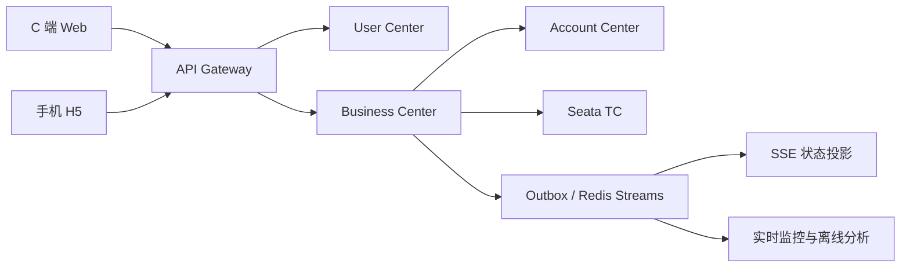
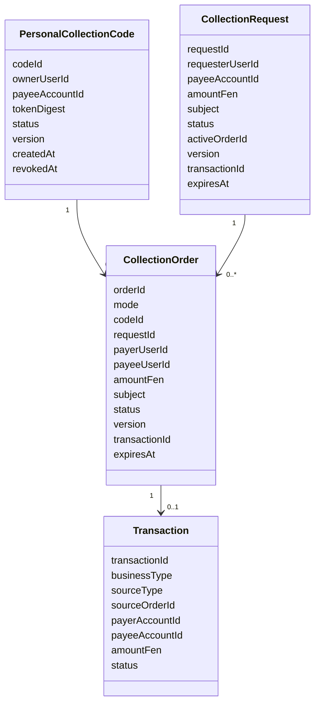
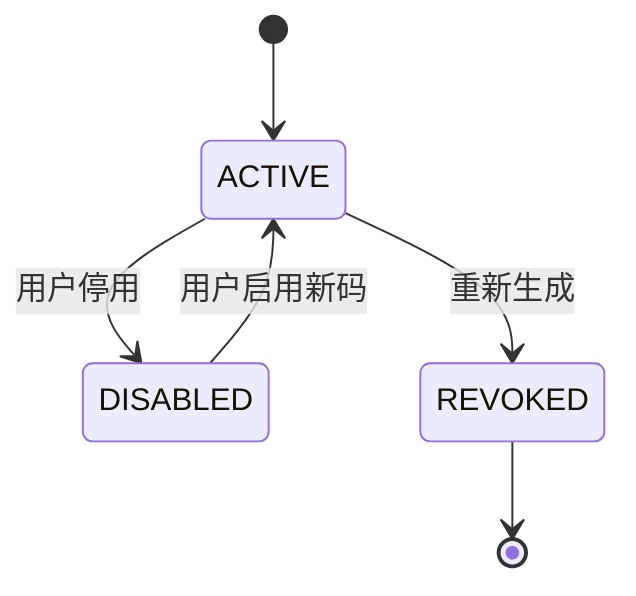
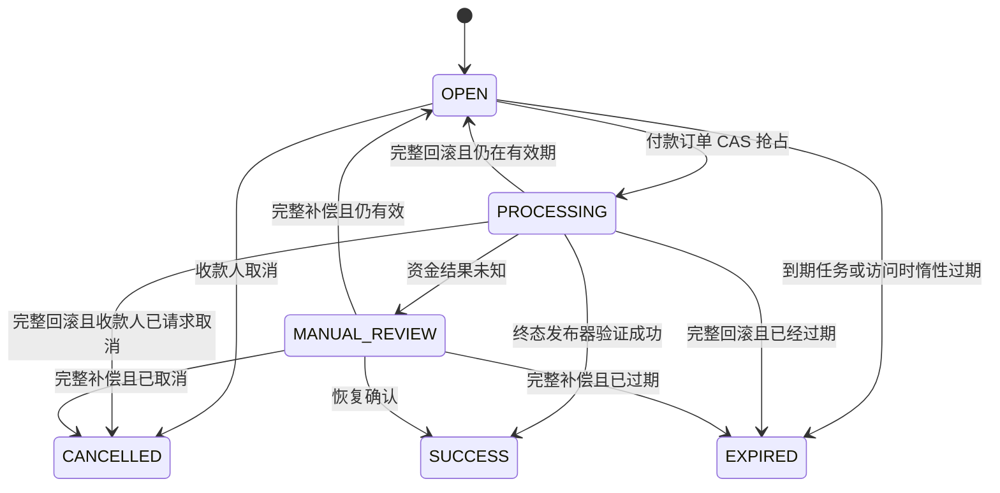
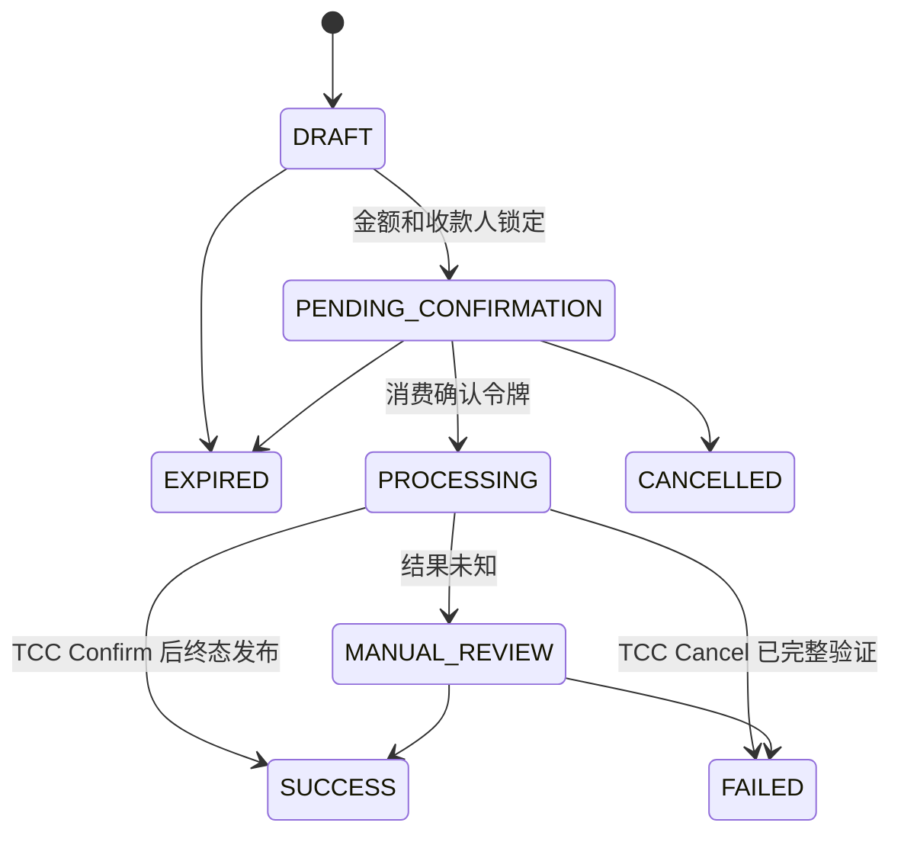

# MiniAIalipay C2C 个人收款设计

| 项目 | 内容 |
|---|---|
| 文档状态 | 已确认设计，待合入 PRD 与系统分析 |
| 日期 | 2026-07-29 |
| 适用版本 | PRD V1.5 后续版本 |
| 项目约束 | 两周、5 人、仅处理虚拟资金 |

## 1. 背景与目标

现有系统支持普通用户搜索其他用户并主动发起 `TRANSFER`，也支持模拟商户创建动态收款码，但普通用户不能主动创建个人收款码或固定金额收款请求。本设计补齐 C2C 收款入口，同时保持现有确定性交易核心、TCC、复式账本、风控、支付密码和监控链路不变。

目标能力：

1. 普通用户可以展示长期、可撤销和可重新生成的个人收款码。
2. 付款人扫码后填写金额和备注，使用虚拟余额向收款人付款。
3. 普通用户可以创建 30 分钟有效的固定金额收款请求，并分享链接或二维码。
4. 固定金额请求不绑定指定付款人，首笔最终成功的付款使请求失效。
5. 主动转账、个人码付款和固定请求付款最终统一执行 `TRANSFER`。

## 2. 范围边界

### 2.1 范围内

- 用户搜索和单向保存常用收款人。
- 普通用户主动转账给其他普通用户。
- 长期个人收款码及重新生成、停用。
- 个人码扫码后由付款人填写金额和备注。
- 固定金额、固定备注、30 分钟有效的收款请求。
- 固定请求链接与二维码分享。
- 登录、支付密码、风控、确认令牌、幂等和防重。
- TCC 资金执行、复式记账、Outbox 事件、Trace、监控和对账。
- 付款方和收款方交易明细及电子回执。

### 2.2 范围外

- 好友申请、好友同意、双向好友关系和好友动态。
- 群收款、AA 收款、多人目标金额和部分收款进度。
- Mini 花呗 C2C 转账或收款。
- C2C 转账手续费；MVP 费率固定为 0。
- 真实人民币、银行卡、第三方支付和真实清算。
- 普通用户伪装商户或使用商户信用支付能力。

“常用收款人”是用户单向保存的快捷记录，不表示双方存在好友关系。

## 3. 产品方案

### 3.1 三种 C2C 入口

| 入口 | 金额来源 | 收款方操作 | 付款方操作 | 最终业务类型 |
|---|---|---|---|---|
| 主动转账 | 付款方填写 | 无 | 搜索用户、填写金额并确认 | `TRANSFER` |
| 长期个人码 | 付款方填写 | 展示个人码 | 扫码、填写金额并确认 | `TRANSFER` |
| 固定收款请求 | 收款方锁定 | 填写金额和备注并分享 | 打开链接或扫码后确认 | `TRANSFER` |

### 3.2 长期个人收款码

- 每个正常普通用户同时最多有一个 `ACTIVE` 个人码。
- 个人码长期有效，不因一次付款成功而失效。
- 每次扫码建立独立 H5 会话和 `CollectionOrder`，因此不同付款人可以并发付款。
- 用户可以停用个人码；停用后所有尚未受理的扫码订单失效。
- 用户可以重新生成个人码；系统原子撤销旧码并生成新码，旧令牌立即失效。
- 二维码不包含用户 ID、账户号、昵称、金额或其他业务字段，只包含 HTTPS 地址和不可预测令牌。

### 3.3 固定金额收款请求

- 收款人填写 0.01 至 50,000.00 元和不超过 50 个字符的备注。
- 请求创建后金额、收款账户和备注锁定，不能编辑；需要修改时取消并重新创建。
- 请求创建后 30 分钟过期。
- 请求不绑定指定付款人，任何获得链接并完成登录的其他正常用户均可付款。
- 多个付款人可以同时打开请求，但只有一个付款订单可以进入资金处理阶段。
- 收款人可以在请求进入 `PROCESSING` 前取消。
- 首笔最终 `SUCCESS` 的付款关闭请求；失败且已确认完整回滚的付款不会占用请求，仍在有效期内时可以由其他付款人重试。

### 3.4 共同支付规则

- 禁止用户向自己的同一账户付款。
- 付款资金来源只允许 `BALANCE`，请求中的 `MINI_CREDIT` 或其他值一律拒绝。
- 付款人必须登录，查看结构化确认单并输入支付密码。
- 确认单展示脱敏收款人、金额、备注、手续费 0 和实际扣款金额。
- 收款方不需要再次确认；交易成功后虚拟余额自动增加。
- `SUCCESS` 只能由终态发布器在验证 TCC、余额和账本事实后发布。

## 4. 架构与组件边界



| 组件 | 新增或复用职责 |
|---|---|
| User Center | 复用身份、登录、支付密码、用户搜索和账户状态校验 |
| Business Center | 新增个人码、收款请求、收款订单、状态机、受理和恢复模块 |
| Account Center | 复用余额冻结、扣减、收款入账和复式账本 TCC 分支 |
| API Gateway | 复用认证、CSRF、限流、Trace 和对象级授权入口 |
| Event/Monitor | 新增个人码和固定请求维度的事件、指标与告警 |

客户端不能直接写入账户或账本。AI Agent 可以帮助创建收款请求草稿，但 P0 不新增 AI 收款工具；所有资金确认仍必须在可信 UI 完成。

## 5. 领域模型



固定请求允许存在多个扫码或确认尝试，因此 `CollectionRequest` 与 `CollectionOrder` 是一对多关系；但请求通过 `active_order_id` 和状态 CAS 保证同时最多只有一个订单进入 `PROCESSING`，并且最终最多一笔成功。这一模型允许余额不足或 TCC 已完整回滚后安全重试，同时保留失败尝试的审计记录。

### 5.1 关键唯一约束

```text
personal_collection_code: UNIQUE(owner_user_id, active_slot)
transaction: UNIQUE(source_type, source_order_id)
confirmation: UNIQUE(token_digest)
idempotency_record: UNIQUE(user_id, operation, idempotency_key)
```

`active_slot` 仅在状态为 `ACTIVE` 时取固定值，在撤销记录上为空，用于 MySQL 中约束每个用户最多一个有效个人码。也可以使用单行原地换码，但必须保留独立审计历史。

## 6. 状态机

### 6.1 个人码



### 6.2 固定收款请求



取消或过期发生在 `PROCESSING` 时只记录待生效意图，不强制回滚已确认资金；必须等待恢复器确定最终资金结果。

### 6.3 单次收款订单



## 7. 核心流程

### 7.1 个人码付款

1. H5 `GET` 只加载空壳、bootstrap Cookie 和 CSRF nonce，不返回收款人数据。
2. H5 清理地址栏令牌后，通过同源 `POST token-exchanges` 提交令牌。
3. 服务端验证个人码为 `ACTIVE`，创建短期 H5 会话和 `DRAFT` 收款订单，返回脱敏收款人。
4. 付款人登录并填写金额、备注；服务端锁定金额和收款账户，订单进入 `PENDING_CONFIRMATION`。
5. 用户输入支付密码，系统执行风控并签发绑定订单 ID、版本、双方账户、金额和资金来源的一次性确认令牌。
6. 受理事务消费确认令牌、CAS 订单、插入统一交易和 Outbox。
7. Seata TCC 扣减付款方余额、增加收款方余额并写入平衡账本。
8. 终态发布器验证资金事实后发布 `SUCCESS`，双方交易明细和回执更新。

### 7.2 固定请求付款

1. 收款人创建固定金额请求，服务端锁定本人收款账户、金额、备注和 30 分钟过期时间。
2. 多个付款人可以打开同一链接并建立各自 H5 会话和 `CollectionOrder` 尝试。
3. 每个付款人分别完成登录、支付密码、风控和确认令牌签发。
4. 支付受理在单个 `business_db` 本地事务中执行：
   - 条件消费确认令牌；
   - CAS `CollectionRequest OPEN -> PROCESSING` 并绑定 `active_order_id`；
   - CAS 当前订单 `PENDING_CONFIRMATION -> PROCESSING`；
   - 插入 `TRANSFER` 交易并写入 Outbox。
5. 任一步失败整体回滚。未抢占成功的付款人收到“请求已由其他付款处理”，客户端查询最终结果。
6. TCC 成功后请求和订单同时发布 `SUCCESS`；完整回滚后请求按取消、过期和剩余有效期决定回到 `OPEN`、`CANCELLED` 或 `EXPIRED`。

## 8. API 设计

| 方法 | 路径 | 权限 | 语义 |
|---|---|---|---|
| `GET` | `/api/v1/p2p-collections/codes/me` | 普通用户 | 查询本人当前个人码及状态 |
| `POST` | `/api/v1/p2p-collections/codes/me/regenerations` | 普通用户 | 原子撤销旧码并生成新码 |
| `POST` | `/api/v1/p2p-collections/codes/me/disable` | 普通用户 | 停用当前个人码 |
| `POST` | `/api/v1/p2p-collections/requests` | 普通用户 | 创建固定金额请求，要求 `Idempotency-Key` |
| `GET` | `/api/v1/p2p-collections/requests/{id}` | 创建者或关联付款人 | 查询脱敏请求状态 |
| `POST` | `/api/v1/p2p-collections/requests/{id}/cancel` | 创建者 | CAS 取消未受理请求 |
| `GET` | `/api/v1/p2p-collections/by-token?t=...` | 匿名 | 返回无业务数据 H5 壳，不消费令牌 |
| `POST` | `/api/v1/p2p-collections/token-exchanges` | bootstrap 会话 | 建立受控 H5 会话并返回脱敏信息 |
| `PATCH` | `/api/v1/p2p-collections/orders/{id}` | 登录付款人和 H5 会话 | 仅个人码模式填写并锁定金额、备注 |
| `POST` | `/api/v1/p2p-collections/orders/{id}/confirmations` | 登录付款人和 H5 会话 | 校验密码、风控并签发确认令牌 |
| `POST` | `/api/v1/p2p-collections/orders/{id}/pay` | 登录付款人和 H5 会话 | 创建并执行 `TRANSFER`，要求 `Idempotency-Key` |
| `GET` | `/api/v1/p2p-collections/orders/{id}` | 双方或 H5 会话 | 查询真实资金状态 |
| `GET` | `/api/v1/p2p-collections/requests/{id}/events` | 创建者 | SSE 订阅请求状态，断线可续传 |

固定请求的 `PATCH order` 不接受金额字段；个人码订单的金额只能从 `DRAFT` 锁定一次。所有对象接口执行角色和对象级授权，不能只依赖前端路由隐藏。

## 9. 一致性与复式记账

### 9.1 账务模板

```text
业务类型：TRANSFER
借：付款方虚拟余额负债 amount_fen
贷：收款方虚拟余额负债 amount_fen
手续费：0
```

### 9.2 一致性规则

- 单个订单并发受理使用状态与版本 CAS。
- 固定请求竞争使用请求行 CAS 和 `active_order_id` 绑定。
- 单次订单重复提交使用 `source_type + source_order_id` 唯一约束。
- 同一用户同一操作重试使用 `Idempotency-Key` 返回原结果。
- 跨业务中心、账户中心和账本资源使用 Seata TCC。
- TCC 分支屏障处理重复 Confirm、重复 Cancel、空回滚和悬挂。
- 余额扣减使用 `available_fen >= amount_fen` 条件更新，禁止负余额。
- 资金事实与 Outbox 在各自资源的本地事务中提交，Redis 不作为资金事实来源。
- 只有终态发布器验证全局事务、全部分支、余额事实和账本平衡后才能发布 `SUCCESS`。
- 未知结果由恢复扫描、对账和人工工单收敛。

## 10. 安全与隐私

- 令牌使用密码学安全随机数，服务端只保存摘要。
- URL 令牌不进入日志、埋点、Trace、Referer 或 Agent 消息。
- H5 首屏响应使用 `Cache-Control: no-store`、`Referrer-Policy: no-referrer` 和 `X-Robots-Tag: noindex`。
- 收款账户只从服务端个人码或请求聚合读取，付款账户只从登录身份读取。
- 返回收款人昵称和身份信息时进行脱敏，不暴露账号、手机号或余额。
- 确认令牌绑定付款人、付款账户、收款账户、金额、订单版本、资金来源和过期时间。
- 支付接口拒绝客户端传入收款账户、修改固定金额或选择 Mini 花呗。
- 对令牌交换、扫码、密码和付款接口分别限流。
- 停用或重新生成个人码时使旧码和未确认订单失效；已进入 `PROCESSING` 的交易继续按真实资金状态收敛。
- 所有创建、停用、换码、取消、确认、支付和人工处理动作写审计日志。

## 11. 事件、监控与对账

新增事件至少包括：

- `P2P_COLLECTION_CODE_CREATED`
- `P2P_COLLECTION_CODE_REVOKED`
- `P2P_COLLECTION_REQUEST_CREATED`
- `P2P_COLLECTION_REQUEST_CANCELLED`
- `P2P_COLLECTION_REQUEST_EXPIRED`
- `P2P_COLLECTION_ORDER_ACCEPTED`
- `P2P_COLLECTION_ORDER_SUCCEEDED`
- `P2P_COLLECTION_ORDER_FAILED`

指标至少包括：

| 指标 | 维度 |
|---|---|
| 个人码扫码数、确认率、成功率 | `PERSONAL_QR`、时间、结果 |
| 固定请求创建数、支付率、过期率 | `COLLECTION_REQUEST`、时间、结果 |
| C2C 收款成功金额 | 入口类型、`TRANSFER` |
| 固定请求并发冲突数 | 请求类型、错误码 |
| 跨端状态同步延迟 | SSE、轮询降级 |
| TCC 补偿和未知事务数 | 来源类型、分支状态 |
| 账本差异数 | 来源类型、交易状态 |

对账必须验证交易、付款方余额变化、收款方余额变化和账本凭证四方一致。个人码的多笔合法付款不能被误判为重复；重复判断以 `CollectionOrder` 为单位。

## 12. 错误处理

| 错误码 | HTTP | 行为 |
|---|---:|---|
| `P2P_CODE_INVALID` | 404 | 个人码无效或已撤销，不泄露所有者信息 |
| `COLLECTION_REQUEST_EXPIRED` | 410 | 请求已过期，隐藏支付按钮 |
| `COLLECTION_REQUEST_CANCELLED` | 409 | 请求已取消，禁止继续确认 |
| `COLLECTION_REQUEST_PROCESSING` | 409 | 已有付款正在处理，查询最终状态 |
| `COLLECTION_REQUEST_PAID` | 409 | 请求已完成，禁止重复付款 |
| `SELF_PAYMENT_FORBIDDEN` | 422 | 禁止向本人同一账户付款 |
| `AMOUNT_IMMUTABLE` | 422 | 固定请求金额不允许修改 |
| `FUNDING_SOURCE_NOT_ALLOWED` | 422 | C2C 仅允许虚拟余额 |
| `INSUFFICIENT_BALANCE` | 422 | 不创建资金交易，请求保持可支付 |
| `CONFIRMATION_STALE` | 409 | 订单或请求版本已变化，必须重新确认 |
| `TRANSACTION_PENDING` | 202 | 资金结果未知，进入恢复与查询流程 |

## 13. 测试与验收

1. 普通用户通过搜索或常用收款人主动转账，双方余额和明细正确。
2. 两名付款人同时扫描同一长期个人码并分别付款，两笔交易均可成功且互不覆盖。
3. 个人码付款金额由付款人填写，修改请求中的收款账户字段被拒绝。
4. 收款人换码后旧码立即不可建立新订单，新码可正常付款。
5. 固定请求创建后金额和备注锁定，30 分钟后自动或惰性过期。
6. 对同一固定请求使用不同用户和幂等键并发付款 100 次，同时最多一个订单进入 `PROCESSING`，最终最多一笔成功。
7. 抢占付款余额不足时不产生交易；请求保持 `OPEN`，其他付款人仍可支付。
8. TCC Try 后故障并完整 Cancel，请求安全回到 `OPEN`、`CANCELLED` 或 `EXPIRED`，不重复释放余额。
9. TCC 结果未知时请求进入 `MANUAL_REVIEW`，不得重新开放导致第二笔付款。
10. 用户扫描自己的个人码或请求被拒绝，余额和账本不变化。
11. 传入 `MINI_CREDIT` 被拒绝，不占用信用额度或生成信用应收。
12. 支付成功后付款方减少、收款方等额增加，`TRANSFER` 分录借贷平衡。
13. SSE 中断后客户端降级轮询，并最终展示交易核心的真实状态。
14. Redis 不可用时可以降级查询 MySQL，不能重复扣款或错误发布成功。
15. 个人码、固定请求、交易、TCC、账本和事件可通过同一 `trace_id` 追溯。

## 14. 两周范围控制

P0 包含长期个人码、固定请求、H5 付款、支付密码、余额支付、防重、TCC、账本、回执和核心监控。P1 可以包含 AI 创建收款请求、站内收款提醒、高级筛选和个人码样式定制。

若进度落后，优先裁剪 P1，不得裁剪固定请求 CAS、订单唯一约束、支付确认、TCC、复式账本、对账、旧码失效和核心并发测试。

## 15. 对现有文档的影响

PRD 需要新增 C2C 个人收款一级能力、功能需求、页面、业务规则、数据实体、API、监控指标、验收用例、排期和演示脚本，并明确普通用户与模拟商户收款码的边界。

系统分析需要新增用例、组件职责、领域类图、个人码和固定请求时序图、状态图、数据库 DDL、API 契约、TCC 受理规则、事件、权限、监控、测试和需求追踪矩阵。原有主动转账、商户 `QR_PAY` 和 `CREDIT_PAY` 设计继续保留。
